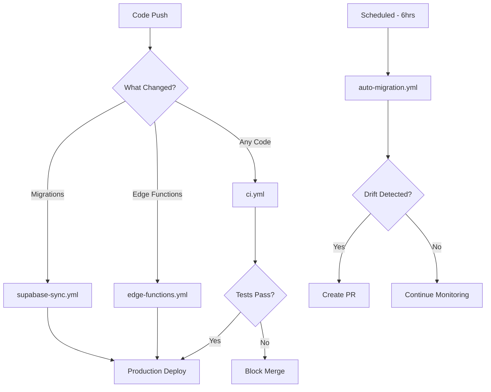

# 🤖 GitHub Actions Workflows - AI-as-a-Service Hardened Lakehouse

This directory contains automated workflows for maintaining perfect sync between your GitHub repository and Supabase project.

## 🚀 Quick Start

1. **Set up secrets** (one-time setup):
   ```bash
   ./.github/workflows/setup-secrets.sh
   ```

2. **Trigger initial sync**:
   ```bash
   gh workflow run supabase-sync.yml
   ```

## 📋 Available Workflows

### 🔄 Primary Sync Workflows

#### `supabase-sync.yml` - Complete Supabase Sync
**Trigger**: Push to main, PR changes to Supabase files, manual dispatch  
**Purpose**: Full bidirectional sync between GitHub and Supabase

**Features**:
- 🗃️ Database migration deployment
- ⚡ Edge function deployment  
- 🔧 TypeScript type generation
- 🗄️ Storage bucket management
- 📊 Deployment tracking
- ✅ Post-deployment validation

**Manual triggers**:
```bash
# Full sync with all features
gh workflow run supabase-sync.yml

# Sync without edge functions
gh workflow run supabase-sync.yml -f deploy_functions=false

# Force complete sync (includes schema reset)
gh workflow run supabase-sync.yml -f force_sync=true
```

#### `auto-migration.yml` - Automated Schema Sync
**Trigger**: Every 6 hours, manual dispatch  
**Purpose**: Detects and resolves schema drift automatically

**Features**:
- 🔍 Schema drift detection
- 📝 Automatic migration creation
- 🔀 Pull request generation
- 🚨 Severity-based alerting
- 📱 Slack/GitHub notifications

### 🧪 Testing & Validation Workflows

#### `ci.yml` - Continuous Integration
**Trigger**: PRs and pushes  
**Purpose**: Schema validation and testing

**Features**:
- 🔍 Schema drift detection on PRs
- 📝 Migration file validation
- 🏗️ Database build testing
- ✅ Data quality checks

#### `edge-functions.yml` - Edge Function Testing
**Trigger**: Changes to `supabase/functions/`  
**Purpose**: Test and validate edge functions

#### `deploy-prod.yml` - Production Deployment
**Trigger**: Pushes to main with migration changes  
**Purpose**: Controlled production deployments

### 📊 Monitoring Workflows

#### `storage-buckets.yml` - Storage Management
**Trigger**: Manual dispatch, storage changes  
**Purpose**: Sync storage buckets and policies

#### `dictionary-refresh.yml` - Data Dictionary Updates
**Trigger**: Schedule, manual dispatch  
**Purpose**: Keep data dictionaries current

## 🔐 Required Secrets

### Core Secrets (Required)
```bash
SUPABASE_ACCESS_TOKEN    # Personal access token
SUPABASE_PROJECT_REF     # Project reference (cxzllzyxwpyptfretryc)  
SUPABASE_SERVICE_ROLE_KEY # Service role key
SUPABASE_ANON_KEY        # Anonymous key
SUPABASE_DB_URL          # Direct database connection
```

### Optional Secrets
```bash
SLACK_WEBHOOK_URL        # For notifications
MAPBOX_TOKEN            # For map features
SUPABASE_ALTERNATE_*    # For multi-project setups
```

**Quick setup**: Run `.github/workflows/setup-secrets.sh`

## 🎯 Workflow Orchestration

### Automatic Triggers



### Manual Operations

```bash
# Emergency sync (force all changes)
gh workflow run supabase-sync.yml -f force_sync=true

# Check for schema drift now  
gh workflow run auto-migration.yml -f force_pull=true

# Deploy only edge functions
gh workflow run supabase-sync.yml -f deploy_functions=true -f update_types=false

# Generate types only
gh workflow run supabase-sync.yml -f deploy_functions=false -f update_types=true
```

## 📈 Monitoring & Alerts

### Built-in Monitoring
- ✅ Deployment success/failure tracking
- 📊 Schema drift detection  
- 🚨 High-severity change alerts
- 📱 Slack/GitHub notifications
- 🗄️ Artifact retention (30 days)

### Dashboard Access
- **GitHub Actions**: Repository → Actions tab
- **Supabase**: [Dashboard](https://app.supabase.com/project/cxzllzyxwpyptfretryc)
- **Deployment Logs**: `scout.deployment_log` table

### Alert Severities
- 🚨 **HIGH**: Destructive operations (DROP, TRUNCATE)
- ⚠️ **MEDIUM**: Schema changes (ALTER, CREATE)  
- 📝 **LOW**: Minor updates (comments, grants)

## 🔧 Troubleshooting

### Common Issues

#### "Schema drift detected"
```bash
# Check the drift report
gh run view [RUN_ID] --log

# Download drift artifact
gh run download [RUN_ID]

# Force sync if safe
gh workflow run auto-migration.yml -f force_pull=true
```

#### "Migration failed"
```bash
# Check deployment logs
gh run view [RUN_ID] --log

# Rollback if needed (manual)
# Connect to Supabase and revert changes

# Re-run deployment
gh workflow run supabase-sync.yml
```

#### "Secrets missing"
```bash
# Re-run secret setup
./.github/workflows/setup-secrets.sh

# Verify secrets are set
gh secret list

# Test with workflow
gh workflow run supabase-sync.yml
```

### Debug Commands

```bash
# List recent workflow runs
gh run list --limit 10

# View specific run logs
gh run view [RUN_ID] --log

# Check workflow status
gh workflow view supabase-sync.yml

# Download run artifacts
gh run download [RUN_ID]

# Re-run failed workflow
gh run rerun [RUN_ID]
```

## 🎯 Best Practices

### Development Workflow
1. 🏗️ **Make changes locally** in `supabase/migrations/`
2. 🧪 **Test locally** with `supabase start`
3. 🔀 **Create PR** - triggers validation
4. ✅ **Merge after approval** - auto-deploys
5. 📊 **Monitor deployment** in Actions tab

### Migration Naming
```bash
# Good (auto-handled by Supabase CLI)
20240824160000_add_user_preferences.sql

# Bad  
user_prefs.sql
migration_v2.sql
```

### Emergency Procedures
```bash
# Stop all deployments
gh workflow disable supabase-sync.yml

# Emergency rollback (manual)
# 1. Connect to Supabase SQL editor
# 2. Revert problematic changes
# 3. Re-enable workflow

# Re-enable deployments
gh workflow enable supabase-sync.yml
```

## 🔮 Advanced Usage

### Multi-Environment Setup
```yaml
# Add to workflow environment variables
ENVIRONMENT: ${{ github.ref == 'refs/heads/main' && 'production' || 'staging' }}
SUPABASE_PROJECT_REF: ${{ github.ref == 'refs/heads/main' && secrets.PROD_PROJECT_REF || secrets.STAGING_PROJECT_REF }}
```

### Custom Notifications
```yaml
# Add custom Slack channels per severity
SLACK_CRITICAL_WEBHOOK: ${{ secrets.SLACK_CRITICAL_WEBHOOK }}
SLACK_INFO_WEBHOOK: ${{ secrets.SLACK_INFO_WEBHOOK }}
```

### Branch-based Deployments
```yaml
# Deploy different branches to different environments
on:
  push:
    branches: [main, staging, dev]
```

---

**📞 Support**: Create an issue in this repository for workflow problems  
**🔗 Documentation**: [Supabase CLI Docs](https://supabase.com/docs/reference/cli)  
**🎯 Status**: All workflows active and monitoring 24/7