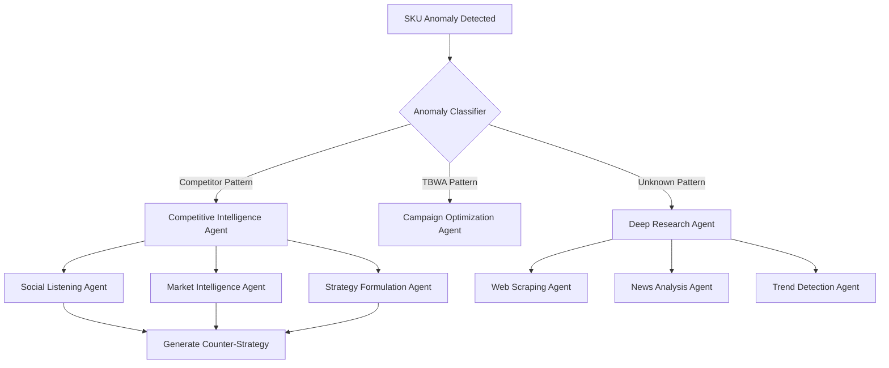

# 🤖 Agentic Intelligence System for Competitive Anomaly Detection

## Architecture: Multi-Agent Reasoning Pipeline

### 🎯 **Core Detection → Reasoning → Action Flow**



## 🧠 **Agent Components & Reasoning Chains**

### 1. **Anomaly Detection Agent**
```typescript
interface AnomalyDetectionAgent {
  // Initial detection from data
  detectAnomaly(data: TransactionData): AnomalySignal {
    if (sku.lift > 2 * baseline && region.concentrated) {
      return {
        type: 'LOCALIZED_SPIKE',
        confidence: calculateZScore(sku.performance),
        trigger: 'INVESTIGATE'
      }
    }
  }
  
  // Reasoning chain
  async reasonAboutAnomaly(signal: AnomalySignal) {
    // Step 1: Is this our brand or competitor?
    const brand = await identifyBrand(signal.sku);
    
    // Step 2: What persona is affected?
    const persona = await analyzePersonaShift(signal.transactions);
    
    // Step 3: Is this systematic or random?
    const pattern = await detectSystematicPattern(signal);
    
    return {
      brand,
      persona, 
      pattern,
      requiresDeepDive: pattern.confidence > 0.8
    }
  }
}
```

### 2. **Social Listening Agent**
```typescript
interface SocialListeningAgent {
  // Triggered when competitor anomaly detected
  async investigateSocialSignals(anomaly: CompetitorAnomaly) {
    const searchQueries = this.generateSearchQueries(anomaly);
    
    // Multi-platform social listening
    const signals = await Promise.all([
      this.scanFacebook(searchQueries),
      this.scanTwitter(searchQueries),
      this.scanTikTok(searchQueries),
      this.scanLocalForums(searchQueries)
    ]);
    
    return this.synthesizeFindings(signals);
  }
  
  generateSearchQueries(anomaly: CompetitorAnomaly): SearchQuery[] {
    // Smart query generation based on anomaly
    if (anomaly.sku === 'MARLBORO' && anomaly.region === 'VI') {
      return [
        'Marlboro basketball league Cebu',
        'PMI sports sponsorship Visayas',
        'cigarette brand basketball tournament',
        'Marlboro community event [city names]',
        // Local language queries
        'Marlboro liga sa basketball',
        'libre basketball uniform Marlboro'
      ];
    }
    // ... more patterns
  }
  
  async scanFacebook(queries: SearchQuery[]) {
    // Look for:
    // - Event pages with brand sponsorship
    // - Community group discussions
    // - Photo tags at sponsored events
    // - Local influencer posts
    
    return {
      eventPages: [...],
      communityMentions: [...],
      visualEvidence: [...],
      sentimentAnalysis: {...}
    };
  }
}
```

### 3. **Deep Research Agent**
```typescript
interface DeepResearchAgent {
  // Triggered for high-confidence anomalies
  async conductDeepResearch(signal: AnomalySignal) {
    const researchPlan = this.createResearchPlan(signal);
    
    // Execute multi-phase research
    const phase1 = await this.gatherPublicData(researchPlan);
    const phase2 = await this.analyzeCompetitorComms(phase1);
    const phase3 = await this.investigateLocalSources(phase2);
    
    return this.synthesizeIntelligence(phase1, phase2, phase3);
  }
  
  createResearchPlan(signal: AnomalySignal): ResearchPlan {
    return {
      primary: [
        'Check competitor press releases',
        'Scan job postings for community managers',
        'Review trademark/permit filings',
        'Analyze ad spend data'
      ],
      secondary: [
        'Local news in affected regions',
        'Barangay announcements',
        'School/community bulletins',
        'Radio station sponsorships'
      ],
      tertiary: [
        'Sari-sari store owner WhatsApp groups',
        'Distributor newsletters',
        'Trade association updates'
      ]
    };
  }
  
  async gatherPublicData(plan: ResearchPlan) {
    // Web scraping for public information
    const data = {
      pressReleases: await this.scrapeCompanyNews(),
      jobPostings: await this.scrapeJobSites(),
      permits: await this.checkGovernmentSites(),
      adSpend: await this.analyzeAdPlatforms()
    };
    
    // Pattern matching
    if (data.jobPostings.includes('community activation manager') &&
        data.permits.includes('event permit') &&
        data.adSpend.facebook > baseline * 2) {
      return {
        confidence: 'HIGH',
        type: 'COMMUNITY_PROGRAM',
        investment: this.estimateInvestment(data)
      };
    }
  }
}
```

### 4. **Market Intelligence Agent**
```typescript
interface MarketIntelligenceAgent {
  // Correlate multiple signals
  async correlateIntelligence(anomaly: AnomalySignal) {
    const intelligence = {
      // Historical patterns
      historicalCampaigns: await this.queryHistoricalDatabase(anomaly.brand),
      
      // Seasonal correlation
      seasonalFactors: await this.checkSeasonality(anomaly.timing),
      
      // Competitive landscape
      marketContext: await this.analyzeMarketConditions(),
      
      // Regulatory environment
      regulatoryTriggers: await this.checkRegulatoryChanges()
    };
    
    return this.generateHypothesis(intelligence);
  }
  
  generateHypothesis(intel: MarketIntelligence): Hypothesis {
    // Reasoning engine
    if (intel.regulatoryTriggers.includes('sin tax increase') &&
        intel.historicalCampaigns.includes('community building') &&
        intel.seasonalFactors.includes('summer basketball season')) {
      
      return {
        hypothesis: 'PMI launching basketball league to maintain loyalty before tax increase',
        confidence: 0.85,
        evidence: [...],
        counterStrategy: this.formulateCounter(intel)
      };
    }
  }
}
```

### 5. **Strategy Formulation Agent**
```typescript
interface StrategyFormulationAgent {
  // Generate actionable counter-strategies
  async formulateResponse(
    competitorInitiative: Initiative,
    tbwaClient: Client,
    marketIntel: Intelligence
  ): CounterStrategy {
    
    // Multi-dimensional strategy generation
    const strategies = await Promise.all([
      this.generateDirectCounter(competitorInitiative),
      this.generateFlankingStrategy(competitorInitiative),
      this.generateDisruptiveStrategy(competitorInitiative)
    ]);
    
    // Evaluate and rank strategies
    const evaluated = strategies.map(s => ({
      ...s,
      roi: this.estimateROI(s, marketIntel),
      risk: this.assessRisk(s, competitorInitiative),
      speed: this.estimateTimeToMarket(s),
      fit: this.assessClientFit(s, tbwaClient)
    }));
    
    // Return best strategy with reasoning
    return {
      recommended: evaluated.sort((a, b) => b.roi - a.roi)[0],
      reasoning: this.explainStrategy(evaluated[0]),
      alternatives: evaluated.slice(1, 3),
      implementation: this.createImplementationPlan(evaluated[0])
    };
  }
}
```

## 🔄 **Agentic Reasoning Chains**

### Example: Marlboro Basketball League Detection

```typescript
// 1. Initial Signal
{
  anomaly: "Marlboro +200% in Region VI",
  persona: "Carlo (Young Adult)",
  confidence: 0.82
}

// 2. Social Listening Activation
SocialAgent.investigate() -> {
  facebook: "Found 3 event pages: 'Marlboro 3x3 Basketball Cebu'",
  tiktok: "15 videos with #MarlboroHoops trending locally",
  forums: "Subreddit r/Cebu discussing free jerseys"
}

// 3. Deep Research Trigger
ResearchAgent.deepDive() -> {
  jobPostings: "PMI hiring 5 'Community Activation Managers' in Visayas",
  permits: "Event permits filed for 12 basketball courts",
  news: "Local paper: 'Marlboro sponsors youth league'",
  investment: "Estimated ₱2-3M based on venue + prize pool"
}

// 4. Intelligence Correlation
IntelligenceAgent.correlate() -> {
  pattern: "PMI historically uses sports before tax increases",
  timing: "Sin tax increase scheduled Q3 2025",
  hypothesis: "Building loyalty buffer before price increase",
  confidence: 0.91
}

// 5. Strategy Generation
StrategyAgent.formulate() -> {
  direct: "JTI sponsors bigger basketball tournament",
  flanking: "JTI launches e-sports league (different sport, same demo)",
  disruptive: "JTI creates TikTok challenge with prizes",
  recommended: "E-sports league - lower cost, higher engagement, owns digital"
}
```

## 🎯 **Automated Trigger System**

```sql
-- Database triggers for agent activation
CREATE OR REPLACE FUNCTION scout.trigger_agent_investigation()
RETURNS TRIGGER AS $$
BEGIN
  -- Check if anomaly meets threshold
  IF NEW.lift_percentage > 150 AND NEW.confidence_score > 0.8 THEN
    -- Queue for agent investigation
    INSERT INTO scout.agent_queue (
      task_type,
      priority,
      payload,
      agents_required
    ) VALUES (
      'COMPETITIVE_INTELLIGENCE',
      CASE 
        WHEN NEW.lift_percentage > 200 THEN 'HIGH'
        ELSE 'MEDIUM'
      END,
      jsonb_build_object(
        'anomaly_id', NEW.anomaly_id,
        'sku', NEW.sku_code,
        'region', NEW.region_code,
        'lift', NEW.lift_percentage
      ),
      ARRAY['social_listening', 'deep_research', 'market_intelligence']
    );
  END IF;
  RETURN NEW;
END;
$$ LANGUAGE plpgsql;

CREATE TRIGGER anomaly_investigation_trigger
AFTER INSERT ON scout.sku_regional_anomalies
FOR EACH ROW
EXECUTE FUNCTION scout.trigger_agent_investigation();
```

## 🚀 **Implementation with Supabase Edge Functions**

```typescript
// Edge Function: Competitive Intelligence Pipeline
import { createClient } from '@supabase/supabase-js';
import { SocialListeningAgent } from './agents/social';
import { DeepResearchAgent } from './agents/research';
import { StrategyAgent } from './agents/strategy';

export async function handleCompetitiveAnomaly(anomaly: Anomaly) {
  // Initialize agents
  const agents = {
    social: new SocialListeningAgent(),
    research: new DeepResearchAgent(),
    strategy: new StrategyAgent()
  };
  
  // Parallel intelligence gathering
  const [socialIntel, marketIntel] = await Promise.all([
    agents.social.investigate(anomaly),
    agents.research.conductDeepDive(anomaly)
  ]);
  
  // Reasoning synthesis
  const hypothesis = synthesizeIntelligence(socialIntel, marketIntel);
  
  // Strategy formulation
  const counterStrategy = await agents.strategy.formulate(
    hypothesis,
    anomaly.affectedClient
  );
  
  // Store insights
  await supabase.from('competitive_intelligence').insert({
    anomaly_id: anomaly.id,
    competitor_initiative: hypothesis.initiative,
    confidence: hypothesis.confidence,
    counter_strategy: counterStrategy.recommended,
    reasoning_chain: {
      social: socialIntel,
      market: marketIntel,
      hypothesis,
      strategy: counterStrategy
    }
  });
  
  // Notify stakeholders
  await notifyStakeholders(counterStrategy);
  
  return counterStrategy;
}
```

## 📊 **Intelligence Dashboard Integration**

```typescript
// React Component: Competitive Intelligence Monitor
export const CompetitiveIntelligenceMonitor = () => {
  const [anomalies] = useAnomalies();
  const [agentStatus] = useAgentStatus();
  
  return (
    <div className="grid grid-cols-3 gap-4">
      {/* Live Anomaly Detection */}
      <AnomalyFeed anomalies={anomalies} />
      
      {/* Agent Activity */}
      <AgentActivityPanel agents={agentStatus} />
      
      {/* Intelligence Reports */}
      <IntelligenceReports />
      
      {/* Reasoning Chain Viewer */}
      <ReasoningChainVisualization />
    </div>
  );
};
```

## 🎯 **Key Agentic Capabilities**

1. **Autonomous Detection**: Continuously monitors for anomalies
2. **Multi-Source Intelligence**: Combines data, social, news, permits
3. **Reasoning Chains**: Explains how conclusions were reached
4. **Proactive Alerts**: Notifies before competitors scale
5. **Strategic Recommendations**: Not just detection, but action plans
6. **Learning Loop**: Improves detection based on confirmed initiatives

This agentic system transforms your anomaly detection into a **full competitive intelligence platform** that automatically investigates, reasons, and recommends actions! 🚀
