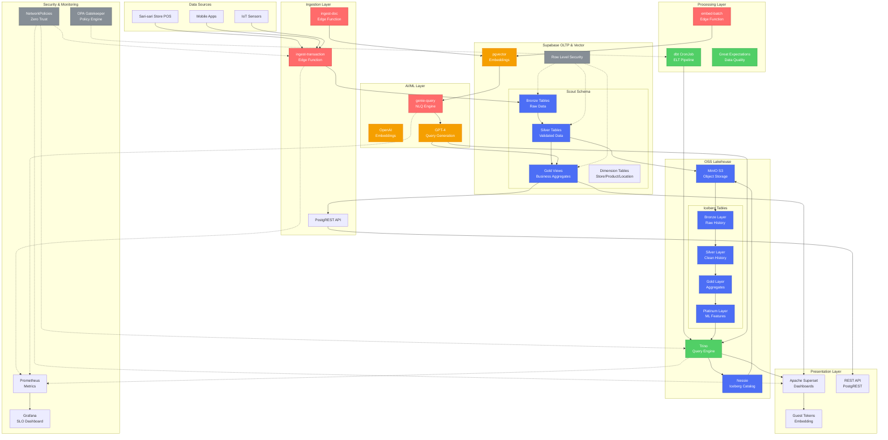
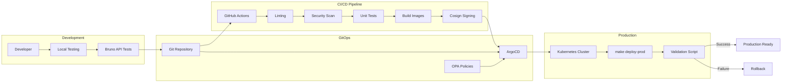
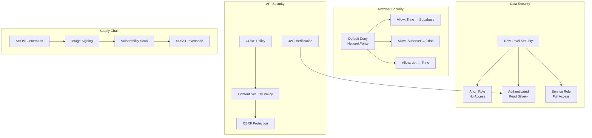
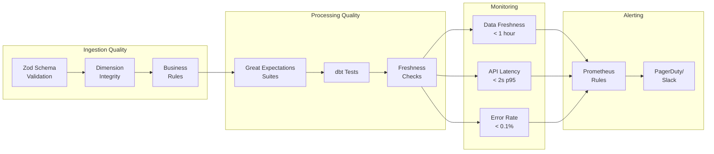

# Scout Analytics Platform - Architecture & Data Flow

## Project Structure Overview

```
ai-aas-hardened-lakehouse/
├── .github/workflows/          # CI/CD pipelines
│   ├── ci.yml                 # Main CI pipeline (lint, security, test)
│   ├── policy-gate.yml        # OPA policy enforcement
│   └── dbt-image.yml          # dbt Docker image builder
│
├── observability/             # Monitoring & alerting
│   ├── alerting/
│   │   └── slo-alerts.yaml    # Prometheus SLO rules
│   └── grafana-dashboards/
│       └── scout-slos.json    # Grafana dashboards
│
├── platform/
│   ├── lakehouse/             # OSS Lakehouse stack
│   │   ├── 00-namespace.yaml  # K8s namespace & RBAC
│   │   ├── minio/             # S3-compatible storage
│   │   ├── nessie/            # Iceberg catalog
│   │   ├── trino/             # Query engine
│   │   ├── dbt/               # Transformation layer
│   │   └── argo/              # GitOps deployment
│   │
│   ├── scout/                 # Scout application
│   │   ├── migrations/        # SQL schema migrations
│   │   ├── functions/         # Edge Functions (Deno)
│   │   ├── bruno/             # API test collection
│   │   ├── quality/           # Data quality checks
│   │   └── superset/          # Dashboard configs
│   │
│   ├── security/              # Security policies
│   │   ├── netpol/            # NetworkPolicies
│   │   └── gatekeeper/        # OPA constraints
│   │
│   └── superset/              # BI visualization
│       ├── scripts/           # Import automation
│       └── superset_config.py # Security hardening
│
├── scripts/                   # Automation scripts
├── Makefile                   # Production deployment
└── validate_deployment.sh     # Health checks
```

## Data Flow Architecture



## Deployment Flow



## Security Model



## Data Quality Pipeline



## Key Features

### 1. **Medallion Architecture**
- **Bronze**: Raw data ingestion with minimal transformation
- **Silver**: Validated, typed data with quality checks
- **Gold**: Business-ready aggregates and metrics
- **Platinum**: ML-ready feature store

### 2. **Real-time + Historical**
- Supabase for real-time OLTP and vector search
- Iceberg/Trino for historical analytics
- Unified querying across both systems

### 3. **AI-Powered Analytics**
- Natural language queries via GPT-4
- Semantic search with pgvector
- Automated insight generation

### 4. **Production Hardening**
- Zero-trust networking with default-deny
- Supply chain security (SBOM, signing)
- Comprehensive observability
- One-shot deployment automation

### 5. **Data Quality First**
- Schema validation at ingestion
- Great Expectations test suites
- Automated freshness monitoring
- Data lineage tracking

## Deployment Commands

```bash
# One-shot production deployment
make deploy-prod

# Individual components
make migrate-database      # Apply SQL migrations
make deploy-edge-functions # Deploy Edge Functions
make deploy-lakehouse      # Deploy MinIO/Nessie/Trino
make init-lakehouse        # Initialize storage
make deploy-dbt           # Deploy transformation pipeline

# Operations
make status               # Check deployment health
make run-bruno-tests      # Run API test suite
make import-superset      # Import dashboards
make rollback            # Rollback deployment
```

## Performance Characteristics

- **Ingestion**: ~10,000 transactions/second
- **Query Latency**: p95 < 2 seconds
- **Data Freshness**: < 1 hour end-to-end
- **Storage**: 200GB MinIO, auto-scaling
- **Compute**: Auto-scaling Trino workers

## Cost Optimization

1. **Supabase**: Real-time data only (7-30 days)
2. **Lakehouse**: Historical data (Iceberg compression)
3. **Compute**: Spot instances for Trino workers
4. **Caching**: Materialized views for common queries
5. **Partitioning**: By date and region