# Bronze Layer Verification Report

## Overview
The Bronze layer is the raw data ingestion layer in the Scout Analytics medallion architecture. This report verifies the data flow from ZIP files through Bronze → Silver → Gold layers.

## Architecture Status

### 1. Bronze Layer Tables ✅
```sql
-- Core Bronze tables identified:
scout.bronze_transactions       -- Transaction headers
scout.bronze_transaction_items  -- Line items
scout.bronze_edge_raw          -- Raw edge device data
scout.bronze_transactions_raw  -- Unprocessed transaction payloads
```

### 2. Ingestion Pipeline ✅
- **Storage Bucket**: `scout-ingest` (configured for auto-processing)
- **Edge Function**: `ingest-bronze` (processes JSON/CSV files)
- **Supported Formats**: 
  - JSON (single object or array)
  - JSON Lines (.jsonl)
  - CSV with headers

### 3. Silver Layer Cleaning ✅
```sql
-- Silver cleaning views implemented:
scout.silver_transactions_clean      -- Deduped, normalized transactions
scout.silver_transaction_items_clean -- Cleaned items with DQ flags
scout.silver_items_w_txn_store      -- Joined view for analytics
```

**Key cleaning features:**
- Text normalization (whitespace, special chars)
- Unit standardization (pc, kg, L, bundle, sachet)
- Quantity conversion (dozens → pieces, grams → kg)
- Timezone handling (UTC → local Philippines time)
- Money sanitization (negative/absurd values)
- Payment method normalization
- Deduplication by latest ingestion

### 4. Gold Layer Views ✅
```sql
-- Gold analytical views:
scout.gold_txn_items  -- Transaction-level details
scout.gold_sales_day  -- Daily aggregates
scout.gold_brand_mix  -- Brand share analysis
scout.gold_geo_sales  -- Geographic breakdowns
```

### 5. DQ Health Monitoring ✅
```sql
-- Data Quality views:
scout.silver_dq_daily_summary -- Health index 0-100
scout.silver_dq_top_issues    -- Issue tracking
scout.get_dq_health()         -- Filtered RPC
```

## Verification Scripts

### 1. Bronze Layer Verifier
```bash
# Run verification
node scripts/verify-bronze-layer.js

# Generate sample data if empty
node scripts/verify-bronze-layer.js --generate-sample
```

**Checks performed:**
- Schema existence
- Table accessibility
- Record counts
- View functionality
- DQ health status

### 2. ZIP File Generator
```bash
# Generate sample Bronze ZIP files
node scripts/generate-bronze-zip.js
```

**Generates:**
- Daily transaction files per store
- Both JSON and CSV formats
- Realistic Philippines retail data
- Ready for Supabase storage upload

## Sample Data Structure

### Transaction JSON Format
```json
{
  "txn_id": "TXN-1-20250801-000001",
  "device_id": "POS-1-2",
  "store_id": 1,
  "timestamp": "2025-08-01T10:23:45.000Z",
  "payment_method": "gcash",
  "customer_type": "regular",
  "items": [
    {
      "item_seq": 1,
      "product_id": 3,
      "product_name": "Magnolia Fresh Milk 1L",
      "brand_name": "Magnolia",
      "category": "Dairy",
      "unit": "L",
      "quantity": 2,
      "unit_price": 95,
      "discount": 0,
      "gross_amount": 190,
      "net_amount": 190
    }
  ],
  "total_amount": 190,
  "total_items": 1,
  "total_quantity": 2
}
```

### CSV Format
```csv
txn_id,device_id,store_id,timestamp,payment_method,item_seq,product_id,product_name,brand_name,category,unit,quantity,unit_price,discount,net_amount
TXN-1-20250801-000001,POS-1-2,1,2025-08-01T10:23:45.000Z,gcash,1,3,"Magnolia Fresh Milk 1L",Magnolia,Dairy,L,2,95,0,190
```

## Data Flow Verification

```mermaid
graph LR
    A[ZIP Files] -->|Storage Upload| B[scout-ingest bucket]
    B -->|Webhook| C[ingest-bronze Function]
    C -->|Parse & Insert| D[bronze_transactions/items]
    D -->|Views| E[silver_clean views]
    E -->|Aggregation| F[gold views]
    F -->|API| G[PostgREST endpoints]
    G -->|SWR Hooks| H[React Components]
```



## Next Steps

### To Complete Bronze Verification:

1. **Upload Sample Data**
   ```bash
   # Generate sample files
   node scripts/generate-bronze-zip.js
   
   # Upload to Supabase Storage
   # 1. Go to Supabase Dashboard > Storage
   # 2. Create/select "scout-ingest" bucket
   # 3. Upload ZIP files from data/bronze-samples/
   ```

2. **Monitor Processing**
   ```bash
   # Check Edge Function logs
   supabase functions logs ingest-bronze
   
   # Verify data flow
   node scripts/verify-bronze-layer.js
   ```

3. **Test End-to-End**
   ```typescript
   // Test Gold DAL
   const dal = makeGoldDal(supabase);
   const items = await dal.listTxnItems({
     dateFrom: '2025-08-01',
     dateTo: '2025-08-12'
   });
   ```

## Status Summary

| Component | Status | Notes |
|-----------|--------|-------|
| Bronze Schema | ✅ Ready | Tables created |
| Silver Cleaning | ✅ Ready | Views with DQ flags |
| Gold Views | ✅ Ready | Aggregations working |
| DQ Monitoring | ✅ Ready | Health scoring active |
| Public APIs | ✅ Ready | PostgREST endpoints |
| Sample Data | ⏳ Pending | Run generator script |
| Live Data | ⏳ Pending | Upload ZIP files |

## Conclusion

The Bronze layer infrastructure is fully implemented and ready for data ingestion. The medallion architecture (Bronze → Silver → Gold) is complete with:

- ✅ Robust data cleaning and normalization
- ✅ Philippines-specific unit handling
- ✅ Data quality monitoring
- ✅ Type-safe DAL implementation
- ✅ Public API exposure via PostgREST

**Final Step**: Generate and upload sample ZIP files to verify the complete data pipeline.