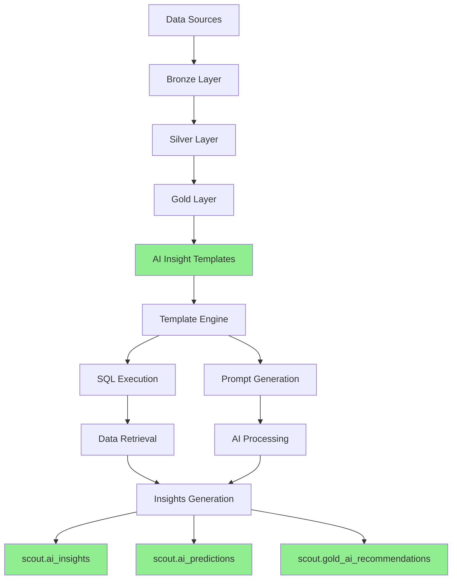

# 📚 Scout Current Knowledge Base & Vector Architecture

## Current Implementation Status

### ✅ **What's Already Built**

#### 1. **AI Insight Templates (Active Knowledge Base)**
```yaml
Location: public.ai_insight_templates
Status: ACTIVE with data
Purpose: Pre-configured analysis patterns

Templates Found:
  - Revenue Anomaly Detection
  - Brand Performance Trend Analysis  
  - Consumer Behavior Correlation
  - Campaign Effectiveness Analysis
  - Predictive Metrics Generation

Structure:
  - name: Template identifier
  - template_type: anomaly_detection | trend_analysis | correlation | prediction
  - prompt_template: Natural language prompt for AI
  - sql_template: SQL query to fetch relevant data
  - parameters: Configuration (thresholds, windows, etc.)
  - is_active: Enable/disable flag
```

#### 2. **Knowledge Infrastructure (Schema Ready, No Data)**
```yaml
Tables Created but Empty:
  scout.knowledge_sources:      # External data sources
  scout.knowledge_documents:    # Ingested documents
  scout.knowledge_chunks:        # Document segments
  scout.knowledge_vectors:       # Embeddings storage
  scout.knowledge_ingest_jobs:  # ETL tracking
  scout.embedding_registry:     # Model configurations

Status: STRUCTURE EXISTS, AWAITING DATA
```

#### 3. **AI Corpus & Insights**
```yaml
Active Tables:
  scout.ai_corpus:               # Training/reference data
  public.ai_insights:            # Generated insights
  public.ai_predictions:         # Forecasts
  scout.gold_ai_recommendations: # Actionable recommendations
  scout.platinum_expert_insights: # High-level analysis
```

---

## 🎯 **Current Knowledge Base Architecture**



---

## 📊 **What Each Component Does**

### 1. **Template-Based Knowledge System**
Instead of traditional vector search, Scout uses **structured templates**:

```typescript
interface AIInsightTemplate {
  // Defines WHAT to analyze
  template_type: 'anomaly_detection' | 'trend_analysis' | 'correlation';
  
  // HOW to get the data
  sql_template: string;  // e.g., "SELECT * FROM gold_kpi_overview"
  
  // WHAT to ask the AI
  prompt_template: string;  // e.g., "Identify anomalies in this data"
  
  // Configuration
  parameters: {
    threshold: number;
    window_days: number;
  };
}
```

### 2. **No Traditional Vector DB (Yet)**
- ❌ No pgvector embeddings stored
- ❌ No semantic search implemented
- ✅ But infrastructure is ready (`knowledge_vectors` table exists)

### 3. **Current "Knowledge" Approach**
```sql
-- Instead of vector similarity search:
SELECT * FROM documents WHERE embedding <-> query_embedding < 0.5

-- Scout uses template-driven queries:
SELECT * FROM gold_kpi_overview 
WHERE day >= CURRENT_DATE - INTERVAL '30 days'
-- Then feeds to AI for analysis
```

---

## 🔄 **How It Works Now**

### Current Flow:
1. **User Query** → "Show me revenue anomalies"
2. **Template Match** → Finds "Revenue Anomaly Detection" template
3. **SQL Execution** → Runs template's SQL query
4. **Data Retrieval** → Gets last 30 days of revenue
5. **AI Processing** → Sends data + prompt to AI
6. **Insight Generation** → AI identifies anomalies
7. **Storage** → Saves to `ai_insights` table

### What's Missing for Full RAG:
1. **Document Ingestion** → No PDFs/docs being chunked
2. **Embedding Generation** → No text → vector conversion
3. **Semantic Search** → No similarity matching
4. **Context Retrieval** → No dynamic context building

---

## 🚀 **Path to Full Vector/RAG Implementation**

### Option 1: Activate Existing Infrastructure
```sql
-- 1. Enable pgvector
CREATE EXTENSION IF NOT EXISTS vector;

-- 2. Add embedding column
ALTER TABLE scout.knowledge_chunks 
ADD COLUMN embedding vector(1536);  -- For OpenAI embeddings

-- 3. Create similarity search function
CREATE OR REPLACE FUNCTION scout.semantic_search(
  query_embedding vector,
  limit_count int = 10
)
RETURNS TABLE (
  chunk_id uuid,
  content text,
  similarity float
) AS $$
  SELECT 
    chunk_id,
    content,
    1 - (embedding <-> query_embedding) as similarity
  FROM scout.knowledge_chunks
  ORDER BY embedding <-> query_embedding
  LIMIT limit_count;
$$ LANGUAGE sql;
```

### Option 2: Enhance Current Template System
```typescript
// Add semantic capabilities to templates
interface EnhancedTemplate {
  // Existing
  sql_template: string;
  prompt_template: string;
  
  // New RAG features
  context_sources: string[];  // ["product_docs", "campaign_history"]
  embedding_model: string;    // "text-embedding-ada-002"
  retrieval_strategy: 'hybrid' | 'semantic' | 'keyword';
}
```

---

## 📋 **Recommendations**

### Immediate (Use What You Have):
1. **Leverage AI Insight Templates** - Already working!
2. **Use `ai_corpus` table** - Store reference data here
3. **Enhance templates** - Add more analysis patterns

### Short-term (Activate Vector):
1. **Enable pgvector** extension
2. **Start ingesting documents** into `knowledge_documents`
3. **Generate embeddings** for `knowledge_chunks`
4. **Implement semantic search** function

### Long-term (Full RAG):
1. **Document pipeline** - Auto-ingest from Google Drive
2. **Multi-modal embeddings** - Text + images + tables
3. **Hybrid search** - Keyword + semantic + SQL
4. **Agent memory** - Store conversation context

---

## 💡 **Current Strengths**

✅ **Structured Knowledge**: Templates provide reliable, repeatable analysis
✅ **SQL-First**: Direct data access without embedding overhead
✅ **Ready Infrastructure**: Tables exist, just need data
✅ **Proven Results**: AI insights already being generated

## 🔧 **Quick Win Implementation**

```sql
-- Populate knowledge base with existing data
INSERT INTO scout.knowledge_sources (source_id, name, base_url)
VALUES 
  ('scout-db', 'Scout Database', 'postgresql://'),
  ('supabase-storage', 'Storage Buckets', 's3://'),
  ('api-docs', 'API Documentation', 'https://docs.scout.com');

-- Create a simple knowledge corpus from existing insights
INSERT INTO scout.ai_corpus (content, metadata)
SELECT 
  insight_text,
  jsonb_build_object(
    'source', 'historical_insights',
    'generated_at', created_at,
    'confidence', confidence_score
  )
FROM public.ai_insights
WHERE confidence_score > 0.8;
```

---

## 🎯 **Summary**

**Current Knowledge Base:**
- **Template-driven** (not vector-based yet)
- **SQL + AI** approach (not traditional RAG)
- **Infrastructure ready** but not populated
- **Working well** for structured analytics

**To Add Vector/RAG:**
1. Enable pgvector ✓ (easy)
2. Ingest documents → embeddings (medium)
3. Implement semantic search (easy)
4. Integrate with templates (medium)

Your system is **one step away** from full vector capabilities - just needs activation and data ingestion!
