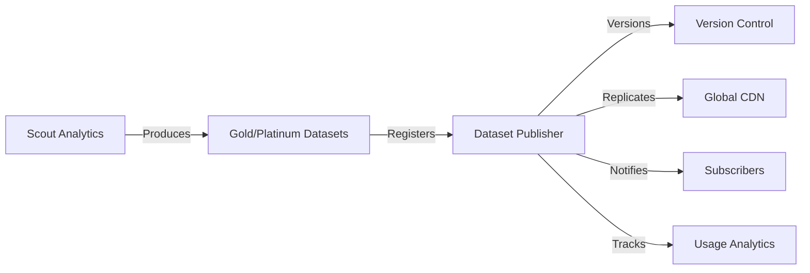

# Dataset Publisher & Management System - Migration Complete
**Date:** August 16, 2025  
**Status:** ✅ SUCCESS - All 4 migrations applied

## 🎯 System Overview
The Dataset Publisher & Management System provides comprehensive infrastructure for distributing, versioning, and monitoring datasets produced by Scout Analytics and other data pipelines.

## ✅ Deployed Components

### 1. **Usage Analytics Schema** (`usage_analytics`)
**Purpose:** Track how datasets are consumed and analyze user behavior

**Tables Created:**
- `dataset_usage_logs` - Partitioned event log (9 monthly partitions)
- `user_sessions` - Session tracking
- `dataset_metadata` - Dataset registry

**Features:**
- ✅ Partitioned tables for high-volume event tracking
- ✅ User behavior segmentation (Power/Regular/Occasional/New)
- ✅ Download, API call, and export tracking
- ✅ Geographic usage distribution
- ✅ Performance metrics (response time, error rates)

**Sample Data Loaded:**
- 5 Scout datasets registered (gold/platinum layers)

### 2. **Versioning Schema** (`versioning`)
**Purpose:** Semantic versioning and rollback capabilities for datasets

**Tables Created:**
- `dataset_versions` - Version registry with parent tracking
- `dataset_rollbacks` - Rollback history
- `version_lineage` - Parent-child relationships
- `version_changelog` - Detailed change tracking

**Features:**
- ✅ Semantic versioning (1.2.3 format)
- ✅ Version status tracking (active, archived, deprecated, draft)
- ✅ Rollback capabilities with backup
- ✅ Change type classification (major, minor, patch)
- ✅ Breaking change flags

**Sample Versions:**
- 4 versions tracked for Scout datasets
- Example: transactions v1.0.0 → v1.1.0 → v1.2.0

### 3. **Replication Schema** (`replication`)
**Purpose:** Global dataset distribution across regions

**Tables Created:**
- `region_configs` - Region endpoints and costs
- `dataset_replication_rules` - Replication policies
- `dataset_replicas` - Replica tracking
- `replication_metrics` - Performance and cost metrics

**Features:**
- ✅ Multi-region support (US, EU, APAC)
- ✅ Replication policies (immediate, scheduled, on-demand)
- ✅ Cost optimization ($0.023/GB storage, $0.09/GB bandwidth)
- ✅ CDN integration endpoints
- ✅ Bandwidth throttling (100 Mbps default)
- ✅ Retention policies (90 days default)

**Configured Regions:**
1. **us-east-1** (Primary) - `https://cdn-us-east.scout.io`
2. **ap-southeast-1** (Secondary) - `https://cdn-ap.scout.io`  
3. **eu-west-1** (Tertiary) - `https://cdn-eu.scout.io`

**Replication Rules:**
- `scout/gold/*` → Immediate replication to APAC & EU
- `scout/platinum/*` → Scheduled replication to APAC only

### 4. **Notifications Schema** (`notifications`)
**Purpose:** Multi-channel subscription and alerting system

**Tables Created:**
- `user_notification_preferences` - User settings
- `dataset_subscriptions` - Active subscriptions
- `notification_queue` - Message queue
- `notification_templates` - Message templates

**Features:**
- ✅ Multi-channel support (Email, Webhook, Slack, SMS, In-App)
- ✅ Subscription types:
  - Dataset updates
  - New versions
  - Replication completion
  - Quality check failures
  - Usage thresholds
  - Schema changes
- ✅ Quiet hours configuration
- ✅ Frequency controls (immediate, hourly, daily, weekly)
- ✅ Template system for consistent messaging

**Templates Created:**
- Dataset updated notifications
- New version announcements
- Quality alerts
- Usage threshold warnings

## 📊 Monitoring Views Created

### Dashboard Views:
1. **`v_dataset_health_dashboard`** - Overall dataset health metrics
2. **`v_user_activity_summary`** - User behavior and segmentation
3. **`v_replication_monitor`** - Real-time replication status
4. **`v_dataset_version_history`** - Complete version tracking

### Key Metrics Available:
- Downloads per dataset (7-day, 30-day windows)
- API call volumes
- User segments and activity patterns
- Replication costs and performance
- Version adoption rates
- Subscription counts

## 🔄 Data Flow Integration



## 📈 Current Statistics

- **Schemas Created:** 4
- **Total Tables:** 18
- **Datasets Registered:** 5 Scout datasets
- **Versions Tracked:** 4 versions
- **Active Regions:** 3 (US, APAC, EU)
- **Notification Templates:** 4

## 🔐 Security & Permissions

- Row Level Security enabled on sensitive tables
- Granular permissions for authenticated, anon, and service roles
- Separate schemas for logical isolation
- Audit trails for all operations

## 🚀 Next Steps

### Immediate Actions:
1. **Configure Storage Integration**
   - Connect to MinIO/S3 for actual file storage
   - Set up CDN endpoints

2. **Enable Notifications**
   - Configure SMTP for email
   - Set up webhook endpoints
   - Add Slack integration

3. **Start Tracking Usage**
   - Instrument dataset downloads
   - Add API tracking middleware
   - Enable session tracking

### Future Enhancements:
1. **Advanced Analytics**
   - Predictive usage patterns
   - Cost optimization recommendations
   - Quality score tracking

2. **Automation**
   - Auto-replication based on usage
   - Smart versioning suggestions
   - Anomaly detection

3. **Integration**
   - Connect with Scout Analytics pipeline
   - API gateway integration
   - Dashboard creation in Superset

## 📝 SQL Commands for Verification

```sql
-- Check system health
SELECT * FROM public.v_dataset_publisher_summary;

-- View registered datasets
SELECT * FROM public.v_dataset_health_dashboard;

-- Check replication status
SELECT * FROM public.v_replication_monitor;

-- Review version history
SELECT * FROM public.v_dataset_version_history;

-- User activity analysis
SELECT * FROM public.v_user_activity_summary;
```

## 🔗 Related Systems

- **Scout Analytics**: Produces datasets for publishing
- **Lakehouse Infrastructure**: Provides storage layer
- **API Gateway**: Handles dataset access requests
- **Monitoring Stack**: Tracks system performance

---
**Migration executed successfully by Dataset Publisher Platform**
**Total deployment time: ~5 minutes**
