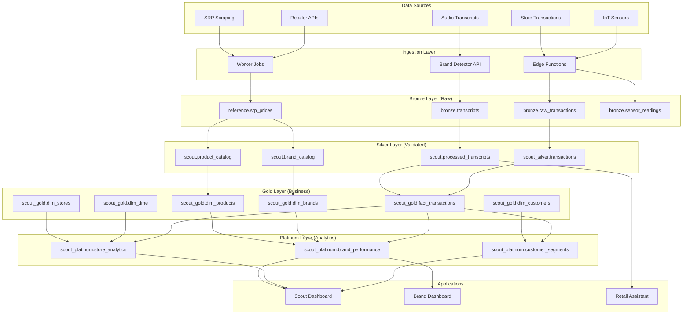
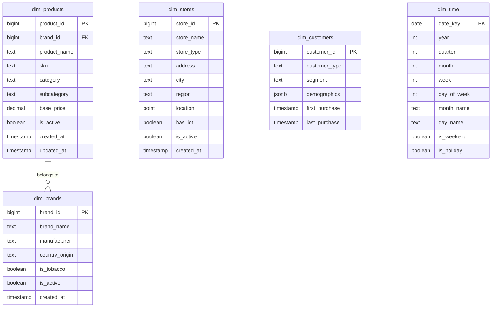
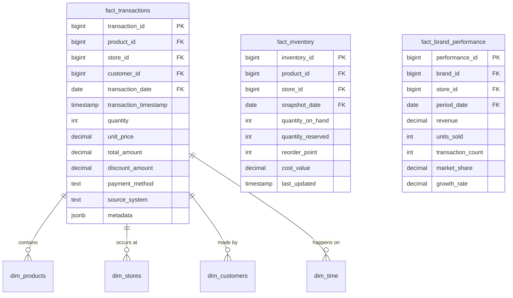
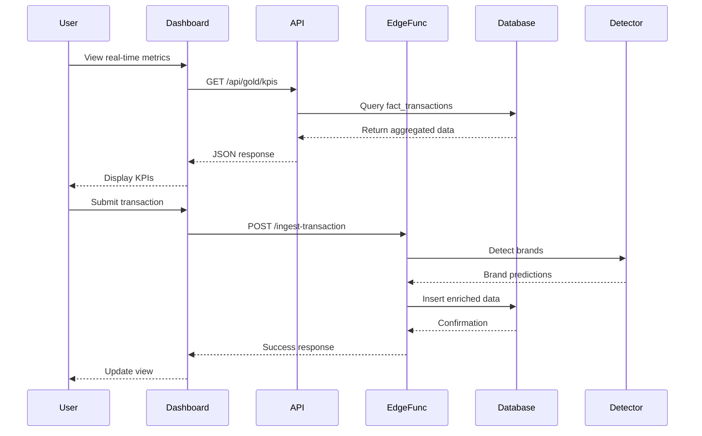

# Scout Analytics Platform - Data Flow Architecture

## Overview

This document illustrates how data flows through the Scout Analytics Platform from ingestion to visualization, showing all dimension and fact tables involved in the process.

## High-Level Data Flow



## Detailed Table Relationships

### Dimension Tables (scout_gold schema)



### Fact Tables



## Data Processing Pipeline

### 1. Ingestion Phase

```sql
-- SRP Data Ingestion (Worker Job)
INSERT INTO reference.srp_prices (
    store_name, address, source, product, 
    current_price, promo_price, scraped_at
)
SELECT * FROM staging.srp_import;

-- Transaction Ingestion (Edge Function)
INSERT INTO bronze.raw_transactions (
    store_id, product_description, amount, 
    quantity, timestamp, metadata
)
VALUES ($1, $2, $3, $4, $5, $6);
```

### 2. Brand Detection & Enrichment

```sql
-- Process transcript through brand detector
SELECT scout.process_transcript(
    transaction_id := 'TXN-001',
    text_input := 'Kuya, may Lucky Me ba kayo?'
) AS result;

-- Result enriches transaction with brand
UPDATE scout_silver.transactions
SET 
    detected_brand_id = (result->>'brand_id')::bigint,
    brand_confidence = (result->>'confidence')::decimal
WHERE transaction_id = 'TXN-001';
```

### 3. Silver Layer Processing

```sql
-- Consolidate and validate products
INSERT INTO scout.product_catalog (
    brand_id, product_name, sku, category
)
SELECT DISTINCT
    b.brand_id,
    p.product_name,
    p.sku,
    p.category
FROM staging.product_import p
JOIN scout.brand_catalog b ON b.brand_name = p.brand_name
WHERE p.is_valid = true;
```

### 4. Gold Layer Transformation

```sql
-- Build fact table from silver
INSERT INTO scout_gold.fact_transactions (
    transaction_id, product_id, store_id, customer_id,
    transaction_date, transaction_timestamp,
    quantity, unit_price, total_amount
)
SELECT 
    t.transaction_id,
    p.product_id,
    s.store_id,
    COALESCE(c.customer_id, -1), -- Unknown customer
    DATE(t.timestamp),
    t.timestamp,
    t.quantity,
    t.unit_price,
    t.total_amount
FROM scout_silver.transactions t
JOIN scout_gold.dim_products p ON p.sku = t.product_sku
JOIN scout_gold.dim_stores s ON s.store_id = t.store_id
LEFT JOIN scout_gold.dim_customers c ON c.customer_id = t.customer_id
WHERE t.is_processed = false;
```

### 5. Platinum Layer Analytics

```sql
-- Aggregate brand performance
INSERT INTO scout_platinum.brand_performance (
    brand_id, store_id, period_date,
    revenue, units_sold, transaction_count
)
SELECT 
    p.brand_id,
    f.store_id,
    f.transaction_date,
    SUM(f.total_amount) as revenue,
    SUM(f.quantity) as units_sold,
    COUNT(DISTINCT f.transaction_id) as transaction_count
FROM scout_gold.fact_transactions f
JOIN scout_gold.dim_products p ON p.product_id = f.product_id
GROUP BY p.brand_id, f.store_id, f.transaction_date;
```

## Real-Time Data Flow



## Key Data Transformations

### 1. Brand Resolution
```
Raw: "Lucky Me Pancit Canton Original 60g"
  ↓ Brand Detector
Detected: brand_id: 123, brand_name: "Lucky Me", confidence: 0.95
  ↓ Catalog Lookup
Enriched: manufacturer: "Monde Nissin", category: "Instant Noodles"
```

### 2. Geographic Enrichment
```
Raw: store_address: "123 Ayala Ave, Makati"
  ↓ Geocoding
Enriched: region: "NCR", city: "Makati", coordinates: [14.5547, 121.0244]
  ↓ Boundary Match
Tagged: barangay: "Bel-Air", district: "CBD"
```

### 3. Customer Segmentation
```
Raw: transaction_history: [{...}, {...}, {...}]
  ↓ Analytics
Segment: "Frequent Buyer", demographics: {gender: "female", age_group: "25-34"}
  ↓ Scoring
Value: lifetime_value: 45000, churn_risk: "low"
```

## Dashboard Data Access Patterns

### Executive Dashboard (scout_gold views)
```sql
-- Real-time KPIs
CREATE VIEW scout_gold.v_executive_dashboard AS
SELECT 
    COUNT(DISTINCT f.transaction_id) as total_transactions,
    COUNT(DISTINCT f.store_id) as active_stores,
    COUNT(DISTINCT f.customer_id) as unique_customers,
    SUM(f.total_amount) as total_revenue,
    AVG(f.total_amount) as avg_transaction_value
FROM scout_gold.fact_transactions f
WHERE f.transaction_date >= CURRENT_DATE - INTERVAL '30 days';

-- Brand Performance
CREATE VIEW scout_gold.v_brand_performance AS
SELECT 
    b.brand_name,
    COUNT(DISTINCT f.transaction_id) as transaction_count,
    SUM(f.total_amount) as revenue,
    AVG(f.total_amount) as avg_transaction_value
FROM scout_gold.fact_transactions f
JOIN scout_gold.dim_products p ON p.product_id = f.product_id
JOIN scout_gold.dim_brands b ON b.brand_id = p.brand_id
GROUP BY b.brand_name;
```

### Geographic Analysis
```sql
-- Regional Distribution
CREATE VIEW scout_gold.v_regional_sales AS
SELECT 
    s.region,
    s.city,
    COUNT(DISTINCT f.transaction_id) as transactions,
    SUM(f.total_amount) as revenue,
    COUNT(DISTINCT f.customer_id) as customers
FROM scout_gold.fact_transactions f
JOIN scout_gold.dim_stores s ON s.store_id = f.store_id
GROUP BY s.region, s.city;
```

## Data Quality Checks

```sql
-- Completeness
SELECT 
    'fact_transactions' as table_name,
    COUNT(*) as total_rows,
    COUNT(product_id) as non_null_products,
    COUNT(store_id) as non_null_stores,
    COUNT(customer_id) as non_null_customers
FROM scout_gold.fact_transactions;

-- Referential Integrity
SELECT 
    COUNT(*) as orphaned_transactions
FROM scout_gold.fact_transactions f
LEFT JOIN scout_gold.dim_products p ON p.product_id = f.product_id
WHERE p.product_id IS NULL;
```

## Performance Optimization

1. **Partitioning**: Fact tables partitioned by transaction_date
2. **Indexing**: B-tree indexes on all foreign keys
3. **Materialized Views**: Pre-aggregated metrics refresh hourly
4. **Compression**: Historical partitions use ZSTD compression
5. **Caching**: Redis cache for frequently accessed dimensions

## Summary

The Scout Analytics Platform processes data through a medallion architecture (Bronze → Silver → Gold → Platinum), with clear separation between raw ingestion, validation/enrichment, business modeling, and analytics layers. The star schema in the Gold layer provides optimal query performance for dashboard visualizations while maintaining data quality and consistency.