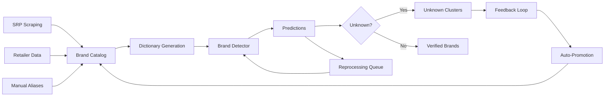

# Dictionary Lifecycle - Scout Analytics Platform

## Overview

The Dictionary Lifecycle system automates brand dictionary management through a closed-loop process that continuously improves brand detection accuracy. It consolidates brands from multiple sources, generates detection patterns, identifies unknowns, and promotes them based on feedback.

## Architecture



## Components

### 1. Brand Consolidation

Automatically consolidates brand names from:
- SRP (Suggested Retail Price) data
- Product catalogs
- Retailer snapshots
- Manual entries

```sql
-- Run consolidation
SELECT scout.consolidate_brands();
```

### 2. Dictionary Generation

Generates regex-safe patterns from:
- Canonical brand names
- Product name tokens
- Human-approved aliases

```sql
-- Generate dictionary JSON
SELECT scout.generate_dictionary_json();
```

Output format:
```json
{
  "version": "2025-01-19 10:30:00",
  "brands": [
    {
      "canonical": "Lucky Me",
      "patterns": ["^\\b(Lucky\\W+Me)\\b$", "^\\b(luckyme)\\b$"]
    }
  ]
}
```

### 3. Unknown Clustering

Identifies high-volume unknown brands:
- Aggregates unknowns from last 7 days
- Tracks occurrence frequency
- Queues for review when count ≥ 5

```sql
-- Cluster unknowns
SELECT scout.cluster_unknowns();
```

### 4. Auto-Promotion

Promotes unknowns to brands when:
- Feedback consensus ≥ 80%
- Minimum 20 votes received
- Within 14-day window

```sql
-- Auto-promote with consensus
SELECT scout.auto_promote_brands();
```

### 5. Reprocessing Pipeline

Re-evaluates past data with updated dictionary:
- Queues transcripts/transactions
- Batch processes with new patterns
- Updates prediction history

```sql
-- Queue last 7 days for reprocessing
SELECT scout.queue_reprocessing(7);
```

## Usage

### Manual Operations

```bash
# Refresh dictionary
make refresh-dictionary

# Refresh and queue reprocessing
make refresh-reprocess

# Start reprocessing worker
make reprocess-start

# Check coverage metrics
make coverage-check

# View dictionary statistics
make dict-stats
```

### Automated Schedule

The system runs automatically via GitHub Actions:
- **Daily at 2 AM UTC** (10 AM PHT)
- Consolidates → Clusters → Promotes → Generates → Deploys

### Manual Trigger

```bash
# Run dictionary refresh
gh workflow run dictionary-refresh.yml

# Run with reprocessing
gh workflow run dictionary-refresh.yml -f reprocess=true
```

## Monitoring

### Coverage Metrics

Monitor brand and price coverage:

```sql
-- View 7-day coverage trends
SELECT * FROM dq.v_coverage_summary 
ORDER BY day DESC 
LIMIT 7;
```

Target thresholds:
- **Brand Coverage**: ≥ 70%
- **Price Coverage**: ≥ 85%

### Unknown Brands

Review pending unknowns:

```sql
-- High-volume unknowns
SELECT phrase, occurrence_count, last_seen
FROM scout.unknown_clusters
WHERE status = 'pending'
ORDER BY occurrence_count DESC;
```

### Dictionary Health

```sql
-- Current statistics
WITH stats AS (
  SELECT 
    (SELECT COUNT(*) FROM scout.brand_catalog) as brands,
    (SELECT COUNT(*) FROM scout.brand_aliases) as aliases,
    (SELECT COUNT(*) FROM scout.unknown_clusters WHERE status = 'pending') as unknowns
)
SELECT * FROM stats;
```

## Administration

### Adding Brand Aliases

```sql
-- Add alias for existing brand
INSERT INTO scout.brand_aliases (brand_id, alias)
SELECT brand_id, 'New Alias'
FROM scout.brand_catalog
WHERE brand_name = 'Existing Brand';
```

### Reviewing Unknowns

```sql
-- Review and promote unknown
UPDATE scout.unknown_clusters
SET 
  status = 'promoted',
  promoted_to_brand_id = (
    SELECT brand_id FROM scout.brand_catalog 
    WHERE brand_name = 'Target Brand'
  ),
  reviewed_at = NOW(),
  reviewed_by = CURRENT_USER
WHERE phrase = 'unknown phrase';
```

### Force Reprocessing

```sql
-- Queue specific date range
INSERT INTO scout.reprocess_queue (entity_type, entity_id, reason)
SELECT 'transcript', id, 'manual_reprocess'
FROM bronze.transcripts
WHERE created_at BETWEEN '2025-01-01' AND '2025-01-07';
```

## Troubleshooting

### Low Coverage

If brand coverage drops below 70%:

1. Check for new product categories
2. Review high-volume unknowns
3. Add missing aliases
4. Run reprocessing on recent data

### Failed Deployments

If dictionary deployment fails:

1. Check detector API health
2. Verify dictionary JSON format
3. Review deployment logs
4. Manually deploy if needed

### Reprocessing Stuck

If reprocessing queue grows:

1. Check worker logs
2. Verify detector API capacity
3. Increase batch size if needed
4. Clear failed items

## Best Practices

1. **Regular Reviews**: Weekly review of unknown clusters
2. **Alias Management**: Document alias sources
3. **Version Control**: Track dictionary changes
4. **Performance**: Monitor reprocessing throughput
5. **Quality Gates**: Maintain coverage thresholds

## Integration

### With Brand Detector

```bash
# Deploy dictionary
curl -X POST "$DETECTOR_URL/dictionary/upsert" \
  -H "content-type: application/json" \
  -d @brand-dictionary.json
```

### With Dashboard

The dashboard shows:
- Current dictionary version
- Coverage metrics
- Unknown trends
- Reprocessing status

### With CI/CD

Integrated with:
- Production readiness gate (coverage check)
- Nightly DQ enforcement
- Deployment pipelines

## Metrics

Track these KPIs:
- **Dictionary Growth Rate**: New brands/week
- **Unknown Resolution Time**: Days to promote
- **Coverage Stability**: Standard deviation
- **Reprocessing Throughput**: Items/hour
- **Feedback Quality**: Consensus rates

## Future Enhancements

1. **ML-based clustering**: Group similar unknowns
2. **Multi-language support**: Filipino variations
3. **Category inference**: Auto-categorize brands
4. **Confidence scoring**: Weight by occurrence
5. **A/B testing**: Compare dictionary versions