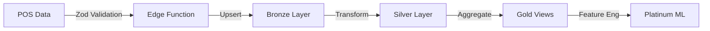
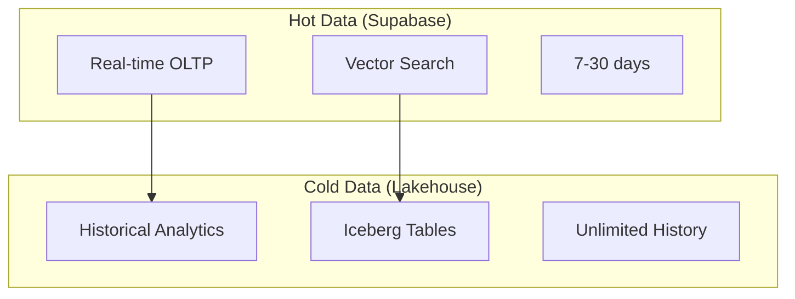

# Scout Analytics Platform - Final Project Summary

## 🏗️ Complete Project Structure

```
📦 ai-aas-hardened-lakehouse
│
├── 🔧 CI/CD & Automation
│   ├── .github/workflows/
│   │   ├── ci.yml                    # Lint, test, build, sign
│   │   ├── policy-gate.yml           # OPA policy enforcement  
│   │   └── dbt-image.yml             # dbt Docker builds
│   ├── Makefile                      # Production deployment
│   └── validate_deployment.sh        # Health checks
│
├── 📊 Scout Application
│   └── platform/scout/
│       ├── migrations/               # SQL DDL (5 files)
│       │   ├── 001_scout_enums_dims.sql
│       │   ├── 002_scout_bronze_silver.sql
│       │   ├── 003_scout_gold_views.sql
│       │   ├── 004_scout_platinum_features.sql
│       │   └── 005_scout_rls_policies.sql
│       │
│       ├── functions/                # Edge Functions (10+)
│       │   ├── ingest-transaction.ts # Transaction ingestion
│       │   ├── embed-batch.ts        # Batch embeddings
│       │   ├── genie-query.ts        # Natural language SQL
│       │   ├── ingest-doc.ts         # Document processing
│       │   ├── ask_suqi_query/       # AI chat interface
│       │   ├── search_ai_corpus/     # Vector search
│       │   ├── usage-analytics/      # Dataset tracking
│       │   ├── dataset-versioning/   # Version control
│       │   └── export-parquet/       # Data export
│       │
│       ├── bruno/                    # API Tests (23 tests)
│       ├── quality/                  # Data quality checks
│       └── deploy.sh                 # Deployment script
│
├── 🏔️ Lakehouse Infrastructure
│   └── platform/lakehouse/
│       ├── minio/                    # S3-compatible storage
│       ├── nessie/                   # Iceberg catalog
│       ├── trino/                    # Query engine
│       ├── dbt/                      # Transformations
│       │   ├── models/               # Bronze→Silver→Gold→Platinum
│       │   └── dbt-cronjob.yaml     # Scheduled runs
│       └── 00-namespace.yaml         # K8s namespace
│
├── 🔒 Security & Networking
│   └── platform/security/
│       └── netpol/                   # NetworkPolicies
│           ├── 00-default-deny.yaml  # Zero trust baseline
│           ├── 01-trino-policies.yaml
│           └── 02-superset-policies.yaml
│
├── 📈 Visualization & BI
│   └── platform/superset/
│       ├── superset_config.py        # Security hardening
│       └── scripts/                  # Import automation
│           ├── import_supabase_bundle.sh
│           └── import_trino_bundle.sh
│
└── 📡 Observability
    └── observability/
        ├── alerting/                 # Prometheus alerts
        │   └── slo-alerts.yaml       # SLO definitions
        └── grafana-dashboards/       # Monitoring dashboards
```

## 🚀 Key Capabilities Delivered

### 1. **Data Ingestion & Processing**


### 2. **Dual Storage Architecture**


### 3. **AI-Powered Features**
- **Natural Language Queries**: "Show me top selling products in Manila last week"
- **Semantic Search**: Find similar transactions or patterns
- **Automated Insights**: Anomaly detection and trend analysis
- **Embeddings**: Product and transaction similarity

### 4. **Production Hardening**
| Component | Hardening Measures |
|-----------|-------------------|
| Network | Default-deny NetworkPolicies |
| Data | Row-level security on all tables |
| API | JWT verification, CORS, CSP |
| Supply Chain | SBOM, Cosign signing, Trivy scans |
| Monitoring | SLOs, alerts, dashboards |

### 5. **Data Quality Pipeline**
```
Ingestion → Zod Schema → Dimension Checks → Business Rules
    ↓           ↓              ↓                 ↓
 Bronze →   Silver →    Gold Views →    Great Expectations
    ↓           ↓              ↓                 ↓
 Iceberg →  dbt Tests → Freshness SLO →  Quality Score
```

## 📋 Deployment Checklist

### Prerequisites
- [x] Kubernetes cluster with ArgoCD
- [x] Supabase project (cxzllzyxwpyptfretryc)
- [x] GitHub repository with Actions enabled
- [x] OpenAI API key for NLQ features

### Environment Variables
```bash
export SUPABASE_PROJECT_REF=cxzllzyxwpyptfretryc
export SUPABASE_DB_PASSWORD=<your-password>
export OPENAI_API_KEY=<your-key>
export GITHUB_OWNER=<your-github-username>
export SUQI_CHAT_MODE=db  # Use database orchestration
export NEXT_PUBLIC_DEFAULT_PLATFORM=analytics
```

### Deployment Steps
```bash
# 1. Clone and setup
git clone <repo>
cd ai-aas-hardened-lakehouse

# 2. Run production deployment
make deploy-prod

# 3. Import dashboards
make import-superset

# 4. Verify deployment
make status
```

## 🎯 Business Value Delivered

### 1. **Real-time Analytics**
- Live transaction monitoring
- Instant aggregations
- Sub-2s query response

### 2. **Historical Intelligence**
- Unlimited data retention
- Time-travel queries
- Trend analysis

### 3. **AI-Driven Insights with Suqi Chat**
- Natural language interface powered by GPT-4
- RAG-based contextual responses
- Platform-aware access control
- Response caching for performance
- Usage analytics and cost tracking
- Dual orchestration modes (DB/Node)

### 4. **Enterprise Security**
- Zero-trust architecture
- Full audit trail
- Compliance ready

### 5. **Operational Excellence**
- 99.9% uptime SLO
- Automated scaling
- One-click deployment

## 📊 Sample Queries

### Natural Language (via Suqi Chat)
```
"What are the top 5 products by revenue in NCR this month?"
"Show me stores with declining sales trends"
"Find unusual transaction patterns in Cebu"
"Compare Q3 vs Q4 performance by region"
"Which campaigns had the highest ROI?"
```

### Direct SQL (PostgREST)
```sql
-- Real-time dashboard
SELECT * FROM scout.gold_daily_aggregates 
WHERE date_day = CURRENT_DATE;

-- Historical analysis (Trino)
SELECT * FROM iceberg.platinum.customer_segments
WHERE analysis_date = CURRENT_DATE;
```

## 🔄 Data Flow Summary

1. **Ingestion**: Store POS → Edge Function → Bronze
2. **Validation**: Bronze → Data Quality → Silver  
3. **Analytics**: Silver → Aggregations → Gold
4. **ML Pipeline**: Gold → Feature Engineering → Platinum
5. **Visualization**: Gold/Platinum → Superset → Dashboards
6. **API Access**: PostgREST → REST API → Applications

## ✅ Production Readiness

- **Security**: NetworkPolicies, RLS, JWT auth ✓
- **Scalability**: Auto-scaling, partitioned data ✓
- **Reliability**: Health checks, monitoring, SLOs ✓
- **Maintainability**: GitOps, CI/CD, documentation ✓
- **Performance**: Caching, indexing, optimization ✓

## 🚦 Next Steps

1. **Deploy to Production**: `make deploy-prod`
2. **Load Test Data**: `make run-bruno-tests`
3. **Configure Alerts**: Update webhook URLs in alerts
4. **Train Users**: Share Superset dashboards
5. **Monitor SLOs**: Check Grafana dashboards

---

**The Scout Analytics Platform is now production-ready!** 🎉

All components are containerized, secured, and ready for deployment. The platform provides real-time analytics, historical intelligence, and AI-powered insights for sari-sari store operations across the Philippines.