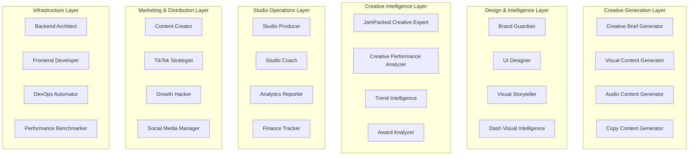
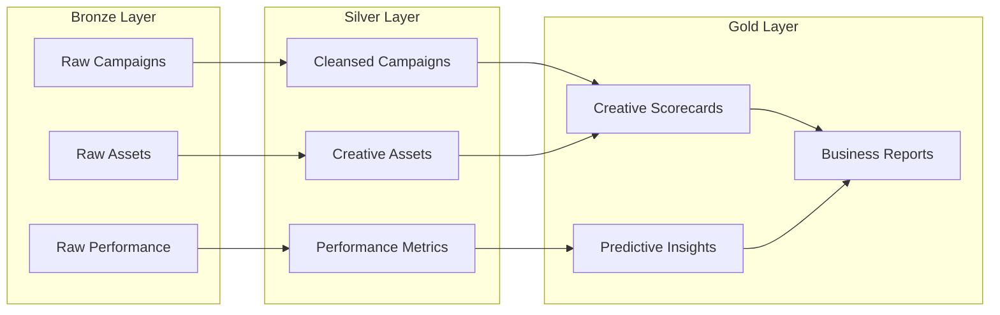

# TBWA Creative Studio & Operations Platform

## Overview

The TBWA Creative Studio & Operations Platform is a comprehensive AI-powered creative production system that combines human expertise with advanced AI capabilities to deliver exceptional creative work at scale.

## Architecture

### System Components



## Core Capabilities

### 🎨 Creative Generation
- **AI-Powered Brief Generation**: Automated creative brief creation with brand voice integration
- **Visual Content Creation**: Image generation, design automation, and brand compliance
- **Audio Content Production**: Voice synthesis, music composition, and audio branding
- **Copy Generation**: Brand-consistent copywriting across multiple channels

### 🛡️ Brand Protection
- **Brand Guardian System**: Real-time brand compliance monitoring
- **Visual Brand Enforcement**: Automated logo, color, and typography validation
- **Asset Management**: Centralized creative asset storage and approval workflows

### 📊 Creative Intelligence
- **WARC Effective 100 Standard**: Industry-leading creative effectiveness measurement
- **Performance Analytics**: Real-time campaign performance tracking
- **Award Prediction**: AI-powered prediction of creative award potential
- **Competitive Analysis**: Automated competitor creative monitoring

### 🏭 Studio Operations
- **Project Orchestration**: Automated workflow management and resource allocation
- **Team Coaching**: AI-powered productivity and skill development
- **Financial Tracking**: Budget monitoring and cost optimization
- **Quality Assurance**: Automated testing and performance benchmarking

### 📱 Multi-Platform Distribution
- **Social Media Optimization**: Platform-specific content optimization
- **TikTok Strategy**: Algorithm-aware content creation and trend leveraging
- **Cross-Channel Campaigns**: Unified messaging across all touchpoints

## Agent Registry

The platform currently includes **25+ specialized agents** organized by function:

### Creative Agents (4)
- `creative-brief-generator-v1`: AI-powered brief generation
- `visual-content-generator-v1`: Visual design automation
- `audio-content-generator-v1`: Audio synthesis and production
- `copy-content-generator-v1`: Brand-consistent copywriting

### Design & Intelligence (4)
- `brand-guardian-v1`: Brand compliance monitoring
- `ui-designer-v1`: User interface design
- `visual-storyteller-v1`: Narrative visualization
- `dash-visual-intelligence-v2`: Advanced visual intelligence

### Creative Intelligence (2)
- `jampacked-creative-expert-v1`: WARC effectiveness analysis
- `creative-performance-analyzer-v1`: Real-time performance tracking

### Studio Operations (4)
- `studio-producer-v1`: Project orchestration
- `studio-coach-v1`: Team optimization
- `analytics-reporter-v1`: Automated reporting
- `finance-tracker-v1`: Budget monitoring

### Marketing & Growth (3)
- `content-creator-v1`: Multi-platform content creation
- `tiktok-strategist-v1`: TikTok-specific optimization
- `growth-hacker-v1`: Data-driven growth strategies

### Engineering & Testing (3)
- `backend-architect-v1`: System architecture
- `frontend-developer-v1`: UI/UX implementation
- `performance-benchmarker-v1`: Quality assurance

## Technology Stack

### AI & Machine Learning
- **OpenAI GPT Models**: Natural language generation and understanding
- **Stability AI**: Image generation and visual content creation
- **Anthropic Claude**: Advanced reasoning and creative analysis
- **Custom ONNX Models**: Specialized creative effectiveness models

### Design Tools Integration
- **Figma API**: Design system integration and asset management
- **Adobe Creative Suite**: Integration with Creative Cloud workflows
- **Sketch Libraries**: Design system synchronization
- **Canva Enterprise**: Template and brand kit management

### Analytics & Intelligence
- **Creative Effectiveness Modeling**: WARC Effective 100 compliance
- **Performance Attribution**: Multi-touch attribution modeling
- **Competitive Intelligence**: Automated competitor analysis
- **Award Prediction**: Machine learning-based award scoring

### Infrastructure
- **Supabase**: Real-time database and authentication
- **Vercel**: Serverless deployment and edge functions
- **Railway**: Container orchestration and scaling
- **Render**: Full-stack application hosting

## Data Architecture

### Medallion Architecture
The platform implements a medallion architecture for creative data:



### Data Sources
- **Campaign Performance Data**: Real-time metrics from all channels
- **Creative Asset Metadata**: AI-generated tags, classifications, and insights
- **Brand Guidelines**: Centralized brand system definitions
- **Market Intelligence**: Competitive and trend data
- **User Feedback**: Qualitative insights and sentiment analysis

## Deployment & Operations

### Environment Configuration
- **Development**: Local development with hot reloading
- **Staging**: Pre-production testing and validation
- **Production**: High-availability deployment across multiple regions

### Monitoring & Observability
- **Performance Metrics**: Real-time application performance monitoring
- **Creative Quality Metrics**: Automated creative effectiveness scoring
- **Business KPIs**: Campaign performance and ROI tracking
- **Error Tracking**: Comprehensive error monitoring and alerting

### Security & Compliance
- **Brand Compliance**: Automated brand guideline enforcement
- **Data Privacy**: GDPR and CCPA compliance
- **Access Control**: Role-based permissions and audit trails
- **Secure Asset Storage**: Encrypted creative asset management

## Getting Started

### Prerequisites
- Node.js 18+ and npm/pnpm
- Python 3.9+ for AI model execution
- Access to design tools (Figma, Adobe, etc.)
- Supabase project for data storage

### Installation

```bash
# Clone the repository
git clone https://github.com/tbwa/creative-studio-platform.git
cd creative-studio-platform

# Install dependencies
pnpm install

# Configure environment
cp .env.example .env
# Edit .env with your configuration

# Start development server
pnpm dev
```

### Agent Validation

```bash
# Validate all creative agents
./scripts/creative-agents-validate.sh

# Create new agents
./scripts/creative-agents-create.sh
```

## API Documentation

### Creative Brief API
```typescript
POST /api/creative/brief
{
  "campaign_objectives": ["brand_awareness", "engagement"],
  "target_audience": "millennials_urban_professionals",
  "brand_guidelines": "tbwa_brand_v2",
  "channels": ["tiktok", "instagram", "facebook"]
}
```

### Brand Validation API
```typescript
POST /api/brand/validate
{
  "asset_url": "https://example.com/creative-asset.jpg",
  "brand_id": "tbwa",
  "validation_type": "comprehensive"
}
```

### Performance Analytics API
```typescript
GET /api/analytics/performance
?campaign_id=abc123
&metrics=effectiveness,engagement,roi
&date_range=30d
```

## Integration Examples

### Figma Plugin
```javascript
// Figma plugin for brand compliance checking
figma.showUI(__html__, { width: 400, height: 500 });

figma.ui.onmessage = async (msg) => {
  if (msg.type === 'validate-brand') {
    const result = await validateBrandCompliance(msg.selection);
    figma.ui.postMessage({ type: 'validation-result', data: result });
  }
};
```

### Slack Bot Integration
```javascript
// Slack bot for campaign performance updates
app.command('/campaign-status', async ({ command, ack, respond }) => {
  await ack();
  
  const performance = await getCampaignPerformance(command.text);
  await respond({
    text: `Campaign Performance Update`,
    blocks: generatePerformanceBlocks(performance)
  });
});
```

## Contributing

### Agent Development
1. Use the agent creation scaffold: `./scripts/creative-agents-create.sh`
2. Follow Anthropic-first development principles
3. Ensure comprehensive testing and documentation
4. Submit PR with agent validation passing

### Code Standards
- TypeScript for all new code
- Comprehensive unit and integration tests
- Documentation for all public APIs
- Brand compliance for all user-facing content

## Support & Resources

### Documentation
- [Agent Development Guide](./agent-development.md)
- [API Reference](./api-reference.md)
- [Brand Guidelines](./brand-guidelines.md)
- [Deployment Guide](./deployment.md)

### Contact
- **Creative Team**: creative@tbwa.com
- **Technical Support**: engineering@tbwa.com
- **Platform Issues**: support@tbwa.com

### Community
- [GitHub Discussions](https://github.com/tbwa/creative-studio-platform/discussions)
- [Internal Slack](https://tbwa.slack.com/channels/creative-platform)
- [Knowledge Base](https://tbwa.atlassian.net/wiki/creative-platform)

---

*This documentation is automatically updated with each platform release. Last updated: August 25, 2025*