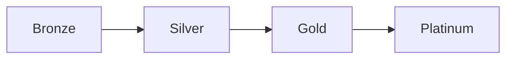

# Scout Analytics Documentation Site

## 🚀 Quick Start

```bash
# Install dependencies
npm install

# Start development server
npm start
# Opens at http://localhost:3001

# Build for production
npm run build

# Serve production build
npm run serve
```

## 📚 Documentation Structure

```
docs/
├── intro.md                    # Landing page
├── architecture/
│   ├── solution-architecture.md
│   ├── medallion-architecture.md  # Bronze→Silver→Gold→Platinum
│   ├── ai-foundry.md              # AI/ML patterns
│   └── network-topology.md
├── data/
│   ├── lineage/                   # Auto-generated lineage
│   ├── schemas/
│   └── privacy-pii.md
├── api/
│   ├── openapi.yaml               # Auto-generated OpenAPI
│   └── examples/
├── operations/
│   ├── runbooks/                  # Incident response guides
│   └── disaster-recovery/
└── ml/
    └── model-cards/               # ML model documentation
```

## 🔄 Automated Documentation

Generate fresh documentation from live systems:

```bash
# Run the documentation generator
npm run generate

# Or directly
../scripts/generate_docs.sh
```

This will:
- Extract data lineage from database
- Generate OpenAPI specs from Edge Functions
- Create model cards from ML registry
- Update cost reports from billing APIs
- Generate network topology diagrams

## 🎨 Customization

### Adding New Pages

1. Create a new `.md` file in `docs/`
2. Add front matter:
```yaml
---
sidebar_position: 1
title: Your Page Title
---
```
3. Write content in Markdown with Mermaid diagram support

### Updating Navigation

Edit `sidebars.ts` to modify the navigation structure.

### Styling

Custom CSS in `src/css/custom.css`

## 📊 Mermaid Diagrams

Embed diagrams directly in Markdown:

````markdown

````

## 🔍 Search

Search is powered by Algolia. Configure in `docusaurus.config.ts`:

```typescript
algolia: {
  appId: 'YOUR_APP_ID',
  apiKey: 'YOUR_API_KEY',
  indexName: 'scout-docs',
}
```

## 🚢 Deployment

### GitHub Pages

```bash
npm run build
npm run deploy
```

### Vercel

```bash
vercel --prod build/
```

## 📈 Features

- ✅ **Auto-generation**: Documentation from code
- ✅ **Versioning**: Git-based version control
- ✅ **Search**: Instant search with Algolia
- ✅ **Dark Mode**: Automatic theme switching
- ✅ **Mobile**: Responsive design
- ✅ **Offline**: PWA support
- ✅ **Diagrams**: Mermaid support
- ✅ **API Docs**: OpenAPI/Swagger integration

## 🛠️ Scripts

| Script | Description |
|--------|-------------|
| `npm start` | Start dev server |
| `npm run build` | Build production site |
| `npm run serve` | Serve production build |
| `npm run generate` | Generate docs from sources |
| `npm run deploy` | Deploy to GitHub Pages |
| `npm run clear` | Clear cache |

## 📝 License

Copyright © 2025 Scout Analytics Platform
