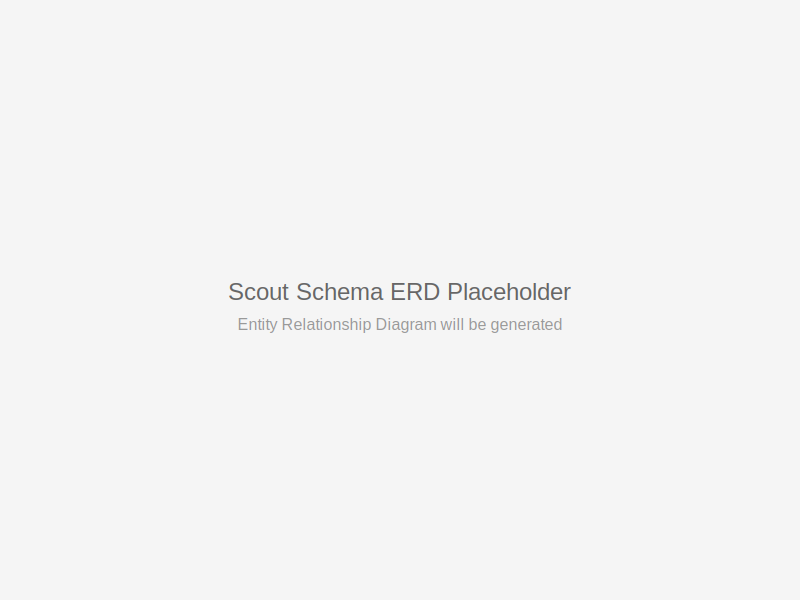

# SQL Interface Reference

This comprehensive guide covers all SQL interfaces, queries, and database operations for the AI-AAS Hardened Lakehouse platform.

## 📊 Scout Schema Overview



## Core Tables Structure

### **Dimensional Tables**

#### **scout.dim_store**
```sql
CREATE TABLE scout.dim_store (
    store_id TEXT PRIMARY KEY,
    store_name TEXT NOT NULL,
    store_code TEXT UNIQUE,
    channel channel_type DEFAULT 'store',
    region TEXT,
    province TEXT,
    city TEXT,
    barangay TEXT,
    address TEXT,
    latitude DECIMAL(10,8),
    longitude DECIMAL(11,8),
    cluster_id TEXT,
    district_id TEXT,
    is_active BOOLEAN DEFAULT true,
    opened_date DATE,
    closed_date DATE,
    store_size_sqm INTEGER,
    staff_count INTEGER,
    
    -- Geographic normalization
    citymun_psgc TEXT,
    province_psgc TEXT,
    region_psgc TEXT,
    
    created_at TIMESTAMP DEFAULT NOW(),
    updated_at TIMESTAMP DEFAULT NOW()
);
```

#### **scout.dim_product**
```sql
CREATE TABLE scout.dim_product (
    product_id TEXT PRIMARY KEY,
    product_name TEXT NOT NULL,
    product_code TEXT UNIQUE,
    barcode TEXT,
    category product_category,
    subcategory TEXT,
    brand TEXT,
    supplier_id TEXT,
    unit_of_measure TEXT,
    pack_size INTEGER,
    unit_cost DECIMAL(10,2),
    srp DECIMAL(10,2),
    is_active BOOLEAN DEFAULT true,
    launch_date DATE,
    discontinue_date DATE,
    created_at TIMESTAMP DEFAULT NOW(),
    updated_at TIMESTAMP DEFAULT NOW()
);
```

#### **scout.dim_customer**
```sql
CREATE TABLE scout.dim_customer (
    customer_id TEXT PRIMARY KEY,
    customer_code TEXT UNIQUE,
    mobile_number TEXT,
    email TEXT,
    first_name TEXT,
    last_name TEXT,
    birthdate DATE,
    gender TEXT,
    customer_type customer_type,
    loyalty_tier TEXT,
    loyalty_points INTEGER DEFAULT 0,
    first_purchase_date DATE,
    last_purchase_date DATE,
    total_lifetime_value DECIMAL(12,2),
    preferred_store_id TEXT,
    preferred_payment payment_method,
    created_at TIMESTAMP DEFAULT NOW(),
    updated_at TIMESTAMP DEFAULT NOW()
);
```

### **Fact Tables**

#### **scout.fact_transactions**
```sql
CREATE TABLE scout.fact_transactions (
    transaction_id TEXT PRIMARY KEY,
    store_id TEXT REFERENCES scout.dim_store(store_id),
    customer_id TEXT REFERENCES scout.dim_customer(customer_id),
    product_id TEXT REFERENCES scout.dim_product(product_id),
    campaign_id TEXT REFERENCES scout.dim_campaign(campaign_id),
    transaction_date DATE NOT NULL,
    transaction_time TIME NOT NULL,
    time_of_day time_of_day,
    
    -- Metrics
    quantity INTEGER NOT NULL,
    unit_price DECIMAL(10,2) NOT NULL,
    discount_amount DECIMAL(10,2) DEFAULT 0,
    total_amount DECIMAL(10,2) NOT NULL,
    
    -- Additional context
    payment_method payment_method,
    is_loyalty_transaction BOOLEAN DEFAULT false,
    weather_condition TEXT,
    is_weekend BOOLEAN,
    is_holiday BOOLEAN,
    
    created_at TIMESTAMP DEFAULT NOW()
);
```

## 🔍 Common Query Patterns

### **Basic Analytics Queries**

#### **Store Performance Analysis**
```sql
-- Top performing stores by revenue (last 30 days)
SELECT 
    s.store_name,
    s.region,
    s.city,
    COUNT(DISTINCT t.transaction_id) as transaction_count,
    SUM(t.total_amount) as total_revenue,
    AVG(t.total_amount) as avg_transaction_value,
    COUNT(DISTINCT t.customer_id) as unique_customers,
    SUM(t.total_amount) / COUNT(DISTINCT t.customer_id) as revenue_per_customer
FROM scout.fact_transactions t
JOIN scout.dim_store s ON t.store_id = s.store_id
WHERE t.transaction_date >= CURRENT_DATE - INTERVAL '30 days'
    AND s.is_active = true
GROUP BY s.store_id, s.store_name, s.region, s.city
ORDER BY total_revenue DESC
LIMIT 20;
```

#### **Product Category Performance**
```sql
-- Product category sales analysis with trends
WITH category_sales AS (
    SELECT 
        p.category,
        p.subcategory,
        DATE_TRUNC('week', t.transaction_date) as week,
        SUM(t.quantity) as units_sold,
        SUM(t.total_amount) as revenue,
        COUNT(DISTINCT t.customer_id) as unique_customers
    FROM scout.fact_transactions t
    JOIN scout.dim_product p ON t.product_id = p.product_id
    WHERE t.transaction_date >= CURRENT_DATE - INTERVAL '12 weeks'
    GROUP BY p.category, p.subcategory, DATE_TRUNC('week', t.transaction_date)
),
category_trends AS (
    SELECT 
        category,
        subcategory,
        SUM(units_sold) as total_units,
        SUM(revenue) as total_revenue,
        AVG(revenue) as avg_weekly_revenue,
        -- Calculate week-over-week growth
        (SUM(CASE WHEN week >= DATE_TRUNC('week', CURRENT_DATE) - INTERVAL '4 weeks' 
                  THEN revenue ELSE 0 END) /
         NULLIF(SUM(CASE WHEN week >= DATE_TRUNC('week', CURRENT_DATE) - INTERVAL '8 weeks' 
                         AND week < DATE_TRUNC('week', CURRENT_DATE) - INTERVAL '4 weeks'
                         THEN revenue ELSE 0 END), 0) - 1) * 100 as growth_rate_pct
    FROM category_sales
    GROUP BY category, subcategory
)
SELECT *
FROM category_trends
ORDER BY total_revenue DESC;
```

#### **Customer Segmentation Analysis**
```sql
-- RFM (Recency, Frequency, Monetary) customer segmentation
WITH customer_rfm AS (
    SELECT 
        c.customer_id,
        c.customer_code,
        c.first_name,
        c.last_name,
        c.customer_type,
        
        -- Recency: Days since last purchase
        CURRENT_DATE - MAX(t.transaction_date) as days_since_last_purchase,
        
        -- Frequency: Number of transactions in last 365 days
        COUNT(DISTINCT t.transaction_id) as transaction_frequency,
        
        -- Monetary: Total spend in last 365 days
        SUM(t.total_amount) as total_spend,
        
        -- Additional metrics
        AVG(t.total_amount) as avg_transaction_value,
        COUNT(DISTINCT t.store_id) as stores_visited,
        COUNT(DISTINCT DATE_TRUNC('month', t.transaction_date)) as active_months
    FROM scout.dim_customer c
    LEFT JOIN scout.fact_transactions t ON c.customer_id = t.customer_id
        AND t.transaction_date >= CURRENT_DATE - INTERVAL '365 days'
    GROUP BY c.customer_id, c.customer_code, c.first_name, c.last_name, c.customer_type
),
customer_segments AS (
    SELECT *,
        -- Recency scoring (1-5, 5 being most recent)
        NTILE(5) OVER (ORDER BY days_since_last_purchase DESC) as recency_score,
        
        -- Frequency scoring (1-5, 5 being most frequent)
        NTILE(5) OVER (ORDER BY transaction_frequency) as frequency_score,
        
        -- Monetary scoring (1-5, 5 being highest spend)
        NTILE(5) OVER (ORDER BY total_spend) as monetary_score
    FROM customer_rfm
),
customer_classification AS (
    SELECT *,
        CASE 
            WHEN recency_score >= 4 AND frequency_score >= 4 AND monetary_score >= 4 
                THEN 'Champions'
            WHEN recency_score >= 3 AND frequency_score >= 3 AND monetary_score >= 3 
                THEN 'Loyal Customers'
            WHEN recency_score >= 4 AND frequency_score <= 2 
                THEN 'New Customers'
            WHEN recency_score >= 3 AND frequency_score <= 2 AND monetary_score >= 3 
                THEN 'Potential Loyalists'
            WHEN recency_score >= 3 AND frequency_score >= 3 AND monetary_score <= 2 
                THEN 'Need Attention'
            WHEN recency_score <= 2 AND frequency_score >= 3 AND monetary_score >= 3 
                THEN 'At Risk'
            WHEN recency_score <= 2 AND frequency_score <= 2 AND monetary_score >= 4 
                THEN 'Cannot Lose Them'
            WHEN recency_score <= 2 AND frequency_score <= 2 AND monetary_score <= 2 
                THEN 'Lost Customers'
            ELSE 'Others'
        END as customer_segment
    FROM customer_segments
)
SELECT 
    customer_segment,
    COUNT(*) as customer_count,
    AVG(total_spend) as avg_total_spend,
    AVG(transaction_frequency) as avg_frequency,
    AVG(days_since_last_purchase) as avg_days_since_last_purchase,
    SUM(total_spend) as segment_total_value,
    SUM(total_spend) / SUM(SUM(total_spend)) OVER () * 100 as segment_value_percentage
FROM customer_classification
GROUP BY customer_segment
ORDER BY segment_total_value DESC;
```

### **Time-Series Analysis**

#### **Sales Trends with Seasonality**
```sql
-- Daily sales trends with day-of-week and seasonal analysis
WITH daily_sales AS (
    SELECT 
        t.transaction_date,
        EXTRACT(dow FROM t.transaction_date) as day_of_week,
        EXTRACT(month FROM t.transaction_date) as month,
        EXTRACT(quarter FROM t.transaction_date) as quarter,
        COUNT(DISTINCT t.transaction_id) as transaction_count,
        SUM(t.total_amount) as daily_revenue,
        AVG(t.total_amount) as avg_transaction_value,
        COUNT(DISTINCT t.customer_id) as unique_customers
    FROM scout.fact_transactions t
    WHERE t.transaction_date >= CURRENT_DATE - INTERVAL '2 years'
    GROUP BY t.transaction_date
),
sales_with_moving_avg AS (
    SELECT *,
        -- 7-day moving average
        AVG(daily_revenue) OVER (
            ORDER BY transaction_date 
            ROWS BETWEEN 6 PRECEDING AND CURRENT ROW
        ) as ma_7day,
        
        -- 30-day moving average  
        AVG(daily_revenue) OVER (
            ORDER BY transaction_date 
            ROWS BETWEEN 29 PRECEDING AND CURRENT ROW
        ) as ma_30day,
        
        -- Year-over-year comparison
        LAG(daily_revenue, 365) OVER (ORDER BY transaction_date) as revenue_same_day_last_year
    FROM daily_sales
)
SELECT 
    transaction_date,
    day_of_week,
    CASE 
        WHEN day_of_week = 0 THEN 'Sunday'
        WHEN day_of_week = 1 THEN 'Monday'
        WHEN day_of_week = 2 THEN 'Tuesday'
        WHEN day_of_week = 3 THEN 'Wednesday'
        WHEN day_of_week = 4 THEN 'Thursday'
        WHEN day_of_week = 5 THEN 'Friday'
        WHEN day_of_week = 6 THEN 'Saturday'
    END as day_name,
    month,
    quarter,
    transaction_count,
    daily_revenue,
    avg_transaction_value,
    unique_customers,
    ma_7day,
    ma_30day,
    revenue_same_day_last_year,
    CASE 
        WHEN revenue_same_day_last_year > 0 
        THEN ((daily_revenue - revenue_same_day_last_year) / revenue_same_day_last_year) * 100
        ELSE NULL 
    END as yoy_growth_pct
FROM sales_with_moving_avg
ORDER BY transaction_date DESC;
```

### **Geographic Analysis**

#### **Regional Performance with Geographic Insights**
```sql
-- Regional sales analysis with geographic clustering
WITH regional_performance AS (
    SELECT 
        s.region,
        s.province,
        COUNT(DISTINCT s.store_id) as store_count,
        COUNT(DISTINCT t.transaction_id) as transaction_count,
        SUM(t.total_amount) as total_revenue,
        AVG(t.total_amount) as avg_transaction_value,
        COUNT(DISTINCT t.customer_id) as unique_customers,
        
        -- Geographic metrics
        AVG(s.latitude) as avg_latitude,
        AVG(s.longitude) as avg_longitude,
        
        -- Performance per store
        SUM(t.total_amount) / COUNT(DISTINCT s.store_id) as revenue_per_store,
        COUNT(DISTINCT t.customer_id) / COUNT(DISTINCT s.store_id) as customers_per_store
    FROM scout.dim_store s
    LEFT JOIN scout.fact_transactions t ON s.store_id = t.store_id
        AND t.transaction_date >= CURRENT_DATE - INTERVAL '90 days'
    WHERE s.is_active = true
    GROUP BY s.region, s.province
),
regional_rankings AS (
    SELECT *,
        ROW_NUMBER() OVER (ORDER BY total_revenue DESC) as revenue_rank,
        ROW_NUMBER() OVER (ORDER BY revenue_per_store DESC) as efficiency_rank,
        PERCENT_RANK() OVER (ORDER BY total_revenue) as revenue_percentile
    FROM regional_performance
)
SELECT 
    region,
    province,
    store_count,
    transaction_count,
    total_revenue,
    avg_transaction_value,
    unique_customers,
    revenue_per_store,
    customers_per_store,
    revenue_rank,
    efficiency_rank,
    ROUND(revenue_percentile * 100, 1) as revenue_percentile,
    
    -- Geographic center for mapping
    avg_latitude,
    avg_longitude
FROM regional_rankings
ORDER BY revenue_rank;
```

## 🎯 Advanced Analytics

### **Cohort Analysis**
```sql
-- Customer cohort retention analysis
WITH customer_cohorts AS (
    SELECT 
        customer_id,
        DATE_TRUNC('month', MIN(transaction_date)) as cohort_month
    FROM scout.fact_transactions
    GROUP BY customer_id
),
customer_activities AS (
    SELECT 
        c.customer_id,
        c.cohort_month,
        DATE_TRUNC('month', t.transaction_date) as activity_month,
        SUM(t.total_amount) as monthly_spend
    FROM customer_cohorts c
    JOIN scout.fact_transactions t ON c.customer_id = t.customer_id
    GROUP BY c.customer_id, c.cohort_month, DATE_TRUNC('month', t.transaction_date)
),
cohort_table AS (
    SELECT 
        cohort_month,
        activity_month,
        EXTRACT(YEAR FROM AGE(activity_month, cohort_month)) * 12 + 
        EXTRACT(MONTH FROM AGE(activity_month, cohort_month)) as period_number,
        COUNT(DISTINCT customer_id) as customers,
        SUM(monthly_spend) as revenue
    FROM customer_activities
    GROUP BY cohort_month, activity_month
),
cohort_sizes AS (
    SELECT 
        cohort_month,
        COUNT(DISTINCT customer_id) as cohort_size
    FROM customer_cohorts
    GROUP BY cohort_month
)
SELECT 
    ct.cohort_month,
    cs.cohort_size,
    ct.period_number,
    ct.customers,
    ROUND(ct.customers::decimal / cs.cohort_size * 100, 2) as retention_rate,
    ct.revenue,
    ROUND(ct.revenue / ct.customers, 2) as revenue_per_customer
FROM cohort_table ct
JOIN cohort_sizes cs ON ct.cohort_month = cs.cohort_month
WHERE ct.cohort_month >= CURRENT_DATE - INTERVAL '24 months'
ORDER BY ct.cohort_month, ct.period_number;
```

### **Predictive Analytics Preparation**
```sql
-- Feature engineering for ML models
CREATE OR REPLACE VIEW scout.ml_customer_features AS
WITH customer_behavior AS (
    SELECT 
        c.customer_id,
        c.customer_type,
        c.loyalty_tier,
        
        -- Transaction patterns (last 90 days)
        COUNT(DISTINCT t.transaction_id) as transactions_90d,
        SUM(t.total_amount) as revenue_90d,
        AVG(t.total_amount) as avg_transaction_value_90d,
        STDDEV(t.total_amount) as transaction_value_stddev,
        
        -- Frequency patterns
        COUNT(DISTINCT DATE_TRUNC('week', t.transaction_date)) as active_weeks_90d,
        COUNT(DISTINCT t.store_id) as stores_visited_90d,
        COUNT(DISTINCT p.category) as product_categories_90d,
        
        -- Temporal patterns
        AVG(EXTRACT(hour FROM t.transaction_time)) as avg_shopping_hour,
        COUNT(*) FILTER (WHERE EXTRACT(dow FROM t.transaction_date) IN (0,6)) as weekend_transactions,
        COUNT(*) FILTER (WHERE t.is_loyalty_transaction = true) as loyalty_transactions,
        
        -- Payment preferences
        MODE() WITHIN GROUP (ORDER BY t.payment_method) as preferred_payment_method,
        
        -- Recent activity indicators
        MAX(t.transaction_date) as last_transaction_date,
        CURRENT_DATE - MAX(t.transaction_date) as days_since_last_transaction,
        
        -- Seasonal behavior
        VARIANCE(EXTRACT(month FROM t.transaction_date)) as seasonal_variance
        
    FROM scout.dim_customer c
    LEFT JOIN scout.fact_transactions t ON c.customer_id = t.customer_id
        AND t.transaction_date >= CURRENT_DATE - INTERVAL '90 days'
    LEFT JOIN scout.dim_product p ON t.product_id = p.product_id
    GROUP BY c.customer_id, c.customer_type, c.loyalty_tier
),
customer_segments AS (
    SELECT *,
        -- Behavioral segments
        CASE 
            WHEN transactions_90d >= 20 THEN 'high_frequency'
            WHEN transactions_90d >= 5 THEN 'medium_frequency'
            WHEN transactions_90d >= 1 THEN 'low_frequency'
            ELSE 'inactive'
        END as frequency_segment,
        
        CASE 
            WHEN revenue_90d >= 10000 THEN 'high_value'
            WHEN revenue_90d >= 5000 THEN 'medium_value'
            WHEN revenue_90d >= 1000 THEN 'low_value'
            ELSE 'minimal_value'
        END as value_segment,
        
        -- Risk indicators
        CASE 
            WHEN days_since_last_transaction > 60 THEN 'high_risk'
            WHEN days_since_last_transaction > 30 THEN 'medium_risk'
            ELSE 'low_risk'
        END as churn_risk
    FROM customer_behavior
)
SELECT 
    customer_id,
    customer_type,
    loyalty_tier,
    transactions_90d,
    revenue_90d,
    avg_transaction_value_90d,
    transaction_value_stddev,
    active_weeks_90d,
    stores_visited_90d,
    product_categories_90d,
    avg_shopping_hour,
    weekend_transactions,
    loyalty_transactions,
    preferred_payment_method,
    days_since_last_transaction,
    frequency_segment,
    value_segment,
    churn_risk,
    
    -- Derived metrics for ML
    CASE WHEN transactions_90d > 0 THEN revenue_90d / transactions_90d ELSE 0 END as spend_per_transaction,
    CASE WHEN active_weeks_90d > 0 THEN transactions_90d / active_weeks_90d ELSE 0 END as transactions_per_week,
    CASE WHEN stores_visited_90d > 0 THEN transactions_90d / stores_visited_90d ELSE 0 END as transactions_per_store
FROM customer_segments;
```

## 🔧 Utility Functions

### **Data Quality Functions**
```sql
-- Data quality validation functions
CREATE OR REPLACE FUNCTION scout.validate_transaction_data()
RETURNS TABLE (
    check_name TEXT,
    status TEXT,
    issue_count BIGINT,
    sample_records JSONB
) AS $$
BEGIN
    -- Check for negative amounts
    RETURN QUERY
    SELECT 
        'negative_amounts'::TEXT as check_name,
        CASE WHEN COUNT(*) = 0 THEN 'PASS' ELSE 'FAIL' END as status,
        COUNT(*) as issue_count,
        jsonb_agg(jsonb_build_object(
            'transaction_id', transaction_id,
            'total_amount', total_amount
        )) as sample_records
    FROM scout.fact_transactions 
    WHERE total_amount < 0 
        AND transaction_date >= CURRENT_DATE - INTERVAL '7 days'
    LIMIT 5;
    
    -- Check for missing customer references  
    RETURN QUERY
    SELECT 
        'missing_customer_refs'::TEXT as check_name,
        CASE WHEN COUNT(*) = 0 THEN 'PASS' ELSE 'FAIL' END as status,
        COUNT(*) as issue_count,
        jsonb_agg(jsonb_build_object(
            'transaction_id', transaction_id,
            'customer_id', customer_id
        )) as sample_records
    FROM scout.fact_transactions t
    LEFT JOIN scout.dim_customer c ON t.customer_id = c.customer_id
    WHERE t.customer_id IS NOT NULL 
        AND c.customer_id IS NULL
        AND t.transaction_date >= CURRENT_DATE - INTERVAL '7 days'
    LIMIT 5;
    
    -- Check for duplicate transactions
    RETURN QUERY
    SELECT 
        'duplicate_transactions'::TEXT as check_name,
        CASE WHEN COUNT(*) = 0 THEN 'PASS' ELSE 'FAIL' END as status,
        COUNT(*) as issue_count,
        jsonb_agg(jsonb_build_object(
            'transaction_id', transaction_id,
            'duplicate_count', duplicate_count
        )) as sample_records
    FROM (
        SELECT 
            transaction_id,
            COUNT(*) as duplicate_count
        FROM scout.fact_transactions
        WHERE transaction_date >= CURRENT_DATE - INTERVAL '7 days'
        GROUP BY store_id, customer_id, product_id, transaction_date, transaction_time, total_amount
        HAVING COUNT(*) > 1
        LIMIT 5
    ) duplicates;
END;
$$ LANGUAGE plpgsql;
```

### **Performance Optimization Functions**
```sql
-- Table statistics and optimization recommendations
CREATE OR REPLACE FUNCTION scout.get_table_stats(table_name TEXT)
RETURNS TABLE (
    metric TEXT,
    value TEXT,
    recommendation TEXT
) AS $$
DECLARE
    row_count BIGINT;
    table_size TEXT;
    index_usage NUMERIC;
BEGIN
    -- Get row count
    EXECUTE format('SELECT COUNT(*) FROM %I', table_name) INTO row_count;
    
    -- Get table size
    SELECT pg_size_pretty(pg_total_relation_size(table_name::regclass)) INTO table_size;
    
    -- Return metrics
    RETURN QUERY VALUES 
        ('row_count', row_count::TEXT, 
         CASE WHEN row_count > 10000000 THEN 'Consider partitioning' ELSE 'OK' END),
        ('table_size', table_size,
         CASE WHEN pg_total_relation_size(table_name::regclass) > 1073741824 
              THEN 'Monitor storage growth' ELSE 'OK' END);
END;
$$ LANGUAGE plpgsql;
```

This SQL interface reference provides comprehensive coverage of the Scout schema with practical, production-ready queries for analytics, reporting, and machine learning preparation.