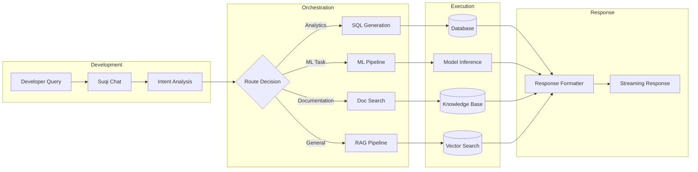
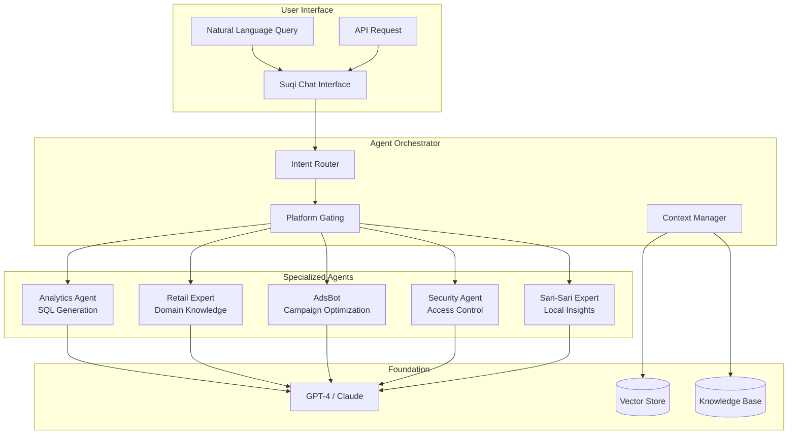
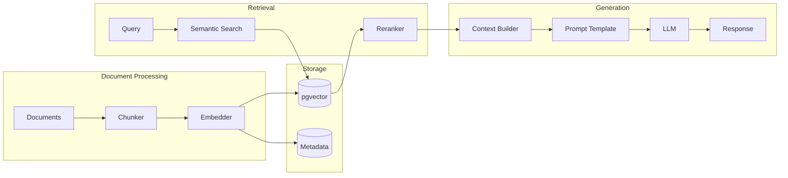

# AI Foundry Patterns for Scout

Scout implements enterprise AI patterns similar to Azure AI Foundry, with agents, RAG pipelines, and comprehensive model lifecycle management.

## 🎯 Suqi Chat: Unified AI Orchestration

Suqi Chat serves as the central orchestration layer for all AI agents, providing:

- **Unified Interface**: Single entry point for all AI interactions
- **Platform-Aware Routing**: Different capabilities based on user platform (analytics, docs, admin)
- **Context Management**: Maintains conversation history and user context
- **Cost Optimization**: Caching and token usage tracking
- **Security Enforcement**: JWT validation and parameter verification

### Orchestration Modes

1. **Database Mode (`SUQI_CHAT_MODE=db`)**
   - All orchestration logic in PostgreSQL functions
   - Lower latency, better for simple queries
   - Integrated caching at database level

2. **Node Mode (`SUQI_CHAT_MODE=node`)**
   - Application-level orchestration
   - More flexibility for complex agent interactions
   - Better for multi-step reasoning

### AI Development Workflow



### Orchestration Examples

```typescript
// Example 1: Analytics Query
const analyticsQuery = {
  question: "Show revenue trends for Q4 2023",
  platform: "analytics"
};
// Routes to: Analytics Agent → SQL Generation → Database Query

// Example 2: ML Prediction
const mlQuery = {
  question: "Predict next month's sales for Store S001",
  platform: "analytics"
};
// Routes to: ML Agent → Feature Extraction → Model Inference

// Example 3: Documentation Query
const docQuery = {
  question: "How do I calculate customer lifetime value?",
  platform: "docs"
};
// Routes to: Doc Agent → RAG Pipeline → Knowledge Base Search

// Example 4: Complex Multi-Agent Query
const complexQuery = {
  question: "Analyze campaign effectiveness and suggest optimizations",
  platform: "analytics"
};
// Routes to: Analytics Agent + AdsBot → Data Analysis + ML Optimization
```

## 🤖 Agent Architecture

### Multi-Agent System



### Agent Integration with Suqi Chat

All agents are accessed through the Suqi Chat interface, which handles:

```typescript
// Suqi Chat orchestrates agent selection based on query intent
const suqiChatOrchestrator = {
  async processQuery(query: string, platform: string) {
    // 1. Platform gating
    if (platform === 'docs' && containsSQLKeywords(query)) {
      throw new Error('SQL operations not allowed on docs platform');
    }
    
    // 2. Intent classification
    const intent = await classifyIntent(query);
    
    // 3. Route to appropriate agent
    switch (intent.type) {
      case 'analytics':
        return await analyticsAgent.process(query);
      case 'retail_advice':
        return await retailExpertAgent.advise(query);
      case 'campaign_optimization':
        return await adsBotAgent.optimize(query);
      default:
        return await generalAgent.respond(query);
    }
  }
};
```

### Agent Definitions

#### 1. Analytics Agent
```typescript
interface AnalyticsAgent {
  name: "analytics-agent";
  version: "1.0.0";
  capabilities: [
    "sql_generation",
    "metric_calculation",
    "trend_analysis",
    "anomaly_detection"
  ];
  
  async process(query: string): Promise<AnalyticsResponse> {
    // 1. Parse intent
    const intent = await parseIntent(query);
    
    // 2. Generate SQL
    const sql = await generateSQL(intent, schemaContext);
    
    // 3. Execute query
    const results = await executeQuery(sql);
    
    // 4. Format response
    return formatAnalyticsResponse(results);
  }
}
```

#### 2. Retail Expert Agent
```typescript
interface RetailExpertAgent {
  name: "retail-expert";
  version: "1.0.0";
  knowledge: [
    "philippine_retail_patterns",
    "sari_sari_operations",
    "fmcg_distribution",
    "seasonal_trends"
  ];
  
  async advise(context: RetailContext): Promise<RetailAdvice> {
    // Domain-specific reasoning
    const marketConditions = await analyzeMarket(context);
    const recommendations = await generateRecommendations(marketConditions);
    return recommendations;
  }
}
```

#### 3. Campaign Optimization Agent (AdsBot)
```typescript
interface AdsBotAgent {
  name: "adsbot";
  version: "2.0.0";
  models: [
    "attribution_model",
    "budget_optimizer",
    "creative_scorer"
  ];
  
  async optimize(campaign: Campaign): Promise<Optimization> {
    // ML-driven optimization
    const performance = await analyzePerformance(campaign);
    const attribution = await calculateAttribution(performance);
    const suggestions = await generateOptimizations(attribution);
    return suggestions;
  }
}
```

## 📚 RAG (Retrieval-Augmented Generation)

### RAG Pipeline Architecture



### Document Processing

```typescript
// Chunking strategy
const chunkDocument = async (document: Document): Promise<Chunk[]> => {
  const chunks = [];
  
  // Smart chunking with overlap
  const chunkSize = 1000; // tokens
  const overlap = 200; // tokens
  
  for (let i = 0; i < document.tokens.length; i += chunkSize - overlap) {
    chunks.push({
      content: document.tokens.slice(i, i + chunkSize),
      metadata: {
        source: document.id,
        position: i,
        type: document.type
      }
    });
  }
  
  return chunks;
};

// Embedding generation
const generateEmbeddings = async (chunks: Chunk[]): Promise<Embedding[]> => {
  const embeddings = await openai.embeddings.create({
    model: "text-embedding-3-small",
    input: chunks.map(c => c.content)
  });
  
  return embeddings.data.map((e, i) => ({
    vector: e.embedding,
    metadata: chunks[i].metadata
  }));
};
```

### Vector Store Schema

```sql
-- Enable pgvector extension
CREATE EXTENSION IF NOT EXISTS vector;

-- Document chunks with embeddings (used by Suqi Chat)
CREATE TABLE scout.ai_corpus (
    id UUID PRIMARY KEY DEFAULT gen_random_uuid(),
    tenant_id TEXT NOT NULL,
    vendor_id TEXT,
    title TEXT NOT NULL,
    chunk TEXT NOT NULL,
    embedding vector(1536) NOT NULL,
    metadata JSONB DEFAULT '{}',
    created_at TIMESTAMPTZ DEFAULT NOW(),
    -- Indexes for similarity search
    INDEX idx_ai_corpus_embedding USING ivfflat (embedding vector_cosine_ops) WITH (lists = 100),
    INDEX idx_tenant_vendor ON scout.ai_corpus(tenant_id, vendor_id)
);

-- Semantic search function
CREATE OR REPLACE FUNCTION scout.semantic_search(
    query_embedding vector(1536),
    limit_count INTEGER DEFAULT 5,
    threshold FLOAT DEFAULT 0.7
)
RETURNS TABLE(
    content TEXT,
    similarity FLOAT,
    metadata JSONB
) AS $$
BEGIN
    RETURN QUERY
    SELECT 
        kb.content,
        1 - (kb.embedding <=> query_embedding) as similarity,
        kb.metadata
    FROM scout.rag_knowledge_base kb
    WHERE 1 - (kb.embedding <=> query_embedding) > threshold
    ORDER BY kb.embedding <=> query_embedding
    LIMIT limit_count;
END;
$$ LANGUAGE plpgsql;
```

### Retrieval & Reranking

```typescript
// Multi-stage retrieval
const retrieveContext = async (query: string): Promise<Context> => {
  // Stage 1: Semantic search
  const queryEmbedding = await generateEmbedding(query);
  const semanticResults = await semanticSearch(queryEmbedding, 20);
  
  // Stage 2: Keyword search (hybrid)
  const keywordResults = await keywordSearch(query, 20);
  
  // Stage 3: Merge and rerank
  const combined = mergeResults(semanticResults, keywordResults);
  const reranked = await rerank(query, combined, 5);
  
  // Stage 4: Build context
  return buildContext(reranked);
};

// Reranking with cross-encoder
const rerank = async (
  query: string, 
  candidates: Document[], 
  topK: number
): Promise<Document[]> => {
  const scores = await crossEncoder.rank(query, candidates);
  return candidates
    .map((doc, i) => ({ ...doc, score: scores[i] }))
    .sort((a, b) => b.score - a.score)
    .slice(0, topK);
};
```

## 🔄 Model Lifecycle Management

### Model Registry

```sql
CREATE TABLE scout.ml_model_registry (
    model_id UUID PRIMARY KEY DEFAULT gen_random_uuid(),
    model_name TEXT NOT NULL,
    version TEXT NOT NULL,
    model_type TEXT NOT NULL, -- 'classification', 'regression', 'embedding', 'generation'
    framework TEXT, -- 'pytorch', 'tensorflow', 'sklearn'
    
    -- Performance metrics
    metrics JSONB NOT NULL, -- {f1: 0.85, precision: 0.87, recall: 0.83}
    
    -- Deployment info
    endpoint TEXT,
    status TEXT DEFAULT 'staging', -- 'staging', 'production', 'retired'
    deployed_at TIMESTAMPTZ,
    
    -- Metadata
    training_data JSONB,
    hyperparameters JSONB,
    feature_importance JSONB,
    
    -- Audit
    created_by TEXT,
    created_at TIMESTAMPTZ DEFAULT NOW(),
    
    UNIQUE(model_name, version)
);

-- Model performance tracking
CREATE TABLE scout.ml_model_performance (
    id UUID PRIMARY KEY DEFAULT gen_random_uuid(),
    model_id UUID REFERENCES scout.ml_model_registry(model_id),
    timestamp TIMESTAMPTZ DEFAULT NOW(),
    
    -- Online metrics
    latency_p50 FLOAT,
    latency_p95 FLOAT,
    latency_p99 FLOAT,
    
    -- Accuracy metrics
    accuracy FLOAT,
    drift_score FLOAT,
    
    -- Usage
    request_count INTEGER,
    error_count INTEGER
);
```

### Model Card Template

```markdown
# Model Card: Store Performance Predictor

## Model Details
- **Name**: store-performance-predictor
- **Version**: 2.1.0
- **Type**: Regression
- **Framework**: XGBoost
- **Last Updated**: 2025-01-15

## Intended Use
- **Primary Use**: Predict next month's revenue for sari-sari stores
- **Users**: Store owners, field agents, distribution planners
- **Out of Scope**: Macro-economic forecasting, new store predictions

## Training Data
- **Dataset**: 2 years of transaction data (2023-2024)
- **Size**: 174,344 transactions
- **Features**: 42 engineered features
- **Split**: 70% train, 15% validation, 15% test

## Performance Metrics
| Metric | Value | Target |
|--------|-------|--------|
| MAE | ₱1,234 | < ₱2,000 |
| MAPE | 8.5% | < 10% |
| R² | 0.87 | > 0.85 |

## Limitations
- Requires minimum 3 months of historical data
- Less accurate during holiday seasons
- Does not account for external events (typhoons, etc.)

## Ethical Considerations
- No PII used in training
- Fair across all regions (balanced dataset)
- Regular bias audits conducted

## Monitoring
- Drift detection: Weekly
- Performance evaluation: Daily
- Retraining trigger: MAPE > 15% or drift > 0.3
```

### Deployment Pipeline

```yaml
# .github/workflows/model-deployment.yml
name: Model Deployment Pipeline
on:
  push:
    paths:
      - 'models/**'
      
jobs:
  validate:
    runs-on: ubuntu-latest
    steps:
      - name: Validate model
        run: |
          python scripts/validate_model.py \
            --model ${{ github.event.inputs.model }} \
            --version ${{ github.event.inputs.version }}
            
      - name: Run offline evaluation
        run: |
          python scripts/evaluate_model.py \
            --test-data s3://scout/test-data \
            --metrics mae,mape,r2
            
  canary-deploy:
    needs: validate
    runs-on: ubuntu-latest
    steps:
      - name: Deploy to staging
        run: |
          kubectl apply -f models/deployments/staging.yaml
          
      - name: Run A/B test (10% traffic)
        run: |
          python scripts/ab_test.py \
            --traffic-split 0.1 \
            --duration 24h \
            --metrics latency,accuracy
            
  production-deploy:
    needs: canary-deploy
    runs-on: ubuntu-latest
    if: success()
    steps:
      - name: Deploy to production
        run: |
          kubectl apply -f models/deployments/production.yaml
          
      - name: Update model registry
        run: |
          psql $DATABASE_URL -c "
            UPDATE scout.ml_model_registry 
            SET status = 'production', deployed_at = NOW()
            WHERE model_name = '$MODEL_NAME' AND version = '$VERSION'
          "
```

### Monitoring & Drift Detection

```python
# Model monitoring
import numpy as np
from scipy import stats

def detect_drift(reference_data, current_data, threshold=0.05):
    """
    Detect data drift using Kolmogorov-Smirnov test
    """
    drift_results = {}
    
    for feature in reference_data.columns:
        statistic, p_value = stats.ks_2samp(
            reference_data[feature],
            current_data[feature]
        )
        
        drift_results[feature] = {
            'statistic': statistic,
            'p_value': p_value,
            'is_drifted': p_value < threshold
        }
    
    return drift_results

# Automated retraining trigger
def should_retrain(model_id):
    """
    Determine if model should be retrained
    """
    # Check performance degradation
    recent_performance = get_recent_performance(model_id, days=7)
    if recent_performance['mape'] > 0.15:
        return True, "Performance degradation"
    
    # Check data drift
    drift_score = calculate_drift_score(model_id)
    if drift_score > 0.3:
        return True, "Data drift detected"
    
    # Check time since last training
    last_training = get_last_training_date(model_id)
    if (datetime.now() - last_training).days > 30:
        return True, "Scheduled retraining"
    
    return False, None
```

## 🎯 Best Practices

### Agent Development
1. **Single Responsibility**: Each agent has one clear purpose
2. **Stateless Design**: Agents don't maintain state between calls
3. **Error Handling**: Graceful fallbacks for all agents
4. **Monitoring**: Track agent performance and usage
5. **Versioning**: Semantic versioning for agent updates

### RAG Implementation
1. **Chunk Size**: Optimize for your use case (500-1500 tokens)
2. **Overlap**: Include 10-20% overlap between chunks
3. **Metadata**: Rich metadata for filtering and reranking
4. **Hybrid Search**: Combine semantic and keyword search
5. **Caching**: Cache frequently accessed contexts

### Model Management
1. **Reproducibility**: Track all training parameters
2. **Versioning**: Semantic versioning for models
3. **A/B Testing**: Always canary deploy
4. **Monitoring**: Track online and offline metrics
5. **Documentation**: Model cards for all production models

## 📚 Related Documentation

- [API Reference](/docs/api/functions/genie-query)
- [Vector Store Setup](/docs/data/schemas/vector-store)
- [ML Pipeline](/docs/operations/ml-pipeline)
- [Security for AI](/docs/security/ai-security)

---

*Scout's AI Foundry patterns enable scalable, reliable, and explainable AI capabilities across the platform.*
