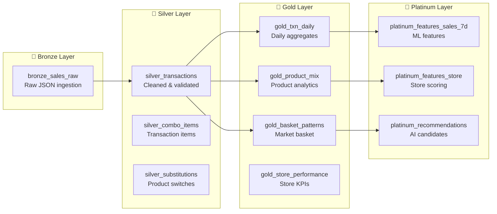
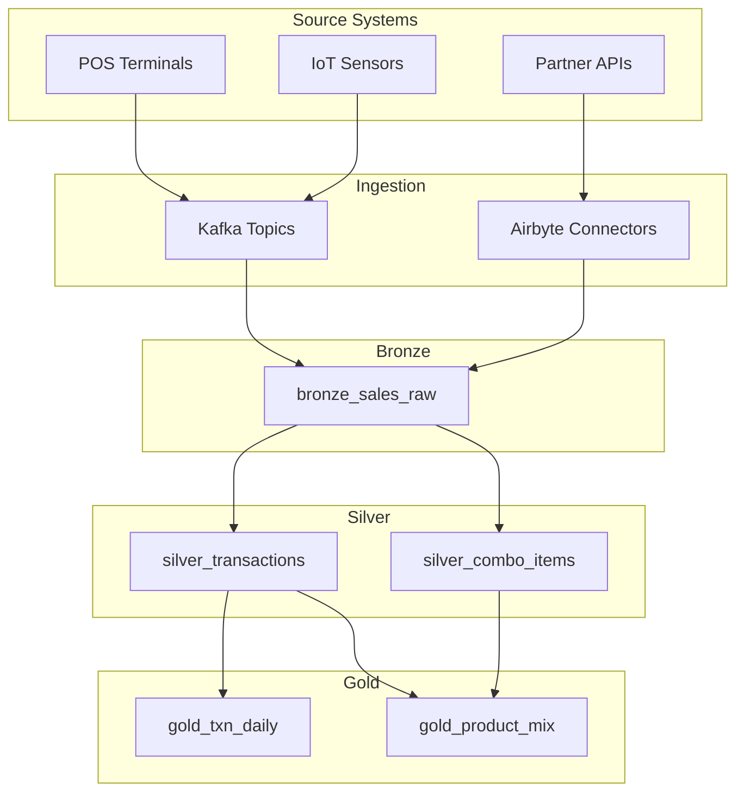

# Scout Platform Data Dictionary & Schema Documentation

This document provides comprehensive documentation of the Scout Analytics Platform database schema, including detailed data dictionary, entity relationships, and architectural patterns.

## 📊 Schema Documentation

### DBML (Database Markup Language)

The complete schema is documented using DBML format, which provides:
- **Visual ERD Generation**: Automatic entity relationship diagrams
- **Inline Documentation**: Column-level data dictionary
- **Cross-platform Support**: Generate SQL for any database
- **Version Control Friendly**: Plain text format

**📁 Schema Files:**
- Complete DBML: [`/static/dbml/scout-schema-complete.dbml`](/dbml/scout-schema-complete.dbml)
- [View in dbdiagram.io](https://dbdiagram.io/d) (upload the DBML file)

## 🏗️ Medallion Architecture



## 📚 Core Tables & Data Dictionary

### Dimension Tables (Master Data)

#### `scout.dim_store`
Store/outlet master data with Philippine geographic hierarchy.

| Column | Type | Description | Notes |
|--------|------|-------------|-------|
| `store_id` | TEXT | Unique store identifier | Primary Key |
| `store_name` | TEXT | Store display name | Required |
| `region` | TEXT | Philippine region | NCR, Region I-XIII |
| `province` | TEXT | Province name | Normalized |
| `city` | TEXT | City/municipality | Normalized |
| `barangay` | TEXT | Barangay name | Smallest admin unit |
| `latitude` | DECIMAL(10,8) | GPS latitude | For geospatial queries |
| `longitude` | DECIMAL(11,8) | GPS longitude | For proximity search |
| `citymun_psgc` | TEXT | City/Municipality PSGC | Philippine Standard Geographic Code |
| `store_size_sqm` | INTEGER | Store size | Square meters |
| `economic_class` | TEXT | Economic classification | A/B/C/D/E |

#### `scout.dim_product`
Product catalog with categories and pricing.

| Column | Type | Description | Notes |
|--------|------|-------------|-------|
| `product_id` | TEXT | Unique product ID | Primary Key |
| `product_name` | TEXT | Product display name | Required |
| `barcode` | TEXT | Product barcode/EAN | For scanning |
| `category` | ENUM | Product category | FMCG, Health, Beauty, etc. |
| `brand` | TEXT | Brand name | Normalized |
| `srp` | DECIMAL(10,2) | Suggested retail price | Philippine Peso |
| `unit_cost` | DECIMAL(10,2) | Unit cost price | For margin calculation |

### Fact Tables

#### `scout.fact_transactions`
Core transaction records at receipt level.

| Column | Type | Description | Notes |
|--------|------|-------------|-------|
| `transaction_id` | TEXT | Unique transaction ID | Primary Key |
| `store_id` | TEXT | Store reference | FK → dim_store |
| `customer_id` | TEXT | Customer reference | FK → dim_customer, nullable |
| `transaction_date` | DATE | Transaction date | Partitioned |
| `total_amount` | DECIMAL(10,2) | Total transaction value | Philippine Peso |
| `payment_method` | ENUM | Payment type | Cash, Card, E-wallet |
| `basket_size` | INTEGER | Number of unique items | For analysis |

#### `scout.fact_transaction_items`
Transaction line items at product level.

| Column | Type | Description | Notes |
|--------|------|-------------|-------|
| `transaction_item_id` | TEXT | Unique line item ID | Primary Key |
| `transaction_id` | TEXT | Parent transaction | FK → fact_transactions |
| `product_id` | TEXT | Product reference | FK → dim_product |
| `quantity` | DECIMAL(10,3) | Quantity purchased | Supports fractions |
| `unit_price` | DECIMAL(10,2) | Price at time of sale | May differ from SRP |
| `line_total` | DECIMAL(10,2) | Line total amount | qty × price - discount |

## 🔍 Analytics Views

### Gold Layer Views

#### `scout.gold_txn_daily`
Daily transaction aggregates for dashboards.

**Key Metrics:**
- Transaction count by geography/time
- Revenue aggregations
- Average basket metrics
- TBWA brand performance
- AI suggestion acceptance rates

#### `scout.gold_product_mix`
Product performance with Pareto analysis.

**Features:**
- Revenue ranking within categories
- 80/20 rule identification
- Store coverage metrics
- Price point analysis

#### `scout.gold_basket_patterns`
Market basket analysis for cross-sell opportunities.

**Calculations:**
- Product affinity (lift scores)
- Confidence metrics (A→B, B→A)
- Co-occurrence frequencies
- Bundle recommendations

### Platinum Layer Features

#### `scout.platinum_features_sales_7d`
ML-ready features with 7-day rolling windows.

**Feature Engineering:**
- Rolling averages, sums, std deviations
- Week-over-week growth rates
- Percentile rankings
- Trend indicators

## 🔒 Security & Compliance

### Row-Level Security (RLS)

All tables implement RLS policies:

```sql
-- Example: Store access policy
CREATE POLICY store_access ON scout.dim_store
FOR ALL USING (
    region = ANY(current_user_regions())
    OR current_user_role() = 'admin'
);
```

### Audit Trail

Comprehensive audit logging in `scout.audit_log`:
- All data modifications tracked
- User, action, timestamp captured
- Before/after values stored
- 7-year retention for compliance

### PII Protection

- Mobile numbers: SHA-256 hashed
- Email addresses: SHA-256 hashed  
- Customer names: Encrypted at rest
- Access logging for all PII queries

## 📈 Performance Optimizations

### Strategic Indexes

```sql
-- Composite indexes for common queries
CREATE INDEX idx_txn_store_date 
ON fact_transactions(store_id, transaction_date);

-- Covering indexes for read performance
CREATE INDEX idx_product_category_brand 
ON dim_product(category, brand) 
INCLUDE (product_name, srp);

-- Partial indexes for filtered queries
CREATE INDEX idx_active_stores 
ON dim_store(region, city) 
WHERE is_active = true;
```

### Materialized Views

- **Refresh Schedule**: Every 5-15 minutes
- **Concurrent Refresh**: No table locks
- **Incremental Updates**: Where possible

### Partitioning Strategy

```sql
-- Time-based partitioning
CREATE TABLE fact_transactions_2025_01 
PARTITION OF fact_transactions
FOR VALUES FROM ('2025-01-01') TO ('2025-02-01');

-- Geographic partitioning  
CREATE TABLE silver_transactions_ncr
PARTITION OF silver_transactions
FOR VALUES IN ('NCR');
```

## 🔄 Data Lineage



## 🛠️ Schema Management

### Version Control

```bash
# Generate SQL from DBML
dbml2sql scout-schema-complete.dbml --postgres

# Create migration
supabase migration new add_scout_v5_schema

# Apply migration
supabase db push
```

### Documentation Generation

```bash
# Generate interactive docs
dbdocs build scout-schema-complete.dbml

# Generate ERD
dbml-renderer -i scout-schema-complete.dbml -o scout-erd.svg
```

## 📊 Sample Queries

### Daily Revenue by Region
```sql
SELECT 
    day,
    region,
    SUM(total_peso) as revenue,
    COUNT(DISTINCT store_id) as active_stores
FROM scout.gold_txn_daily
WHERE day >= CURRENT_DATE - INTERVAL '30 days'
GROUP BY day, region
ORDER BY day DESC, revenue DESC;
```

### Top Products by Category
```sql
SELECT 
    product_category,
    brand_name,
    product_name,
    total_revenue,
    rank_in_category
FROM scout.gold_product_mix
WHERE is_pareto_80 = true
ORDER BY product_category, rank_in_category;
```

### Market Basket Analysis
```sql
SELECT 
    product_a,
    product_b,
    co_occurrence_count,
    lift,
    confidence_a_to_b
FROM scout.gold_basket_patterns
WHERE lift > 2.0
ORDER BY lift DESC
LIMIT 20;
```

## 🔗 Related Documentation

- [Solution Architecture](./solution-architecture.md)
- [API Reference](../api-reference/sql-interfaces.md)
- [Security Guide](../security/hardening-guide.md)
- [Performance Tuning](../operations/monitoring.md)

## 📝 Schema Change Process

1. **Update DBML**: Modify `/static/dbml/scout-schema-complete.dbml`
2. **Generate SQL**: Run `./generate-erd.sh`
3. **Create Migration**: `supabase migration new <description>`
4. **Test Locally**: `supabase db reset`
5. **Deploy**: `supabase db push`
6. **Document**: Update this page

---

*For the complete schema with inline documentation, see the [DBML file](/dbml/scout-schema-complete.dbml).*