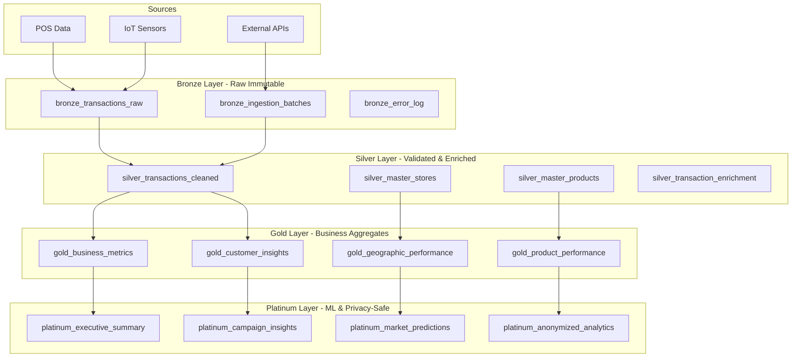

# Medallion Architecture (+ Platinum Layer)

Scout implements a **modern medallion architecture** with an additional **Platinum layer** for ML-ready features and privacy-safe analytics.

## 📊 Architecture Overview



## 🥉 Bronze Layer (Raw Immutable Data)

**Purpose**: Capture raw data exactly as received, maintaining immutability for audit and replay.

### Characteristics
- ✅ **Immutable**: Never update, only append
- ✅ **Schema-on-read**: Store as JSONB/raw format
- ✅ **Complete**: Include all fields, even if unused
- ✅ **Auditable**: Timestamp and source tracking

### Schema Example

```sql
CREATE TABLE scout.bronze_transactions_raw (
    id UUID PRIMARY KEY DEFAULT gen_random_uuid(),
    raw_data JSONB NOT NULL,
    source_system TEXT NOT NULL,
    ingested_at TIMESTAMPTZ DEFAULT NOW(),
    batch_id UUID,
    -- No updates allowed
    CONSTRAINT bronze_immutable CHECK (false) NO INHERIT
);

-- Partition by ingestion date for performance
CREATE TABLE scout.bronze_transactions_202501 
    PARTITION OF scout.bronze_transactions_raw
    FOR VALUES FROM ('2025-01-01') TO ('2025-02-01');
```

### Quality Checks
```yaml
Bronze Validation:
  - Schema validation: None (store anything)
  - Duplicate handling: Allow (track with batch_id)
  - Error handling: Log to bronze_error_log
  - Retention: 2 years (then archive to S3)
```

## 🥈 Silver Layer (Validated & Enriched)

**Purpose**: Clean, validate, and enrich data for analytics consumption.

### Transformations
1. **Data Type Casting**: Convert strings to proper types
2. **Validation**: Business rules and constraints
3. **Deduplication**: Remove exact duplicates
4. **Enrichment**: Add derived fields and lookups
5. **Standardization**: Consistent formats and units

### Schema Example

```sql
CREATE TABLE scout.silver_transactions_cleaned (
    transaction_id UUID PRIMARY KEY,
    store_id UUID NOT NULL REFERENCES scout.dim_store(store_id),
    transaction_date TIMESTAMPTZ NOT NULL,
    amount DECIMAL(12,2) CHECK (amount > 0),
    product_category TEXT NOT NULL,
    brand_name TEXT,
    customer_type customer_type_enum NOT NULL,
    -- Enriched fields
    day_of_week INT GENERATED ALWAYS AS (EXTRACT(DOW FROM transaction_date)) STORED,
    is_weekend BOOLEAN GENERATED ALWAYS AS (EXTRACT(DOW FROM transaction_date) IN (0,6)) STORED,
    -- Audit
    created_at TIMESTAMPTZ DEFAULT NOW(),
    updated_at TIMESTAMPTZ DEFAULT NOW()
);

-- Indexes for performance
CREATE INDEX idx_silver_store_date ON silver_transactions_cleaned(store_id, transaction_date);
CREATE INDEX idx_silver_amount ON silver_transactions_cleaned(amount) WHERE amount > 1000;
```

### Data Quality Rules

```sql
-- Great Expectations checks
CREATE OR REPLACE FUNCTION validate_silver_transaction()
RETURNS TRIGGER AS $$
BEGIN
    -- Amount must be positive
    IF NEW.amount <= 0 THEN
        RAISE EXCEPTION 'Amount must be positive';
    END IF;
    
    -- Store must exist
    IF NOT EXISTS (SELECT 1 FROM scout.dim_store WHERE store_id = NEW.store_id) THEN
        RAISE EXCEPTION 'Invalid store_id: %', NEW.store_id;
    END IF;
    
    -- Date cannot be future
    IF NEW.transaction_date > NOW() THEN
        RAISE EXCEPTION 'Transaction date cannot be in future';
    END IF;
    
    RETURN NEW;
END;
$$ LANGUAGE plpgsql;
```

## 🥇 Gold Layer (Business Aggregates)

**Purpose**: Pre-computed business metrics optimized for reporting and dashboards.

### Aggregation Patterns

```sql
CREATE MATERIALIZED VIEW scout.gold_business_metrics AS
SELECT 
    DATE_TRUNC('day', transaction_date) as date_key,
    store_id,
    COUNT(*) as transaction_count,
    SUM(amount) as daily_revenue,
    AVG(amount) as avg_transaction,
    COUNT(DISTINCT customer_id) as unique_customers,
    -- Advanced metrics
    PERCENTILE_CONT(0.5) WITHIN GROUP (ORDER BY amount) as median_amount,
    STDDEV(amount) as amount_stddev,
    -- Segmentation
    COUNT(*) FILTER (WHERE customer_type = 'new') as new_customers,
    COUNT(*) FILTER (WHERE customer_type = 'regular') as returning_customers
FROM scout.silver_transactions_cleaned
GROUP BY DATE_TRUNC('day', transaction_date), store_id
WITH DATA;

-- Refresh strategy
CREATE OR REPLACE FUNCTION refresh_gold_metrics()
RETURNS void AS $$
BEGIN
    REFRESH MATERIALIZED VIEW CONCURRENTLY scout.gold_business_metrics;
    REFRESH MATERIALIZED VIEW CONCURRENTLY scout.gold_customer_insights;
    REFRESH MATERIALIZED VIEW CONCURRENTLY scout.gold_geographic_performance;
END;
$$ LANGUAGE plpgsql;

-- Schedule refresh every 30 minutes
SELECT cron.schedule('refresh-gold', '*/30 * * * *', 'SELECT refresh_gold_metrics()');
```

### Performance Optimization

```yaml
Gold Layer Optimizations:
  - Materialized views for heavy aggregations
  - Columnar storage for analytical queries
  - Partitioning by date for time-series
  - Pre-computed rollups (daily, weekly, monthly)
  - Bitmap indexes for categorical filters
```

## 💎 Platinum Layer (ML-Ready & Privacy-Safe)

**Purpose**: Advanced analytics, ML features, and privacy-compliant data products.

### Key Features

1. **ML Feature Store**
```sql
CREATE TABLE scout.platinum_ml_features AS
SELECT 
    store_id,
    -- Time-based features
    AVG(daily_revenue) OVER (PARTITION BY store_id ORDER BY date_key ROWS 7 PRECEDING) as revenue_7d_ma,
    AVG(daily_revenue) OVER (PARTITION BY store_id ORDER BY date_key ROWS 30 PRECEDING) as revenue_30d_ma,
    -- Growth metrics
    (daily_revenue - LAG(daily_revenue, 7) OVER (PARTITION BY store_id ORDER BY date_key)) / 
        NULLIF(LAG(daily_revenue, 7) OVER (PARTITION BY store_id ORDER BY date_key), 0) as wow_growth,
    -- Seasonality
    daily_revenue / AVG(daily_revenue) OVER (PARTITION BY store_id, EXTRACT(DOW FROM date_key)) as day_of_week_index,
    -- Clustering features
    CASE 
        WHEN daily_revenue > PERCENTILE_CONT(0.9) WITHIN GROUP (ORDER BY daily_revenue) THEN 'high_performer'
        WHEN daily_revenue > PERCENTILE_CONT(0.5) WITHIN GROUP (ORDER BY daily_revenue) THEN 'average_performer'
        ELSE 'low_performer'
    END as performance_tier
FROM scout.gold_business_metrics;
```

2. **Privacy-Safe Analytics**
```sql
CREATE VIEW scout.platinum_anonymized_analytics AS
SELECT 
    -- No individual identifiers
    region,
    city,
    DATE_TRUNC('week', transaction_date) as week,
    COUNT(*) as transaction_count,
    -- K-anonymity: suppress small groups
    CASE 
        WHEN COUNT(*) >= 15 THEN AVG(amount)
        ELSE NULL 
    END as avg_amount,
    -- Differential privacy: add noise
    COUNT(*) + (RANDOM() - 0.5) * 10 as noisy_count
FROM scout.silver_transactions_cleaned
GROUP BY region, city, DATE_TRUNC('week', transaction_date)
HAVING COUNT(*) >= 15; -- Suppress small groups
```

3. **Executive Dashboards**
```sql
CREATE VIEW scout.platinum_executive_summary AS
WITH kpis AS (
    SELECT 
        SUM(daily_revenue) as total_revenue,
        COUNT(DISTINCT store_id) as active_stores,
        AVG(daily_revenue) as avg_store_revenue
    FROM scout.gold_business_metrics
    WHERE date_key >= CURRENT_DATE - INTERVAL '30 days'
),
trends AS (
    SELECT 
        REGR_SLOPE(daily_revenue, EXTRACT(EPOCH FROM date_key)) as revenue_trend,
        CORR(daily_revenue, campaign_spend) as campaign_correlation
    FROM scout.gold_business_metrics
    WHERE date_key >= CURRENT_DATE - INTERVAL '90 days'
)
SELECT 
    k.*,
    t.*,
    -- Add predictions
    k.total_revenue * (1 + t.revenue_trend * 30) as revenue_30d_forecast
FROM kpis k, trends t;
```

## 📐 Data Quality Framework

### Quality Gates by Layer

| Layer | Quality Score | Requirements | SLA |
|-------|--------------|--------------|-----|
| **Bronze** | None | Store everything | < 1 min |
| **Silver** | 95%+ | Schema valid, no nulls in required fields | < 5 min |
| **Gold** | 99%+ | Business rules passed, aggregates balanced | < 30 min |
| **Platinum** | 100% | Privacy compliant, ML features valid | < 2 hours |

### Quality Monitoring

```sql
CREATE VIEW scout.data_quality_dashboard AS
SELECT 
    'Bronze' as layer,
    COUNT(*) as total_records,
    COUNT(*) FILTER (WHERE raw_data IS NOT NULL) as valid_records,
    100.0 * COUNT(*) FILTER (WHERE raw_data IS NOT NULL) / NULLIF(COUNT(*), 0) as quality_score
FROM scout.bronze_transactions_raw
WHERE ingested_at >= CURRENT_DATE

UNION ALL

SELECT 
    'Silver',
    COUNT(*),
    COUNT(*) FILTER (WHERE amount > 0 AND store_id IS NOT NULL),
    100.0 * COUNT(*) FILTER (WHERE amount > 0 AND store_id IS NOT NULL) / NULLIF(COUNT(*), 0)
FROM scout.silver_transactions_cleaned
WHERE created_at >= CURRENT_DATE

UNION ALL

SELECT 
    'Gold',
    COUNT(*),
    COUNT(*) FILTER (WHERE daily_revenue > 0 AND transaction_count > 0),
    100.0 * COUNT(*) FILTER (WHERE daily_revenue > 0 AND transaction_count > 0) / NULLIF(COUNT(*), 0)
FROM scout.gold_business_metrics
WHERE date_key >= CURRENT_DATE;
```

## 🔄 Refresh Schedule

```yaml
Refresh Cadence:
  Bronze:
    - Real-time: Edge Functions (continuous)
    - Batch: Every 5 minutes
    
  Silver:
    - Incremental: Every 5 minutes
    - Full refresh: Daily at 02:00 UTC
    
  Gold:
    - Incremental: Every 30 minutes
    - Full refresh: Daily at 03:00 UTC
    
  Platinum:
    - ML features: Every 2 hours
    - Executive summary: Every hour
    - Privacy views: Real-time (live views)
```

## 🎯 Best Practices

1. **Immutability in Bronze**: Never update Bronze records
2. **Idempotency**: Make all transformations idempotent
3. **Late-arriving data**: Handle with merge logic in Silver
4. **Schema evolution**: Use versioned schemas
5. **Cost optimization**: Archive old Bronze data to S3/MinIO
6. **Performance**: Partition by date, cluster by common filters
7. **Privacy**: Apply PII masking as early as Silver layer
8. **Monitoring**: Track quality scores at each layer

## 📚 Related Documentation

- [Data Lineage](/docs/data/lineage)
- [Quality Framework](/docs/data/quality-framework)
- [Privacy & PII](/docs/data/privacy-pii)
- [Performance Tuning](/docs/operations/runbooks/performance-tuning)

---

*The Medallion + Platinum architecture ensures data quality, performance, and privacy compliance while enabling advanced analytics and ML capabilities.*
