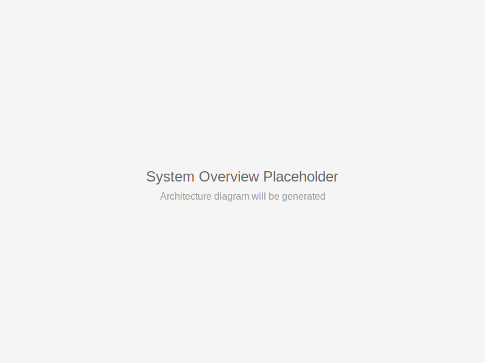
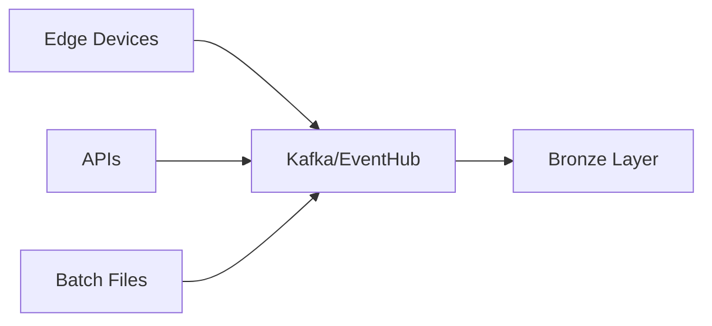
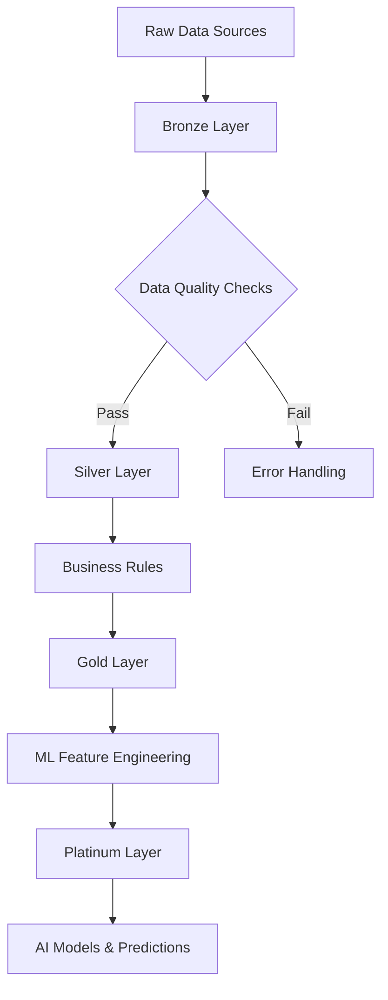
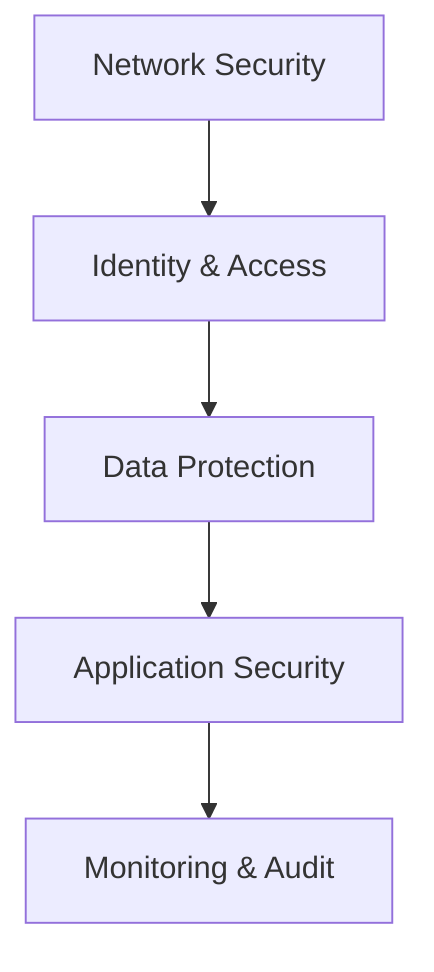

# Lakehouse Architecture Overview

The AI-AAS Hardened Lakehouse is a production-ready, security-hardened data platform that combines the benefits of data lakes and data warehouses with advanced AI/ML capabilities.

## Core Architecture Principles

### 1. **Medallion Architecture**
Our data flows through a structured medallion architecture:

- **🥉 Bronze Layer**: Raw data ingestion and storage
- **🥈 Silver Layer**: Cleaned, validated, and enriched data
- **🥇 Gold Layer**: Business-ready aggregated data
- **💎 Platinum Layer**: AI/ML features and predictions

### 2. **Security-First Design**
Every component is designed with security hardening:

- Zero-trust network architecture
- End-to-end encryption (AES-256)
- Row-level security (RLS) policies
- Comprehensive audit logging

### 3. **Cloud-Native & Kubernetes-Ready**
Built for modern cloud deployments:

- Container-first architecture
- Kubernetes orchestration
- Auto-scaling capabilities
- Multi-region support

## System Components

### **Data Ingestion Layer**

- **Edge Devices**: Raspberry Pi with secure token-based uploads
- **Streaming**: Real-time data ingestion via Kafka
- **Batch Processing**: Scheduled ETL jobs
- **API Endpoints**: REST/GraphQL interfaces

### **Storage Layer**
- **Object Storage**: MinIO (S3-compatible) with multi-region replication
- **Table Format**: Apache Iceberg with Nessie catalog
- **File Formats**: Parquet, Delta Lake, JSON
- **Partitioning**: Intelligent partitioning by date/region/category

### **Compute Layer**
- **Query Engine**: Trino for distributed SQL queries
- **Transformation**: dbt for data modeling and transformation
- **Orchestration**: Apache Airflow for workflow management
- **Edge Functions**: Supabase Edge Functions for real-time processing

### **AI/ML Layer**
- **Feature Store**: Centralized feature management
- **Model Training**: Automated ML pipelines
- **Model Serving**: Real-time inference endpoints
- **Monitoring**: Model performance and drift detection

### **Visualization Layer**
- **Apache Superset**: Interactive dashboards and reports
- **Geographic Visualization**: PostGIS + Mapbox integration
- **Embedded Analytics**: Iframe-based dashboard embedding

## Data Flow Architecture

### **Bronze → Silver → Gold → Platinum Flow**

#### **Bronze Layer** 🥉
- Raw data ingestion without transformation
- Schema-on-read approach
- Full audit trail preservation
- Error handling and retry mechanisms

#### **Silver Layer** 🥈
- Data cleaning and validation
- Schema enforcement
- Deduplication
- Data quality monitoring

#### **Gold Layer** 🥇
- Business-ready aggregations
- KPI calculations
- Historical trends
- Ready for visualization

#### **Platinum Layer** 💎
- ML feature engineering
- Model predictions
- Advanced analytics
- AI-powered insights

## Security Architecture

### **Multi-Layer Security Model**

1. **Network Security**
   - Private VPC with isolated subnets
   - Security groups and NACLs
   - VPN/Private endpoints
   - DDoS protection

2. **Identity & Access Management**
   - Role-based access control (RBAC)
   - JWT token authentication
   - Row-level security policies
   - API key management

3. **Data Protection**
   - Encryption at rest (AES-256)
   - Encryption in transit (TLS 1.3)
   - Key rotation policies
   - Data masking for PII

4. **Application Security**
   - Container security scanning
   - Vulnerability assessments
   - Secure coding practices
   - Regular security updates

5. **Monitoring & Audit**
   - Comprehensive audit logging
   - Real-time security monitoring
   - Anomaly detection
   - Compliance reporting

## Performance Characteristics

### **Query Performance Targets**
- **Sub-second**: Simple aggregations (less than 1.5s SLA)
- **Interactive**: Complex analytical queries (less than 10s)
- **Batch**: Large ETL operations (optimized for throughput)

### **Scalability**
- **Horizontal**: Auto-scaling compute resources
- **Vertical**: Right-sizing based on workload
- **Storage**: Unlimited object storage capacity
- **Concurrent Users**: Supports 1000+ simultaneous users

### **Availability**
- **Uptime**: 99.9% availability target
- **Multi-Region**: Active-passive disaster recovery
- **Backup**: Point-in-time recovery capabilities
- **Monitoring**: 24/7 health monitoring

## Technology Stack

| Layer | Primary Technology | Alternatives |
|-------|-------------------|--------------|
| **Storage** | MinIO, Iceberg, Parquet | S3, Delta Lake, ORC |
| **Compute** | Trino, dbt, Airflow | Spark, Databricks |
| **Database** | PostgreSQL + PostGIS | MySQL, MongoDB |
| **API** | Supabase (PostgREST) | GraphQL, REST |
| **Visualization** | Apache Superset | Tableau, PowerBI |
| **Orchestration** | Kubernetes | Docker Swarm |
| **Monitoring** | Prometheus + Grafana | ELK Stack, DataDog |

## Integration Points

### **External Systems**
- **ERP Systems**: SAP, Oracle, Microsoft Dynamics
- **CRM Platforms**: Salesforce, HubSpot
- **Marketing Tools**: Adobe Analytics, Google Analytics
- **Cloud Providers**: AWS, Azure, GCP

### **APIs and Protocols**
- **REST APIs**: Standard HTTP/JSON interfaces
- **GraphQL**: Flexible query interface
- **WebSocket**: Real-time data streaming
- **JDBC/ODBC**: Database connectivity

### **Data Formats**
- **Structured**: Parquet, CSV, JSON
- **Semi-Structured**: JSONB, XML
- **Unstructured**: Images, Documents, Logs
- **Streaming**: Apache Avro, Protocol Buffers

## Deployment Models

### **Cloud Deployment**
- Multi-region setup for high availability
- Auto-scaling based on demand
- Managed services where possible
- Cost optimization strategies

### **Hybrid Deployment**
- On-premises data processing
- Cloud-based analytics and AI
- Secure data transfer protocols
- Compliance with data residency requirements

### **Edge Deployment**
- Edge computing for real-time processing
- Local data storage and processing
- Intermittent connectivity support
- Edge AI inference capabilities

This architecture provides a solid foundation for enterprise-grade data lakehouse operations with advanced AI capabilities and comprehensive security measures.