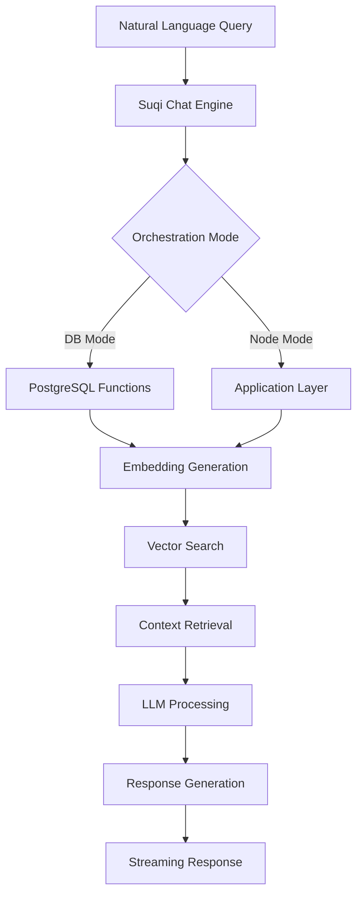

# Suqi Chat - Natural Language Analytics

Suqi Chat is an intelligent AI interface that allows users to query Scout Analytics data using natural language. Powered by GPT-4 and RAG (Retrieval-Augmented Generation), it provides instant insights with contextual understanding and source citations.

## Overview



## Key Features

### 🧠 Intelligent Query Understanding
- Natural language processing for complex analytics questions
- Automatic SQL generation for data retrieval
- Context-aware responses with source citations

### 🔒 Platform-Based Access Control
- Different capabilities for different user roles
- SQL execution restricted on docs platform
- Full analytics access for authorized users

### ⚡ Performance Optimization
- Response caching for repeated queries
- Sub-second responses for cached results
- Streaming responses for better UX

### 📊 Usage Analytics
- Token tracking and cost monitoring
- Performance metrics (P50, P95, P99)
- User engagement analytics

## Configuration

### Environment Variables

```bash
# Orchestration mode
SUQI_CHAT_MODE=db  # 'db' for database mode, 'node' for application mode

# Performance settings
SUQI_P95_TARGET_MS=2000
SUQI_CACHE_TTL_HOURS=24

# Platform settings
NEXT_PUBLIC_DEFAULT_PLATFORM=analytics
```

### Database Setup

1. **Enable pgvector extension**:
```sql
CREATE EXTENSION IF NOT EXISTS vector;
```

2. **Apply Suqi Chat schema**:
```sql
-- AI corpus for knowledge base
CREATE TABLE scout.ai_corpus (
  id UUID PRIMARY KEY DEFAULT gen_random_uuid(),
  tenant_id TEXT NOT NULL,
  vendor_id TEXT,
  title TEXT NOT NULL,
  chunk TEXT NOT NULL,
  embedding vector(1536) NOT NULL,
  metadata JSONB DEFAULT '{}',
  created_at TIMESTAMPTZ DEFAULT NOW()
);

-- Create vector index for fast similarity search
CREATE INDEX idx_ai_corpus_embedding ON scout.ai_corpus 
USING ivfflat (embedding vector_cosine_ops)
WITH (lists = 100);
```

## Usage Examples

### Basic Query

```javascript
// Using Supabase client
const response = await supabase.rpc('ask_suqi_query', {
  question: "What were our top performing stores last month?",
  context_limit: 10,
  use_cache: true
});

console.log(response.data.answer);
// Output: "Based on last month's data, the top performing stores were:
//  1. Store S123 in Makati - ₱2.5M revenue
//  2. Store S456 in BGC - ₱2.1M revenue..."
```

### Advanced Query with Metadata

```javascript
const response = await supabase.rpc('ask_suqi_query', {
  question: "Compare Q3 vs Q4 sales performance by region",
  context_limit: 15,
  include_metadata: true,
  search_depth: 10
});

// Access detailed metrics
console.log(response.data.usage);
// { prompt_tokens: 450, completion_tokens: 320, total_tokens: 770 }

// View source documents
console.log(response.data.sources);
// [{ id: "...", title: "Q4 Sales Report", chunk: "...", score: 0.92 }]
```

### Streaming Response (Web App)

```javascript
const response = await fetch('/api/ask-suqi', {
  method: 'POST',
  headers: {
    'Content-Type': 'application/json',
    'x-platform': 'analytics'
  },
  body: JSON.stringify({
    question: "Show me customer retention trends"
  })
});

const reader = response.body.getReader();
const decoder = new TextDecoder();

while (true) {
  const { done, value } = await reader.read();
  if (done) break;
  
  const chunk = decoder.decode(value);
  const lines = chunk.split('\n');
  
  for (const line of lines) {
    if (line.startsWith('data: ')) {
      const data = JSON.parse(line.slice(6));
      if (data.chunk) {
        // Append to chat UI
        appendToChat(data.chunk);
      } else if (data.done) {
        // Show sources and metadata
        showSources(data.sources);
        showMetrics(data.usage);
      }
    }
  }
}
```

## Platform Gating

Different platforms have different access levels:

### Analytics Platform (`x-platform: analytics`)
```javascript
// Full read-only SQL capabilities
const response = await askSuqi({
  question: "SELECT store_id, SUM(revenue) FROM gold_daily_metrics GROUP BY store_id",
  platform: "analytics"
});
// ✅ Allowed - returns query results
```

### Docs Platform (`x-platform: docs`)
```javascript
// Restricted mode - no direct SQL
const response = await askSuqi({
  question: "SELECT * FROM users",
  platform: "docs"
});
// ❌ Denied - returns error: "SQL operations not allowed on docs platform"
```

## Security Features

### JWT Validation
All requests are validated against JWT claims:

```javascript
// ask_suqi_query function internally validates:
if (params.tenant_id !== jwt.tenant_id) {
  throw new Error('Tenant mismatch');
}
```

### SQL Injection Prevention
- Parameterized queries only
- Platform-based SQL keyword blocking
- Query validation before execution

### Rate Limiting
- Per-user query limits
- Token-based throttling
- Cost-based restrictions

## Performance Optimization

### Caching Strategy

```sql
-- Cache key generation
SELECT md5(question || tenant_id || vendor_id) as cache_key;

-- Cache lookup (24-hour TTL)
SELECT response FROM scout.query_cache
WHERE query_hash = cache_key
  AND created_at > NOW() - INTERVAL '24 hours';
```

### Vector Search Optimization

```sql
-- Use IVFFlat index for fast similarity search
CREATE INDEX idx_embedding_ivfflat ON ai_corpus 
USING ivfflat (embedding vector_cosine_ops)
WITH (lists = 100);

-- Query with index
SELECT * FROM ai_corpus
ORDER BY embedding <-> query_vector
LIMIT 10;
```

## Monitoring

### Performance Metrics

```javascript
const metrics = await supabase.rpc('get_suqi_performance_metrics');

console.log(metrics.data);
// {
//   avg_response_time_ms: 1650,
//   p50_response_time_ms: 1200,
//   p95_response_time_ms: 1950,
//   p99_response_time_ms: 2500,
//   cache_hit_rate: 0.35,
//   total_queries_24h: 1250,
//   unique_users_24h: 45
// }
```

### Usage Analytics

```javascript
const usage = await supabase.rpc('get_suqi_usage_stats', {
  p_start_date: '2024-01-01',
  p_end_date: '2024-01-31'
});

// Daily breakdown of usage
usage.data.forEach(day => {
  console.log(`${day.date}: ${day.queries_count} queries, $${day.cost_usd}`);
});
```

## Best Practices

### 1. Query Design
- Be specific and include context
- Mention time ranges when relevant
- Use business terminology

✅ **Good**: "Show me top 10 stores by revenue in Metro Manila for Q4 2023"  
❌ **Bad**: "sales data"

### 2. Performance
- Enable caching for repeated queries
- Limit context documents (5-10 optimal)
- Use appropriate search depth

### 3. Cost Management
- Monitor daily token usage
- Set up usage alerts
- Implement user quotas if needed

### 4. Security
- Always set platform headers
- Validate user permissions
- Audit sensitive queries

## Troubleshooting

### Common Issues

#### High Latency
```javascript
// Check cache hit rate
const metrics = await supabase.rpc('get_suqi_performance_metrics');
if (metrics.data.cache_hit_rate < 0.2) {
  console.log('Low cache hit rate - consider adjusting cache TTL');
}
```

#### Empty Responses
```javascript
// Verify AI corpus has content
const count = await supabase
  .from('ai_corpus')
  .select('count')
  .eq('tenant_id', tenantId);

if (count.data[0].count === 0) {
  console.log('No documents in AI corpus - run indexing');
}
```

#### Access Denied
```javascript
// Check platform header
const headers = {
  'x-platform': 'analytics', // Must match user's platform
  'Authorization': `Bearer ${token}`
};
```

## Advanced Features

### Custom Embeddings

```javascript
// Generate embeddings for new documents
const embedding = await generateEmbedding(documentText);

// Index in AI corpus
await supabase.from('ai_corpus').insert({
  tenant_id: tenantId,
  title: documentTitle,
  chunk: documentChunk,
  embedding: embedding,
  metadata: { source: 'manual', indexed_at: new Date() }
});
```

### Query Templates

```javascript
// Pre-defined query templates
const templates = {
  topStores: (period) => `Show me top performing stores for ${period}`,
  productTrends: (category) => `What are the sales trends for ${category} products?`,
  customerSegments: () => `Analyze customer segments and their purchase patterns`
};

// Use template
const response = await askSuqi({
  question: templates.topStores('last quarter')
});
```

## Integration Examples

### React Component

```jsx
function SuqiChatWidget() {
  const [messages, setMessages] = useState([]);
  const [loading, setLoading] = useState(false);

  const askQuestion = async (question) => {
    setLoading(true);
    
    const response = await fetch('/api/ask-suqi', {
      method: 'POST',
      headers: {
        'Content-Type': 'application/json',
        'x-platform': 'analytics'
      },
      body: JSON.stringify({ question })
    });

    // Handle streaming response
    const reader = response.body.getReader();
    let answer = '';

    while (true) {
      const { done, value } = await reader.read();
      if (done) break;
      
      // Process chunks and update UI
      const text = new TextDecoder().decode(value);
      answer += text;
      setMessages(prev => [...prev, { role: 'assistant', content: answer }]);
    }
    
    setLoading(false);
  };

  return (
    <div className="suqi-chat">
      <MessageList messages={messages} />
      <InputBox onSubmit={askQuestion} disabled={loading} />
    </div>
  );
}
```

## Related Documentation

- [API Reference](/docs/api-reference/suqi-chat-api) - Complete API documentation
- [Architecture Overview](/docs/architecture/overview) - System architecture
- [Security Guide](/docs/security/platform-gating) - Platform security details
- [Performance Tuning](/docs/operations/performance) - Optimization guide