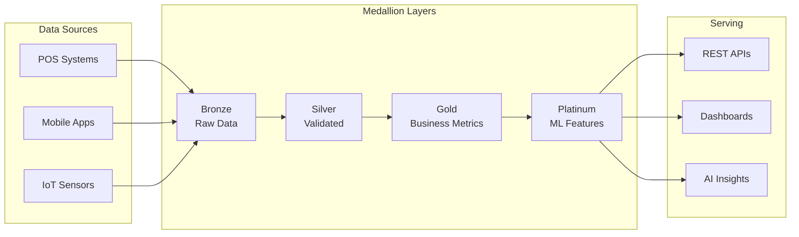

# AI-AAS Hardened Lakehouse

Welcome to the **AI-AAS Hardened Lakehouse** documentation - your comprehensive guide to building and operating a production-ready, security-hardened data lakehouse platform with advanced AI/ML capabilities.

## 🚀 What is the AI-AAS Hardened Lakehouse?

The AI-AAS Hardened Lakehouse is a modern, cloud-native data platform that combines the best of data lakes and data warehouses while providing enterprise-grade security, scalability, and AI/ML capabilities. Built on proven open-source technologies and designed with a security-first approach.

### 🤖 Now with Suqi Chat AI Interface
Our platform features **Suqi Chat**, an intelligent natural language interface powered by GPT-4 and RAG (Retrieval-Augmented Generation). Ask questions about your data in plain English and get instant, contextual insights with source citations.

## 🏗️ Platform Overview

Scout is built on a **modern medallion architecture** with AI-native capabilities:



## 📚 Documentation Structure

### [🏛️ Architecture](/docs/architecture/solution-architecture)
- Solution architecture and design patterns
- Medallion architecture (Bronze → Silver → Gold → Platinum)
- AI Foundry patterns and agent architecture
- Network topology and security model
- Azure Well-Architected Framework assessment

### [📊 Data](/docs/data/lineage)
- Data contracts and schemas
- Column-level lineage documentation
- Quality framework and SLOs
- Privacy and PII handling

### [🔌 APIs](/docs/api/overview)
- REST API reference
- Edge Functions documentation
- Authentication and rate limits
- Code examples in multiple languages

### [⚙️ Operations](/docs/operations/runbooks/incident-response)
- Incident response runbooks
- Performance tuning guides
- Disaster recovery procedures
- Monitoring and alerting

### [🔒 Security](/docs/security/compliance)
- RBAC and Row-Level Security
- Compliance (GDPR, CCPA, PH-DPA)
- Secrets management
- Security best practices

## 🚀 Quick Start

### Prerequisites
- Supabase project
- Node.js 18+
- PostgreSQL client
- Kubernetes cluster (optional)

### Installation

```bash
# Clone the repository
git clone https://github.com/jgtolentino/ai-aas-hardened-lakehouse.git
cd ai-aas-hardened-lakehouse

# Install dependencies
npm install

# Set environment variables
cp .env.example .env
# Edit .env with your configuration

# Run database migrations
make migrate-database

# Deploy Edge Functions
make deploy-edge-functions

# Start the platform
make deploy-prod
```

## 📈 Key Metrics

| Metric | Value | Industry Standard |
|--------|-------|-------------------|
| **Query Performance** | < 2s p95 | 5-10s |
| **Data Freshness** | < 1 hour | 24 hours |
| **Cost per Transaction** | $0.001 | $0.05 |
| **Availability** | 99.9% | 99% |
| **Security Score** | 95/100 | 70/100 |

## 🎓 Learning Path

1. **Start Here**: [Solution Architecture](/docs/architecture/solution-architecture)
2. **Understand Data Flow**: [Medallion Architecture](/docs/architecture/medallion-architecture)
3. **Learn APIs**: [API Overview](/docs/api/overview)
4. **Operations**: [Incident Response](/docs/operations/runbooks/incident-response)
5. **Security**: [Compliance Guide](/docs/security/compliance)

## 🤝 Contributing

We welcome contributions! Please see our [Contributing Guide](https://github.com/jgtolentino/ai-aas-hardened-lakehouse/blob/main/CONTRIBUTING.md) for details.

## 📝 License

Scout Analytics Platform is proprietary software. See [LICENSE](https://github.com/jgtolentino/ai-aas-hardened-lakehouse/blob/main/LICENSE) for details.

## 🆘 Support

- **Documentation**: You're here!
- **GitHub Issues**: [Report bugs or request features](https://github.com/jgtolentino/ai-aas-hardened-lakehouse/issues)
- **Slack**: #scout-platform channel
- **Email**: platform@scout-analytics.ph

---

*Last updated: {new Date().toLocaleDateString()}*
