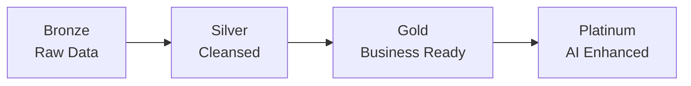

# Scout Design Principles

## 🏛️ Core Architecture Principles

### 1. Medallion Architecture

Scout strictly follows the Medallion Architecture pattern for data quality and governance:



**Key Rules:**
- **Bronze** - Never modify raw data; preserve original fidelity
- **Silver** - Apply business rules and validation
- **Gold** - Create reusable, performant aggregations
- **Platinum** - Add AI-generated insights and predictions

### 2. API-First Design

All data access must go through defined interfaces:

```typescript
// ✅ Good - Use DAL functions
const data = await getGoldBrandShare({ 
  region_id: 13, 
  date_from: '2025-01-01' 
});

// ❌ Bad - Direct database access
const data = await supabase
  .from('bronze_transactions')
  .select('*');
```

### 3. Read-Only Gold/Platinum

Applications should **NEVER** write directly to Gold or Platinum layers:

- **Reads**: Gold/Platinum views via DAL
- **Writes**: Bronze layer via ingestion APIs
- **Processing**: Silver layer via ETL pipelines

## 📐 Data Quality Standards

### Naming Conventions

| Layer | Table Prefix | View Prefix | Example |
|-------|-------------|-------------|---------|
| Bronze | `bronze_` | `v_bronze_` | `bronze_transactions` |
| Silver | `silver_` | `v_silver_` | `silver_transactions` |
| Gold | `gold_` | `v_gold_` | `gold_brand_share` |
| Platinum | `platinum_` | `v_platinum_` | `platinum_forecasts` |

### Column Standards

```sql
-- Standard columns for all tables
created_at TIMESTAMPTZ DEFAULT NOW(),
updated_at TIMESTAMPTZ DEFAULT NOW(),
created_by UUID REFERENCES auth.users(id),
updated_by UUID REFERENCES auth.users(id),
is_deleted BOOLEAN DEFAULT FALSE,
tenant_id UUID NOT NULL
```

### Data Types

| Business Type | PostgreSQL Type | Example |
|--------------|----------------|---------|
| Money | `NUMERIC(15,2)` | `net_sales_amt` |
| Percentage | `NUMERIC(5,2)` | `market_share_pct` |
| Quantity | `NUMERIC(10,3)` | `qty_sold` |
| ID/Key | `BIGINT` or `UUID` | `product_id` |
| Date | `DATE` | `transaction_date` |
| Timestamp | `TIMESTAMPTZ` | `created_at` |
| Text | `VARCHAR(n)` or `TEXT` | `product_name` |

## 🔒 Security Principles

### 1. Row-Level Security (RLS)

Every table must implement RLS policies:

```sql
-- Example RLS policy
CREATE POLICY tenant_isolation ON gold_transactions
  FOR ALL
  TO authenticated
  USING (tenant_id = auth.jwt() ->> 'tenant_id');
```

### 2. Least Privilege Access

- **anon** - No direct table access
- **authenticated** - Read Gold/Platinum via RLS
- **service_role** - Write Bronze, process Silver
- **postgres** - Schema migrations only

### 3. Data Privacy

- PII must be hashed or encrypted
- No customer names in analytics views
- Aggregate data to prevent individual identification
- Implement GDPR-compliant data retention

## 🚀 Performance Guidelines

### 1. Materialized Views

Use materialized views for expensive aggregations:

```sql
CREATE MATERIALIZED VIEW gold_daily_metrics AS
  SELECT date, region_id, SUM(amount) as total_sales
  FROM silver_transactions
  GROUP BY date, region_id;

-- Refresh strategy
REFRESH MATERIALIZED VIEW CONCURRENTLY gold_daily_metrics;
```

### 2. Indexing Strategy

```sql
-- Composite indexes for common queries
CREATE INDEX idx_transactions_date_store 
  ON silver_transactions(transaction_date, store_id);

-- Partial indexes for filtered queries  
CREATE INDEX idx_active_products 
  ON dim_products(product_id) 
  WHERE is_active = true;
```

### 3. Partitioning

Partition large tables by date:

```sql
CREATE TABLE silver_transactions (
  transaction_id BIGINT,
  transaction_date DATE,
  ...
) PARTITION BY RANGE (transaction_date);

CREATE TABLE silver_transactions_2025_01 
  PARTITION OF silver_transactions
  FOR VALUES FROM ('2025-01-01') TO ('2025-02-01');
```

## 🤖 AI Agent Principles

### 1. Deterministic Fallbacks

Every AI operation must have a fallback:

```typescript
try {
  // AI-powered brand detection
  const brand = await detectBrandWithAI(product_name);
} catch (error) {
  // Fallback to rule-based detection
  const brand = detectBrandWithRules(product_name);
}
```

### 2. Confidence Scoring

All AI predictions include confidence scores:

```json
{
  "prediction": "Brand substitution detected",
  "confidence": 0.85,
  "explanation": "Based on 3-month purchase pattern"
}
```

### 3. Human-in-the-Loop

Critical decisions require approval:

```typescript
if (confidence < 0.7 || impact > 10000) {
  await requireHumanApproval(action);
}
```

## 📊 Visualization Standards

### 1. Chart Selection

| Data Type | Recommended Chart | Library |
|-----------|------------------|---------|
| Time Series | Line Chart | Recharts |
| Comparison | Bar Chart | Recharts |
| Composition | Stacked Bar | Recharts |
| Distribution | Histogram | Recharts |
| Geographic | Choropleth Map | Mapbox |
| Correlation | Scatter Plot | Recharts |

### 2. Color Palette

```css
:root {
  --scout-primary: #1E3A8A;    /* Navy Blue */
  --scout-secondary: #3B82F6;  /* Sky Blue */
  --scout-success: #10B981;    /* Green */
  --scout-warning: #F59E0B;    /* Amber */
  --scout-danger: #EF4444;     /* Red */
  --scout-neutral: #6B7280;    /* Gray */
}
```

### 3. Dashboard Layout

- Maximum 6 KPI cards per row
- Charts should be 16:9 or 4:3 aspect ratio
- Use consistent spacing (8px grid system)
- Mobile-first responsive design

## 🔄 Development Workflow

### 1. Version Control

```bash
# Feature branches
git checkout -b feature/add-brand-analysis

# Commit message format
git commit -m "feat(gold): add brand penetration view"

# Types: feat, fix, docs, style, refactor, test, chore
```

### 2. Migration Strategy

```sql
-- Migrations must be idempotent
CREATE TABLE IF NOT EXISTS ...
CREATE INDEX IF NOT EXISTS ...
CREATE OR REPLACE VIEW ...
```

### 3. Testing Requirements

- Unit tests for all DAL functions
- Integration tests for API endpoints
- E2E tests for critical user flows
- Performance tests for Gold views

## 📋 Documentation Standards

### 1. Code Documentation

```typescript
/**
 * Fetches brand market share for a given region and date range
 * @param {number} region_id - The region identifier
 * @param {string} date_from - Start date (YYYY-MM-DD)
 * @param {string} date_to - End date (YYYY-MM-DD)
 * @returns {Promise<BrandShare[]>} Array of brand share data
 * @throws {Error} If region_id is invalid or dates are malformed
 */
async function getGoldBrandShare(params: BrandShareParams): Promise<BrandShare[]> {
  // Implementation
}
```

### 2. SQL Documentation

```sql
-- =====================================================
-- View: gold_brand_penetration
-- Purpose: Calculate brand reach across stores
-- Refresh: Daily at 2 AM PHT
-- Dependencies: silver_transactions, dim_products
-- =====================================================
CREATE OR REPLACE VIEW gold_brand_penetration AS
  ...
```

### 3. API Documentation

Every endpoint must document:
- Purpose and use case
- Request parameters with types
- Response schema with examples
- Error codes and meanings
- Rate limits and quotas

---

These principles ensure Scout remains scalable, maintainable, and reliable as it grows.
