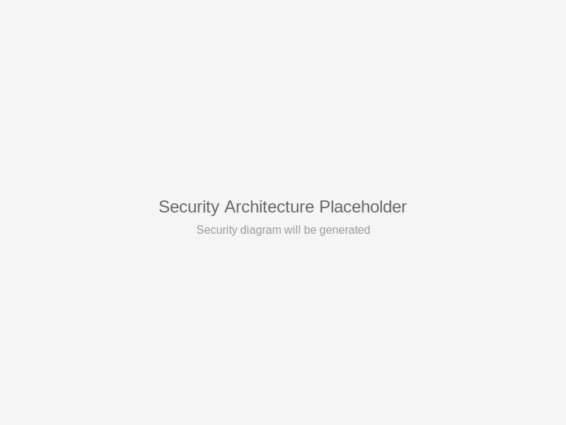

# Security Hardening Guide

This guide provides comprehensive security hardening measures for the AI-AAS Lakehouse platform, ensuring enterprise-grade protection across all system components.

## 🛡️ Security Architecture Overview



## Network Security

### **VPC and Network Isolation**

```yaml
# Network security configuration
vpc_configuration:
  private_subnets:
    - cidr: "10.0.1.0/24"
      tier: "database"
    - cidr: "10.0.2.0/24"  
      tier: "application"
    - cidr: "10.0.3.0/24"
      tier: "web"
  
  public_subnets:
    - cidr: "10.0.101.0/24"
      tier: "load_balancer"
  
  security_groups:
    database_sg:
      ingress:
        - protocol: "tcp"
          port: 5432
          source: "application_sg"
    
    application_sg:
      ingress:
        - protocol: "tcp"
          port: 8080
          source: "web_sg"
```

### **Firewall Rules**

```bash
# PostgreSQL database access
allow_rule "database_access" {
  protocol = "tcp"
  port     = "5432"
  source   = "10.0.2.0/24"  # Application subnet only
}

# Supabase API access
allow_rule "api_access" {
  protocol = "tcp"
  port     = "443"
  source   = "0.0.0.0/0"   # Public API with authentication
}

# Deny all other traffic
deny_rule "default_deny" {
  protocol = "all"
  action   = "drop"
}
```

### **VPN and Private Endpoints**

```terraform
# Private endpoint for Supabase
resource "aws_vpc_endpoint" "supabase" {
  vpc_id              = var.vpc_id
  service_name        = "com.amazonaws.us-west-2.supabase"
  route_table_ids     = [aws_route_table.private.id]
  policy              = data.aws_iam_policy_document.supabase_endpoint_policy.json
}
```

## Identity and Access Management

### **Row Level Security (RLS) Policies**

```sql
-- Enable RLS on all sensitive tables
ALTER TABLE scout.dim_store ENABLE ROW LEVEL SECURITY;
ALTER TABLE scout.fact_transactions ENABLE ROW LEVEL SECURITY;
ALTER TABLE scout.customer_data ENABLE ROW LEVEL SECURITY;

-- Regional data access policy
CREATE POLICY "regional_access_policy" ON scout.dim_store
FOR ALL TO authenticated
USING (
  region = (auth.jwt() ->> 'region')::TEXT
);

-- Department-based access policy
CREATE POLICY "department_access_policy" ON scout.fact_transactions
FOR SELECT TO authenticated
USING (
  EXISTS (
    SELECT 1 FROM user_permissions up
    WHERE up.user_id = auth.uid()
    AND up.department = 'analytics'
    AND up.data_access_level >= 'read'
  )
);

-- Time-based access restrictions
CREATE POLICY "business_hours_policy" ON scout.sensitive_data
FOR ALL TO authenticated
USING (
  EXTRACT(hour FROM NOW()) BETWEEN 8 AND 18
  AND EXTRACT(dow FROM NOW()) BETWEEN 1 AND 5
);
```

### **JWT Token Management**

```typescript
// Token validation and permissions
interface JWTPayload {
  sub: string;           // User ID
  role: string;          // User role
  region: string;        // Geographic region
  department: string;    // Department access
  data_classification: string; // Data access level
  exp: number;          // Token expiration
  permissions: string[]; // Granular permissions
}

// Role-based permissions
const ROLE_PERMISSIONS = {
  'executive': ['read:all', 'write:approved', 'admin:users'],
  'manager': ['read:department', 'write:department'],
  'analyst': ['read:assigned', 'export:limited'],
  'viewer': ['read:public']
};

// Token validation middleware
export async function validateToken(token: string): Promise<JWTPayload | null> {
  try {
    const payload = jwt.verify(token, process.env.JWT_SECRET) as JWTPayload;
    
    // Check token expiration
    if (payload.exp < Date.now() / 1000) {
      throw new Error('Token expired');
    }
    
    // Validate permissions
    if (!ROLE_PERMISSIONS[payload.role]) {
      throw new Error('Invalid role');
    }
    
    return payload;
  } catch (error) {
    console.error('Token validation failed:', error);
    return null;
  }
}
```

### **API Key Security**

```sql
-- API key management table
CREATE TABLE api_keys (
  key_id UUID PRIMARY KEY DEFAULT gen_random_uuid(),
  key_hash TEXT NOT NULL UNIQUE, -- bcrypt hashed
  user_id UUID NOT NULL REFERENCES auth.users(id),
  name TEXT NOT NULL,
  permissions JSONB NOT NULL DEFAULT '[]',
  rate_limit INTEGER DEFAULT 1000,
  expires_at TIMESTAMP WITH TIME ZONE,
  last_used TIMESTAMP WITH TIME ZONE,
  is_active BOOLEAN DEFAULT true,
  created_at TIMESTAMP WITH TIME ZONE DEFAULT NOW()
);

-- API key validation function
CREATE OR REPLACE FUNCTION validate_api_key(api_key TEXT)
RETURNS TABLE(user_id UUID, permissions JSONB, rate_limit INTEGER)
LANGUAGE plpgsql SECURITY DEFINER
AS $$
BEGIN
  RETURN QUERY
  SELECT ak.user_id, ak.permissions, ak.rate_limit
  FROM api_keys ak
  WHERE ak.key_hash = crypt(api_key, ak.key_hash)
    AND ak.is_active = true
    AND (ak.expires_at IS NULL OR ak.expires_at > NOW());
    
  -- Update last used timestamp
  UPDATE api_keys 
  SET last_used = NOW()
  WHERE key_hash = crypt(api_key, key_hash);
END;
$$;
```

## Data Protection

### **Encryption Configuration**

#### **Encryption at Rest**
```yaml
# PostgreSQL encryption
postgresql_config:
  ssl: true
  ssl_cert_file: "/etc/ssl/certs/server.crt"
  ssl_key_file: "/etc/ssl/private/server.key"
  ssl_ca_file: "/etc/ssl/certs/ca.crt"
  
  # Transparent Data Encryption
  data_encryption:
    algorithm: "AES-256-CBC"
    key_rotation: "90days"
    backup_encryption: true

# MinIO object storage encryption
minio_config:
  encryption:
    sse_s3:
      enabled: true
      algorithm: "AES256"
    sse_kms:
      enabled: true
      key_id: "${KMS_KEY_ID}"
```

#### **Encryption in Transit**
```nginx
# NGINX SSL configuration
server {
    listen 443 ssl http2;
    ssl_protocols TLSv1.3;
    ssl_ciphers ECDHE-RSA-AES128-GCM-SHA256:ECDHE-RSA-AES256-GCM-SHA384;
    ssl_prefer_server_ciphers off;
    
    # HSTS headers
    add_header Strict-Transport-Security "max-age=63072000" always;
    add_header X-Frame-Options "SAMEORIGIN" always;
    add_header X-Content-Type-Options "nosniff" always;
    add_header Referrer-Policy "no-referrer-when-downgrade" always;
}
```

### **PII Data Protection**

```sql
-- PII masking functions
CREATE OR REPLACE FUNCTION mask_email(email TEXT)
RETURNS TEXT AS $$
BEGIN
  RETURN CASE 
    WHEN email IS NULL THEN NULL
    WHEN position('@' in email) > 0 THEN 
      substring(email from 1 for 2) || '****@' || split_part(email, '@', 2)
    ELSE '****'
  END;
END;
$$ LANGUAGE plpgsql IMMUTABLE;

CREATE OR REPLACE FUNCTION mask_phone(phone TEXT)
RETURNS TEXT AS $$
BEGIN
  RETURN CASE 
    WHEN phone IS NULL THEN NULL
    WHEN length(phone) >= 10 THEN 
      '***-***-' || right(phone, 4)
    ELSE '***-****'
  END;
END;
$$ LANGUAGE plpgsql IMMUTABLE;

-- PII-protected view
CREATE OR REPLACE VIEW scout.customers_protected AS
SELECT 
  customer_id,
  CASE 
    WHEN current_setting('role') = 'admin' THEN email
    ELSE mask_email(email)
  END as email,
  CASE 
    WHEN current_setting('role') = 'admin' THEN mobile_number
    ELSE mask_phone(mobile_number)
  END as mobile_number,
  first_name,
  last_name,
  customer_type,
  created_at
FROM scout.dim_customer;
```

### **Data Classification and Labeling**

```sql
-- Data classification system
CREATE TYPE data_classification AS ENUM (
  'public',
  'internal', 
  'confidential',
  'restricted'
);

-- Table metadata with classification
CREATE TABLE data_catalog (
  table_name TEXT PRIMARY KEY,
  classification data_classification NOT NULL,
  contains_pii BOOLEAN DEFAULT false,
  retention_period INTERVAL,
  encryption_required BOOLEAN DEFAULT false,
  access_controls JSONB,
  created_at TIMESTAMP DEFAULT NOW()
);

-- Insert classifications for scout tables
INSERT INTO data_catalog VALUES
('scout.dim_store', 'internal', false, '7 years', false, '{"read": ["analyst", "manager"]}'),
('scout.dim_customer', 'confidential', true, '5 years', true, '{"read": ["manager", "admin"]}'),
('scout.fact_transactions', 'confidential', false, '7 years', true, '{"read": ["analyst", "manager"]}');
```

## Application Security

### **Container Security**

```dockerfile
# Security-hardened container
FROM node:20-alpine AS base

# Create non-root user
RUN addgroup -g 1001 -S nodejs
RUN adduser -S nextjs -u 1001

# Security updates
RUN apk update && apk upgrade
RUN apk add --no-cache dumb-init

# Remove unnecessary packages
RUN apk del --purge wget curl

# Set security headers
ENV NODE_OPTIONS="--max-old-space-size=2048"
ENV NODE_ENV="production"

# Switch to non-root user
USER nextjs

# Health check
HEALTHCHECK --interval=30s --timeout=3s --start-period=5s --retries=3 \
  CMD node healthcheck.js
```

### **Input Validation and Sanitization**

```typescript
// Input validation middleware
import { z } from 'zod';

const QuerySchema = z.object({
  table: z.string().regex(/^[a-zA-Z_][a-zA-Z0-9_]*$/), // Prevent SQL injection
  filters: z.object({
    region: z.string().max(50),
    date_from: z.string().datetime(),
    date_to: z.string().datetime(),
    limit: z.number().min(1).max(1000)
  }).partial(),
  sort: z.object({
    column: z.string().regex(/^[a-zA-Z_][a-zA-Z0-9_]*$/),
    direction: z.enum(['asc', 'desc'])
  }).optional()
});

export function validateQuery(req: Request, res: Response, next: NextFunction) {
  try {
    const validatedQuery = QuerySchema.parse(req.query);
    req.validatedQuery = validatedQuery;
    next();
  } catch (error) {
    res.status(400).json({
      error: 'Invalid query parameters',
      details: error.errors
    });
  }
}
```

### **SQL Injection Prevention**

```typescript
// Parameterized queries with type safety
import { sql } from '@vercel/postgres';

export async function getStoresByRegion(region: string, limit: number = 100) {
  // Using parameterized query to prevent SQL injection
  const result = await sql`
    SELECT 
      store_id,
      store_name,
      region,
      latitude,
      longitude
    FROM scout.dim_store
    WHERE region = ${region}
      AND is_active = true
    ORDER BY store_name
    LIMIT ${limit}
  `;
  
  return result.rows;
}

// Dynamic query builder with validation
export function buildSecureQuery(
  baseTable: string,
  filters: Record<string, any>,
  allowedColumns: string[]
) {
  // Validate table name
  const tableRegex = /^[a-zA-Z_][a-zA-Z0-9_]*\.[a-zA-Z_][a-zA-Z0-9_]*$/;
  if (!tableRegex.test(baseTable)) {
    throw new Error('Invalid table name');
  }
  
  // Validate column names
  const whereClause = Object.entries(filters)
    .filter(([column]) => allowedColumns.includes(column))
    .map(([column, value]) => `${column} = $${column}`)
    .join(' AND ');
    
  return {
    query: `SELECT * FROM ${baseTable} WHERE ${whereClause}`,
    params: filters
  };
}
```

## Monitoring and Audit

### **Comprehensive Audit Logging**

```sql
-- Audit log table
CREATE TABLE audit_log (
  log_id UUID PRIMARY KEY DEFAULT gen_random_uuid(),
  user_id UUID,
  user_email TEXT,
  action TEXT NOT NULL, -- SELECT, INSERT, UPDATE, DELETE, LOGIN, LOGOUT
  table_name TEXT,
  record_id TEXT,
  old_values JSONB,
  new_values JSONB,
  ip_address INET,
  user_agent TEXT,
  timestamp TIMESTAMP WITH TIME ZONE DEFAULT NOW(),
  session_id TEXT,
  success BOOLEAN DEFAULT true,
  error_message TEXT
);

-- Audit trigger function
CREATE OR REPLACE FUNCTION audit_trigger_function()
RETURNS TRIGGER AS $$
DECLARE
  old_data JSONB;
  new_data JSONB;
BEGIN
  -- Get old and new data
  IF TG_OP = 'DELETE' THEN
    old_data = to_jsonb(OLD);
    new_data = NULL;
  ELSIF TG_OP = 'UPDATE' THEN
    old_data = to_jsonb(OLD);
    new_data = to_jsonb(NEW);
  ELSIF TG_OP = 'INSERT' THEN
    old_data = NULL;
    new_data = to_jsonb(NEW);
  END IF;

  -- Insert audit record
  INSERT INTO audit_log (
    user_id,
    action,
    table_name,
    record_id,
    old_values,
    new_values
  ) VALUES (
    auth.uid(),
    TG_OP,
    TG_TABLE_NAME,
    COALESCE(NEW.id, OLD.id)::TEXT,
    old_data,
    new_data
  );

  RETURN COALESCE(NEW, OLD);
END;
$$ LANGUAGE plpgsql;

-- Apply audit triggers to sensitive tables
CREATE TRIGGER audit_dim_customer
  AFTER INSERT OR UPDATE OR DELETE ON scout.dim_customer
  FOR EACH ROW EXECUTE FUNCTION audit_trigger_function();
```

### **Security Monitoring**

```typescript
// Security event monitoring
interface SecurityEvent {
  type: 'failed_login' | 'unauthorized_access' | 'data_breach' | 'suspicious_activity';
  severity: 'low' | 'medium' | 'high' | 'critical';
  user_id?: string;
  ip_address: string;
  user_agent: string;
  details: Record<string, any>;
  timestamp: Date;
}

export class SecurityMonitor {
  private failedAttempts = new Map<string, number>();
  
  async logSecurityEvent(event: SecurityEvent) {
    // Log to audit system
    await this.logToDatabase(event);
    
    // Send alerts for critical events
    if (event.severity === 'critical') {
      await this.sendAlert(event);
    }
    
    // Track failed login attempts
    if (event.type === 'failed_login') {
      await this.handleFailedLogin(event);
    }
  }
  
  private async handleFailedLogin(event: SecurityEvent) {
    const key = `${event.ip_address}:${event.user_id}`;
    const attempts = this.failedAttempts.get(key) || 0;
    
    if (attempts >= 5) {
      // Block IP for 1 hour
      await this.blockIP(event.ip_address, 3600);
      
      // Send security alert
      await this.sendAlert({
        ...event,
        type: 'suspicious_activity',
        severity: 'high',
        details: { reason: 'Multiple failed login attempts', attempts: attempts + 1 }
      });
    }
    
    this.failedAttempts.set(key, attempts + 1);
  }
}
```

## Compliance and Governance

### **GDPR Compliance**

```sql
-- Data subject rights implementation
CREATE OR REPLACE FUNCTION gdpr_right_to_be_forgotten(subject_id UUID)
RETURNS BOOLEAN AS $$
BEGIN
  -- Anonymize personal data instead of deletion for audit compliance
  UPDATE scout.dim_customer 
  SET 
    email = 'anonymized@deleted.com',
    first_name = 'Anonymized',
    last_name = 'User',
    mobile_number = NULL,
    birthdate = NULL,
    gdpr_deleted = true,
    gdpr_deleted_at = NOW()
  WHERE customer_id = subject_id;
  
  -- Log the GDPR request
  INSERT INTO gdpr_requests (
    subject_id, 
    request_type, 
    processed_at, 
    status
  ) VALUES (
    subject_id, 
    'right_to_be_forgotten', 
    NOW(), 
    'completed'
  );
  
  RETURN true;
END;
$$ LANGUAGE plpgsql;

-- Data portability
CREATE OR REPLACE FUNCTION gdpr_data_export(subject_id UUID)
RETURNS JSONB AS $$
DECLARE
  customer_data JSONB;
  transaction_data JSONB;
  export_data JSONB;
BEGIN
  -- Export customer data
  SELECT to_jsonb(c.*) INTO customer_data
  FROM scout.dim_customer c
  WHERE c.customer_id = subject_id;
  
  -- Export transaction history
  SELECT jsonb_agg(t.*) INTO transaction_data
  FROM scout.fact_transactions t
  WHERE t.customer_id = subject_id;
  
  -- Combine all data
  export_data = jsonb_build_object(
    'customer_profile', customer_data,
    'transaction_history', transaction_data,
    'export_timestamp', NOW(),
    'format_version', '1.0'
  );
  
  -- Log the export request
  INSERT INTO gdpr_requests (
    subject_id, 
    request_type, 
    processed_at, 
    status
  ) VALUES (
    subject_id, 
    'data_portability', 
    NOW(), 
    'completed'
  );
  
  RETURN export_data;
END;
$$ LANGUAGE plpgsql;
```

### **Data Retention Policies**

```sql
-- Automated data retention
CREATE OR REPLACE FUNCTION enforce_data_retention()
RETURNS void AS $$
DECLARE
  retention_policy RECORD;
BEGIN
  -- Loop through retention policies
  FOR retention_policy IN 
    SELECT table_name, retention_period 
    FROM data_catalog 
    WHERE retention_period IS NOT NULL
  LOOP
    EXECUTE format(
      'DELETE FROM %I WHERE created_at < NOW() - INTERVAL %L',
      retention_policy.table_name,
      retention_policy.retention_period
    );
  END LOOP;
END;
$$ LANGUAGE plpgsql;

-- Schedule retention job
SELECT cron.schedule(
  'data-retention',
  '0 2 * * 0', -- Weekly at 2 AM Sunday
  'SELECT enforce_data_retention();'
);
```

This comprehensive security hardening guide ensures that the AI-AAS Lakehouse platform meets enterprise security standards with defense-in-depth protection across all system layers.