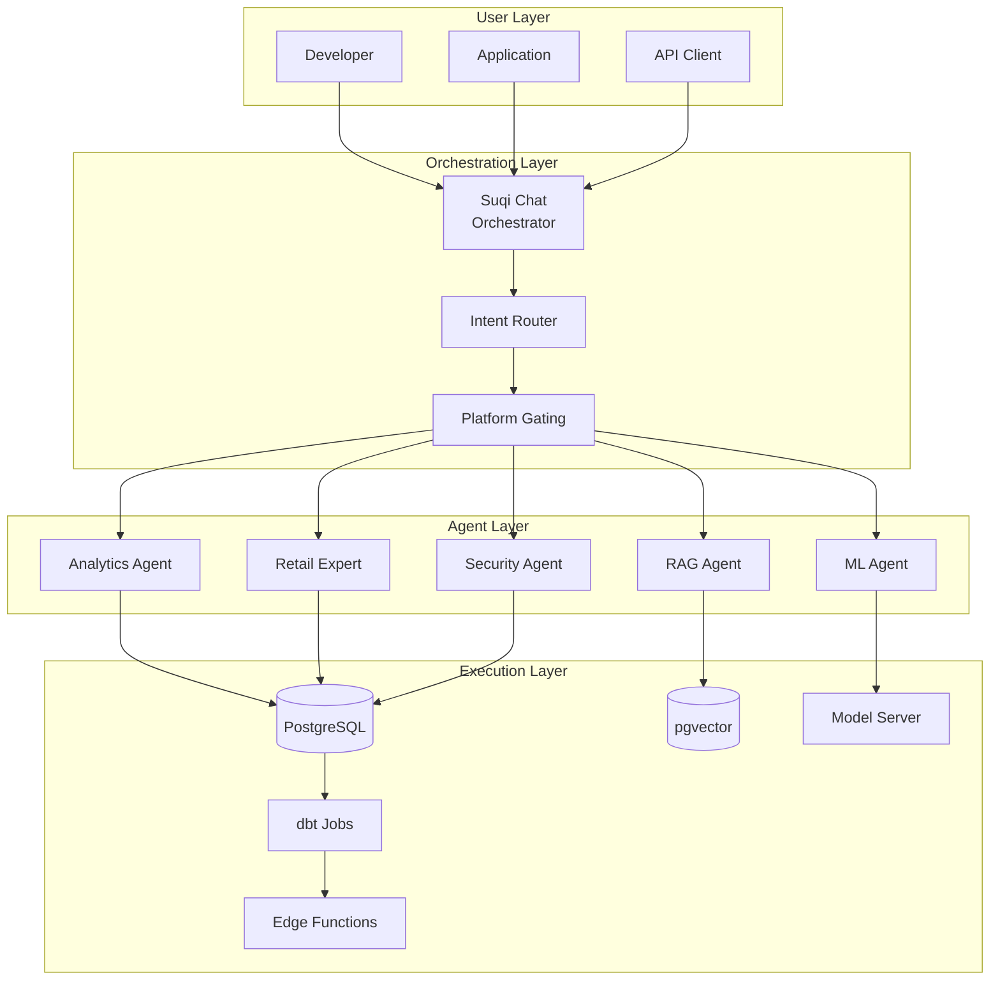
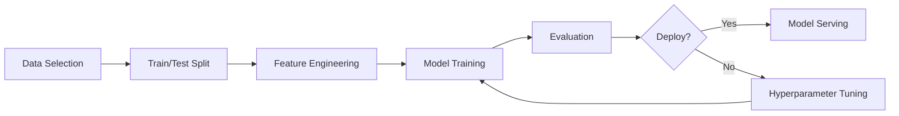

# AI Development Orchestration Guide

## Overview

The AI-AAS Hardened Lakehouse provides a comprehensive AI development orchestration framework centered around **Suqi Chat**, which serves as the unified interface for all AI operations, agent coordination, and ML pipeline management.

## Architecture

### Core Components

1. **Suqi Chat** - Central AI orchestration interface
2. **Multi-Agent System** - Specialized agents for different domains
3. **RAG Pipeline** - Retrieval-Augmented Generation for contextual responses
4. **ML Pipeline** - Feature engineering and model management
5. **Data Pipeline** - ETL/ELT orchestration with dbt

### Orchestration Flow



## Orchestration Modes

### 1. Database Mode (Default)

Configuration: `SUQI_CHAT_MODE=db`

**Advantages:**
- Lower latency (< 100ms overhead)
- Built-in caching at database level
- Simplified deployment
- Better for synchronous operations

**Use Cases:**
- Real-time analytics queries
- Simple Q&A interactions
- Cached response retrieval
- Single-step operations

**Implementation:**
```sql
-- All orchestration logic in PostgreSQL
CREATE OR REPLACE FUNCTION public.ask_suqi_query(
  question text,
  context_limit int default 10
) RETURNS jsonb AS $$
DECLARE
  _intent jsonb;
  _agent text;
  _response jsonb;
BEGIN
  -- Intent classification
  _intent := classify_intent(question);
  _agent := _intent->>'agent';
  
  -- Route to appropriate handler
  CASE _agent
    WHEN 'analytics' THEN
      _response := process_analytics_query(question);
    WHEN 'ml' THEN
      _response := process_ml_query(question);
    WHEN 'rag' THEN
      _response := process_rag_query(question);
    ELSE
      _response := process_general_query(question);
  END CASE;
  
  RETURN _response;
END;
$$ LANGUAGE plpgsql SECURITY INVOKER;
```

### 2. Node Mode (Advanced)

Configuration: `SUQI_CHAT_MODE=node`

**Advantages:**
- Complex multi-step reasoning
- External API integrations
- Streaming responses
- Asynchronous operations

**Use Cases:**
- Multi-agent collaboration
- Long-running ML pipelines
- Complex data transformations
- Real-time streaming analytics

**Implementation:**
```typescript
// Application-level orchestration
class SuqiOrchestrator {
  async processQuery(query: string, context: Context) {
    // 1. Intent classification
    const intent = await this.classifyIntent(query);
    
    // 2. Multi-agent planning
    const plan = await this.createExecutionPlan(intent);
    
    // 3. Execute plan steps
    const results = [];
    for (const step of plan.steps) {
      const agent = this.agents.get(step.agent);
      const result = await agent.execute(step.params);
      results.push(result);
      
      // Stream intermediate results
      yield { step: step.name, result };
    }
    
    // 4. Combine results
    return this.combineResults(results);
  }
}
```

## Agent Types and Capabilities

### 1. Analytics Agent

**Capabilities:**
- SQL generation from natural language
- Metric calculations and aggregations
- Trend analysis and forecasting
- Anomaly detection

**Example Queries:**
```
"Show me top 10 stores by revenue last month"
"Compare Q3 vs Q4 performance by region"
"Find anomalies in transaction patterns"
```

### 2. ML Agent

**Capabilities:**
- Model training orchestration
- Feature engineering
- Prediction serving
- Model performance monitoring

**Example Queries:**
```
"Train a sales prediction model for next quarter"
"What features are most important for churn prediction?"
"Evaluate model performance on recent data"
```

### 3. RAG Agent

**Capabilities:**
- Document retrieval and ranking
- Context-aware responses
- Knowledge base search
- Citation generation

**Example Queries:**
```
"How do I calculate customer lifetime value?"
"What are best practices for inventory management?"
"Explain the company's return policy"
```

### 4. Retail Expert Agent

**Capabilities:**
- Domain-specific insights
- Market analysis
- Competitive intelligence
- Seasonal recommendations

**Example Queries:**
```
"What products should we stock for Christmas season?"
"Analyze competitor pricing strategies"
"Recommend optimal store locations"
```

## Data Pipeline Orchestration

### ETL/ELT with dbt

The platform uses dbt CronJobs for data transformation orchestration:

```yaml
# platform/lakehouse/dbt/dbt-cronjob.yaml
apiVersion: batch/v1
kind: CronJob
metadata:
  name: dbt-transform
  namespace: aaas
spec:
  schedule: "0 */2 * * *"  # Every 2 hours
  jobTemplate:
    spec:
      template:
        spec:
          containers:
          - name: dbt
            image: dbt:latest
            command: ["dbt", "run", "--models", "medallion.bronze+"]
```

### Medallion Architecture Flow

```
Bronze (Raw) → Silver (Cleaned) → Gold (Aggregated) → Platinum (ML Features)
```

Each layer is orchestrated through:
1. **Ingestion** - Edge functions and batch loads
2. **Transformation** - dbt models and SQL functions
3. **Quality Checks** - Great Expectations validations
4. **Serving** - Materialized views and caching

## ML Pipeline Orchestration

### Feature Engineering

```python
# Automated feature generation
class FeatureOrchestrator:
    def __init__(self):
        self.feature_generators = {
            'numeric': NumericFeatureGenerator(),
            'categorical': CategoricalFeatureGenerator(),
            'temporal': TemporalFeatureGenerator(),
            'text': TextFeatureGenerator()
        }
    
    async def generate_features(self, dataset: str):
        # 1. Analyze data types
        schema = await self.analyze_schema(dataset)
        
        # 2. Generate features by type
        features = []
        for column, dtype in schema.items():
            generator = self.feature_generators[dtype]
            features.extend(await generator.generate(column))
        
        # 3. Store in Platinum layer
        await self.store_features(features)
```

### Model Training Pipeline



## Monitoring and Observability

### Performance Metrics

```sql
-- Real-time orchestration metrics
CREATE VIEW ai_orchestration_metrics AS
SELECT 
  date_trunc('hour', created_at) as hour,
  agent_type,
  COUNT(*) as queries,
  AVG(response_time_ms) as avg_latency,
  PERCENTILE_CONT(0.95) WITHIN GROUP (ORDER BY response_time_ms) as p95_latency,
  SUM(tokens_used) as total_tokens,
  SUM(cost_usd) as total_cost
FROM scout.ai_orchestration_log
WHERE created_at > NOW() - INTERVAL '24 hours'
GROUP BY 1, 2;
```

### Health Checks

```typescript
// Orchestration health monitoring
const healthChecks = {
  async checkAgents() {
    const results = {};
    for (const [name, agent] of this.agents) {
      results[name] = await agent.healthCheck();
    }
    return results;
  },
  
  async checkPipelines() {
    return {
      dbt: await this.checkDbtStatus(),
      ml: await this.checkMLPipeline(),
      rag: await this.checkRAGPipeline()
    };
  }
};
```

## Best Practices

### 1. Query Design
- Use specific, contextual queries
- Include relevant time ranges
- Specify desired output format

### 2. Performance Optimization
- Enable caching for repeated queries
- Use appropriate context limits
- Batch similar operations

### 3. Security
- Always validate platform headers
- Implement tenant isolation
- Audit sensitive operations

### 4. Cost Management
- Monitor token usage
- Set user quotas
- Implement request throttling

## Integration Examples

### Python SDK

```python
from supabase import create_client
import asyncio

class AIOrchestrator:
    def __init__(self, url, key):
        self.client = create_client(url, key)
    
    async def query(self, question, platform='analytics'):
        response = await self.client.rpc('ask_suqi_query', {
            'question': question,
            'context_limit': 10,
            'platform': platform
        })
        
        return response.data
    
    async def train_model(self, config):
        # Trigger ML pipeline
        response = await self.client.rpc('trigger_ml_pipeline', {
            'model_type': config['type'],
            'parameters': config['params'],
            'dataset': config['dataset']
        })
        
        # Monitor progress
        job_id = response.data['job_id']
        return await self.monitor_job(job_id)
```

### Node.js Integration

```javascript
const { createClient } = require('@supabase/supabase-js');

class AIWorkflow {
  constructor(supabaseUrl, supabaseKey) {
    this.supabase = createClient(supabaseUrl, supabaseKey);
  }
  
  async runAnalytics(query) {
    // Execute through Suqi Chat
    const { data, error } = await this.supabase
      .rpc('ask_suqi_query', {
        question: query,
        platform: 'analytics'
      });
    
    if (error) throw error;
    return data;
  }
  
  async orchestrateWorkflow(steps) {
    const results = [];
    
    for (const step of steps) {
      const result = await this.executeStep(step);
      results.push(result);
      
      // Check for dependencies
      if (step.dependsOn) {
        await this.waitForDependencies(step.dependsOn);
      }
    }
    
    return this.combineResults(results);
  }
}
```

## Deployment Considerations

### Kubernetes Deployment

```yaml
apiVersion: apps/v1
kind: Deployment
metadata:
  name: ai-orchestrator
  namespace: aaas
spec:
  replicas: 3
  selector:
    matchLabels:
      app: ai-orchestrator
  template:
    metadata:
      labels:
        app: ai-orchestrator
    spec:
      containers:
      - name: orchestrator
        image: ai-orchestrator:latest
        env:
        - name: SUQI_CHAT_MODE
          value: "node"
        - name: ORCHESTRATION_THREADS
          value: "4"
        resources:
          requests:
            memory: "2Gi"
            cpu: "1"
          limits:
            memory: "4Gi"
            cpu: "2"
```

### Scaling Considerations

1. **Horizontal Scaling**
   - Use multiple orchestrator instances
   - Implement request routing
   - Share state via Redis/PostgreSQL

2. **Vertical Scaling**
   - Increase memory for larger context windows
   - Add GPU support for local inference
   - Optimize database connections

3. **Caching Strategy**
   - Query result caching (24h TTL)
   - Embedding cache for RAG
   - Model prediction caching

## Troubleshooting

### Common Issues

1. **High Latency**
   - Check cache hit rates
   - Verify index usage
   - Monitor embedding generation time

2. **Agent Failures**
   - Review agent health checks
   - Check resource limits
   - Verify API quotas

3. **Inconsistent Results**
   - Ensure deterministic prompts
   - Check model versions
   - Verify data freshness

### Debug Mode

```sql
-- Enable debug logging
SET scout.debug_mode = true;

-- View orchestration trace
SELECT * FROM scout.orchestration_trace
WHERE query_id = 'xxx'
ORDER BY step_number;
```

## Future Roadmap

1. **Advanced Orchestration**
   - Workflow DAGs with Airflow integration
   - Distributed training with Ray
   - AutoML capabilities

2. **Enhanced Agents**
   - Visual analytics agent
   - Code generation agent
   - Data quality agent

3. **Integration Expansions**
   - Kubeflow pipelines
   - MLflow experiment tracking
   - Weights & Biases integration

## Conclusion

The AI orchestration layer in the AI-AAS Hardened Lakehouse provides a flexible, scalable foundation for AI development workflows. By centralizing orchestration through Suqi Chat and providing both database and application-level modes, the platform supports everything from simple analytics queries to complex ML pipelines.

For more details, see:
- [Suqi Chat Documentation](/docs/features/suqi-chat)
- [AI Foundry Patterns](/docs-site/docs/architecture/ai-foundry.md)
- [API Reference](/API_DOCUMENTATION.md)