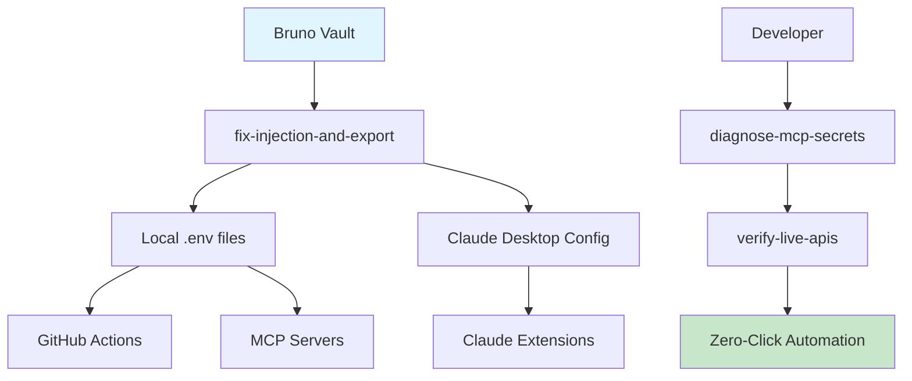

# CI/CD Secrets Playbook - TBWA Enterprise Data Platform

## 🎯 Overview

This playbook ensures **zero secrets in Git**, **automated credential rotation**, and **bulletproof CI/CD pipelines** across the entire TBWA Enterprise Data Platform using Bruno Vault as the single source of truth.

## 🏗️ Architecture



## 📋 Team Onboarding Checklist

### Phase 1: Environment Setup (5 minutes)
- [ ] Clone repo: `git clone <repo-url>`
- [ ] Install Bruno: `brew install bruno-cli` (or download GUI)
- [ ] Run diagnostics: `./diagnose-mcp-secrets`
- [ ] Note missing secrets from diagnostic output

### Phase 2: Bruno Vault Setup (10 minutes)
- [ ] Open Bruno and navigate to project collection
- [ ] Add missing secrets using diagnostic output:
  ```bash
  :bruno env:set GITHUB_TOKEN "ghp_your_token_here"
  :bruno env:set SUPABASE_ACCESS_TOKEN "sbp_your_token_here"
  :bruno env:set SUPABASE_SERVICE_ROLE_KEY "service_role_key_here"
  :bruno env:set FIGMA_ACCESS_TOKEN "figd_your_token_here"
  ```
- [ ] Save Bruno environment

### Phase 3: Secret Injection (2 minutes)
- [ ] Run injection: `./fix-injection-and-export`
- [ ] Verify APIs: `./verify-live-apis`
- [ ] Generate Claude config: `./write-claude-mcp-config`

### Phase 4: Activation (1 minute)
- [ ] Restart Claude Desktop
- [ ] Test MCP servers are available in Claude
- [ ] Run zero-click automation: `./retarget-dashboard.sh "executive kpi" "TBWA"`

## 🔄 Daily Developer Workflow

### Morning Routine
```bash
# 1. Check secret health
./diagnose-mcp-secrets

# 2. If any issues detected, auto-fix
./fix-injection-and-export

# 3. Verify all APIs are live
./verify-live-apis
```

### Before Commits
```bash
# Security pre-commit check
git add .
gitleaks detect --source . --verbose
# Should show 0 leaks detected
```

### Before Deployments
```bash
# Ensure secrets are fresh
./verify-live-apis
# All APIs should return 200 OK
```

## 🚀 CI/CD Pipeline Integration

### GitHub Actions Setup

#### 1. Repository Secrets Configuration
```yaml
# .github/workflows/ci.yml
name: CI/CD Pipeline
on: [push, pull_request]

jobs:
  security-scan:
    runs-on: ubuntu-latest
    steps:
      - uses: actions/checkout@v4
        with:
          fetch-depth: 0
      
      # Security scanning - should always pass with Bruno vault
      - name: Run Gitleaks
        uses: gitleaks/gitleaks-action@v2
        env:
          GITHUB_TOKEN: ${{ secrets.GITHUB_TOKEN }}
      
      - name: Run Trivy
        uses: aquasecurity/trivy-action@master
        with:
          scan-type: 'fs'
          scan-ref: '.'

  deploy:
    needs: security-scan
    runs-on: ubuntu-latest
    if: github.ref == 'refs/heads/main'
    steps:
      - uses: actions/checkout@v4
      
      # Bruno CLI for secret injection in CI
      - name: Setup Bruno CLI
        run: npm install -g @usebruno/cli
      
      # Inject secrets from Bruno vault
      - name: Setup Environment
        run: |
          # Bruno vault pulls secrets safely
          bruno run --env production
          ./fix-injection-and-export
        env:
          BRUNO_VAULT_KEY: ${{ secrets.BRUNO_VAULT_KEY }}
      
      # Deploy with injected secrets
      - name: Deploy to Vercel
        run: vercel deploy --prod
        env:
          VERCEL_TOKEN: ${{ secrets.VERCEL_TOKEN }}
```

#### 2. Required GitHub Repository Secrets
```bash
# Add these to GitHub repo settings > Secrets and variables > Actions:
BRUNO_VAULT_KEY          # Master key for Bruno vault access
VERCEL_TOKEN            # For Vercel deployments
DOCKER_HUB_TOKEN        # For Docker image publishing
```

### Vercel Integration
```json
// vercel.json
{
  "build": {
    "env": {
      "NEXT_PUBLIC_SUPABASE_URL": "@supabase-url",
      "NEXT_PUBLIC_SUPABASE_ANON_KEY": "@supabase-anon-key"
    }
  },
  "env": {
    "SUPABASE_SERVICE_ROLE_KEY": "@supabase-service-role-key",
    "GITHUB_TOKEN": "@github-token"
  }
}
```

### Supabase CLI Integration
```bash
# supabase/.env.production (auto-generated)
SUPABASE_ACCESS_TOKEN=sbp_injected_from_bruno
SUPABASE_DB_PASSWORD=injected_from_bruno
SUPABASE_SERVICE_ROLE_KEY=injected_from_bruno

# Deploy with injected credentials
supabase deploy --create-ticket
```

## 🛡️ Security Best Practices

### File Permissions (Automatic)
```bash
# All scripts set secure permissions automatically
.env                    # 600 (rw-------)
.env.local             # 600 (rw-------)
claude-mcp-config.json # 600 (rw-------)
```

### Secret Rotation Schedule
- **Weekly**: GitHub Personal Access Tokens
- **Monthly**: Supabase Service Role Keys  
- **Quarterly**: Figma Access Tokens
- **On-demand**: Any compromised credentials

### Git Hygiene Rules
```bash
# These patterns are automatically ignored
.env
.env.local
.env.production
claude-mcp-config.json
*.key
*.pem
secrets/
```

## 🔧 Troubleshooting Guide

### Common Issues

#### "MCP servers not loading in Claude"
```bash
# 1. Check Claude Desktop config
./write-claude-mcp-config
# 2. Restart Claude Desktop completely
# 3. Verify config location:
# macOS: ~/Library/Application Support/Claude/claude_desktop_config.json
```

#### "API calls returning 401 Unauthorized"
```bash
# 1. Check token validity
./verify-live-apis
# 2. Refresh tokens in Bruno
# 3. Re-inject secrets
./fix-injection-and-export
```

#### "Gitleaks detecting false positives"
```bash
# 1. Check for test files with dummy tokens
find . -name "*.test.*" -o -name "*.spec.*" | xargs grep -l "token\|key\|secret"
# 2. Add to .gitleaksignore if legitimate
# 3. Use placeholder values in tests
```

#### "Environment variables not loading"
```bash
# 1. Check file permissions
ls -la .env*
# 2. Verify Bruno vault connectivity
bruno run --dry-run
# 3. Manually inject if needed
./fix-injection-and-export --force
```

## 📊 Monitoring & Alerts

### Secret Health Dashboard
```bash
# Daily automated checks
./diagnose-mcp-secrets > /tmp/secret-health.json
# Parse and alert on any failures
```

### CI/CD Pipeline Monitoring
```yaml
# .github/workflows/secret-health.yml
name: Secret Health Check
on:
  schedule:
    - cron: '0 9 * * *'  # Daily at 9 AM UTC

jobs:
  secret-health:
    runs-on: ubuntu-latest
    steps:
      - uses: actions/checkout@v4
      - name: Check Secret Health
        run: ./diagnose-mcp-secrets
        continue-on-error: true
      - name: Alert on Failure
        if: failure()
        uses: 8398a7/action-slack@v3
        with:
          status: failure
          text: "🚨 Secret health check failed - tokens may need rotation"
```

## 🎯 Team Training

### New Developer Onboarding Session (30 minutes)
1. **Concepts** (5 min): Why Bruno vault over .env files
2. **Setup** (15 min): Run through checklist above
3. **Practice** (10 min): Execute zero-click automation end-to-end

### Quarterly Security Reviews
- Audit all secrets in Bruno vault
- Rotate high-privilege tokens
- Review CI/CD pipeline security
- Update documentation

## 📚 Quick Reference

### Essential Commands
```bash
./diagnose-mcp-secrets           # Check current state
./fix-injection-and-export      # Inject from Bruno
./verify-live-apis              # Test connectivity
./write-claude-mcp-config       # Update Claude
./retarget-dashboard.sh          # Zero-click automation
```

### File Locations
```bash
# Configuration
.env.example                     # Template (safe to commit)
.env                            # Injected secrets (gitignored)
claude-mcp-config.json          # Auto-generated (gitignored)

# Scripts
tools/bruno/                    # Bruno integration scripts
tools/mcp/                      # MCP server implementations
scripts/                        # Zero-click automation scripts
```

### Emergency Contacts
- **Security Issues**: security@tbwa.com
- **Bruno Vault Access**: devops@tbwa.com  
- **CI/CD Pipeline**: infrastructure@tbwa.com

---

## 🏆 Success Metrics

After implementing this playbook, your team should achieve:

✅ **Zero** secrets committed to Git (verified by Gitleaks)  
✅ **100%** automated secret injection in CI/CD  
✅ **<5 minutes** developer onboarding time  
✅ **Zero** manual token management  
✅ **Bulletproof** zero-click automation workflows  

**This playbook ensures enterprise-grade security while maximizing developer productivity.**