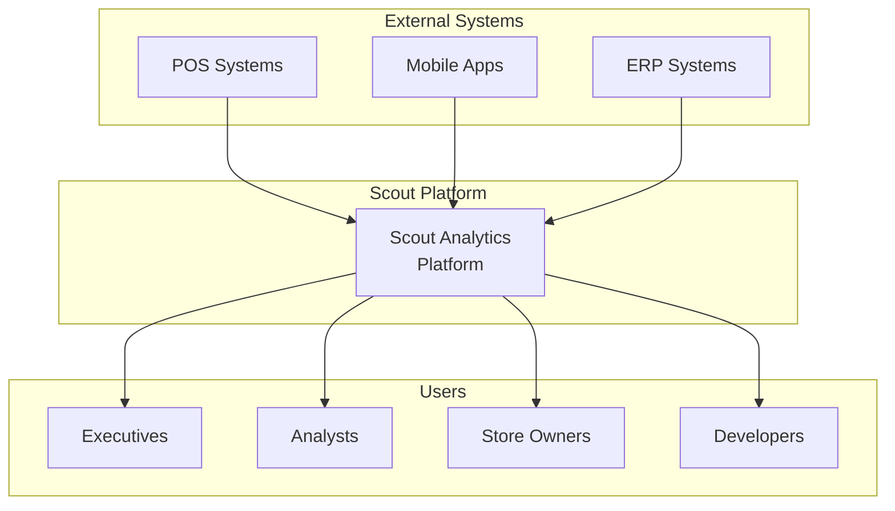

# Scout Platform Documentation Roadmap
## Gap Analysis vs Enterprise Architecture Standards

Based on Azure AI/ML and Modern Data Platform reference architectures, here's what we have vs what's needed:

## ✅ **What We Have**

### 1. **Architecture Documentation**
- ✅ `ARCHITECTURE_FLOW.md` - Data flow diagrams with Mermaid
- ✅ `API_DOCUMENTATION.md` - Complete API reference
- ✅ `DEPLOYMENT_STATUS.md` - Deployment tracking
- ✅ `FINAL_PROJECT_SUMMARY.md` - High-level overview

### 2. **Technical Diagrams**
- ✅ Data Flow Architecture (Mermaid)
- ✅ Deployment Flow (CI/CD)
- ✅ Security Model
- ✅ Data Quality Pipeline

### 3. **Operational Docs**
- ✅ Deployment checklist
- ✅ Makefile commands
- ✅ Bruno API tests
- ✅ README files

## ❌ **Documentation Gaps** (Based on Azure Standards)

### 1. **High-Level Architecture Diagrams**

#### **System Context Diagram** (C4 Level 1)


#### **Container Diagram** (C4 Level 2)
- Missing: Detailed breakdown of microservices
- Missing: Service communication patterns
- Missing: External dependencies

### 2. **AI/ML Architecture** (Like Azure AI Foundry)

#### **AI Pipeline Documentation**
```yaml
needed:
  - Model Training Pipeline
  - Feature Engineering Flow
  - Model Registry & Versioning
  - A/B Testing Framework
  - MLOps CI/CD
  - Drift Detection
  - Explainability Framework
```

#### **RAG Architecture**
```yaml
needed:
  - Document Processing Pipeline
  - Vector Store Architecture
  - Embedding Strategy
  - Retrieval Optimization
  - Context Window Management
  - Prompt Engineering Guidelines
```

### 3. **Data Mesh Architecture**

#### **Domain Ownership Model**
```yaml
needed:
  - Data Product Catalog
  - Domain Boundaries
  - Data Contracts
  - Self-Service Infrastructure
  - Federated Governance
  - Cross-Domain Discovery
```

### 4. **Network Architecture**

#### **Zero Trust Network Diagram**
```yaml
needed:
  - Network Segmentation
  - Service Mesh Architecture
  - API Gateway Pattern
  - WAF Configuration
  - DDoS Protection
  - Private Endpoints
```

### 5. **Disaster Recovery & Business Continuity**

#### **DR Architecture**
```yaml
needed:
  - RPO/RTO Targets
  - Backup Strategy
  - Failover Procedures
  - Data Replication
  - Geographic Redundancy
  - Recovery Testing Plans
```

### 6. **Cost Management Architecture**

#### **FinOps Documentation**
```yaml
needed:
  - Resource Tagging Strategy
  - Cost Allocation Model
  - Showback/Chargeback
  - Optimization Recommendations
  - Budget Alerts
  - Reserved Capacity Planning
```

### 7. **Performance Architecture**

#### **Scalability Patterns**
```yaml
needed:
  - Auto-scaling Policies
  - Load Balancing Strategy
  - Caching Architecture
  - CDN Configuration
  - Database Sharding
  - Read Replicas
```

### 8. **Compliance & Governance**

#### **Compliance Architecture**
```yaml
needed:
  - Data Classification
  - Encryption at Rest/Transit
  - Key Management
  - Audit Logging
  - GDPR/CCPA Compliance
  - Data Residency
```

## 📋 **Documentation Creation Priority**

### **Phase 1: Critical (Week 1)**
1. **Solution Architecture Document**
   - Executive summary
   - Business drivers
   - Technical requirements
   - Architecture decisions
   - Trade-offs

2. **Deployment Architecture**
   - Infrastructure as Code
   - Environment strategy
   - Release management
   - Rollback procedures

3. **Security Architecture**
   - Threat model
   - Security controls
   - Identity & access management
   - Data protection

### **Phase 2: Important (Week 2)**
1. **Data Architecture**
   - Data lineage
   - Master data management
   - Data quality framework
   - Metadata management

2. **Integration Architecture**
   - API specifications
   - Event-driven patterns
   - Message queuing
   - ETL/ELT patterns

3. **Monitoring Architecture**
   - Observability strategy
   - Logging architecture
   - Metrics & KPIs
   - Alert escalation

### **Phase 3: Enhancement (Week 3)**
1. **AI/ML Architecture**
   - Model lifecycle
   - Feature store
   - Experimentation platform
   - Model monitoring

2. **Performance Architecture**
   - Capacity planning
   - Performance testing
   - Optimization strategies
   - SLA definitions

3. **Operations Playbook**
   - Runbooks
   - Incident response
   - Change management
   - Knowledge base

## 🎨 **Diagram Standards**

### **Recommended Tools**
1. **draw.io/diagrams.net** - For detailed architecture diagrams
2. **Mermaid** - For version-controlled diagrams in markdown
3. **C4 Model** - For hierarchical architecture views
4. **ArchiMate** - For enterprise architecture

### **Diagram Types Needed**
1. ✅ Data Flow (Have)
2. ✅ Deployment Flow (Have)
3. ❌ Component Architecture
4. ❌ Sequence Diagrams
5. ❌ State Diagrams
6. ❌ Entity Relationship
7. ❌ Network Topology
8. ❌ Infrastructure Layout

## 📚 **Reference Documentation Structure**

```
docs/
├── architecture/
│   ├── overview.md
│   ├── system-context.md
│   ├── container-architecture.md
│   ├── component-architecture.md
│   ├── deployment-architecture.md
│   └── decision-records/
│       ├── adr-001-medallion-architecture.md
│       ├── adr-002-streaming-vs-batch.md
│       └── adr-003-security-model.md
├── design/
│   ├── data-model.md
│   ├── api-design.md
│   ├── security-design.md
│   └── ui-ux-design.md
├── operations/
│   ├── deployment-guide.md
│   ├── monitoring-guide.md
│   ├── troubleshooting.md
│   ├── disaster-recovery.md
│   └── runbooks/
├── development/
│   ├── getting-started.md
│   ├── development-setup.md
│   ├── coding-standards.md
│   ├── testing-strategy.md
│   └── contribution-guide.md
└── reference/
    ├── api-reference.md
    ├── configuration.md
    ├── glossary.md
    └── faq.md
```

## 🎯 **Next Steps**

1. **Create Solution Architecture Document** using Azure Well-Architected Framework
2. **Generate C4 Model diagrams** for different architecture levels
3. **Document Architecture Decision Records (ADRs)**
4. **Create detailed network topology diagrams**
5. **Document disaster recovery procedures**
6. **Create cost optimization documentation**
7. **Build comprehensive runbooks**

## 📖 **Templates to Use**

1. [Azure Architecture Center](https://learn.microsoft.com/en-us/azure/architecture/)
2. [AWS Well-Architected Framework](https://aws.amazon.com/architecture/well-architected/)
3. [Google Cloud Architecture Framework](https://cloud.google.com/architecture/framework)
4. [The C4 Model](https://c4model.com/)
5. [Arc42 Template](https://arc42.org/)

## 🏆 **Success Criteria**

Documentation is complete when:
- ✅ New team members can onboard in < 1 day
- ✅ Any engineer can deploy the platform
- ✅ Operations team has runbooks for all scenarios
- ✅ Architecture decisions are documented and justified
- ✅ Security controls are clearly documented
- ✅ Cost implications are transparent
- ✅ Performance characteristics are defined
- ✅ Compliance requirements are mapped

This roadmap aligns Scout Platform documentation with enterprise standards seen in Azure, AWS, and GCP reference architectures.
