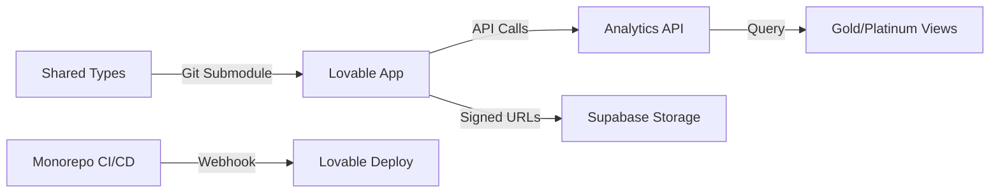

# Lovable App Integration Guide

## 🎯 Overview

This guide covers the integration of Lovable (external React app) with the Scout Analytics monorepo for seamless data access and deployment coordination.

## 🏗️ Architecture



## 📋 Integration Steps

### 1. Environment Configuration

Create `.env.lovable` in monorepo root:

```env
# Lovable App Configuration
LOVABLE_APP_URL=https://your-lovable-app.lovable.app
LOVABLE_WEBHOOK_SECRET=your-webhook-secret
LOVABLE_API_KEY=your-lovable-api-key

# Shared Supabase (read-only access)
LOVABLE_SUPABASE_URL=https://cxzllzyxwpyptfretryc.supabase.co
LOVABLE_SUPABASE_ANON_KEY=your-anon-key

# Analytics API
ANALYTICS_API_URL=https://api.scout-analytics.com
ANALYTICS_API_KEY=your-analytics-api-key
```

### 2. Create Analytics API Endpoints

Create `platform/scout/functions/analytics-api/index.ts`:

```typescript
import { serve } from "https://deno.land/std@0.168.0/http/server.ts"
import { createClient } from 'https://esm.sh/@supabase/supabase-js@2'

const corsHeaders = {
  'Access-Control-Allow-Origin': process.env.LOVABLE_APP_URL || '*',
  'Access-Control-Allow-Headers': 'authorization, x-client-info, apikey, content-type',
  'Access-Control-Allow-Methods': 'GET, POST, OPTIONS',
  'Access-Control-Max-Age': '86400',
}

serve(async (req) => {
  if (req.method === 'OPTIONS') {
    return new Response('ok', { headers: corsHeaders })
  }

  const supabase = createClient(
    Deno.env.get('SUPABASE_URL')!,
    Deno.env.get('SUPABASE_SERVICE_ROLE_KEY')!
  )

  const { pathname, searchParams } = new URL(req.url)
  
  try {
    // Route: /daily-summary
    if (pathname === '/daily-summary') {
      const date = searchParams.get('date') || new Date().toISOString().slice(0, 10)
      
      const { data, error } = await supabase
        .from('daily_transactions')
        .select('*')
        .eq('transaction_date', date)
        
      if (error) throw error
      
      return new Response(JSON.stringify({ data }), {
        headers: { ...corsHeaders, 'Content-Type': 'application/json' }
      })
    }
    
    // Route: /store-rankings
    if (pathname === '/store-rankings') {
      const limit = parseInt(searchParams.get('limit') || '10')
      
      const { data, error } = await supabase
        .from('store_rankings')
        .select('*')
        .order('revenue_rank')
        .limit(limit)
        
      if (error) throw error
      
      return new Response(JSON.stringify({ data }), {
        headers: { ...corsHeaders, 'Content-Type': 'application/json' }
      })
    }
    
    // Route: /ml-predictions
    if (pathname === '/ml-predictions') {
      const storeId = searchParams.get('store_id')
      
      const { data, error } = await supabase
        .from('store_features')
        .select('store_id, revenue_forecast_next_7d, churn_probability, growth_potential_score')
        .eq('store_id', storeId)
        .single()
        
      if (error) throw error
      
      return new Response(JSON.stringify({ data }), {
        headers: { ...corsHeaders, 'Content-Type': 'application/json' }
      })
    }
    
    // Route: /datasets (for direct CSV/Parquet access)
    if (pathname === '/datasets') {
      const { data: manifest } = await supabase.storage
        .from('scout-platinum')
        .download('manifest/latest.json')
        
      const manifestData = JSON.parse(await manifest.text())
      
      // Generate signed URLs for each dataset
      const datasets = {}
      for (const [key, path] of Object.entries(manifestData.available_exports)) {
        const { data: signedUrl } = await supabase.storage
          .from('scout-platinum')
          .createSignedUrl(path.slice(1), 3600) // 1 hour expiry
          
        datasets[key] = signedUrl.signedUrl
      }
      
      return new Response(JSON.stringify({ 
        manifest: manifestData,
        signed_urls: datasets 
      }), {
        headers: { ...corsHeaders, 'Content-Type': 'application/json' }
      })
    }
    
    return new Response(JSON.stringify({ error: 'Route not found' }), {
      status: 404,
      headers: { ...corsHeaders, 'Content-Type': 'application/json' }
    })
    
  } catch (error) {
    return new Response(JSON.stringify({ error: error.message }), {
      status: 500,
      headers: { ...corsHeaders, 'Content-Type': 'application/json' }
    })
  }
})
```

### 3. Shared Type Definitions

Create `packages/shared-types/index.ts`:

```typescript
// Shared types between monorepo and Lovable app

export interface DailyTransaction {
  transaction_date: string
  device_id: string
  transaction_count: number
  total_revenue: number
  avg_transaction_value: number
  cash_pct: number
  gcash_pct: number
  card_pct: number
  morning_pct: number
  afternoon_pct: number
  evening_pct: number
}

export interface StoreRanking {
  store_id: string
  region: string
  city: string
  total_revenue: number
  revenue_rank: number
  performance_tier: 'Top 10' | 'Top 50' | 'Top 100' | 'Other'
}

export interface MLPrediction {
  store_id: string
  revenue_forecast_next_7d: number
  churn_probability: number
  growth_potential_score: number
}

export interface AnalyticsAPIResponse<T> {
  data?: T
  error?: string
}
```

### 4. Lovable App Configuration

In your Lovable app, create `src/lib/analytics-client.ts`:

```typescript
import { 
  DailyTransaction, 
  StoreRanking, 
  MLPrediction,
  AnalyticsAPIResponse 
} from '@scout/shared-types'

const API_BASE = import.meta.env.VITE_ANALYTICS_API_URL
const API_KEY = import.meta.env.VITE_ANALYTICS_API_KEY

export class AnalyticsClient {
  private headers = {
    'Authorization': `Bearer ${API_KEY}`,
    'Content-Type': 'application/json'
  }

  async getDailySummary(date?: string): Promise<DailyTransaction[]> {
    const params = date ? `?date=${date}` : ''
    const response = await fetch(`${API_BASE}/daily-summary${params}`, {
      headers: this.headers
    })
    
    const result: AnalyticsAPIResponse<DailyTransaction[]> = await response.json()
    if (result.error) throw new Error(result.error)
    return result.data || []
  }

  async getStoreRankings(limit = 10): Promise<StoreRanking[]> {
    const response = await fetch(`${API_BASE}/store-rankings?limit=${limit}`, {
      headers: this.headers
    })
    
    const result: AnalyticsAPIResponse<StoreRanking[]> = await response.json()
    if (result.error) throw new Error(result.error)
    return result.data || []
  }

  async getMLPredictions(storeId: string): Promise<MLPrediction> {
    const response = await fetch(`${API_BASE}/ml-predictions?store_id=${storeId}`, {
      headers: this.headers
    })
    
    const result: AnalyticsAPIResponse<MLPrediction> = await response.json()
    if (result.error) throw new Error(result.error)
    return result.data!
  }

  async getDatasetUrls(): Promise<Record<string, string>> {
    const response = await fetch(`${API_BASE}/datasets`, {
      headers: this.headers
    })
    
    const result = await response.json()
    if (result.error) throw new Error(result.error)
    return result.signed_urls
  }
}

export const analyticsClient = new AnalyticsClient()
```

### 5. Deploy Hook Automation

Create `.github/workflows/lovable-deploy.yml`:

```yaml
name: Trigger Lovable Deploy

on:
  push:
    branches:
      - main
    paths:
      - 'platform/scout/**'
      - 'packages/shared-types/**'
  workflow_dispatch:

jobs:
  trigger-deploy:
    runs-on: ubuntu-latest
    steps:
      - name: Trigger Lovable webhook
        run: |
          curl -X POST ${{ secrets.LOVABLE_WEBHOOK_URL }} \
            -H "Content-Type: application/json" \
            -H "X-Webhook-Secret: ${{ secrets.LOVABLE_WEBHOOK_SECRET }}" \
            -d '{
              "event": "monorepo_update",
              "branch": "${{ github.ref_name }}",
              "commit": "${{ github.sha }}",
              "changes": ["analytics_api", "shared_types"]
            }'
```

### 6. Submodule Setup (Optional)

If you want to share code directly:

```bash
# In Lovable app
git submodule add https://github.com/your-org/ai-aas-hardened-lakehouse.git monorepo
git submodule update --init --recursive

# Create symlinks to shared packages
ln -s monorepo/packages/shared-types src/shared-types
```

### 7. Environment Variables for Lovable

In Lovable dashboard, add these environment variables:

```
VITE_ANALYTICS_API_URL=https://cxzllzyxwpyptfretryc.supabase.co/functions/v1/analytics-api
VITE_ANALYTICS_API_KEY=your-generated-api-key
VITE_SUPABASE_URL=https://cxzllzyxwpyptfretryc.supabase.co
VITE_SUPABASE_ANON_KEY=your-anon-key
```

### 8. Usage in Lovable Components

```tsx
import { useQuery } from '@tanstack/react-query'
import { analyticsClient } from '@/lib/analytics-client'

export function DashboardOverview() {
  const { data: dailyData, isLoading } = useQuery({
    queryKey: ['daily-summary', new Date().toISOString().slice(0, 10)],
    queryFn: () => analyticsClient.getDailySummary(),
    staleTime: 5 * 60 * 1000 // 5 minutes
  })

  const { data: rankings } = useQuery({
    queryKey: ['store-rankings'],
    queryFn: () => analyticsClient.getStoreRankings(5),
    staleTime: 15 * 60 * 1000 // 15 minutes
  })

  if (isLoading) return <div>Loading...</div>

  return (
    <div>
      <h2>Today's Performance</h2>
      {dailyData?.map(d => (
        <div key={d.device_id}>
          Revenue: ₱{d.total_revenue.toLocaleString()}
        </div>
      ))}
      
      <h2>Top Stores</h2>
      {rankings?.map(store => (
        <div key={store.store_id}>
          #{store.revenue_rank} - {store.store_id}: ₱{store.total_revenue.toLocaleString()}
        </div>
      ))}
    </div>
  )
}
```

## 🔒 Security Considerations

1. **API Keys**: Use environment-specific keys with limited scopes
2. **CORS**: Restrict to Lovable domain only in production
3. **Rate Limiting**: Implement rate limiting in Edge Functions
4. **Data Access**: Only expose Gold/Platinum layers, never Bronze/Silver
5. **Signed URLs**: Use short TTLs (1 hour max)

## 🚨 Troubleshooting

### CORS Issues
- Verify `LOVABLE_APP_URL` in Edge Function environment
- Check browser console for specific CORS errors
- Use development proxy in local environment

### Authentication Errors
- Verify API keys are correctly set
- Check Supabase RLS policies
- Ensure anon key has SELECT permissions on Gold views

### Data Not Updating
- Check medallion ETL pipeline status
- Verify dataset freshness in monitoring
- Check cache settings in React Query

## 📚 Additional Resources

- [Lovable Documentation](https://docs.lovable.app)
- [Supabase Edge Functions](https://supabase.com/docs/guides/functions)
- [React Query](https://tanstack.com/query/latest)