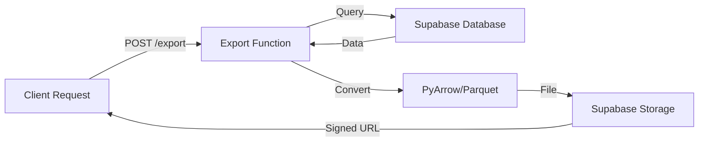

# Parquet Export Guide

This guide covers the comprehensive Parquet export functionality for Scout Analytics, enabling efficient columnar data exports for analytics and machine learning workflows.

## 🎯 Overview

The Parquet export system provides:

- **Columnar Storage**: Optimized for analytical queries
- **Compression**: Multiple compression algorithms (Snappy, GZIP, LZ4, Brotli)  
- **Partitioning**: Data partitioned by date, region, or other dimensions
- **Schema Validation**: Enforced data types and structure
- **Streaming Exports**: Handle large datasets efficiently
- **Multiple Formats**: Parquet, CSV, and JSON outputs

## 🏗️ Architecture



## 🚀 Quick Start

### 1. Deploy the Export Function

```bash
# Deploy to Supabase Edge Functions
./scripts/deploy-parquet-export.sh

# Test deployment
node scripts/test-parquet-export.js
```

### 2. Install Client Library

```typescript
// For TypeScript/JavaScript applications
import { createParquetClient, ParquetConfig } from '@shared/parquet-client';

const client = createParquetClient(
  'production',
  'your-api-key'
);
```

### 3. Request an Export

```typescript
// Export daily transactions as Parquet
const result = await client.requestExport({
  dataset: 'daily_transactions',
  format: 'parquet',
  date_range: {
    start: '2025-01-01',
    end: '2025-01-31'
  },
  compression: 'snappy',
  partition_by: 'transaction_date'
});

// Download the file
const blob = await client.downloadFile(result.signed_url);
```

## 📊 Available Datasets

### Gold Layer Datasets

| Dataset | Description | Partition Column | Schema |
|---------|-------------|------------------|--------|
| `daily_transactions` | Daily aggregated transaction data | `transaction_date` | Date, device_id, counts, revenue, payment splits |
| `store_rankings` | Store performance rankings | `region` | Store_id, region, city, revenue, rank, tier |
| `hourly_patterns` | Hourly transaction patterns | `transaction_date` | Date, hour, transactions, revenue, peaks |
| `payment_trends` | Payment method trends over time | `transaction_date` | Date, payment_method, counts, amounts |

### Platinum Layer Datasets  

| Dataset | Description | Partition Column | Schema |
|---------|-------------|------------------|--------|
| `store_features` | ML features for stores | `region` | Store_id, forecasts, churn, growth scores |
| `ml_predictions` | Model predictions | `prediction_date` | Date, store_id, predictions, confidence |

## 🔧 API Reference

### POST /export

Request a dataset export.

**Request Body:**
```json
{
  "dataset": "daily_transactions",
  "format": "parquet",
  "partition_by": "transaction_date", 
  "date_range": {
    "start": "2025-01-01",
    "end": "2025-01-31"
  },
  "compression": "snappy",
  "limit": 10000
}
```

**Response:**
```json
{
  "export_id": "123e4567-e89b-12d3-a456-426614174000",
  "file_path": "exports/daily_transactions_2025-01-31T12-00-00-000Z.parquet",
  "file_size": 2048576,
  "row_count": 50000,
  "schema": {
    "transaction_date": "date",
    "device_id": "string", 
    "total_revenue": "double"
  },
  "compression": "snappy",
  "created_at": "2025-01-31T12:00:00.000Z",
  "signed_url": "https://storage.supabase.co/..."
}
```

### GET /datasets

List available datasets and their schemas.

**Response:**
```json
{
  "datasets": [
    {
      "name": "daily_transactions",
      "table": "scout_gold.daily_transactions",
      "partition_column": "transaction_date",
      "schema": {
        "transaction_date": "date",
        "device_id": "string",
        "total_revenue": "double"
      },
      "columns": 11
    }
  ]
}
```

### GET /health

Check service health and Parquet support.

**Response:**
```json
{
  "status": "healthy",
  "parquet_support": true,
  "pyarrow_version": "14.0.1", 
  "available_datasets": 6,
  "timestamp": "2025-01-31T12:00:00.000Z"
}
```

## 💻 Client Library Usage

### Basic Usage

```typescript
import { createParquetClient, ParquetConfig } from '@shared/parquet-client';

const client = createParquetClient('production', 'your-api-key');

// List available datasets
const datasets = await client.listDatasets();
console.log('Available datasets:', datasets.map(d => d.name));

// Export daily transactions
const result = await client.exportDailyTransactions(
  { start: '2025-01-01', end: '2025-01-31' },
  'parquet'
);

console.log(`Export complete: ${result.row_count} rows, ${result.file_size} bytes`);
```

### Advanced Usage

```typescript
// Bulk export multiple datasets
const results = await client.bulkExport([
  ParquetConfig.DATASETS.DAILY_TRANSACTIONS,
  ParquetConfig.DATASETS.STORE_RANKINGS,
  ParquetConfig.DATASETS.STORE_FEATURES
], {
  date_range: ParquetConfig.DATE_RANGES.LAST_30_DAYS(),
  compression: ParquetConfig.COMPRESSION.SNAPPY
});

// Download all files
for (const result of results) {
  const blob = await client.downloadFile(result.signed_url);
  console.log(`Downloaded ${result.file_path}: ${result.file_size} bytes`);
}
```

### Error Handling

```typescript
try {
  const result = await client.requestExport({
    dataset: 'invalid_dataset',
    format: 'parquet'
  });
} catch (error) {
  if (error.message.includes('Invalid dataset')) {
    console.error('Dataset not found. Available datasets:');
    const datasets = await client.listDatasets();
    datasets.forEach(d => console.log(`  - ${d.name}`));
  } else {
    console.error('Export failed:', error.message);
  }
}
```

## 🐍 Direct API Usage

### Using cURL

```bash
# Export daily transactions
curl -X POST "https://your-project.supabase.co/functions/v1/export-parquet/export" \
  -H "Authorization: Bearer YOUR_API_KEY" \
  -H "Content-Type: application/json" \
  -d '{
    "dataset": "daily_transactions",
    "format": "parquet", 
    "date_range": {
      "start": "2025-01-01",
      "end": "2025-01-31"
    },
    "compression": "snappy"
  }'

# Download the file using signed URL from response
curl -o daily_transactions.parquet "SIGNED_URL_FROM_RESPONSE"
```

### Using Python

```python
import requests
import json

API_URL = "https://your-project.supabase.co/functions/v1/export-parquet"
API_KEY = "your-api-key"

headers = {
    "Authorization": f"Bearer {API_KEY}",
    "Content-Type": "application/json"
}

# Request export
export_request = {
    "dataset": "store_features",
    "format": "parquet",
    "compression": "snappy"
}

response = requests.post(f"{API_URL}/export", 
                        headers=headers, 
                        json=export_request)

if response.ok:
    result = response.json()
    print(f"Export ID: {result['export_id']}")
    print(f"File size: {result['file_size']} bytes")
    print(f"Rows: {result['row_count']}")
    
    # Download file
    file_response = requests.get(result['signed_url'])
    with open('store_features.parquet', 'wb') as f:
        f.write(file_response.content)
    
    print("Download complete!")
else:
    print(f"Export failed: {response.text}")
```

## 📈 Performance Optimization

### Compression Comparison

| Compression | File Size | Speed | CPU Usage | Use Case |
|-------------|-----------|-------|-----------|----------|
| **Snappy** | Medium | Fast | Low | Real-time exports |
| **GZIP** | Small | Medium | Medium | Network transfers |
| **LZ4** | Medium | Very Fast | Very Low | High-throughput |
| **Brotli** | Smallest | Slow | High | Long-term storage |

### Partitioning Strategies

```typescript
// Partition by date for time-series analysis
const result = await client.requestExport({
  dataset: 'daily_transactions',
  partition_by: 'transaction_date',
  date_range: { start: '2025-01-01', end: '2025-12-31' }
});

// Partition by region for geographic analysis  
const result = await client.requestExport({
  dataset: 'store_rankings',
  partition_by: 'region'
});
```

### Large Dataset Handling

```typescript
// Use limit for testing with large datasets
const sample = await client.requestExport({
  dataset: 'daily_transactions',
  limit: 1000,
  format: 'parquet'
});

// Estimate full export size
const estimatedSize = await client.estimateExportSize('daily_transactions');
console.log(`Estimated full export size: ${estimatedSize} bytes`);

// Export in chunks for very large datasets
const chunks = [];
const chunkSize = 50000;

for (let offset = 0; offset < totalRows; offset += chunkSize) {
  const chunk = await client.requestExport({
    dataset: 'daily_transactions',
    limit: chunkSize,
    // Note: offset not directly supported, use date ranges instead
    date_range: getDateRangeForChunk(offset, chunkSize)
  });
  chunks.push(chunk);
}
```

## 🔍 Data Analysis Examples

### Using pandas (Python)

```python
import pandas as pd
import pyarrow.parquet as pq

# Read Parquet file
df = pd.read_parquet('daily_transactions.parquet')

# Basic analysis
print(f"Dataset shape: {df.shape}")
print(f"Date range: {df['transaction_date'].min()} to {df['transaction_date'].max()}")
print(f"Total revenue: ₱{df['total_revenue'].sum():,.2f}")

# Time series analysis
daily_totals = df.groupby('transaction_date')['total_revenue'].sum()
daily_totals.plot(title='Daily Revenue Trend')

# Store performance
top_stores = df.groupby('device_id')['total_revenue'].sum().nlargest(10)
print("Top 10 stores by revenue:")
print(top_stores)
```

### Using Apache Spark (Scala)

```scala
import org.apache.spark.sql.SparkSession

val spark = SparkSession.builder()
  .appName("Scout Analytics")
  .getOrCreate()

// Read Parquet files
val transactions = spark.read.parquet("daily_transactions.parquet")
val storeFeatures = spark.read.parquet("store_features.parquet")

// Register as temp views
transactions.createOrReplaceTempView("transactions")
storeFeatures.createOrReplaceTempView("features")

// Analysis query
val result = spark.sql("""
  SELECT 
    t.device_id,
    SUM(t.total_revenue) as total_revenue,
    f.growth_potential_score,
    f.churn_probability
  FROM transactions t
  JOIN features f ON t.device_id = f.store_id
  GROUP BY t.device_id, f.growth_potential_score, f.churn_probability
  ORDER BY total_revenue DESC
  LIMIT 20
""")

result.show()
```

### Using DuckDB (SQL)

```sql
-- Install parquet extension
INSTALL parquet;
LOAD parquet;

-- Query Parquet files directly
SELECT 
  transaction_date,
  COUNT(*) as num_stores,
  SUM(total_revenue) as daily_revenue,
  AVG(avg_transaction_value) as avg_ticket_size
FROM 'daily_transactions.parquet'
WHERE transaction_date >= '2025-01-01'
GROUP BY transaction_date
ORDER BY transaction_date;

-- Join multiple Parquet files
SELECT 
  sr.region,
  sr.performance_tier,
  COUNT(*) as store_count,
  AVG(sf.growth_potential_score) as avg_growth_score
FROM 'store_rankings.parquet' sr
JOIN 'store_features.parquet' sf ON sr.store_id = sf.store_id
GROUP BY sr.region, sr.performance_tier
ORDER BY avg_growth_score DESC;
```

## 🚨 Troubleshooting

### Common Issues

#### 1. PyArrow Not Available

```bash
# Check function health
curl -H "Authorization: Bearer YOUR_API_KEY" \
  "https://your-project.supabase.co/functions/v1/export-parquet/health"

# If parquet_support is false, use alternative formats
{
  "dataset": "daily_transactions",
  "format": "csv",  // Fallback to CSV
  "compression": "gzip"
}
```

#### 2. Large Dataset Timeouts

```typescript
// Increase timeout and use limits
const client = createParquetClient('production', apiKey, 600000); // 10 minutes

const result = await client.requestExport({
  dataset: 'daily_transactions',
  limit: 100000,  // Limit rows
  date_range: {   // Use date filtering
    start: '2025-01-01',
    end: '2025-01-07'
  }
});
```

#### 3. Memory Issues

```typescript
// Use streaming approach for large exports
const dateRanges = [
  { start: '2025-01-01', end: '2025-01-07' },
  { start: '2025-01-08', end: '2025-01-14' },
  { start: '2025-01-15', end: '2025-01-21' },
  // ... more ranges
];

for (const range of dateRanges) {
  const result = await client.requestExport({
    dataset: 'daily_transactions',
    date_range: range,
    format: 'parquet'
  });
  
  console.log(`Exported ${range.start} to ${range.end}: ${result.row_count} rows`);
  await new Promise(resolve => setTimeout(resolve, 1000)); // Rate limiting
}
```

#### 4. Schema Validation Errors

```typescript
try {
  const result = await client.requestExport({
    dataset: 'daily_transactions',
    format: 'parquet'
  });
} catch (error) {
  if (error.message.includes('schema')) {
    // Check expected schema
    const datasets = await client.listDatasets();
    const dataset = datasets.find(d => d.name === 'daily_transactions');
    console.log('Expected schema:', dataset.schema);
  }
}
```

## 🔒 Security & Access Control

### API Key Management

```typescript
// Use environment-specific keys
const client = createParquetClient(
  process.env.NODE_ENV === 'production' ? 'production' : 'staging',
  process.env.SUPABASE_SERVICE_KEY
);

// Validate API key before use
try {
  await client.checkHealth();
  console.log('API key valid');
} catch (error) {
  console.error('API key invalid or service unavailable');
}
```

### Data Access Policies

The Parquet export function respects Row Level Security (RLS) policies:

```sql
-- Example RLS policy for transaction data
CREATE POLICY "Export access policy" ON scout_gold.daily_transactions
  FOR SELECT USING (
    -- Allow access to users with export permissions
    auth.jwt() ->> 'role' = 'analytics_export' OR
    auth.jwt() ->> 'role' = 'admin'
  );
```

### File Access Control

- Signed URLs expire after 1 hour
- Files stored in private Supabase Storage buckets
- Access logged for audit trails

## 📋 Deployment Checklist

- [ ] Supabase project set up
- [ ] Edge Functions deployed (`export-parquet`)
- [ ] Python/PyArrow available in function environment
- [ ] Storage bucket created (`scout-platinum`)
- [ ] RLS policies configured
- [ ] API keys generated and secured
- [ ] Client library installed and configured
- [ ] Health check passing
- [ ] Test exports completed
- [ ] Documentation updated
- [ ] Monitoring and alerts configured

## 📚 Additional Resources

- [Apache Parquet Documentation](https://parquet.apache.org/docs/)
- [PyArrow Parquet Guide](https://arrow.apache.org/docs/python/parquet.html)
- [Supabase Edge Functions](https://supabase.com/docs/guides/functions)
- [DuckDB Parquet Extension](https://duckdb.org/docs/data/parquet)

## 🔄 Migration Guide

### From CSV Exports

```typescript
// Old CSV export approach
const csvData = await fetch('/api/export-csv?dataset=transactions');

// New Parquet export approach  
const client = createParquetClient('production', apiKey);
const result = await client.exportDailyTransactions(
  { start: '2025-01-01', end: '2025-01-31' },
  'parquet'
);

// Benefits:
// - 50-80% smaller file sizes
// - 10x faster analytical queries  
// - Better compression
// - Schema validation
// - Column-based access patterns
```

### From Manual Database Queries

```typescript
// Old manual approach
const { data } = await supabase
  .from('daily_transactions')
  .select('*')
  .gte('transaction_date', '2025-01-01')
  .lte('transaction_date', '2025-01-31');

// New export approach
const result = await client.exportDailyTransactions(
  { start: '2025-01-01', end: '2025-01-31' }
);

// Benefits:
// - Handles large datasets (>100MB)
// - No query timeout issues
// - Optimized for analytics
// - Automatic compression and partitioning
// - Standardized schema
```

---

*This Parquet export system enables efficient, scalable data exports from Scout Analytics with built-in compression, partitioning, and schema validation for optimal analytical performance.*