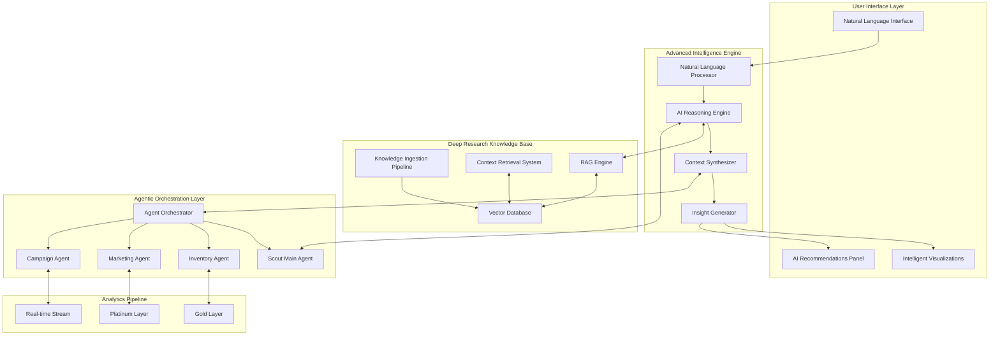

# Scout v5.2 Advanced Intelligence Engine Architecture

## Executive Summary

Scout v5.2 represents a paradigm shift in business intelligence, introducing an Advanced Intelligence Engine that combines traditional analytics with AI-powered contextual insights. This architecture integrates deep research capabilities, natural language processing, and multi-agent orchestration to deliver actionable intelligence that goes beyond conventional BI dashboards.

## Architecture Overview



## Advanced Intelligence Engine Components

### 1. AI Reasoning Engine

The AI Reasoning Engine serves as the cognitive core of Scout v5.2, processing complex business queries and generating contextual insights.

```typescript
// AI Reasoning Engine Interface
interface AIReasoningEngine {
  // Process natural language business queries
  processQuery(query: string, context: BusinessContext): Promise<ReasoningResult>;
  
  // Generate contextual insights
  generateInsights(data: AnalyticsData, knowledge: KnowledgeBase): Promise<Insight[]>;
  
  // Synthesize multi-source intelligence
  synthesizeIntelligence(sources: DataSource[]): Promise<SynthesizedIntelligence>;
  
  // Predict business outcomes
  predictOutcomes(scenario: BusinessScenario): Promise<PredictionResult>;
}

// Implementation using Supabase Edge Functions
export const aiReasoningEngine = async (req: Request) => {
  const { query, context } = await req.json();
  
  // Natural language understanding
  const intent = await parseBusinessIntent(query);
  
  // Retrieve relevant knowledge
  const knowledge = await retrieveContextualKnowledge(intent, context);
  
  // Generate reasoning chain
  const reasoning = await generateReasoningChain({
    intent,
    knowledge,
    historicalData: await fetchHistoricalPatterns(context),
    marketTrends: await fetchMarketIntelligence(context)
  });
  
  // Synthesize insights
  const insights = await synthesizeInsights(reasoning);
  
  return new Response(JSON.stringify({
    insights,
    confidence: reasoning.confidence,
    recommendations: await generateRecommendations(insights)
  }));
};
```

### 2. Deep Research Knowledge Base (RAG System)

The Deep Research Knowledge Base implements a sophisticated Retrieval-Augmented Generation (RAG) system that enriches analytics with contextual business intelligence.

```sql
-- Vector storage for knowledge embeddings
CREATE TABLE IF NOT EXISTS scout_intelligence.knowledge_embeddings (
  id UUID PRIMARY KEY DEFAULT gen_random_uuid(),
  content_type TEXT NOT NULL, -- 'market_research', 'industry_report', 'competitor_analysis'
  source_reference TEXT NOT NULL,
  content TEXT NOT NULL,
  embedding vector(1536), -- OpenAI embeddings
  metadata JSONB NOT NULL,
  relevance_score FLOAT,
  created_at TIMESTAMPTZ DEFAULT NOW(),
  updated_at TIMESTAMPTZ DEFAULT NOW()
);

-- Create vector similarity search index
CREATE INDEX idx_knowledge_embeddings ON scout_intelligence.knowledge_embeddings 
USING ivfflat (embedding vector_cosine_ops)
WITH (lists = 100);

-- Context retrieval function
CREATE OR REPLACE FUNCTION scout_intelligence.retrieve_contextual_knowledge(
  query_embedding vector(1536),
  context_filters JSONB DEFAULT '{}',
  limit_results INT DEFAULT 10
)
RETURNS TABLE (
  content TEXT,
  relevance_score FLOAT,
  metadata JSONB
) AS $$
BEGIN
  RETURN QUERY
  SELECT 
    ke.content,
    1 - (ke.embedding <=> query_embedding) AS relevance_score,
    ke.metadata
  FROM scout_intelligence.knowledge_embeddings ke
  WHERE 
    (context_filters->>'content_type' IS NULL OR 
     ke.content_type = context_filters->>'content_type')
    AND (context_filters->>'date_from' IS NULL OR 
         ke.created_at >= (context_filters->>'date_from')::DATE)
  ORDER BY ke.embedding <=> query_embedding
  LIMIT limit_results;
END;
$$ LANGUAGE plpgsql;
```

### 3. Agentic Orchestration Layer

The Agentic Orchestration Layer coordinates specialized AI agents that handle different aspects of business intelligence.

```typescript
// Agent Orchestration Framework
interface AgentOrchestrator {
  agents: Map<string, IntelligenceAgent>;
  
  // Coordinate multi-agent analysis
  orchestrateAnalysis(request: AnalysisRequest): Promise<OrchestratedInsight>;
  
  // Manage agent collaboration
  facilitateCollaboration(task: CollaborativeTask): Promise<CollaborationResult>;
}

// Scout Main Agent - Central Intelligence Coordinator
class ScoutMainAgent implements IntelligenceAgent {
  async processRequest(request: BusinessRequest): Promise<IntelligenceResponse> {
    // Analyze request complexity
    const complexity = await this.assessComplexity(request);
    
    // Delegate to specialized agents
    const delegations = await this.planDelegation(request, complexity);
    
    // Coordinate sub-agent responses
    const subResults = await Promise.all(
      delegations.map(d => this.delegateToAgent(d))
    );
    
    // Synthesize comprehensive intelligence
    return this.synthesizeIntelligence(subResults);
  }
}

// Inventory Intelligence Agent
class InventoryAgent implements IntelligenceAgent {
  async analyzeInventory(context: InventoryContext): Promise<InventoryInsights> {
    // Deep inventory analysis
    const patterns = await this.detectInventoryPatterns(context);
    const predictions = await this.predictStockMovements(patterns);
    const optimizations = await this.generateOptimizations(predictions);
    
    return {
      currentState: await this.assessCurrentInventory(),
      predictions,
      optimizations,
      riskFactors: await this.identifyRisks(patterns)
    };
  }
}

// Marketing Intelligence Agent
class MarketingAgent implements IntelligenceAgent {
  async analyzeMarketing(context: MarketingContext): Promise<MarketingInsights> {
    // Campaign performance deep dive
    const campaigns = await this.analyzeCampaignPerformance(context);
    const attribution = await this.performAttribution(campaigns);
    const predictions = await this.predictCampaignOutcomes(context);
    
    return {
      performanceMetrics: campaigns,
      attributionModel: attribution,
      predictions,
      recommendations: await this.generateMarketingRecommendations()
    };
  }
}
```

## Deep Research Layers Architecture

### 1. Knowledge Ingestion Pipeline

The Knowledge Ingestion Pipeline continuously processes diverse data sources to build a comprehensive business intelligence knowledge base.

```typescript
// Knowledge Ingestion Pipeline
export const knowledgeIngestionPipeline = async () => {
  // Multi-source data ingestion
  const sources = [
    { type: 'market_research', processor: processMarketResearch },
    { type: 'competitor_analysis', processor: processCompetitorData },
    { type: 'industry_reports', processor: processIndustryReports },
    { type: 'social_sentiment', processor: processSocialData },
    { type: 'economic_indicators', processor: processEconomicData }
  ];
  
  for (const source of sources) {
    try {
      // Fetch latest data
      const rawData = await fetchSourceData(source.type);
      
      // Process and structure
      const processed = await source.processor(rawData);
      
      // Generate embeddings
      const embeddings = await generateEmbeddings(processed);
      
      // Store in vector database
      await storeKnowledgeEmbeddings(embeddings);
      
      // Update knowledge graph
      await updateKnowledgeGraph(processed);
      
    } catch (error) {
      console.error(`Failed to process ${source.type}:`, error);
    }
  }
};

// Embedding generation with context preservation
async function generateEmbeddings(data: ProcessedKnowledge): Promise<KnowledgeEmbedding[]> {
  const embeddings: KnowledgeEmbedding[] = [];
  
  // Chunk data intelligently
  const chunks = await intelligentChunking(data, {
    preserveContext: true,
    maxTokens: 1000,
    overlapTokens: 200
  });
  
  for (const chunk of chunks) {
    const embedding = await openai.embeddings.create({
      model: "text-embedding-3-small",
      input: chunk.content
    });
    
    embeddings.push({
      content: chunk.content,
      embedding: embedding.data[0].embedding,
      metadata: {
        source: data.source,
        timestamp: data.timestamp,
        relevance_tags: chunk.tags,
        business_context: chunk.context
      }
    });
  }
  
  return embeddings;
}
```

### 2. Vector Embeddings Storage

Efficient storage and retrieval of vector embeddings for rapid contextual search.

```sql
-- Enhanced vector storage with business context
CREATE TABLE scout_intelligence.contextual_embeddings (
  id UUID PRIMARY KEY DEFAULT gen_random_uuid(),
  -- Business context
  business_unit TEXT,
  market_segment TEXT,
  time_relevance TSTZRANGE, -- Time range for which this knowledge is relevant
  
  -- Content and embeddings
  content TEXT NOT NULL,
  summary TEXT,
  embedding vector(1536) NOT NULL,
  
  -- Multi-modal support
  content_type TEXT NOT NULL CHECK (content_type IN ('text', 'image', 'audio', 'structured_data')),
  media_url TEXT,
  
  -- Metadata and scoring
  confidence_score FLOAT DEFAULT 1.0,
  usage_count INT DEFAULT 0,
  last_accessed TIMESTAMPTZ,
  
  -- Knowledge graph connections
  related_entities JSONB,
  semantic_tags TEXT[],
  
  created_at TIMESTAMPTZ DEFAULT NOW(),
  updated_at TIMESTAMPTZ DEFAULT NOW()
);

-- Composite indexes for performance
CREATE INDEX idx_embeddings_business ON scout_intelligence.contextual_embeddings(business_unit, market_segment);
CREATE INDEX idx_embeddings_temporal ON scout_intelligence.contextual_embeddings USING gist(time_relevance);
CREATE INDEX idx_embeddings_tags ON scout_intelligence.contextual_embeddings USING gin(semantic_tags);
```

### 3. Context Retrieval System

Intelligent context retrieval that considers business relevance, temporal factors, and semantic relationships.

```typescript
// Advanced Context Retrieval System
class ContextRetrievalSystem {
  async retrieveContext(query: BusinessQuery): Promise<EnrichedContext> {
    // Parse query intent and extract entities
    const queryAnalysis = await this.analyzeQuery(query);
    
    // Generate query embedding
    const queryEmbedding = await this.generateQueryEmbedding(query);
    
    // Multi-stage retrieval
    const contexts = await this.multiStageRetrieval({
      embedding: queryEmbedding,
      businessFilters: queryAnalysis.businessContext,
      temporalFilters: queryAnalysis.timeContext,
      semanticFilters: queryAnalysis.entities
    });
    
    // Re-rank based on business relevance
    const reranked = await this.reRankByRelevance(contexts, query);
    
    // Enrich with knowledge graph connections
    const enriched = await this.enrichWithKnowledgeGraph(reranked);
    
    return {
      primaryContext: enriched.slice(0, 5),
      supportingContext: enriched.slice(5, 10),
      relatedInsights: await this.findRelatedInsights(enriched)
    };
  }
  
  private async multiStageRetrieval(params: RetrievalParams): Promise<ContextResult[]> {
    // Stage 1: Vector similarity search
    const vectorResults = await this.vectorSimilaritySearch(params.embedding);
    
    // Stage 2: Business context filtering
    const businessFiltered = this.applyBusinessFilters(vectorResults, params.businessFilters);
    
    // Stage 3: Temporal relevance scoring
    const temporalScored = this.scoreTemporalRelevance(businessFiltered, params.temporalFilters);
    
    // Stage 4: Semantic expansion
    const semanticExpanded = await this.expandSemantics(temporalScored, params.semanticFilters);
    
    return semanticExpanded;
  }
}
```

### 4. Insight Generation Pipeline

The Insight Generation Pipeline transforms raw analytics and contextual knowledge into actionable business insights.

```typescript
// Insight Generation Pipeline
class InsightGenerationPipeline {
  async generateInsights(
    analyticsData: AnalyticsData,
    contextualKnowledge: ContextualKnowledge,
    businessObjectives: BusinessObjectives
  ): Promise<GeneratedInsights> {
    // Phase 1: Pattern Recognition
    const patterns = await this.recognizePatterns({
      timeSeries: analyticsData.timeSeries,
      crossDimensional: analyticsData.dimensions,
      anomalies: await this.detectAnomalies(analyticsData)
    });
    
    // Phase 2: Contextual Enhancement
    const enhancedPatterns = await this.enhanceWithContext(patterns, contextualKnowledge);
    
    // Phase 3: Insight Synthesis
    const insights = await this.synthesizeInsights({
      patterns: enhancedPatterns,
      objectives: businessObjectives,
      constraints: await this.identifyConstraints()
    });
    
    // Phase 4: Recommendation Generation
    const recommendations = await this.generateRecommendations(insights);
    
    // Phase 5: Impact Prediction
    const predictions = await this.predictImpact(recommendations);
    
    return {
      insights,
      recommendations,
      predictions,
      confidence: this.calculateConfidence(insights, contextualKnowledge)
    };
  }
  
  private async synthesizeInsights(params: SynthesisParams): Promise<Insight[]> {
    const insights: Insight[] = [];
    
    // Descriptive insights - What happened?
    insights.push(...await this.generateDescriptiveInsights(params.patterns));
    
    // Diagnostic insights - Why did it happen?
    insights.push(...await this.generateDiagnosticInsights(params.patterns));
    
    // Predictive insights - What will happen?
    insights.push(...await this.generatePredictiveInsights(params.patterns));
    
    // Prescriptive insights - What should we do?
    insights.push(...await this.generatePrescriptiveInsights({
      patterns: params.patterns,
      objectives: params.objectives,
      constraints: params.constraints
    }));
    
    return this.prioritizeInsights(insights);
  }
}
```

## Integration with Analytics Pipeline

### 1. Deep Research Enhancement of Gold/Platinum Insights

The Advanced Intelligence Engine enhances traditional analytics layers with contextual intelligence.

```sql
-- Enhanced Gold Layer with AI Insights
CREATE OR REPLACE VIEW scout_intelligence.enhanced_gold_insights AS
WITH base_metrics AS (
  SELECT * FROM gold.campaign_performance
),
ai_enrichment AS (
  SELECT 
    campaign_id,
    jsonb_build_object(
      'market_context', scout_intelligence.get_market_context(campaign_id),
      'competitor_analysis', scout_intelligence.analyze_competitor_activity(campaign_id),
      'predicted_performance', scout_intelligence.predict_campaign_performance(campaign_id),
      'optimization_opportunities', scout_intelligence.identify_optimizations(campaign_id)
    ) AS ai_insights
  FROM base_metrics
)
SELECT 
  bm.*,
  ae.ai_insights,
  scout_intelligence.generate_natural_language_summary(bm.*, ae.ai_insights) AS executive_summary
FROM base_metrics bm
JOIN ai_enrichment ae ON bm.campaign_id = ae.campaign_id;

-- Platinum Layer with Predictive Intelligence
CREATE OR REPLACE VIEW scout_intelligence.platinum_predictive_insights AS
WITH historical_patterns AS (
  SELECT * FROM platinum.business_intelligence
),
predictive_layer AS (
  SELECT 
    entity_id,
    entity_type,
    scout_intelligence.predict_future_state(
      historical_data := historical_patterns.*,
      prediction_horizon := INTERVAL '90 days',
      confidence_threshold := 0.8
    ) AS predictions
  FROM historical_patterns
)
SELECT 
  hp.*,
  pl.predictions,
  scout_intelligence.generate_scenario_analysis(hp.*, pl.predictions) AS scenarios,
  scout_intelligence.recommend_actions(hp.*, pl.predictions) AS recommended_actions
FROM historical_patterns hp
JOIN predictive_layer pl ON hp.entity_id = pl.entity_id;
```

### 2. Natural Language Query Processing

Enable business users to interact with data using natural language.

```typescript
// Natural Language Query Processor
export const processNaturalLanguageQuery = async (req: Request) => {
  const { query, context } = await req.json();
  
  try {
    // Step 1: Intent Recognition
    const intent = await recognizeQueryIntent(query);
    
    // Step 2: Entity Extraction
    const entities = await extractBusinessEntities(query);
    
    // Step 3: Query Translation
    const structuredQuery = await translateToStructuredQuery({
      intent,
      entities,
      context
    });
    
    // Step 4: Query Optimization
    const optimizedQuery = await optimizeQueryPlan(structuredQuery);
    
    // Step 5: Execute with Context
    const results = await executeWithContext(optimizedQuery, context);
    
    // Step 6: Generate Natural Language Response
    const response = await generateNaturalResponse({
      query,
      results,
      context,
      insights: await generateInsightsFromResults(results)
    });
    
    return new Response(JSON.stringify({
      success: true,
      response,
      visualizations: await suggestVisualizations(results),
      followUpQuestions: await generateFollowUpQuestions(results, context)
    }));
    
  } catch (error) {
    return handleQueryError(error, query);
  }
};

// Query Intent Recognition
async function recognizeQueryIntent(query: string): Promise<QueryIntent> {
  const intents = {
    PERFORMANCE_ANALYSIS: /analyze|performance|how.*doing/i,
    COMPARISON: /compare|versus|difference|better|worse/i,
    PREDICTION: /predict|forecast|will|future|expect/i,
    OPTIMIZATION: /optimize|improve|increase|decrease|better/i,
    ANOMALY_DETECTION: /unusual|strange|anomaly|outlier|unexpected/i,
    ROOT_CAUSE: /why|cause|reason|explain/i
  };
  
  const matchedIntents = Object.entries(intents)
    .filter(([_, pattern]) => pattern.test(query))
    .map(([intent]) => intent);
  
  return {
    primary: matchedIntents[0] || 'GENERAL_ANALYSIS',
    secondary: matchedIntents.slice(1),
    confidence: calculateIntentConfidence(query, matchedIntents)
  };
}
```

### 3. AI-Generated Recommendations

Intelligent recommendation system that considers business context, constraints, and objectives.

```typescript
// AI Recommendation Engine
class AIRecommendationEngine {
  async generateRecommendations(
    currentState: BusinessState,
    objectives: BusinessObjectives,
    constraints: BusinessConstraints
  ): Promise<Recommendations> {
    // Analyze current performance gaps
    const gaps = await this.analyzePerformanceGaps(currentState, objectives);
    
    // Generate potential actions
    const potentialActions = await this.generatePotentialActions(gaps);
    
    // Simulate outcomes
    const simulations = await this.simulateActionOutcomes(
      potentialActions,
      currentState
    );
    
    // Score and rank recommendations
    const scoredRecommendations = await this.scoreRecommendations(
      simulations,
      objectives,
      constraints
    );
    
    // Generate implementation roadmap
    const roadmap = await this.generateImplementationRoadmap(
      scoredRecommendations.top(5)
    );
    
    return {
      immediate: scoredRecommendations.filter(r => r.timeframe === 'immediate'),
      shortTerm: scoredRecommendations.filter(r => r.timeframe === 'short_term'),
      longTerm: scoredRecommendations.filter(r => r.timeframe === 'long_term'),
      roadmap,
      expectedImpact: await this.calculateExpectedImpact(scoredRecommendations)
    };
  }
  
  private async generatePotentialActions(gaps: PerformanceGaps): Promise<Action[]> {
    const actions: Action[] = [];
    
    for (const gap of gaps) {
      // Generate actions based on gap type
      switch (gap.type) {
        case 'REVENUE_SHORTFALL':
          actions.push(...await this.generateRevenueActions(gap));
          break;
        case 'EFFICIENCY_GAP':
          actions.push(...await this.generateEfficiencyActions(gap));
          break;
        case 'GROWTH_OPPORTUNITY':
          actions.push(...await this.generateGrowthActions(gap));
          break;
        case 'RISK_MITIGATION':
          actions.push(...await this.generateRiskActions(gap));
          break;
      }
    }
    
    // Apply business rules and constraints
    return this.filterActionsByConstraints(actions, constraints);
  }
}
```

### 4. Contextual Business Intelligence

Deep integration of contextual factors into business intelligence.

```typescript
// Contextual Business Intelligence System
class ContextualBISystem {
  async generateContextualIntelligence(
    request: IntelligenceRequest
  ): Promise<ContextualIntelligence> {
    // Gather multi-dimensional context
    const context = await this.gatherContext({
      temporal: await this.getTemporalContext(request),
      market: await this.getMarketContext(request),
      competitive: await this.getCompetitiveContext(request),
      operational: await this.getOperationalContext(request),
      financial: await this.getFinancialContext(request)
    });
    
    // Analyze with context
    const analysis = await this.performContextualAnalysis(request.data, context);
    
    // Generate contextual insights
    const insights = await this.generateContextualInsights(analysis);
    
    // Create adaptive visualizations
    const visualizations = await this.createAdaptiveVisualizations(
      analysis,
      insights,
      request.userProfile
    );
    
    // Generate narrative
    const narrative = await this.generateBusinessNarrative(insights, context);
    
    return {
      insights,
      visualizations,
      narrative,
      confidenceScore: this.calculateContextualConfidence(analysis, context),
      nextBestActions: await this.suggestNextActions(insights, context)
    };
  }
  
  private async getMarketContext(request: IntelligenceRequest): Promise<MarketContext> {
    // Retrieve relevant market intelligence
    const marketData = await this.retrieveMarketIntelligence({
      industry: request.industry,
      geography: request.geography,
      timeframe: request.timeframe
    });
    
    // Analyze market trends
    const trends = await this.analyzeMarketTrends(marketData);
    
    // Identify market opportunities and threats
    const swot = await this.performMarketSWOT(marketData, request.businessUnit);
    
    return {
      trends,
      swot,
      marketSize: marketData.size,
      growthRate: marketData.growthRate,
      competitiveLandscape: await this.mapCompetitiveLandscape(marketData)
    };
  }
}
```

## Implementation Details

### 1. Supabase Edge Functions for AI Processing

Leveraging Supabase Edge Functions for scalable AI processing.

```typescript
// Edge Function: AI Processing Pipeline
import { serve } from "https://deno.land/std@0.168.0/http/server.ts";
import { createClient } from "https://esm.sh/@supabase/supabase-js@2.38.0";

const corsHeaders = {
  'Access-Control-Allow-Origin': '*',
  'Access-Control-Allow-Headers': 'authorization, x-client-info, apikey, content-type',
};

serve(async (req) => {
  if (req.method === 'OPTIONS') {
    return new Response('ok', { headers: corsHeaders });
  }

  try {
    const { query, context, processingType } = await req.json();
    
    // Initialize Supabase client
    const supabaseClient = createClient(
      Deno.env.get('SUPABASE_URL') ?? '',
      Deno.env.get('SUPABASE_ANON_KEY') ?? ''
    );
    
    // Route to appropriate processor
    let result;
    switch (processingType) {
      case 'NATURAL_LANGUAGE_QUERY':
        result = await processNaturalLanguageQuery(query, context, supabaseClient);
        break;
      case 'INSIGHT_GENERATION':
        result = await generateInsights(query, context, supabaseClient);
        break;
      case 'RECOMMENDATION':
        result = await generateRecommendations(query, context, supabaseClient);
        break;
      case 'PREDICTION':
        result = await generatePredictions(query, context, supabaseClient);
        break;
      default:
        throw new Error(`Unknown processing type: ${processingType}`);
    }
    
    return new Response(
      JSON.stringify(result),
      { headers: { ...corsHeaders, 'Content-Type': 'application/json' } }
    );
    
  } catch (error) {
    return new Response(
      JSON.stringify({ error: error.message }),
      { headers: { ...corsHeaders, 'Content-Type': 'application/json' }, status: 400 }
    );
  }
});

// Natural Language Query Processing
async function processNaturalLanguageQuery(
  query: string,
  context: QueryContext,
  supabase: SupabaseClient
): Promise<QueryResult> {
  // Parse query using OpenAI
  const parsing = await parseQueryWithLLM(query);
  
  // Retrieve relevant context
  const contextData = await retrieveContext(parsing.entities, supabase);
  
  // Generate SQL or analytical query
  const analyticalQuery = await generateAnalyticalQuery(parsing, contextData);
  
  // Execute query
  const results = await executeAnalyticalQuery(analyticalQuery, supabase);
  
  // Generate natural language response
  const response = await generateNaturalResponse(results, query);
  
  return {
    response,
    data: results,
    visualizations: suggestVisualizations(results),
    confidence: calculateConfidence(parsing, results)
  };
}
```

### 2. Vector Database Integration

Implementing vector search capabilities for contextual retrieval.

```sql
-- Enable pgvector extension
CREATE EXTENSION IF NOT EXISTS vector;

-- Vector operations for similarity search
CREATE OR REPLACE FUNCTION scout_intelligence.vector_similarity_search(
  query_vector vector(1536),
  search_params JSONB DEFAULT '{}'
) RETURNS TABLE (
  id UUID,
  content TEXT,
  similarity FLOAT,
  metadata JSONB
) AS $$
DECLARE
  limit_count INT := COALESCE((search_params->>'limit')::INT, 10);
  similarity_threshold FLOAT := COALESCE((search_params->>'threshold')::FLOAT, 0.7);
BEGIN
  RETURN QUERY
  WITH ranked_results AS (
    SELECT 
      ke.id,
      ke.content,
      1 - (ke.embedding <=> query_vector) AS similarity,
      ke.metadata,
      ROW_NUMBER() OVER (PARTITION BY ke.content_type ORDER BY ke.embedding <=> query_vector) AS rn
    FROM scout_intelligence.knowledge_embeddings ke
    WHERE 1 - (ke.embedding <=> query_vector) > similarity_threshold
  )
  SELECT 
    rr.id,
    rr.content,
    rr.similarity,
    rr.metadata
  FROM ranked_results rr
  WHERE rr.rn <= 3  -- Diversify results
  ORDER BY rr.similarity DESC
  LIMIT limit_count;
END;
$$ LANGUAGE plpgsql;

-- Hybrid search combining vector and keyword search
CREATE OR REPLACE FUNCTION scout_intelligence.hybrid_search(
  query_text TEXT,
  query_vector vector(1536),
  search_params JSONB DEFAULT '{}'
) RETURNS TABLE (
  id UUID,
  content TEXT,
  combined_score FLOAT,
  metadata JSONB
) AS $$
BEGIN
  RETURN QUERY
  WITH vector_results AS (
    SELECT * FROM scout_intelligence.vector_similarity_search(query_vector, search_params)
  ),
  keyword_results AS (
    SELECT 
      ke.id,
      ke.content,
      ts_rank(to_tsvector('english', ke.content), plainto_tsquery('english', query_text)) AS keyword_score,
      ke.metadata
    FROM scout_intelligence.knowledge_embeddings ke
    WHERE to_tsvector('english', ke.content) @@ plainto_tsquery('english', query_text)
  )
  SELECT 
    COALESCE(vr.id, kr.id) AS id,
    COALESCE(vr.content, kr.content) AS content,
    COALESCE(vr.similarity, 0) * 0.7 + COALESCE(kr.keyword_score, 0) * 0.3 AS combined_score,
    COALESCE(vr.metadata, kr.metadata) AS metadata
  FROM vector_results vr
  FULL OUTER JOIN keyword_results kr ON vr.id = kr.id
  ORDER BY combined_score DESC
  LIMIT (search_params->>'limit')::INT;
END;
$$ LANGUAGE plpgsql;
```

### 3. Real-time Insight Generation

Real-time processing pipeline for continuous insight generation.

```typescript
// Real-time Insight Generation Service
class RealTimeInsightService {
  private insightStream: ReadableStream<Insight>;
  private processingQueue: Queue<AnalyticsEvent>;
  
  async initializeStream(): Promise<void> {
    // Subscribe to real-time analytics events
    const subscription = supabase
      .channel('analytics-events')
      .on('postgres_changes', 
        { 
          event: '*', 
          schema: 'analytics', 
          table: 'events' 
        }, 
        (payload) => this.handleAnalyticsEvent(payload)
      )
      .subscribe();
    
    // Initialize processing pipeline
    this.startProcessingPipeline();
  }
  
  private async handleAnalyticsEvent(event: AnalyticsEvent): Promise<void> {
    // Add to processing queue
    await this.processingQueue.enqueue(event);
    
    // Check for immediate insights
    const immediateInsights = await this.checkImmediateInsights(event);
    if (immediateInsights.length > 0) {
      await this.broadcastInsights(immediateInsights);
    }
  }
  
  private async startProcessingPipeline(): Promise<void> {
    while (true) {
      const batch = await this.processingQueue.dequeueBatch(100);
      
      if (batch.length > 0) {
        // Process batch for patterns
        const patterns = await this.detectPatterns(batch);
        
        // Generate insights from patterns
        const insights = await this.generateInsightsFromPatterns(patterns);
        
        // Enrich with context
        const enrichedInsights = await this.enrichInsights(insights);
        
        // Broadcast to subscribers
        await this.broadcastInsights(enrichedInsights);
      }
      
      // Brief pause to prevent CPU overload
      await new Promise(resolve => setTimeout(resolve, 100));
    }
  }
  
  private async detectPatterns(events: AnalyticsEvent[]): Promise<Pattern[]> {
    const patterns: Pattern[] = [];
    
    // Anomaly detection
    patterns.push(...await this.detectAnomalies(events));
    
    // Trend identification
    patterns.push(...await this.identifyTrends(events));
    
    // Correlation analysis
    patterns.push(...await this.analyzeCorrelations(events));
    
    // Seasonality detection
    patterns.push(...await this.detectSeasonality(events));
    
    return patterns;
  }
}
```

### 4. Multi-modal Knowledge Processing

Support for processing various data formats including text, images, and structured data.

```typescript
// Multi-modal Knowledge Processor
class MultiModalKnowledgeProcessor {
  async processKnowledge(input: MultiModalInput): Promise<ProcessedKnowledge> {
    switch (input.type) {
      case 'TEXT':
        return this.processText(input);
      case 'IMAGE':
        return this.processImage(input);
      case 'STRUCTURED_DATA':
        return this.processStructuredData(input);
      case 'AUDIO':
        return this.processAudio(input);
      default:
        throw new Error(`Unsupported input type: ${input.type}`);
    }
  }
  
  private async processText(input: TextInput): Promise<ProcessedKnowledge> {
    // Extract key information
    const extraction = await this.extractKeyInformation(input.content);
    
    // Generate embeddings
    const embeddings = await this.generateTextEmbeddings(input.content);
    
    // Identify entities and relationships
    const entities = await this.extractEntities(input.content);
    const relationships = await this.extractRelationships(entities);
    
    return {
      type: 'TEXT',
      content: input.content,
      summary: extraction.summary,
      embeddings,
      entities,
      relationships,
      metadata: {
        source: input.source,
        timestamp: new Date().toISOString(),
        confidence: extraction.confidence
      }
    };
  }
  
  private async processImage(input: ImageInput): Promise<ProcessedKnowledge> {
    // Image analysis using vision API
    const analysis = await this.analyzeImage(input.imageUrl);
    
    // Extract visual features
    const features = await this.extractVisualFeatures(input.imageUrl);
    
    // Generate description
    const description = await this.generateImageDescription(analysis, features);
    
    // Create embeddings from description
    const embeddings = await this.generateTextEmbeddings(description);
    
    return {
      type: 'IMAGE',
      content: description,
      visualFeatures: features,
      embeddings,
      entities: analysis.objects,
      metadata: {
        source: input.source,
        imageUrl: input.imageUrl,
        timestamp: new Date().toISOString(),
        confidence: analysis.confidence
      }
    };
  }
  
  private async processStructuredData(input: StructuredDataInput): Promise<ProcessedKnowledge> {
    // Parse structured data
    const parsed = await this.parseStructuredData(input.data);
    
    // Generate summary
    const summary = await this.summarizeStructuredData(parsed);
    
    // Extract patterns
    const patterns = await this.extractDataPatterns(parsed);
    
    // Generate embeddings
    const embeddings = await this.generateTextEmbeddings(summary);
    
    return {
      type: 'STRUCTURED_DATA',
      content: summary,
      structuredData: parsed,
      patterns,
      embeddings,
      metadata: {
        source: input.source,
        schema: input.schema,
        timestamp: new Date().toISOString(),
        recordCount: parsed.length
      }
    };
  }
}
```

## System Integration Architecture

### 1. API Gateway for Intelligence Services

```typescript
// Intelligence API Gateway
export const intelligenceAPIGateway = async (req: Request) => {
  const { endpoint, params, auth } = await parseRequest(req);
  
  // Validate authentication
  const user = await validateAuth(auth);
  if (!user) {
    return unauthorizedResponse();
  }
  
  // Route to appropriate service
  switch (endpoint) {
    case '/intelligence/query':
      return handleNaturalLanguageQuery(params, user);
      
    case '/intelligence/insights':
      return generateContextualInsights(params, user);
      
    case '/intelligence/recommendations':
      return generateRecommendations(params, user);
      
    case '/intelligence/predict':
      return generatePredictions(params, user);
      
    case '/intelligence/analyze':
      return performDeepAnalysis(params, user);
      
    default:
      return notFoundResponse();
  }
};
```

### 2. WebSocket Support for Real-time Intelligence

```typescript
// Real-time Intelligence WebSocket Handler
export const realtimeIntelligenceHandler = {
  async onConnect(ws: WebSocket, request: Request) {
    const user = await authenticateWebSocket(request);
    if (!user) {
      ws.close(1008, 'Unauthorized');
      return;
    }
    
    // Subscribe to user's intelligence feeds
    const subscriptions = await setupIntelligenceSubscriptions(user);
    
    // Start streaming insights
    streamInsights(ws, subscriptions);
  },
  
  async onMessage(ws: WebSocket, message: string) {
    const { type, params } = JSON.parse(message);
    
    switch (type) {
      case 'QUERY':
        const result = await processRealtimeQuery(params);
        ws.send(JSON.stringify({ type: 'QUERY_RESULT', data: result }));
        break;
        
      case 'SUBSCRIBE':
        await addSubscription(ws, params);
        break;
        
      case 'UNSUBSCRIBE':
        await removeSubscription(ws, params);
        break;
    }
  }
};
```

## Performance and Scalability

### 1. Caching Strategy

```typescript
// Intelligent Caching System
class IntelligenceCacheManager {
  private cacheStore: Map<string, CachedResult>;
  private embeddingCache: LRUCache<string, number[]>;
  
  async getCachedResult(query: string, context: QueryContext): Promise<CachedResult | null> {
    const cacheKey = this.generateCacheKey(query, context);
    const cached = this.cacheStore.get(cacheKey);
    
    if (cached && !this.isExpired(cached)) {
      // Update cache hit metrics
      await this.updateCacheMetrics('hit', cacheKey);
      return cached;
    }
    
    return null;
  }
  
  async cacheResult(query: string, context: QueryContext, result: any): Promise<void> {
    const cacheKey = this.generateCacheKey(query, context);
    
    this.cacheStore.set(cacheKey, {
      result,
      timestamp: Date.now(),
      ttl: this.calculateTTL(query, context),
      hitCount: 0
    });
    
    // Update cache metrics
    await this.updateCacheMetrics('set', cacheKey);
  }
  
  private calculateTTL(query: string, context: QueryContext): number {
    // Dynamic TTL based on query type and data volatility
    if (query.includes('real-time') || query.includes('current')) {
      return 60 * 1000; // 1 minute for real-time queries
    } else if (query.includes('historical') || query.includes('trend')) {
      return 3600 * 1000; // 1 hour for historical analysis
    } else {
      return 300 * 1000; // 5 minutes default
    }
  }
}
```

### 2. Load Balancing and Scaling

```yaml
# Kubernetes deployment for Scout Intelligence Engine
apiVersion: apps/v1
kind: Deployment
metadata:
  name: scout-intelligence-engine
spec:
  replicas: 3
  selector:
    matchLabels:
      app: scout-intelligence
  template:
    metadata:
      labels:
        app: scout-intelligence
    spec:
      containers:
      - name: intelligence-engine
        image: scout-intelligence:v5.2
        resources:
          requests:
            memory: "4Gi"
            cpu: "2"
          limits:
            memory: "8Gi"
            cpu: "4"
        env:
        - name: SUPABASE_URL
          valueFrom:
            secretKeyRef:
              name: supabase-config
              key: url
        - name: OPENAI_API_KEY
          valueFrom:
            secretKeyRef:
              name: ai-config
              key: openai-key
---
apiVersion: v1
kind: Service
metadata:
  name: scout-intelligence-service
spec:
  selector:
    app: scout-intelligence
  ports:
  - port: 80
    targetPort: 8080
  type: LoadBalancer
```

## Security and Compliance

### 1. Data Privacy and Security

```typescript
// Security Layer for Intelligence Engine
class IntelligenceSecurityLayer {
  async processSecurely(request: IntelligenceRequest): Promise<SecureResponse> {
    // Validate and sanitize input
    const sanitized = await this.sanitizeInput(request);
    
    // Check permissions
    const permissions = await this.checkPermissions(request.user, request.scope);
    if (!permissions.allowed) {
      throw new SecurityError('Insufficient permissions');
    }
    
    // Apply data masking rules
    const maskedData = await this.applyDataMasking(request.data, permissions.level);
    
    // Process with security context
    const result = await this.processWithSecurityContext(maskedData, permissions);
    
    // Audit log
    await this.auditLog({
      user: request.user,
      action: request.type,
      timestamp: new Date(),
      dataAccessed: this.summarizeDataAccess(request)
    });
    
    return result;
  }
  
  private async applyDataMasking(data: any, securityLevel: SecurityLevel): Promise<any> {
    const maskingRules = await this.getMaskingRules(securityLevel);
    
    return this.recursivelyMaskData(data, maskingRules);
  }
}
```

### 2. Compliance and Governance

```sql
-- Compliance tracking for AI operations
CREATE TABLE scout_intelligence.ai_governance_log (
  id UUID PRIMARY KEY DEFAULT gen_random_uuid(),
  operation_type TEXT NOT NULL,
  user_id UUID NOT NULL,
  request_data JSONB,
  response_summary JSONB,
  data_sources_accessed TEXT[],
  compliance_checks JSONB,
  created_at TIMESTAMPTZ DEFAULT NOW()
);

-- Data lineage tracking
CREATE TABLE scout_intelligence.data_lineage (
  id UUID PRIMARY KEY DEFAULT gen_random_uuid(),
  insight_id UUID NOT NULL,
  source_data JSONB NOT NULL,
  transformations JSONB NOT NULL,
  confidence_score FLOAT,
  created_at TIMESTAMPTZ DEFAULT NOW()
);
```

## Monitoring and Observability

### 1. Intelligence Engine Metrics

```typescript
// Metrics Collection for Intelligence Engine
class IntelligenceMetricsCollector {
  async collectMetrics(): Promise<IntelligenceMetrics> {
    return {
      queryProcessing: {
        totalQueries: await this.getTotalQueries(),
        averageResponseTime: await this.getAverageResponseTime(),
        successRate: await this.getSuccessRate(),
        naturalLanguageAccuracy: await this.getNLPAccuracy()
      },
      insightGeneration: {
        insightsGenerated: await this.getInsightsCount(),
        insightQualityScore: await this.getInsightQuality(),
        userEngagement: await this.getUserEngagement()
      },
      knowledgeBase: {
        totalDocuments: await this.getDocumentCount(),
        embeddingCoverage: await this.getEmbeddingCoverage(),
        knowledgeFreshness: await this.getKnowledgeFreshness()
      },
      performance: {
        cpuUsage: await this.getCPUUsage(),
        memoryUsage: await this.getMemoryUsage(),
        cacheHitRate: await this.getCacheHitRate()
      }
    };
  }
}
```

### 2. Debugging and Troubleshooting

```typescript
// Intelligence Engine Debugger
class IntelligenceDebugger {
  async debugQuery(query: string, options: DebugOptions): Promise<DebugResult> {
    const trace: DebugTrace[] = [];
    
    // Trace query parsing
    trace.push(await this.traceQueryParsing(query));
    
    // Trace context retrieval
    trace.push(await this.traceContextRetrieval(query));
    
    // Trace insight generation
    trace.push(await this.traceInsightGeneration(query));
    
    // Analyze performance bottlenecks
    const bottlenecks = await this.identifyBottlenecks(trace);
    
    return {
      trace,
      bottlenecks,
      recommendations: await this.generateDebugRecommendations(trace, bottlenecks)
    };
  }
}
```

## Future Enhancements

### 1. Advanced AI Capabilities
- Multi-language support for global operations
- Voice-based query interface
- Augmented reality data visualization
- Quantum computing integration for complex optimizations

### 2. Enhanced Knowledge Processing
- Real-time knowledge graph updates
- Automated knowledge quality assessment
- Cross-industry intelligence sharing (with privacy preservation)
- Federated learning for distributed insights

### 3. Improved User Experience
- Personalized insight delivery
- Proactive anomaly alerts
- Collaborative intelligence workspaces
- Mobile-first intelligence applications

## Conclusion

The Scout v5.2 Advanced Intelligence Engine represents a significant leap forward in business intelligence capabilities. By combining traditional analytics with AI-powered contextual insights, natural language processing, and multi-agent orchestration, Scout v5.2 delivers unprecedented value to business users.

The deep integration of research layers, sophisticated knowledge management, and real-time processing capabilities ensures that businesses can make informed decisions based on comprehensive, contextual intelligence rather than isolated data points.

This architecture is designed to scale with business needs while maintaining security, compliance, and performance standards required for enterprise deployments.