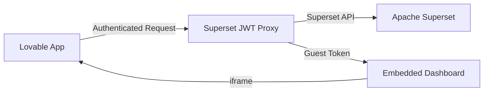

# Superset ↔ Lovable Integration Guide

This guide covers the complete integration between Apache Superset dashboards and the Lovable React application through a secure JWT proxy.

## 🏗️ Architecture



## 🚀 Quick Start

### 1. Deploy the JWT Proxy

```bash
# Deploy the Edge Function
supabase functions deploy superset-jwt-proxy

# Set environment variables
supabase secrets set SUPERSET_URL=http://your-superset-instance:8088
supabase secrets set SUPERSET_USERNAME=admin
supabase secrets set SUPERSET_PASSWORD=your-admin-password
supabase secrets set SUPERSET_JWT_SECRET=your-jwt-secret
supabase secrets set LOVABLE_APP_URL=https://your-app.lovable.app
supabase secrets set LOVABLE_JWT_SECRET=your-lovable-secret
```

### 2. Install in Lovable App

```bash
# Install dependencies
npm install @supabase/supabase-js jsonwebtoken

# Copy the SupersetClient
cp packages/shared-types/superset-client.ts src/lib/
```

### 3. Configure Lovable Environment

```env
VITE_SUPERSET_PROXY_URL=https://cxzllzyxwpyptfretryc.supabase.co/functions/v1/superset-jwt-proxy
VITE_LOVABLE_JWT_SECRET=your-lovable-secret
```

## 📊 Usage in Lovable App

### Basic Setup

```tsx
// src/lib/superset.ts
import { createSupersetClient, SupersetConfig } from './superset-client';
import jwt from 'jsonwebtoken';

// Generate Lovable JWT token
const generateLovableToken = (): string => {
  return jwt.sign(
    { 
      iss: 'lovable-app',
      sub: 'user123',
      exp: Math.floor(Date.now() / 1000) + (60 * 60), // 1 hour
    },
    import.meta.env.VITE_LOVABLE_JWT_SECRET
  );
};

export const supersetClient = createSupersetClient(
  'production',
  generateLovableToken(),
  SupersetConfig.FILTERS.LAST_7_DAYS
);
```

### React Hook Implementation

```tsx
// src/hooks/useSuperset.ts
import { useState, useEffect } from 'react';
import { supersetClient } from '../lib/superset';
import { SupersetDashboard, SupersetFilter, EmbedDashboardResponse } from '../lib/superset-client';

export const useSuperset = (initialDashboardId?: string) => {
  const [dashboards, setDashboards] = useState<SupersetDashboard[] | null>(null);
  const [loading, setLoading] = useState(false);
  const [error, setError] = useState<string | null>(null);

  const fetchDashboards = async () => {
    try {
      setLoading(true);
      setError(null);
      const dashboardList = await supersetClient.listDashboards();
      setDashboards(dashboardList);
    } catch (err) {
      setError(err.message);
    } finally {
      setLoading(false);
    }
  };

  const embedDashboard = async (
    dashboardId: string, 
    filters: SupersetFilter = {}
  ): Promise<EmbedDashboardResponse> => {
    try {
      return await supersetClient.getEmbeddedDashboard(dashboardId, filters);
    } catch (err) {
      setError(err.message);
      throw err;
    }
  };

  useEffect(() => {
    fetchDashboards();
  }, []);

  return {
    client: supersetClient,
    dashboards,
    loading,
    error,
    embedDashboard,
    refetch: fetchDashboards,
  };
};
```

### Dashboard Component

```tsx
// src/components/SupersetDashboard.tsx
import React, { useState, useEffect } from 'react';
import { useSuperset } from '../hooks/useSuperset';

interface SupersetDashboardProps {
  dashboardId: string;
  filters?: Record<string, any>;
  height?: number;
}

export const SupersetDashboard: React.FC<SupersetDashboardProps> = ({
  dashboardId,
  filters = {},
  height = 600,
}) => {
  const { embedDashboard } = useSuperset();
  const [embedUrl, setEmbedUrl] = useState<string | null>(null);
  const [loading, setLoading] = useState(true);
  const [error, setError] = useState<string | null>(null);

  useEffect(() => {
    const loadDashboard = async () => {
      try {
        setLoading(true);
        setError(null);
        
        const embedData = await embedDashboard(dashboardId, filters);
        setEmbedUrl(embedData.embed_url);
      } catch (err) {
        setError(err.message);
      } finally {
        setLoading(false);
      }
    };

    loadDashboard();
  }, [dashboardId, JSON.stringify(filters)]);

  if (loading) {
    return (
      <div className="flex items-center justify-center h-64">
        <div className="animate-spin rounded-full h-8 w-8 border-b-2 border-blue-600"></div>
      </div>
    );
  }

  if (error) {
    return (
      <div className="bg-red-50 border border-red-200 rounded-lg p-4">
        <h3 className="text-red-800 font-medium">Error Loading Dashboard</h3>
        <p className="text-red-600 text-sm mt-1">{error}</p>
      </div>
    );
  }

  if (!embedUrl) {
    return (
      <div className="bg-gray-50 border border-gray-200 rounded-lg p-4">
        <p className="text-gray-600">Dashboard not available</p>
      </div>
    );
  }

  return (
    <div className="w-full border rounded-lg overflow-hidden">
      <iframe
        src={embedUrl}
        width="100%"
        height={height}
        frameBorder="0"
        allowFullScreen
        className="w-full"
        title={`Superset Dashboard ${dashboardId}`}
      />
    </div>
  );
};
```

### Dashboard Selector Component

```tsx
// src/components/DashboardSelector.tsx
import React from 'react';
import { useSuperset } from '../hooks/useSuperset';
import { SupersetDashboard } from './SupersetDashboard';

export const DashboardSelector: React.FC = () => {
  const { dashboards, loading, error } = useSuperset();
  const [selectedDashboard, setSelectedDashboard] = useState<string | null>(null);

  if (loading) return <div>Loading dashboards...</div>;
  if (error) return <div>Error: {error}</div>;
  if (!dashboards) return <div>No dashboards available</div>;

  return (
    <div className="space-y-4">
      <div>
        <label className="block text-sm font-medium text-gray-700 mb-2">
          Select Dashboard
        </label>
        <select
          className="w-full p-2 border border-gray-300 rounded-lg"
          onChange={(e) => setSelectedDashboard(e.target.value)}
          value={selectedDashboard || ''}
        >
          <option value="">Choose a dashboard...</option>
          {dashboards.map((dashboard) => (
            <option key={dashboard.id} value={dashboard.id.toString()}>
              {dashboard.dashboard_title}
            </option>
          ))}
        </select>
      </div>

      {selectedDashboard && (
        <SupersetDashboard
          dashboardId={selectedDashboard}
          filters={{ date_range: '7 days ago : now' }}
          height={700}
        />
      )}
    </div>
  );
};
```

## 🔧 Configuration Options

### Environment Variables

```bash
# Superset Configuration
SUPERSET_URL=http://superset:8088
SUPERSET_USERNAME=admin
SUPERSET_PASSWORD=your-password
SUPERSET_JWT_SECRET=your-jwt-secret
SUPERSET_DB_ID=1

# Lovable Integration
LOVABLE_APP_URL=https://your-app.lovable.app
LOVABLE_JWT_SECRET=shared-secret-with-lovable

# CORS Settings
ALLOWED_ORIGINS=https://*.lovable.app,http://localhost:3000
```

### Dashboard IDs

Common Scout Analytics dashboard IDs:

```typescript
const DASHBOARD_IDS = {
  SCOUT_OVERVIEW: 'scout-overview',
  REVENUE_ANALYTICS: 'revenue-analytics', 
  STORE_PERFORMANCE: 'store-performance',
  ML_PREDICTIONS: 'ml-predictions',
  DAILY_SUMMARY: 'daily-summary',
};
```

### Filters

Common filter patterns:

```typescript
const COMMON_FILTERS = {
  // Time-based
  LAST_7_DAYS: { date_range: '7 days ago : now' },
  LAST_30_DAYS: { date_range: '30 days ago : now' },
  THIS_MONTH: { date_range: 'this month' },
  
  // Store-based
  TOP_STORES: { store_tier: 'Top 10' },
  REGION_METRO: { region: 'Metro Manila' },
  
  // Performance-based
  HIGH_REVENUE: { revenue_threshold: 100000 },
};
```

## 🔒 Security Features

### JWT Authentication

- Lovable app generates signed JWT tokens
- Tokens include expiry and issuer validation
- Proxy validates tokens before Superset access

### Guest Token System

- Short-lived guest tokens for dashboard embedding
- Resource-specific access (dashboard-level)
- Automatic expiry (1 hour default)

### CORS Protection

- Restricted to Lovable app domains
- Origin validation on all requests
- Prevents unauthorized embedding

## 🚨 Troubleshooting

### Common Issues

1. **CORS Errors**
   ```bash
   # Check LOVABLE_APP_URL is correct
   supabase secrets list | grep LOVABLE_APP_URL
   ```

2. **Authentication Failures**
   ```bash
   # Verify JWT secret matches
   supabase secrets list | grep JWT_SECRET
   ```

3. **Superset Connection Issues**
   ```bash
   # Test Superset connectivity
   curl -X POST http://your-superset:8088/api/v1/security/login \
     -H "Content-Type: application/json" \
     -d '{"username":"admin","password":"admin","provider":"db"}'
   ```

### Debug Mode

Enable debug logging:

```typescript
// In Lovable app
const debugClient = createSupersetClient('development', token);
```

### Health Check

```bash
# Check proxy health
curl https://cxzllzyxwpyptfretryc.supabase.co/functions/v1/superset-jwt-proxy/health
```

## 📚 API Reference

### Endpoints

- `GET /embed-dashboard?dashboard_id={id}&filter_{name}={value}` - Get embedded dashboard URL
- `GET /dashboards` - List all dashboards  
- `GET /dashboard/{id}` - Get dashboard metadata
- `GET /api/*` - Proxy Superset API calls
- `GET /health` - Health check

### Response Types

```typescript
interface EmbedDashboardResponse {
  embed_url: string;
  expires_in: number;
  dashboard_id: string;
  filters: Record<string, any>;
}

interface SupersetDashboard {
  id: number;
  dashboard_title: string;
  url: string;
  owners: Array<{id: number, username: string}>;
  created_on: string;
  changed_on: string;
}
```

## 🔄 Deployment Checklist

- [ ] Superset instance running and accessible
- [ ] JWT proxy deployed to Supabase Edge Functions
- [ ] Environment variables configured
- [ ] CORS settings updated
- [ ] Lovable app configured with client library
- [ ] Dashboard IDs documented
- [ ] Filter presets defined
- [ ] Error handling implemented
- [ ] Health checks passing

## 📈 Monitoring

Monitor proxy usage:

```sql
-- Supabase Edge Functions logs
SELECT * FROM edge_logs 
WHERE function_name = 'superset-jwt-proxy'
ORDER BY timestamp DESC;
```

Track dashboard usage in Lovable app:

```typescript
// Analytics tracking
const trackDashboardView = (dashboardId: string) => {
  analytics.track('Dashboard Viewed', {
    dashboard_id: dashboardId,
    timestamp: new Date(),
  });
};
```