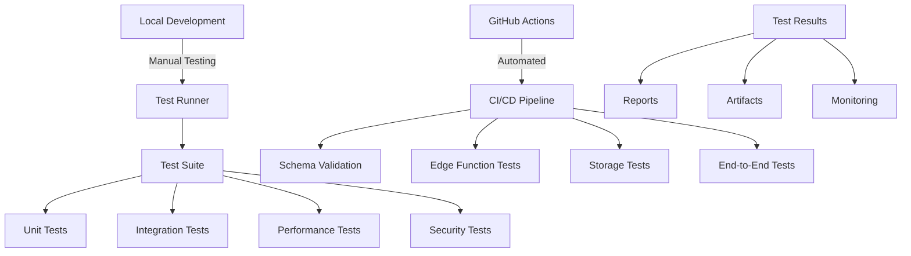

# Testing Guide - Dataset Publisher

This guide covers the comprehensive testing strategy for the Scout Analytics Dataset Publisher, including automated tests, continuous integration, and quality assurance processes.

## 🎯 Overview

The testing framework provides:

- **Automated Test Suite**: Comprehensive tests for all system components
- **CI/CD Integration**: GitHub Actions workflows for continuous testing
- **Performance Monitoring**: Load testing and performance benchmarks
- **Security Validation**: Vulnerability scanning and access control tests
- **Data Quality Assurance**: Schema validation and data integrity checks

## 🏗️ Testing Architecture



## 🚀 Quick Start

### 1. Local Testing

```bash
# Install dependencies
npm install

# Set environment variables
export SUPABASE_URL=https://your-project.supabase.co
export SUPABASE_SERVICE_KEY=your-service-role-key

# Run all tests
./scripts/run-tests.sh

# Run specific test suite
./scripts/run-tests.sh --suite schema
./scripts/run-tests.sh --suite performance --verbose
```

### 2. Automated Testing (CI/CD)

Tests run automatically on:
- Push to `main` or `develop` branches
- Pull requests
- Daily schedule (6 AM UTC)
- Manual trigger via GitHub Actions

## 📊 Test Suites

### Unit Tests

**Focus**: Individual components and functions
**Location**: `tests/dataset-publisher.test.js`
**Duration**: ~2-5 minutes

```bash
# Run unit tests
./scripts/run-tests.sh --suite schema
```

**Coverage**:
- Database schema validation
- Data type checking
- View/table existence
- Column structure verification

### Integration Tests

**Focus**: Component interactions and data flow
**Duration**: ~5-10 minutes

```bash
# Run integration tests
./scripts/run-tests.sh --suite ingestion
```

**Coverage**:
- Bronze → Silver → Gold → Platinum pipeline
- ETL transformations
- Data quality validation
- Cross-layer relationships

### Performance Tests

**Focus**: System performance under load
**Duration**: ~10-15 minutes

```bash
# Run performance tests
./scripts/run-tests.sh --suite performance
```

**Coverage**:
- Large batch insertions (1000+ records)
- Concurrent operations
- Query response times
- Memory usage patterns

### Security Tests

**Focus**: Access control and vulnerability assessment
**Duration**: ~3-5 minutes

```bash
# Run security tests
./scripts/run-tests.sh --suite security
```

**Coverage**:
- Row Level Security (RLS) policies
- API key validation
- Storage bucket permissions
- Data access patterns

### End-to-End Tests

**Focus**: Complete user workflows
**Duration**: ~10-20 minutes

**Coverage**:
- File upload → Processing → Export
- Dashboard data updates
- External API integrations
- Multi-user scenarios

## 🧪 Test Framework

### Core Test Structure

```javascript
const testRunner = new TestRunner();

// Setup
testRunner.setSetup(async () => {
  // Initialize test environment
  // Create test schemas
  // Prepare test data
});

// Individual test
testRunner.addTest('Test name', async () => {
  // Test implementation
  const result = await someOperation();
  if (!result.success) {
    throw new Error('Test failed');
  }
}, { timeout: 30000, retries: 2 });

// Teardown
testRunner.setTeardown(async () => {
  // Clean up test data
  // Remove temporary files
});

// Run
await testRunner.run();
```

### Test Utilities

```javascript
// Generate test data
const testData = TestUtils.generateTestData('transactions', 100);

// Execute SQL
const result = await TestUtils.executeSQL('SELECT COUNT(*) FROM table');

// Make Supabase requests
const response = await TestUtils.supabaseRequest('/rest/v1/table');

// Logging with colors
TestUtils.log('Test passed', 'success');
TestUtils.log('Test failed', 'error');
```

## 🔧 Configuration

### Environment Variables

```bash
# Required
SUPABASE_URL=https://your-project.supabase.co
SUPABASE_SERVICE_KEY=your-service-role-key

# Optional
TEST_TIMEOUT=60000           # Test timeout in milliseconds
TEST_RETRIES=3              # Number of retry attempts
TEST_VERBOSE=true           # Verbose output
TEST_CLEANUP=true           # Cleanup after tests
```

### Test Configuration

```javascript
const TEST_CONFIG = {
  supabaseUrl: process.env.SUPABASE_URL,
  serviceKey: process.env.SUPABASE_SERVICE_KEY,
  testDataDir: './test-data',
  tempDir: './test-temp',
  timeout: 60000,
  retryAttempts: 3,
};
```

## 📈 Performance Benchmarks

### Expected Performance Metrics

| Operation | Metric | Threshold | Notes |
|-----------|---------|-----------|-------|
| Single Insert | Response Time | <100ms | Individual record insertion |
| Batch Insert (1000) | Throughput | >10 records/sec | Large batch operations |
| Query Response | Response Time | <1s | Complex aggregation queries |
| File Upload | Throughput | >1MB/s | Storage bucket uploads |
| ETL Processing | Latency | <5min | Bronze→Gold transformation |

### Performance Test Examples

```javascript
// Throughput test
testRunner.addTest('Large batch insertion performance', async () => {
  const dataset = TestUtils.generateTestData('edge_events', 1000);
  const startTime = Date.now();
  
  await TestUtils.supabaseRequest('/rest/v1/bronze_edge_raw', {
    method: 'POST',
    body: JSON.stringify(dataset)
  });

  const duration = Date.now() - startTime;
  const recordsPerSecond = 1000 / (duration / 1000);

  if (recordsPerSecond < 10) {
    throw new Error(`Performance too slow: ${recordsPerSecond.toFixed(1)} records/second`);
  }
}, { timeout: 30000 });
```

## 🔒 Security Testing

### Access Control Tests

```javascript
// RLS policy test
testRunner.addTest('RLS policy enforcement', async () => {
  // Test with different user contexts
  const adminResult = await queryWithRole('admin');
  const userResult = await queryWithRole('user'); 
  const anonResult = await queryWithRole('anon');
  
  // Verify appropriate data filtering
  assert(adminResult.length > userResult.length);
  assert(userResult.length > anonResult.length);
});
```

### Vulnerability Scanning

```bash
# Secret scanning
trufflehog filesystem ./

# Dependency vulnerabilities
npm audit

# Code quality
eslint . --ext .js,.ts
```

## 📊 Test Results & Reporting

### Local Test Results

```bash
📋 TEST SUMMARY
===============
✅ Passed:  15
❌ Failed:  2
⏭️  Skipped: 1
🎯 Success: 88.2%

❌ FAILURES:
   Large dataset timeout: Test timeout after 60000ms
   RLS policy check: Access not properly restricted
```

### CI/CD Test Reports

Test results are automatically:
- Posted as PR comments
- Uploaded as GitHub Actions artifacts
- Stored in `test-results/` directory
- Integrated with monitoring systems

### Test Report Format

```json
{
  "timestamp": "2025-01-31T12:00:00.000Z",
  "summary": {
    "passed": 15,
    "failed": 2,
    "skipped": 1,
    "successRate": 88.2
  },
  "details": [
    {
      "test": "Bronze layer schema exists",
      "status": "PASSED"
    },
    {
      "test": "Large dataset timeout",
      "status": "FAILED",
      "error": "Test timeout after 60000ms"
    }
  ],
  "errors": [
    {
      "test": "Large dataset timeout", 
      "error": "Test timeout after 60000ms"
    }
  ]
}
```

## 🚨 Troubleshooting

### Common Issues

#### 1. Environment Setup

```bash
# Check environment variables
echo $SUPABASE_URL
echo $SUPABASE_SERVICE_KEY

# Verify connection
curl -H "Authorization: Bearer $SUPABASE_SERVICE_KEY" \
     "$SUPABASE_URL/rest/v1/health"
```

#### 2. Test Timeouts

```javascript
// Increase timeout for slow operations
testRunner.addTest('Slow operation', async () => {
  // Test implementation
}, { timeout: 120000 }); // 2 minutes
```

#### 3. Database Connection Issues

```bash
# Check if Supabase is accessible
ping your-project.supabase.co

# Verify service role key
supabase projects list
```

#### 4. Storage Bucket Access

```bash
# Test bucket access
curl -X GET "$SUPABASE_URL/storage/v1/bucket/scout-ingest" \
     -H "Authorization: Bearer $SUPABASE_SERVICE_KEY"
```

### Debug Mode

```bash
# Run tests in debug mode
DEBUG=true ./scripts/run-tests.sh --verbose

# Keep test data for inspection
./scripts/run-tests.sh --no-cleanup

# Run specific failing test
TEST_FILTER="Large dataset" ./scripts/run-tests.sh --verbose
```

## 🔄 Continuous Integration

### GitHub Actions Workflow

The CI/CD pipeline automatically:

1. **Environment Setup**
   - Install Node.js and dependencies
   - Validate environment variables
   - Create test directories

2. **Test Execution**  
   - Run test suites in parallel
   - Generate detailed reports
   - Capture performance metrics

3. **Result Processing**
   - Parse test results
   - Generate artifacts
   - Post PR comments
   - Update monitoring

4. **Cleanup**
   - Remove temporary data
   - Archive results
   - Send notifications

### Pipeline Configuration

```yaml
# .github/workflows/dataset-publisher-tests.yml
name: Dataset Publisher Tests
on:
  push:
    branches: [ main, develop ]
  pull_request:
    branches: [ main ]
  schedule:
    - cron: '0 6 * * *'  # Daily at 6 AM UTC

jobs:
  test-dataset-publisher:
    strategy:
      matrix:
        test_type: [unit, integration, performance]
    # ... job configuration
```

## 📚 Best Practices

### Writing Tests

```javascript
// ✅ Good: Descriptive test names
testRunner.addTest('Bronze layer validates JSON payload structure', async () => {
  // Test implementation
});

// ❌ Bad: Vague test names
testRunner.addTest('JSON test', async () => {
  // Test implementation
});

// ✅ Good: Clear error messages
if (result.count !== expectedCount) {
  throw new Error(`Expected ${expectedCount} records, got ${result.count}`);
}

// ❌ Bad: Generic error messages
if (!result.success) {
  throw new Error('Test failed');
}
```

### Test Data Management

```javascript
// ✅ Good: Generate fresh test data
const testData = TestUtils.generateTestData('transactions', 100);

// ✅ Good: Clean up after tests
testRunner.setTeardown(async () => {
  await TestUtils.executeSQL('DELETE FROM test_tables WHERE created_at > NOW() - INTERVAL \'1 hour\'');
});

// ❌ Bad: Relying on existing data
const testData = await queryExistingData(); // Unreliable
```

### Performance Testing

```javascript
// ✅ Good: Set realistic thresholds
if (recordsPerSecond < 10) {
  throw new Error('Performance below threshold');
}

// ✅ Good: Test with representative data sizes
const largeDataset = TestUtils.generateTestData('events', 10000);

// ❌ Bad: Testing with tiny datasets
const tinyDataset = TestUtils.generateTestData('events', 5);
```

## 📋 Testing Checklist

### Pre-Release Testing

- [ ] All unit tests passing
- [ ] Integration tests passing
- [ ] Performance benchmarks met
- [ ] Security tests passing
- [ ] Edge functions responding
- [ ] Storage buckets accessible
- [ ] ETL pipeline functional
- [ ] Data quality checks passing
- [ ] Error handling tested
- [ ] Rollback procedures verified

### Deployment Verification

- [ ] Production health checks
- [ ] Monitoring alerts configured
- [ ] Performance baselines established
- [ ] Security policies active
- [ ] Backup procedures tested
- [ ] Documentation updated
- [ ] Team notifications sent

## 🔗 Integration with Monitoring

### Test Result Metrics

Test results feed into monitoring systems:

```javascript
// Example: Send metrics to monitoring
await sendMetric('test.success_rate', testResults.successRate);
await sendMetric('test.duration', testDuration);
await sendMetric('test.failures', testResults.failed);
```

### Alerting Rules

```yaml
# Alert on test failures
- alert: TestFailureRate
  expr: test_success_rate < 90
  labels:
    severity: warning
  annotations:
    description: "Test success rate dropped below 90%"
```

## 📖 Additional Resources

- [Jest Documentation](https://jestjs.io/docs/getting-started) - Testing framework reference
- [Supabase Testing](https://supabase.com/docs/guides/testing) - Official Supabase testing guide
- [GitHub Actions](https://docs.github.com/en/actions) - CI/CD documentation
- [Performance Testing Best Practices](https://docs.google.com/document/d/performance-testing)

---

*This testing framework ensures the Scout Analytics Dataset Publisher maintains high quality, performance, and reliability through comprehensive automated testing and continuous integration.*