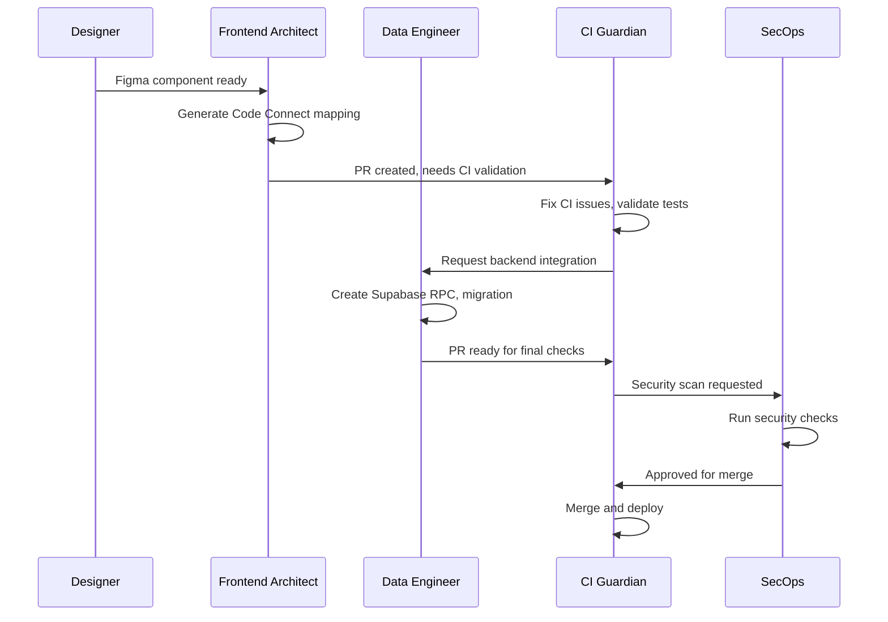
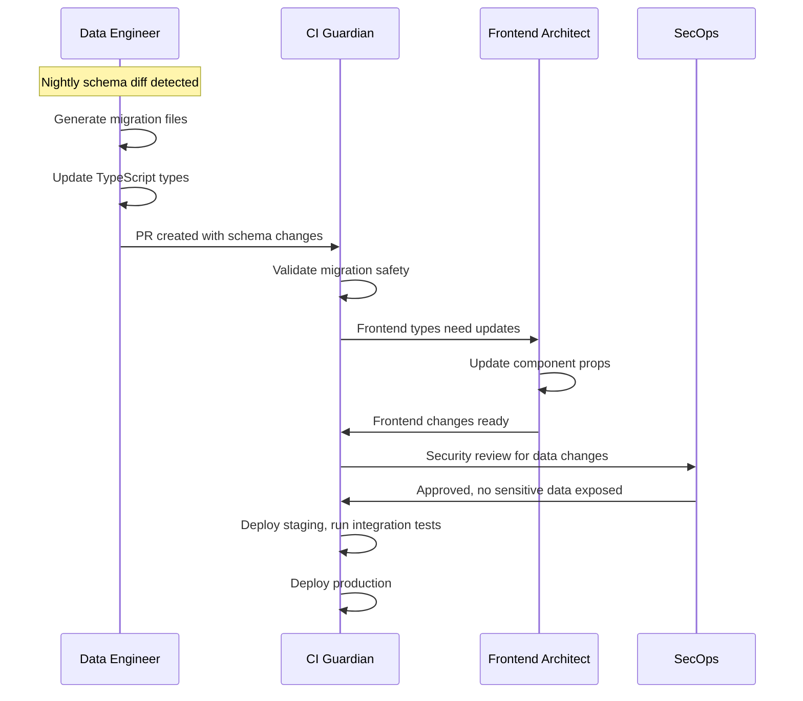

# Agent Orchestration

## Overview

SuperClaude agents work together through standardized contracts, handoff protocols, and shared artifact formats. This orchestration ensures complex tasks flow smoothly between specialized agents while maintaining consistency and traceability.

## Agent Contracts

### Task Card Interface
Each agent accepts a **task card** and returns an **artifact + PR**. This creates predictable interfaces for complex multi-agent workflows.

```yaml
# Standard Task Card Format
task_id: FE-123
title: "Wire KPI Tile to Code Connect"
agent: "Frontend Architect"
priority: "high" | "medium" | "low"
inputs:
  figma_file: "XYZ123"
  node_id: "45:67" 
  component: "KpiTile"
  props:
    label: string
    value: number
    delta?: number
    state: enum
context:
  related_tasks: ["BE-456", "CI-789"]
  dependencies: ["component_created", "figma_design_approved"]
outputs:
  artifacts:
    - type: "code"
      path: "apps/scout-ui/src/components/Kpi/KpiTile.figma.tsx"
    - type: "documentation"  
      path: "apps/scout-ui/CHANGELOG.md"
  pr_targets:
    - "apps/scout-ui/src/components/Kpi/"
    - "docs/components/"
verification:
  ci_checks:
    - "figma-code-connect"
    - "type-check"
    - "lint"
  manual_review: true
handoff:
  next_agent: "CI Guardian"
  condition: "on_ci_failure"
  escalation: "SecOps"
```

### Artifact Standards

**Code Artifacts**:
```typescript
interface CodeArtifact {
  type: 'component' | 'hook' | 'service' | 'config';
  language: 'typescript' | 'javascript' | 'sql' | 'yaml';
  path: string;
  content: string;
  tests?: string[];
  dependencies?: string[];
}
```

**Documentation Artifacts**:
```typescript
interface DocArtifact {
  type: 'readme' | 'changelog' | 'api-spec' | 'runbook';
  format: 'markdown' | 'openapi' | 'yaml';
  path: string;
  content: string;
  references?: string[];
}
```

## Agent Lifecycle

### 1. Task Reception
```yaml
# Agent receives task card
agent.receive(task_card)
  -> validates inputs
  -> checks dependencies
  -> estimates effort
  -> reserves resources
```

### 2. Execution Phase
```yaml
# Agent executes using MCP tools
agent.execute(task_card)
  -> invokes MCP tools
  -> generates artifacts
  -> runs local validation
  -> prepares handoff data
```

### 3. Validation & Handoff
```yaml
# Agent validates output and hands off
agent.complete(task_card)
  -> validates artifacts
  -> runs CI checks
  -> creates PR
  -> triggers next agent (if needed)
```

## Multi-Agent Workflows

### Design → Code → Deploy Pipeline



### Schema Evolution Pipeline



## Agent Specializations

### 🎨 Frontend Architect
**Inputs**: Figma files, design specs, component requirements  
**Outputs**: React components, Code Connect mappings, Storybook stories  
**MCP Tools**: Figma Dev Mode, Filesystem, GitHub  

**Handoff Triggers**:
- ✅ Component created → CI Guardian (for validation)
- ⚠️ Backend integration needed → Data Engineer  
- 🔴 Security concerns → SecOps

**Example Workflow**:
```yaml
1. Receive Figma component specification
2. Generate React component with TypeScript props
3. Create Code Connect mapping with FILE_KEY/NODE_ID
4. Generate Storybook stories for all states
5. Run figma:connect:validate locally
6. Create PR with component + documentation
7. Handoff to CI Guardian for pipeline validation
```

### 🗄️ Data Engineer
**Inputs**: Schema changes, data requirements, ETL specs  
**Outputs**: Migrations, RLS policies, ETL scripts, TypeScript types  
**MCP Tools**: Supabase Primary, Postgres Local, Filesystem  

**Handoff Triggers**:
- ✅ Schema migrated → CI Guardian (for deployment)
- ✅ Types generated → Frontend Architect (for components)
- 🔴 Data security review → SecOps

**Example Workflow**:
```yaml
1. Detect schema drift via nightly diff
2. Generate migration files for changes  
3. Create/update RLS policies
4. Generate TypeScript types
5. Create seed data for testing
6. Run migration validation tests
7. Create PR with schema changes
8. Handoff to CI Guardian for pipeline deployment
```

### ⚙️ CI Guardian  
**Inputs**: PRs, build failures, deployment requests  
**Outputs**: Fixed workflows, updated configs, deployment reports  
**MCP Tools**: GitHub, Filesystem, package managers  

**Handoff Triggers**:
- ✅ CI fixed → Original agent (for continuation)
- ⚠️ Security scan needed → SecOps
- 🔴 Production issue → All agents (alert)

**Example Workflow**:
```yaml
1. Detect CI pipeline failure
2. Analyze build logs and error patterns
3. Fix workflow files or dependency conflicts
4. Update caching and optimization settings
5. Re-run failed checks
6. Merge PR when all checks pass
7. Deploy to staging/production
8. Monitor deployment health
```

### 🔒 SecOps
**Inputs**: Security scan requests, compliance requirements  
**Outputs**: Security reports, cleaned history, compliance docs  
**MCP Tools**: Git history tools, secret scanners  

**Handoff Triggers**:
- ✅ Security approved → CI Guardian (for deployment)
- 🔴 Security incident → All agents (freeze)
- ⚠️ Compliance update needed → Data Engineer

**Example Workflow**:
```yaml
1. Receive security scan request
2. Run comprehensive secret detection
3. Check for vulnerable dependencies  
4. Validate RLS policies and permissions
5. Generate compliance report
6. Clean sensitive data from git history (if needed)
7. Approve/reject deployment
8. Update security documentation
```

## Handoff Protocols

### Synchronous Handoffs
**Used for**: Critical path tasks, immediate dependencies  
**Pattern**: Agent A completes → immediately triggers Agent B

```yaml
frontend_architect:
  on_complete:
    - trigger: "ci_guardian"  
      condition: "pr_created"
      data: 
        pr_url: "{{pr_url}}"
        check_targets: ["figma-code-connect", "type-check"]
```

### Asynchronous Handoffs  
**Used for**: Background tasks, optional enhancements  
**Pattern**: Agent A completes → queues task for Agent B

```yaml
data_engineer:
  on_schema_change:
    - queue: "frontend_architect"
      priority: "medium"  
      task: "update_component_types"
      data:
        types_file: "{{generated_types_path}}"
        affected_components: "{{component_list}}"
```

### Conditional Handoffs
**Used for**: Error handling, escalation paths  
**Pattern**: Agent A fails/succeeds → different agents triggered

```yaml  
ci_guardian:
  on_failure:
    security_scan_failed:
      trigger: "secops"
      escalation: true
    dependency_conflict:
      trigger: "frontend_architect"  
      retry_count: 1
  on_success:
    trigger: "data_engineer"
    condition: "schema_changes_detected"
```

## Quality Gates

### Pre-execution Validation
```yaml
quality_gates:
  pre_execution:
    - dependency_check: "all required inputs present"
    - authorization: "agent has required permissions"  
    - resource_check: "MCP tools available and healthy"
    - conflict_check: "no other agent working on same files"
```

### Post-execution Validation
```yaml
quality_gates:
  post_execution:
    - artifact_validation: "all outputs generated successfully"
    - ci_checks: "automated tests pass"
    - security_scan: "no secrets or vulnerabilities introduced"
    - documentation: "changes documented appropriately"
```

### Handoff Validation
```yaml
quality_gates:
  handoff:
    - completeness: "all handoff data provided"
    - format_check: "data matches expected schema"
    - dependency_ready: "next agent dependencies satisfied"
    - rollback_plan: "failure recovery path defined"
```

## Monitoring & Observability

### Agent Metrics
```typescript
interface AgentMetrics {
  task_completion_rate: number;
  average_execution_time: number;
  error_rate: number;
  handoff_success_rate: number;
  ci_gate_pass_rate: number;
  mcp_tool_usage: Record<string, number>;
}
```

### Workflow Tracing
```yaml
trace_id: "wf_20250828_001"
workflow: "figma_to_production"
agents:
  - agent: "frontend_architect"
    start_time: "2025-08-28T10:00:00Z"
    end_time: "2025-08-28T10:15:00Z"
    status: "success"
    artifacts: ["KpiTile.figma.tsx", "KpiTile.stories.tsx"]
  - agent: "ci_guardian"  
    start_time: "2025-08-28T10:15:00Z"
    end_time: "2025-08-28T10:18:00Z"
    status: "success"
    checks: ["figma-code-connect", "type-check", "lint"]
```

### Alert Conditions
```yaml
alerts:
  agent_down:
    condition: "agent_response_time > 30s"
    severity: "high"
  handoff_failure:  
    condition: "handoff_failure_rate > 10%"
    severity: "medium"
  ci_gate_blocked:
    condition: "ci_checks_failing > 5min"
    severity: "high"
```

## Best Practices

### Task Design
- ✅ **Single Responsibility**: Each task should have one clear objective
- ✅ **Idempotent**: Running the same task multiple times produces same result  
- ✅ **Atomic**: Task either completely succeeds or completely fails
- ✅ **Traceable**: Every step logged with sufficient detail

### Agent Interaction
- ✅ **Loose Coupling**: Agents communicate via task cards, not direct calls
- ✅ **Error Isolation**: One agent failure doesn't cascade to others
- ✅ **Resource Sharing**: Multiple agents can safely work on same repository  
- ✅ **Graceful Degradation**: Fallback paths when tools unavailable

### Quality Assurance
- ✅ **Automated Testing**: Every artifact includes test coverage
- ✅ **Documentation**: Every change includes documentation updates
- ✅ **Security**: Every task considers security implications
- ✅ **Performance**: Monitor resource usage and optimize bottlenecks

---

**Last Updated**: August 28, 2025  
**Orchestration Version**: 1.0.0  
**Contact**: TBWA Platform Team