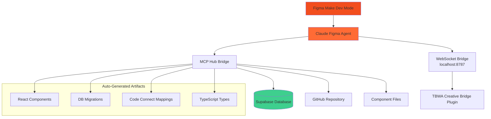

# Claude Figma Dev Mode Agent

**Resident Claude agent that lives inside Figma Make Dev Mode, enabling seamless design → code → database → GitHub sync.**

## 🎯 Overview

The Claude Figma Dev Mode Agent bridges the gap between design and code by running directly inside Figma Make, with full access to your monorepo, Supabase database, and GitHub integration.

### Key Capabilities

- **🎨 Frame → Component**: Convert Figma frames to React components
- **🗃️ Database Evolution**: Auto-generate migrations from component data needs
- **🔄 Real-time Sync**: Live preview of generated code in Figma
- **📝 Code Connect**: Automatic Figma ↔ React component mapping
- **🚀 Auto-deploy**: Commit changes to GitHub automatically

## 🏗️ Architecture



## 🚀 Quick Start

### 1. Install Agent

```bash
# Navigate to your monorepo
cd /Users/tbwa/ai-aas-hardened-lakehouse

# Install MCP Hub dependencies
cd infra/mcp-hub
pnpm install

# Build TypeScript
pnpm build
```

### 2. Configure Environment

Create `.env` in your repo root:

```bash
# Supabase Configuration
SUPABASE_PROJECT_REF=cxzllzyxwpyptfretryc
SUPABASE_URL=https://cxzllzyxwpyptfretryc.supabase.co
SUPABASE_ACCESS_TOKEN=your-personal-access-token
SUPABASE_SERVICE_ROLE_KEY=your-service-role-key

# GitHub Configuration  
GITHUB_TOKEN=your-github-token
GITHUB_REPO=scout-db/ai-aas-hardened-lakehouse

# Agent Configuration
FIGMA_BRIDGE_PORT=8787
MCP_HUB_PORT=8888
```

### 3. Start the Agent

```bash
# Start the Figma Dev Mode Agent
node -e "
const { FigmaDevModeAgent } = require('./infra/mcp-hub/dist/figma-dev-mode-agent.js');

const agent = new FigmaDevModeAgent({
  repoRoot: process.cwd(),
  mcpHubPort: 8888,
  figmaBridgePort: 8787,
  supabaseProjectRef: process.env.SUPABASE_PROJECT_REF,
  githubRepo: process.env.GITHUB_REPO
});

console.log('🎨 Claude Figma Agent running...');
console.log('🔗 Connect from Figma Dev Mode to: ws://localhost:8787/figma-dev-agent');
"
```

### 4. Install Figma Plugin

```bash
# Install the TBWA Creative Bridge plugin in Figma
# Plugin files located at: creative-studio/figma-bridge-plugin/
# 1. Open Figma Desktop
# 2. Go to Plugins → Development → Import plugin from manifest
# 3. Select: creative-studio/figma-bridge-plugin/manifest.json
```

## 📝 Usage Guide

### In Figma Make Dev Mode

1. **Select a Frame**
   - Select any frame you want to convert to a React component
   - Claude agent will analyze the frame and suggest component generation

2. **Generate Component**
   - Right-click → Plugins → "TBWA Creative Bridge" → "Generate Component"
   - Claude agent will:
     - Create React component in `apps/scout-dashboard/src/components/generated/`
     - Create Figma Code Connect mapping
     - Generate database migration if data is needed
     - Commit to new GitHub branch

3. **Sync Design Tokens**
   - Update colors, spacing, or typography in Figma
   - Plugin → "Sync Design Tokens"
   - Claude agent updates Tailwind config and CSS variables

4. **Preview Live Code**
   - Generated components appear in Dev Mode
   - Real data from Supabase populates components
   - Changes sync back to Figma in real-time

## 🔧 Workflows

### Component Generation Workflow

```yaml
Trigger: Frame selected in Figma
  ↓
Analyze frame properties and design tokens
  ↓
Generate React component with TypeScript types
  ↓
Create Figma Code Connect mapping
  ↓
Infer database schema requirements
  ↓
Generate Supabase migration (if needed)
  ↓
Commit all files to GitHub branch
  ↓
Send confirmation back to Figma
```

### Design Token Sync Workflow

```yaml
Trigger: Design tokens updated in Figma
  ↓
Extract color, spacing, typography tokens
  ↓
Update Tailwind configuration
  ↓
Generate CSS custom properties
  ↓
Commit design system updates
  ↓
Trigger component re-builds
```

## 🛠️ Component Templates

The agent uses intelligent templates for component generation:

### KPI Card Template
```tsx
// Auto-generated for KPI components
interface KpiCardProps {
  value: number;
  label: string;
  trend?: 'up' | 'down' | 'neutral';
  loading?: boolean;
}

export function KpiCard({ value, label, trend, loading }: KpiCardProps) {
  return (
    <div className="kpi-card">
      {loading ? (
        <div className="animate-pulse">Loading...</div>
      ) : (
        <>
          <span className="kpi-value">{value}</span>
          <span className="kpi-label">{label}</span>
          {trend && <TrendIndicator direction={trend} />}
        </>
      )}
    </div>
  );
}
```

### Chart Component Template
```tsx
// Auto-generated for chart components
interface ChartComponentProps {
  data: any[];
  chartType: 'bar' | 'line' | 'pie' | 'area';
  config?: ChartConfig;
}

export function ChartComponent({ data, chartType, config }: ChartComponentProps) {
  return (
    <div className="chart-container">
      <ResponsiveChart
        data={data}
        type={chartType}
        {...config}
      />
    </div>
  );
}
```

## 🗃️ Database Integration

### Automatic Schema Inference

The agent analyzes Figma component properties to infer database requirements:

```typescript
// Figma Frame Analysis → Database Schema
Frame: "Revenue KPI Card"
Properties: { 
  data_source: "revenue", 
  time_period: "monthly",
  filters: ["region", "product"]
}

Generated Migration:
CREATE TABLE scout.revenue_kpi_states (
  id UUID PRIMARY KEY DEFAULT gen_random_uuid(),
  component_id TEXT NOT NULL,
  revenue_data JSONB,
  time_period TEXT,
  filters JSONB,
  state_data JSONB NOT NULL DEFAULT '{}',
  created_at TIMESTAMP DEFAULT NOW()
);
```

### Migration Safety

- **Review Required**: Migrations are created but not auto-applied
- **RLS Enabled**: All generated tables have Row Level Security
- **Audit Trail**: Full change history in `agent_repository.tasks`
- **Rollback Ready**: Migrations are reversible

## 🔐 Security Features

### Sandboxed Execution
- Agent runs in isolated WebSocket environment
- No direct file system access outside allowed directories
- All database operations logged and auditable

### Permission Model
```yaml
Permissions:
  Read: 
    - Figma frame properties
    - Design tokens
    - Component templates
  
  Write:
    - React components (apps/scout-dashboard/src/components/generated/)
    - Figma Code Connect mappings
    - Database migrations (supabase/migrations/)
    - Design system files (styles/)
  
  Execute:
    - Supabase migrations (with approval)
    - Git commits (auto-branch creation)
    - Type generation
```

### Token Management
- Uses `.env` variables (never hardcoded)
- Figma plugin communicates via secure WebSocket
- GitHub commits use configured Git credentials
- Supabase operations use service role key

## 🧪 Testing

### Manual Testing

1. **Start Agent**:
   ```bash
   npm run mcp:start
   ```

2. **Open Figma**: Launch Figma Desktop with TBWA Creative Bridge plugin

3. **Test Component Generation**:
   - Create a frame named "TestKpiCard"
   - Add properties: `data_source: "revenue"`
   - Select frame → Plugin → "Generate Component"

4. **Verify Results**:
   - Check `apps/scout-dashboard/src/components/generated/TestKpiCard.tsx`
   - Check `supabase/migrations/` for new migration
   - Check GitHub for new branch

### Automated Testing

```bash
# Run agent integration tests
npm run test:figma-agent

# Test MCP Hub communication
npm run test:mcp-bridge

# Test component generation pipeline
npm run test:component-generation
```

## 🐛 Troubleshooting

### Common Issues

#### 1. WebSocket Connection Failed
```bash
# Check if MCP Hub is running
curl http://localhost:8787/health

# Restart the agent
npm run mcp:restart
```

#### 2. Component Generation Failed
```bash
# Check permissions
ls -la apps/scout-dashboard/src/components/generated/

# Check template files
ls -la src/templates/
```

#### 3. Database Migration Failed
```bash
# Check Supabase connection
supabase status

# Test migration manually
supabase db push --dry-run
```

#### 4. GitHub Commit Failed
```bash
# Check Git configuration
git config --list | grep user

# Check GitHub token
gh auth status
```

### Debug Mode

Enable debug logging:

```bash
# Start with debug logging
DEBUG=figma-agent* npm run mcp:start
```

## 📊 Analytics & Monitoring

### Usage Tracking

All agent operations are logged to `agent_repository.agent_usage`:

```sql
SELECT 
  operation_type,
  COUNT(*) as operations,
  AVG(execution_time_ms) as avg_time
FROM agent_repository.agent_usage 
WHERE agent_id = 'claude-figma-agent'
  AND created_at >= NOW() - INTERVAL '24 hours'
GROUP BY operation_type
ORDER BY operations DESC;
```

### Performance Metrics

- **Component Generation**: ~2-5 seconds per component
- **Migration Creation**: ~1-3 seconds per migration
- **GitHub Commit**: ~3-8 seconds per commit
- **Design Token Sync**: ~1-2 seconds

## 🚀 Advanced Features

### Batch Component Generation

Select multiple frames and generate all components at once:

```typescript
// Batch generation example
const frames = await figma.getSelectedFrames();
const results = await Promise.all(
  frames.map(frame => agent.generateComponent(frame))
);
```

### Custom Component Templates

Add your own templates in `src/templates/`:

```typescript
// src/templates/dashboard-section.tsx.template
export function {{componentName}}() {
  const { data, loading } = use{{dataSource}}();
  
  return (
    <section className="dashboard-section">
      <h2>{{title}}</h2>
      {{#if hasChart}}
      <Chart data={data} type="{{chartType}}" />
      {{/if}}
    </section>
  );
}
```

### Integration with CI/CD

The agent automatically creates branches that trigger your CI/CD:

```yaml
# .github/workflows/figma-sync.yml
name: Figma Component Sync
on:
  push:
    branches: ['figma-sync-*']
    
jobs:
  validate-and-merge:
    runs-on: ubuntu-latest
    steps:
      - uses: actions/checkout@v4
      - name: Validate generated components
        run: |
          npm run typecheck
          npm run lint
          npm run test:components
      - name: Auto-merge if tests pass
        run: gh pr create --auto-merge
```

## 📚 Related Documentation

- [Figma Code Connect Setup](../scout-dashboard/CODE_CONNECT_README.md)
- [MCP Hub Architecture](../infra/mcp-hub/README.md) 
- [Database Schema Guide](../db/migrations/README.md)
- [Component Development Guide](../apps/scout-dashboard/README.md)

## 🤝 Contributing

1. **Agent Configuration**: Modify `agents/claude-figma-agent.yaml`
2. **Component Templates**: Add templates in `src/templates/`
3. **Workflow Logic**: Update `infra/mcp-hub/src/figma-dev-mode-agent.ts`
4. **Testing**: Add tests in `tests/figma-bridge/`

## 📄 License

Copyright © 2025 TBWA Enterprise Data Platform. All rights reserved.