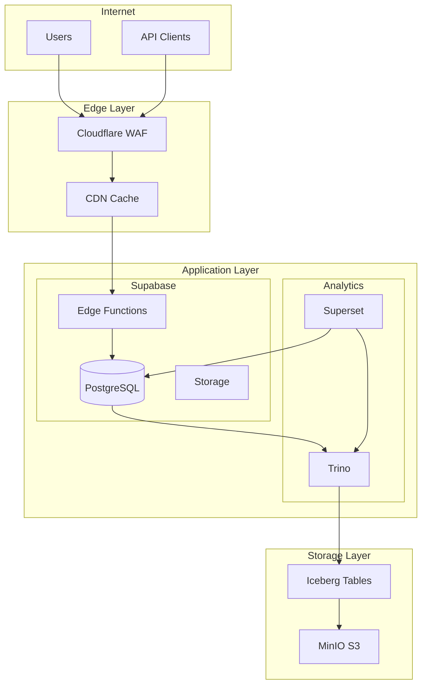

# Scout Platform - Network Architecture
## Auto-Generated from Infrastructure Discovery

## Service Endpoints
| Service | Endpoint | Port | Protocol |
|---------|----------|------|----------|
| Supabase API | cxzllzyxwpyptfretryc.supabase.co | 443 | HTTPS |
| PostgreSQL | db.cxzllzyxwpyptfretryc.supabase.co | 5432 | TLS |
| Edge Functions | /functions/v1/* | 443 | HTTPS |
| Superset | superset.scout.analytics | 443 | HTTPS |
