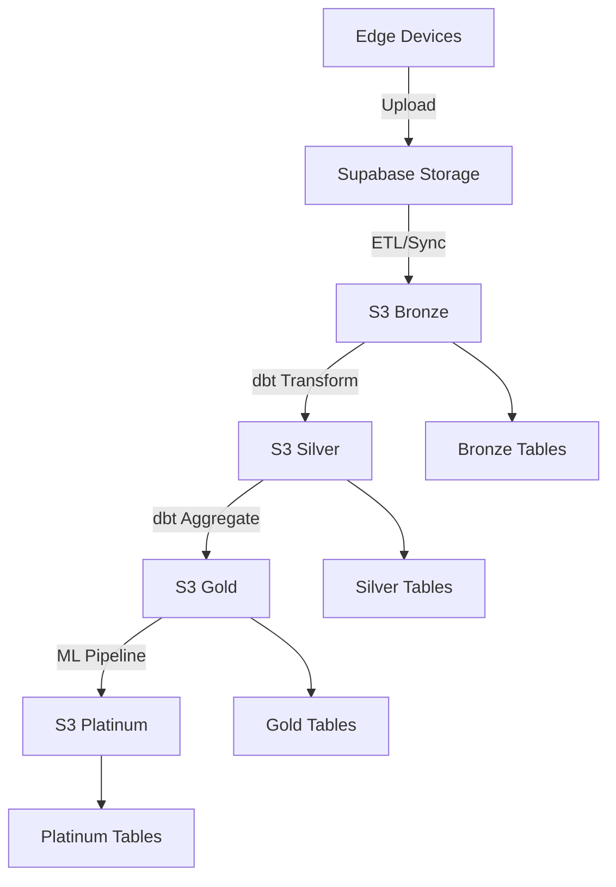

# Scout Lakehouse on S3 (Pseudo-ADLS2)

This defines a vendor-neutral, S3-compatible layout that mimics ADLS Gen2 semantics for the Medallion pattern.

## Layout & Contracts
- Bucket: `<lake-bucket>`
- Prefixes (top-level folders):
  - `bronze/` – raw immutable landings (append-only, gz/parquet/orc allowed)
  - `silver/` – cleansed/conformed records (schema-stable parquet, partitioned)
  - `gold/` – business aggregates/serving (parquet; partition by business keys/time)
  - `platinum/` – ML features/embeddings (parquet + manifest; schema registry optional)

### Partitioning
- Required: `dt=YYYY-MM-DD/` (or `year=YYYY/month=MM/day=DD/`)
- Optional: `tenant=<id>/`, `source=<sys>/`, `region=<code>/`

### Formats
- Parquet (ZSTD), snappy acceptable; no CSV in silver+.
- Add `_SUCCESS` markers per batch job (optional; Spark-style).

### Governance & SLOs
- **Immutability**: versioning ON; `bronze/` may enable Object Lock (compliance/retention).
- **Encryption**: SSE-KMS preferred; else AES256.
- **Lifecycle**:
  - bronze → infrequent/Glacier after N days, expire after M days (configurable).
  - silver/gold → transition slower; platinum retained longest.
- **Access** (least privilege):
  - `ingest-role`: Put/List in `bronze/` only.
  - `transform-role`: Get `bronze/`, Put `silver/` (optionally `gold/`).
  - `consumer-role`: Get `gold/` and `platinum/`.
  - `ml-role`: Get `gold/`, Put `platinum/`.

## Iceberg/Delta (optional)
You can register `silver/gold/platinum` tables in a catalog (Glue/Nessie) with Apache Iceberg; path layout still applies.

## DR & Backups
- Cross-region replication for `silver/`+ if RPO requires.
- Periodic inventory + integrity checksums (manifest listing).

## Integration with Scout Edge Pipeline

This S3 layout integrates with Scout's existing edge device pipeline:

### Current State
- Edge devices upload to Supabase Storage (`sample` bucket)
- Data lands in `scout/v1/bronze/` prefix
- Missing: automated ingestion from storage → bronze tables

### Enhanced Flow with S3 Lake

### Data Quality Framework
- **Bronze**: Schema validation, completeness checks, duplicate detection
- **Silver**: Data type validation, referential integrity, business rule validation  
- **Gold**: Aggregation accuracy, SLA compliance, freshness checks
- **Platinum**: Feature drift detection, model performance metrics

### Security & Access Control
- **Edge Devices**: Write-only to Supabase Storage (no direct S3 access)
- **ETL Pipeline**: Read from Supabase Storage, write to S3 bronze
- **Transform Pipeline**: Read bronze, write silver/gold
- **ML Pipeline**: Read gold, write platinum
- **Dashboard**: Read gold/platinum via Supabase (cached views)

### Cost Optimization
- **Storage Classes**: Standard → IA → Glacier progression based on access patterns
- **Compression**: 70%+ reduction with Parquet ZSTD
- **Partitioning**: Minimize scan costs with proper partition pruning
- **Lifecycle Policies**: Automated cost optimization without manual intervention