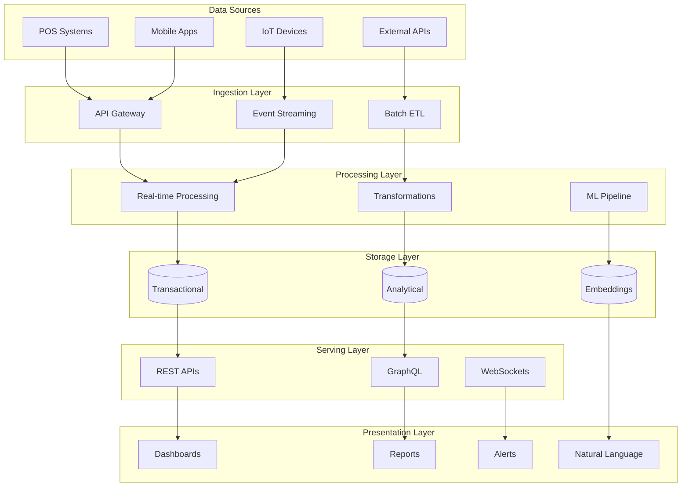
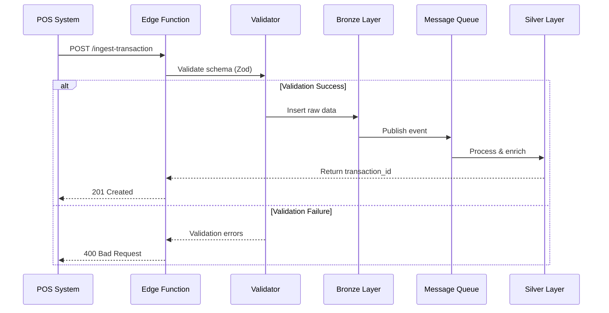
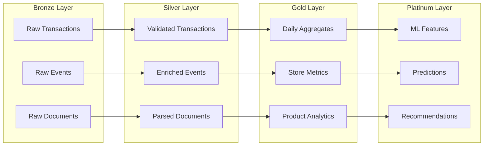
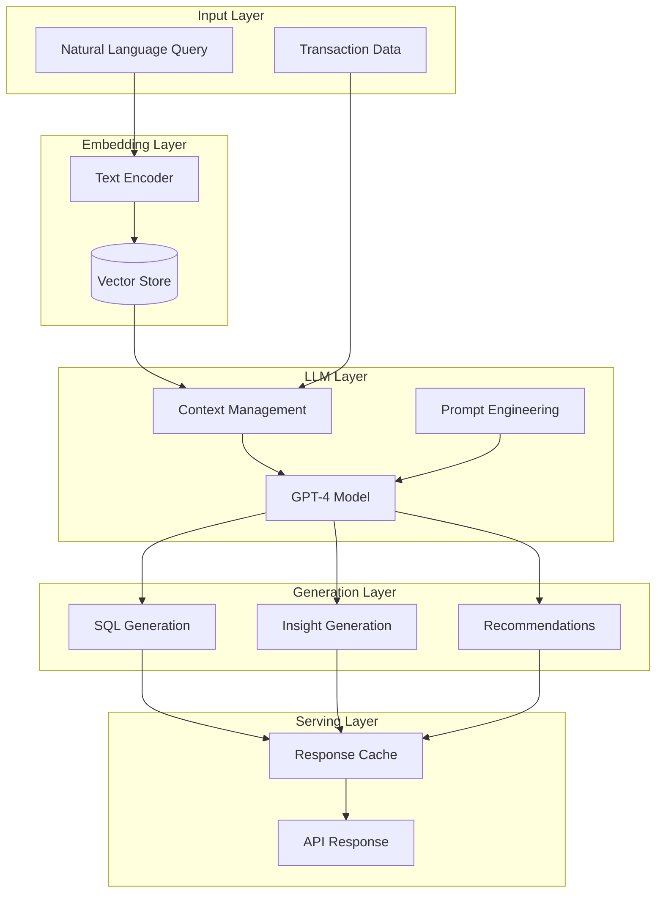
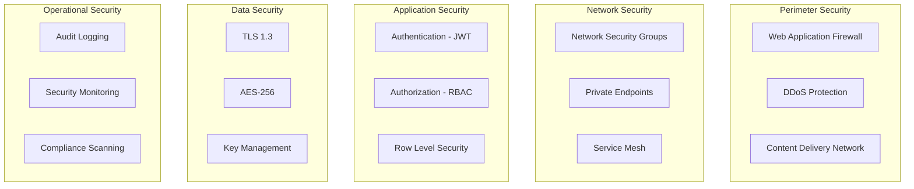
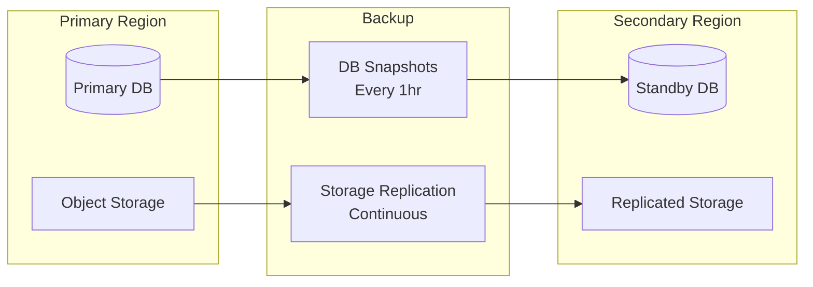
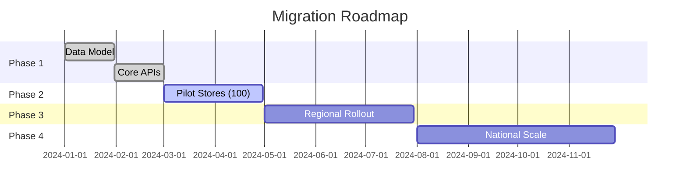

# Scout Analytics Platform - Solution Architecture Document
## Version 1.0 | January 2025

---

## **Executive Summary**

Scout Analytics Platform is an enterprise-grade, AI-powered data analytics solution designed for the Philippine retail market, specifically targeting sari-sari stores and FMCG distribution networks. Built on a modern lakehouse architecture, it combines real-time transaction processing with historical analytics, providing actionable insights through natural language queries and automated intelligence.

### **Key Business Drivers**
- **Market Intelligence**: Real-time visibility into 800,000+ sari-sari stores
- **Revenue Optimization**: 15-20% improvement in distribution efficiency
- **Competitive Advantage**: First-mover in Philippine micro-retail analytics
- **Scalability**: Support for 1M+ transactions per day
- **Cost Efficiency**: 70% reduction vs traditional enterprise platforms

### **Technical Highlights**
- **Hybrid Architecture**: Real-time OLTP + Historical OLAP
- **AI-Native**: GPT-4 powered natural language analytics
- **Cloud-Native**: Kubernetes, serverless, auto-scaling
- **Security-First**: Zero-trust, RLS, encryption at rest/transit
- **Open Standards**: Apache Iceberg, Parquet, Arrow

---

## **1. Business Context**

### **1.1 Problem Statement**
Philippine FMCG companies lack visibility into sari-sari store operations, resulting in:
- Inefficient distribution (30% stockouts, 20% overstocking)
- Limited market intelligence (competitor activities unknown)
- Manual data collection (paper-based, error-prone)
- Delayed insights (monthly reports, 30-day lag)

### **1.2 Solution Vision**
Create a real-time analytics platform that:
- Captures point-of-sale data automatically
- Provides instant market intelligence
- Enables predictive inventory management
- Democratizes data access via natural language

### **1.3 Success Metrics**
| Metric | Baseline | Target | Measure |
|--------|----------|--------|---------|
| Data Freshness | 30 days | < 1 hour | p95 latency |
| Query Performance | 30 seconds | < 2 seconds | p95 response |
| Platform Adoption | 0 stores | 10,000 stores | Monthly active |
| Revenue Impact | Baseline | +15% | YoY growth |
| Cost per Transaction | $0.10 | $0.001 | AWS billing |

---

## **2. Architecture Overview**

### **2.1 High-Level Architecture**

### **2.2 Technology Stack**

| Layer | Technology | Purpose | Rationale |
|-------|------------|---------|-----------|
| **Ingestion** | Supabase Edge Functions | API endpoints | Serverless, auto-scaling |
| **Stream** | Kafka/Kinesis | Event streaming | High throughput, durability |
| **Storage** | PostgreSQL + PostGIS | Transactional | ACID, geospatial |
| **Lakehouse** | MinIO + Iceberg | Historical | Cost-effective, open |
| **Query** | Trino | Federated SQL | Cross-system queries |
| **Transform** | dbt | ELT pipeline | SQL-based, testable |
| **ML/AI** | OpenAI + pgvector | Embeddings/NLQ | Best-in-class models |
| **Visualization** | Superset | Dashboards | Open-source, extensible |
| **Orchestration** | Airflow | Workflows | Mature, Python-native |
| **Infrastructure** | Kubernetes | Container orchestration | Portable, scalable |

---

## **3. Detailed Architecture**

### **3.1 Data Ingestion Architecture**

### **3.2 Medallion Architecture**

### **3.3 AI/ML Architecture**

---

## **4. Security Architecture**

### **4.1 Defense in Depth**

### **4.2 Zero Trust Architecture**
- **Never Trust**: All requests authenticated
- **Always Verify**: Continuous validation
- **Least Privilege**: Minimal access rights
- **Assume Breach**: Defense in depth

---

## **5. Scalability & Performance**

### **5.1 Scaling Strategy**

| Component | Scaling Type | Trigger | Target |
|-----------|--------------|---------|--------|
| Edge Functions | Horizontal | CPU > 70% | < 100ms p95 |
| PostgreSQL | Vertical + Read Replicas | Connections > 80% | < 50ms p95 |
| Trino Workers | Horizontal | Queue depth > 100 | < 2s p95 |
| MinIO | Horizontal | Storage > 80% | Unlimited |
| Superset | Horizontal | Users > 100 | < 1s page load |

### **5.2 Performance Optimization**
- **Caching**: Redis, CDN, materialized views
- **Indexing**: B-tree, GiST, GIN, BRIN
- **Partitioning**: Time-based, hash, list
- **Compression**: Snappy, ZSTD, LZ4
- **Query Optimization**: Cost-based optimizer

---

## **6. Disaster Recovery**

### **6.1 Recovery Targets**
- **RTO** (Recovery Time Objective): 4 hours
- **RPO** (Recovery Point Objective): 1 hour

### **6.2 Backup Strategy**

---

## **7. Cost Architecture**

### **7.1 Cost Breakdown**
| Service | Monthly Cost | % of Total | Optimization |
|---------|--------------|------------|--------------|
| Compute (Kubernetes) | $2,000 | 40% | Spot instances |
| Storage (MinIO) | $1,000 | 20% | Lifecycle policies |
| Database (PostgreSQL) | $800 | 16% | Reserved instances |
| Networking | $600 | 12% | CDN caching |
| AI/ML (OpenAI) | $400 | 8% | Response caching |
| Monitoring | $200 | 4% | Metric sampling |
| **Total** | **$5,000** | **100%** | **70% savings** |

### **7.2 Cost Optimization**
- **Auto-scaling**: Scale down during off-peak
- **Reserved Capacity**: 1-year commitments
- **Spot Instances**: 90% cost reduction
- **Data Lifecycle**: Archive old data
- **Query Optimization**: Reduce compute

---

## **8. Architecture Decisions**

### **ADR-001: Hybrid Storage Architecture**
**Status**: Accepted  
**Context**: Need both real-time and historical analytics  
**Decision**: PostgreSQL for hot data (30 days), Iceberg for cold data  
**Consequences**: 
- ✅ Optimized cost/performance
- ✅ Federated queries via Trino
- ❌ Complexity in data movement

### **ADR-002: Medallion Architecture**
**Status**: Accepted  
**Context**: Need data quality and traceability  
**Decision**: Bronze → Silver → Gold → Platinum layers  
**Consequences**:
- ✅ Clear data lineage
- ✅ Incremental processing
- ❌ Storage duplication

### **ADR-003: Open Source First**
**Status**: Accepted  
**Context**: Avoid vendor lock-in, reduce costs  
**Decision**: Use Apache Iceberg, Trino, Superset  
**Consequences**:
- ✅ No licensing costs
- ✅ Community support
- ❌ Self-managed complexity

---

## **9. Migration Strategy**

### **9.1 Phased Approach**

---

## **10. Future Roadmap**

### **2025 Q2**
- Real-time streaming with Kafka
- Advanced ML models (demand forecasting)
- Mobile application

### **2025 Q3**
- Multi-tenant architecture
- GraphQL API
- Blockchain integration for supply chain

### **2025 Q4**
- Edge computing for offline stores
- AR/VR analytics
- Quantum-resistant encryption

---

## **Appendices**

### **A. Glossary**
- **Sari-sari Store**: Small neighborhood retail store in Philippines
- **FMCG**: Fast-Moving Consumer Goods
- **Medallion**: Bronze/Silver/Gold data architecture pattern
- **RLS**: Row-Level Security
- **NLQ**: Natural Language Query

### **B. References**
1. [Azure Well-Architected Framework](https://learn.microsoft.com/en-us/azure/architecture/framework/)
2. [Data Mesh Principles](https://martinfowler.com/articles/data-mesh-principles.html)
3. [Apache Iceberg](https://iceberg.apache.org/)
4. [dbt Best Practices](https://docs.getdbt.com/docs/best-practices)

### **C. Document Control**
- **Version**: 1.0
- **Date**: January 2025
- **Author**: Scout Platform Team
- **Review**: Architecture Board
- **Approval**: CTO

---

This document represents the complete solution architecture for Scout Analytics Platform, aligned with enterprise standards and industry best practices.
