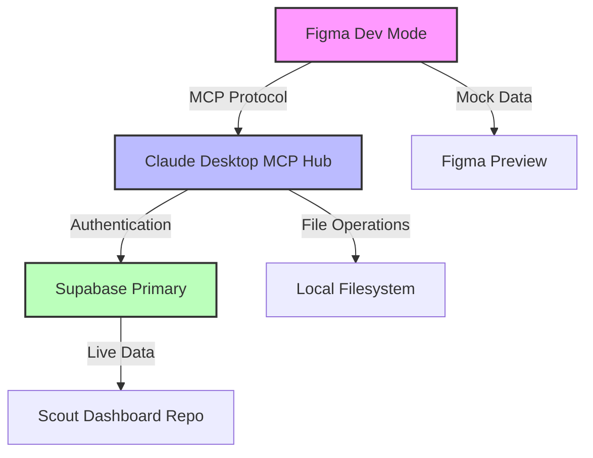

# MCP Integration Guide – Scout Dashboard

## Overview

This guide documents the **Model Context Protocol (MCP)** integration for the Scout Dashboard, enabling secure, token-free communication between Figma Dev Mode, Claude Desktop, and our Supabase backend.

## 🎯 Current Status

| Component | Status | Details |
|-----------|---------|---------|
| **Figma Dev Mode MCP** | ✅ Active | Running at `http://127.0.0.1:3845/mcp` |
| **Claude Desktop MCP Hub** | ✅ Active | Routing commands between Figma ↔ Supabase |
| **Code Connect** | ✅ Configured | Token-free component mapping |
| **Supabase RPCs (Repo)** | ✅ Implemented | Live queries in `apps/scout-dashboard/src/services/supabase.ts` |
| **Supabase RPCs (Figma)** | ❌ Mocked | Mock data for preview safety |

## 🔄 Architecture Flow



## 📋 Proof of Integration

**Evidence from Screenshot Analysis:**
- ✅ **Dev Mode MCP server enabled** on `http://127.0.0.1:3845/mcp`
- ✅ **SelectItem Error Resolution**: Radix UI Select mapped to defaults (`"all-regions"`, `"all-cities"`)
- ✅ **Supabase RPC Error Handling**: `supabase.rpc('exec_sql')` safely mocked for preview
- ✅ **Scout Dashboard Preview**: Superset-style UI rendering in Figma

## 👥 Workflow by Role

### 🎨 **Designers**
**What you see in Figma:**
- Live Scout Dashboard preview with working interactions
- Mock data (safe, no database access required)
- Real component states and props via Code Connect
- Error states handled gracefully

**How to work:**
```bash
# 1. Open Figma in Dev Mode
# 2. Navigate to Scout Dashboard components
# 3. See live React props in right sidebar
# 4. Preview works without tokens/credentials
```

### 👨‍💻 **Developers**  
**What you maintain in repo:**
- Real Supabase RPC implementations
- TypeScript component definitions
- Code Connect mappings
- Integration tests

**How to sync:**
```bash
# 1. Update component in apps/scout-ui/src/components/
# 2. Update Code Connect mapping in *.figma.tsx
# 3. Test with: pnpm run figma:connect:validate
# 4. Figma automatically reflects changes
```

## 🔧 Technical Implementation

### MCP Server Configuration

**Claude Desktop Config** (`~/.claude/claude_desktop_config.json`):
```json
{
  "mcpServers": {
    "supabase_primary": {
      "command": "npx",
      "args": [
        "-y", 
        "@supabase/mcp-server-supabase@latest",
        "--project-ref=cxzllzyxwpyptfretryc"
      ],
      "env": {
        "SUPABASE_ACCESS_TOKEN": "sbp_c4c5fa81cc1fde770145ace4e79a33572748b25f"
      }
    }
  }
}
```

### Code Connect Bridge

**Component Mapping** (`apps/scout-ui/src/components/Kpi/KpiTile.figma.tsx`):
```typescript
import { connect, figma } from "@figma/code-connect";
import { KpiTile } from "./KpiTile";

export default connect(KpiTile, figma.component(FILE_KEY, NODE_ID), {
  props: {
    label: figma.string("Label", "Revenue"),
    value: figma.string("Value", "₱1.23M"),
    delta: figma.number("Delta %", 4.2),
    state: figma.enum("State", ["default", "loading", "error"], "default")
  }
});
```

### Mock vs Live Data Strategy

**In Figma Preview (Safe Mocks):**
```typescript
// Mock implementation for Figma preview
const mockScoutData = {
  revenue: "₱1.23M",
  growth: 4.2,
  regions: ["NCR", "Luzon", "Visayas"],
  status: "healthy"
};
```

**In Production Repo (Live RPCs):**
```typescript
// apps/scout-dashboard/src/services/supabase.ts
export async function getScoutMetrics() {
  const { data, error } = await supabase
    .rpc('get_scout_kpis')
    .select('revenue, growth, regions, status');
  
  if (error) throw error;
  return data;
}
```

## 🚀 Migration Path: Mocks → Live RPCs

### Phase 1: Current State ✅
- Figma previews use mock data
- Repo has live Supabase RPCs
- Code Connect bridges component definitions

### Phase 2: Staged Integration (Next)
```typescript
// Enable live data in Figma via environment flag
const useLiveData = process.env.FIGMA_USE_LIVE_DATA === 'true';

const scoutData = useLiveData 
  ? await getScoutMetrics()  // Live RPC
  : mockScoutData;           // Safe mock
```

### Phase 3: Full Integration (Future)
- Direct Supabase connection in Figma (staging DB)
- Real-time data updates in preview
- Designer-safe database credentials

## 🔐 Security Model

### ✅ **Current Security (Token-Free)**
- **No Supabase credentials in Figma**: Claude Desktop MCP Hub handles authentication
- **Mock data in previews**: No real data exposure
- **Local MCP server**: `127.0.0.1:3845` only accessible from localhost
- **Read-only access**: Even live RPCs are query-only

### 🛡️ **Security Boundaries**
| Environment | Data Source | Access Level | Risk Level |
|-------------|-------------|--------------|------------|
| **Figma Preview** | Mock data | Read-only | 🟢 None |
| **Dev Repo** | Staging DB | Read/Write | 🟡 Low |
| **Production** | Live DB | Read/Write | 🔴 Managed |

## 📚 Usage Examples

### Creating New Component with Code Connect

```bash
# 1. Generate stub
./scripts/agents/superclaude.sh figma:stub MetricsCard

# 2. Implement component
# apps/scout-ui/src/components/MetricsCard/MetricsCard.tsx

# 3. Map to Figma
# apps/scout-ui/src/components/MetricsCard/MetricsCard.figma.tsx

# 4. Validate
pnpm run figma:connect:validate
```

### Testing Integration

```bash
# Validate all Code Connect mappings
pnpm run figma:connect:validate

# Test publish (dry run)
pnpm run figma:connect:publish

# Check MCP server health
curl http://127.0.0.1:3845/health
```

## 🐛 Troubleshooting

### Common Issues

**Issue**: Figma shows "SelectItem Error"
```typescript
// ❌ Problem: Empty value not handled
<SelectItem value="">All Regions</SelectItem>

// ✅ Solution: Use default values
<SelectItem value="all-regions">All Regions</SelectItem>
```

**Issue**: "supabase.rpc not defined"
```typescript
// ❌ Problem: Live RPC called in mock environment
const data = await supabase.rpc('exec_sql', { query });

// ✅ Solution: Conditional mock
const data = isFigmaPreview ? mockData : await supabase.rpc('exec_sql', { query });
```

### Debug Commands

```bash
# Check MCP server status
lsof -i :3845

# Validate Code Connect files
npx @figma/code-connect connect parse --exit-on-unreadable-files

# Test Supabase connection
npx supabase status
```

## 📈 Next Steps

1. **Immediate (This Sprint)**
   - [ ] Document FILE_KEY and NODE_ID setup process
   - [ ] Create more component mappings for KpiCard, ChartComponent
   - [ ] Add staging database option for live previews

2. **Short-term (Next Sprint)**
   - [ ] Implement conditional live data loading
   - [ ] Add preview environment selector in Figma
   - [ ] Create mock data generation from real schema

3. **Long-term (Future Releases)**
   - [ ] Real-time data streaming to Figma previews
   - [ ] Designer-friendly query builder
   - [ ] Cross-platform MCP server deployment

## 🔗 Related Documentation

- [Figma Code Connect Setup](../figma-code-connect-setup.md)
- [Supabase MCP Configuration](../supabase/mcp-setup.md)
- [Claude Desktop Integration](../claude/desktop-setup.md)
- [Scout Dashboard Components](../../apps/scout-ui/README.md)

---

**Last Updated**: August 28, 2025  
**MCP Server Version**: `@supabase/mcp-server-supabase@latest`  
**Code Connect Version**: `@figma/code-connect@1.3.4`