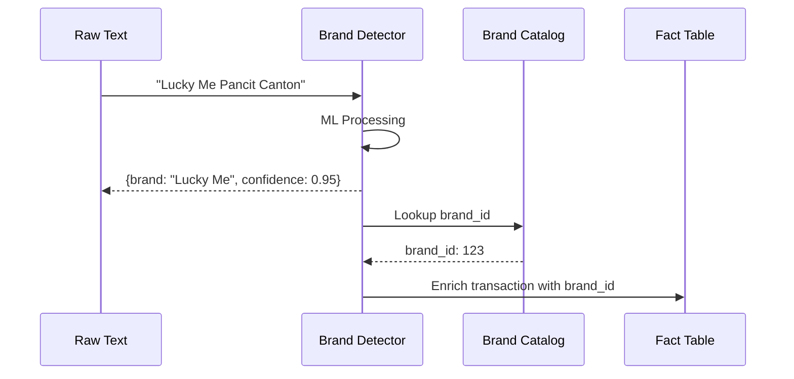
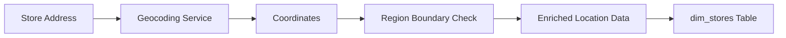
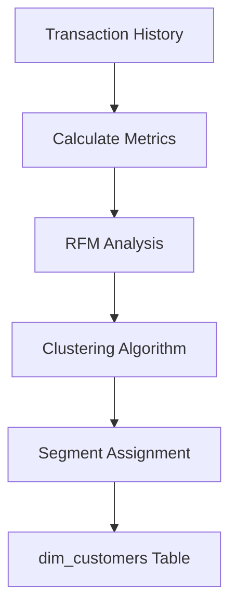

# Scout Analytics Platform - Visual Data Flow

## Complete Data Processing Pipeline

```mermaid
graph TD
    %% Styling
    classDef source fill:#e1f5e1,stroke:#4caf50,stroke-width:2px
    classDef bronze fill:#fff3e0,stroke:#ff9800,stroke-width:2px
    classDef silver fill:#e3f2fd,stroke:#2196f3,stroke-width:2px
    classDef gold fill:#fff9c4,stroke:#ffeb3b,stroke-width:2px
    classDef platinum fill:#f3e5f5,stroke:#9c27b0,stroke-width:2px
    classDef app fill:#ffebee,stroke:#f44336,stroke-width:2px
    classDef process fill:#e0f2f1,stroke:#009688,stroke-width:2px

    %% Data Sources
    subgraph "📥 Data Sources"
        SRP[SRP Scraping<br/>Manufacturer Prices]:::source
        RETAIL[Retailer APIs<br/>Store Inventory]:::source
        POS[POS Transactions<br/>Sales Data]:::source
        IOT[IoT Sensors<br/>Foot Traffic]:::source
        AUDIO[Audio/Chat<br/>Customer Interactions]:::source
    end

    %% Ingestion Services
    subgraph "⚙️ Ingestion Services"
        WORKER[Worker Jobs<br/>Scheduled Scraping]:::process
        EDGE[Edge Functions<br/>Real-time Ingest]:::process
        DETECTOR[Brand Detector<br/>ML Service]:::process
    end

    %% Bronze Layer
    subgraph "🥉 Bronze Layer (Raw Data)"
        B_SRP[reference.srp_prices<br/>├─ store_name<br/>├─ product<br/>├─ current_price<br/>└─ scraped_at]:::bronze
        B_TRANS[bronze.transcripts<br/>├─ transcript_id<br/>├─ text_content<br/>├─ store_id<br/>└─ created_at]:::bronze
        B_RAW[bronze.raw_transactions<br/>├─ transaction_id<br/>├─ product_desc<br/>├─ amount<br/>└─ timestamp]:::bronze
        B_IOT[bronze.sensor_readings<br/>├─ sensor_id<br/>├─ reading_type<br/>├─ value<br/>└─ timestamp]:::bronze
    end

    %% Silver Layer
    subgraph "🥈 Silver Layer (Validated)"
        S_BRAND[scout.brand_catalog<br/>├─ brand_id PK<br/>├─ brand_name<br/>├─ manufacturer<br/>└─ is_active]:::silver
        S_PRODUCT[scout.product_catalog<br/>├─ product_id PK<br/>├─ brand_id FK<br/>├─ product_name<br/>├─ sku<br/>└─ category]:::silver
        S_TRANS[scout.processed_transcripts<br/>├─ transcript_id PK<br/>├─ detected_brands[]<br/>├─ demographics{}<br/>└─ confidence]:::silver
        S_TXN[scout_silver.transactions<br/>├─ transaction_id PK<br/>├─ product_sku<br/>├─ store_id<br/>├─ amount<br/>└─ brand_id]:::silver
    end

    %% Gold Dimension Tables
    subgraph "🥇 Gold Layer - Dimensions"
        D_BRAND[dim_brands<br/>├─ brand_id PK<br/>├─ brand_name<br/>├─ manufacturer<br/>├─ country_origin<br/>└─ is_tobacco]:::gold
        D_PRODUCT[dim_products<br/>├─ product_id PK<br/>├─ brand_id FK<br/>├─ product_name<br/>├─ category<br/>├─ subcategory<br/>└─ base_price]:::gold
        D_STORE[dim_stores<br/>├─ store_id PK<br/>├─ store_name<br/>├─ region<br/>├─ city<br/>├─ location<br/>└─ has_iot]:::gold
        D_CUSTOMER[dim_customers<br/>├─ customer_id PK<br/>├─ customer_type<br/>├─ segment<br/>├─ demographics<br/>└─ lifetime_value]:::gold
        D_TIME[dim_time<br/>├─ date_key PK<br/>├─ year/month/day<br/>├─ quarter/week<br/>├─ is_weekend<br/>└─ is_holiday]:::gold
    end

    %% Gold Fact Tables
    subgraph "🥇 Gold Layer - Facts"
        F_TRANS[fact_transactions<br/>├─ transaction_id PK<br/>├─ product_id FK<br/>├─ store_id FK<br/>├─ customer_id FK<br/>├─ date_key FK<br/>├─ quantity<br/>├─ unit_price<br/>└─ total_amount]:::gold
        F_INV[fact_inventory<br/>├─ product_id FK<br/>├─ store_id FK<br/>├─ date_key FK<br/>├─ quantity_on_hand<br/>└─ reorder_point]:::gold
        F_PERF[fact_brand_performance<br/>├─ brand_id FK<br/>├─ store_id FK<br/>├─ period_date FK<br/>├─ revenue<br/>├─ units_sold<br/>└─ market_share]:::gold
    end

    %% Platinum Analytics
    subgraph "💎 Platinum Layer (Analytics)"
        P_BRAND[brand_performance<br/>├─ Top brands by revenue<br/>├─ Growth trends<br/>├─ Market share<br/>└─ Predictions]:::platinum
        P_STORE[store_analytics<br/>├─ Store rankings<br/>├─ Traffic patterns<br/>├─ Conversion rates<br/>└─ Forecasts]:::platinum
        P_CUSTOMER[customer_segments<br/>├─ Segment profiles<br/>├─ Purchase patterns<br/>├─ Churn risk<br/>└─ LTV analysis]:::platinum
    end

    %% Applications
    subgraph "📊 Applications"
        SCOUT[Scout Dashboard<br/>Executive KPIs]:::app
        BRAND_DASH[Brand Dashboard<br/>Brand Analytics]:::app
        ASSISTANT[Retail Assistant<br/>Chat Interface]:::app
    end

    %% Data Flow Connections
    SRP --> WORKER
    RETAIL --> WORKER
    POS --> EDGE
    IOT --> EDGE
    AUDIO --> DETECTOR

    WORKER --> B_SRP
    EDGE --> B_RAW
    EDGE --> B_IOT
    DETECTOR --> B_TRANS

    B_SRP --> S_BRAND
    B_SRP --> S_PRODUCT
    B_TRANS --> S_TRANS
    B_RAW --> S_TXN

    S_BRAND --> D_BRAND
    S_PRODUCT --> D_PRODUCT
    S_TRANS --> F_TRANS
    S_TXN --> F_TRANS

    D_BRAND --> F_TRANS
    D_PRODUCT --> F_TRANS
    D_STORE --> F_TRANS
    D_CUSTOMER --> F_TRANS
    D_TIME --> F_TRANS

    D_PRODUCT --> F_INV
    D_STORE --> F_INV
    D_TIME --> F_INV

    D_BRAND --> F_PERF
    D_STORE --> F_PERF
    D_TIME --> F_PERF

    F_TRANS --> P_BRAND
    F_TRANS --> P_STORE
    F_TRANS --> P_CUSTOMER
    F_INV --> P_STORE
    F_PERF --> P_BRAND

    P_BRAND --> SCOUT
    P_BRAND --> BRAND_DASH
    P_STORE --> SCOUT
    P_CUSTOMER --> SCOUT
    S_TRANS --> ASSISTANT
```

## Key Data Transformations

### 1. Brand Detection Pipeline


### 2. Geographic Enrichment


### 3. Customer Segmentation


## Dashboard Query Patterns

### Executive KPIs
```sql
-- Real-time metrics from fact tables
SELECT 
    COUNT(DISTINCT transaction_id) as transactions,
    COUNT(DISTINCT store_id) as active_stores,
    SUM(total_amount) as revenue
FROM fact_transactions
WHERE date_key >= CURRENT_DATE - 30;
```

### Brand Performance
```sql
-- Join facts with dimensions
SELECT 
    b.brand_name,
    p.category,
    SUM(f.total_amount) as revenue,
    SUM(f.quantity) as units_sold
FROM fact_transactions f
JOIN dim_products p ON f.product_id = p.product_id
JOIN dim_brands b ON p.brand_id = b.brand_id
GROUP BY b.brand_name, p.category;
```

### Geographic Analysis
```sql
-- Regional aggregations
SELECT 
    s.region,
    s.city,
    COUNT(DISTINCT f.customer_id) as customers,
    AVG(f.total_amount) as avg_basket
FROM fact_transactions f
JOIN dim_stores s ON f.store_id = s.store_id
GROUP BY s.region, s.city;
```