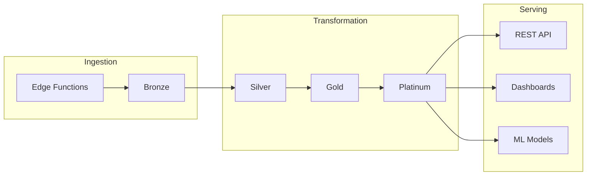

# Scout Platform - Automated Data Lineage
## Generated: $(date +"%Y-%m-%d %H:%M:%S")

## 🔄 Data Flow Pipeline

```mermaid
graph LR
    subgraph "Ingestion"
        EF[Edge Functions] --> B[Bronze]
    end
    
    subgraph "Transformation"
        B --> S[Silver]
        S --> G[Gold]
        G --> P[Platinum]
    end
    
    subgraph "Serving"
        P --> API[REST API]
        P --> D[Dashboards]
        P --> ML[ML Models]
    end
```

## Column Lineage Matrix

