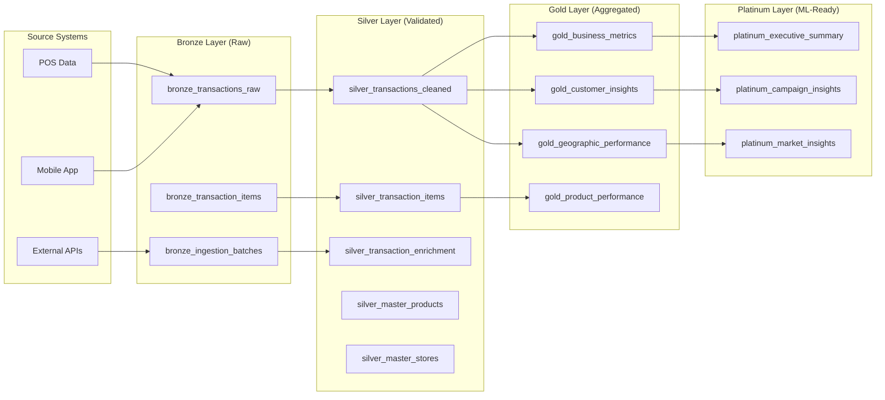
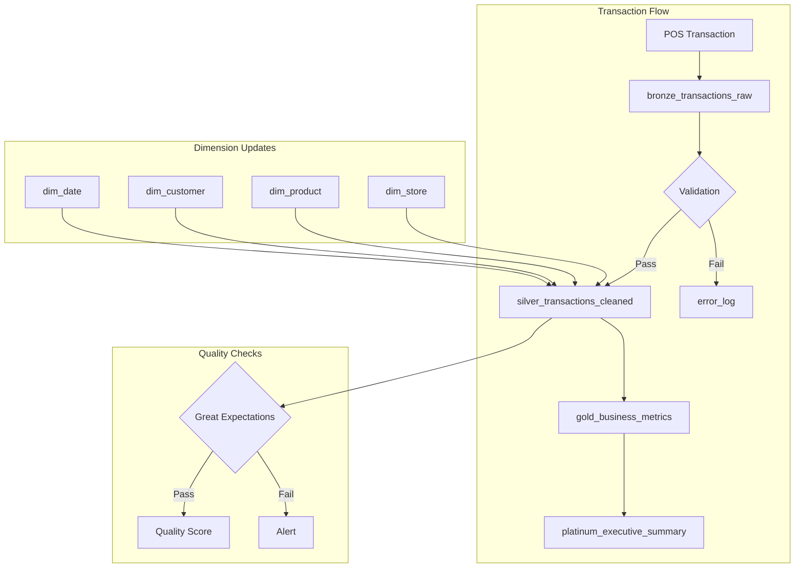

# Scout Platform - Data Lineage Documentation
## Column-Level Data Flow & Transformations
### Version 1.0 | Generated: January 2025

---

## **📊 Data Flow Overview**



---

## **🔄 Column-Level Lineage**

### **Bronze → Silver Transformation**

#### **bronze_transactions_raw → silver_transactions_cleaned**

| Bronze Column | Data Type | Silver Column | Transformation | Business Rule |
|--------------|-----------|---------------|---------------|---------------|
| `id` | uuid | `transaction_id` | Direct mapping | Primary key |
| `store_id` | uuid | `store_id` | Validated against dim_store | Must exist in dim_store |
| `timestamp` | timestamp | `transaction_date` | Timezone conversion to PH | Convert UTC to Asia/Manila |
| `peso_value` | numeric | `amount` | Validated range | Must be > 0 and < 1,000,000 |
| `units_per_transaction` | integer | `quantity` | Null to zero | COALESCE(units, 0) |
| `basket_size` | integer | `basket_size` | Direct mapping | Must be > 0 |
| `product_category` | text | `product_category` | Standardized case | LOWER(TRIM(category)) |
| `brand_name` | text | `brand_name` | Normalized | Match to brand master |
| `sku` | text | `sku` | Validated | Must exist in products |
| `location` | jsonb | *(decomposed)* | Extract fields | See location mapping below |
| `time_of_day` | enum | `time_of_day` | Direct mapping | Validated enum |
| `payment_method` | enum | `payment_method` | Direct mapping | Validated enum |
| `customer_type` | enum | `customer_type` | Direct mapping | Validated enum |
| `gender` | enum | `gender` | Direct mapping | Validated enum |
| `age_bracket` | enum | `age_bracket` | Direct mapping | Validated enum |
| `economic_class` | enum | `economic_class` | Direct mapping | Validated enum |
| `store_type` | enum | `store_type` | Direct mapping | Validated enum |
| `campaign_influenced` | boolean | `campaign_influenced` | Direct mapping | Default FALSE |
| `handshake_score` | numeric | `handshake_score` | Range validation | Between 0 and 1 |
| `is_tbwa_client` | boolean | `is_tbwa_client` | Direct mapping | Default FALSE |
| `created_at` | timestamp | `created_at` | Direct mapping | Audit field |
| `updated_at` | timestamp | `updated_at` | Current timestamp | NOW() on update |

#### **Location JSONB Decomposition**
```sql
-- Bronze: location JSONB
{
  "barangay": "Poblacion",
  "city": "Makati",
  "province": "Metro Manila",
  "region": "NCR"
}

-- Silver: Extracted to joins
LEFT JOIN scout.dim_store s ON bronze.store_id = s.store_id
-- Gets: s.barangay, s.city, s.province, s.region
```

---

### **Silver → Gold Transformation**

#### **silver_transactions_cleaned → gold_business_metrics**

| Silver Source | Aggregation | Gold Column | Formula | Update Frequency |
|---------------|------------|-------------|---------|------------------|
| `store_id, transaction_date` | GROUP BY | `store_id, date_key` | Date truncation | Daily |
| `amount` | SUM | `daily_revenue` | SUM(amount) | Daily |
| `amount` | AVG | `avg_transaction_value` | AVG(amount) | Daily |
| `transaction_id` | COUNT | `transaction_count` | COUNT(*) | Daily |
| `customer_type = 'new'` | COUNT | `new_customers` | COUNT(DISTINCT customer_id) WHERE new | Daily |
| `customer_type = 'regular'` | COUNT | `returning_customers` | COUNT(DISTINCT customer_id) WHERE returning | Daily |
| `basket_size` | AVG | `avg_basket_size` | AVG(basket_size) | Daily |
| `campaign_influenced` | COUNT | `campaign_transactions` | COUNT(*) WHERE campaign_influenced | Daily |
| `handshake_score` | AVG | `avg_engagement_score` | AVG(handshake_score) | Daily |
| `is_tbwa_client` | SUM | `tbwa_revenue` | SUM(amount) WHERE is_tbwa_client | Daily |
| `payment_method` | MODE | `top_payment_method` | MODE() WITHIN GROUP | Daily |

#### **Calculation Examples**
```sql
-- Daily Revenue
daily_revenue = SUM(amount) 
  WHERE DATE(transaction_date) = date_key
  GROUP BY store_id, date_key

-- Customer Lifetime Value (CLV)
clv = SUM(amount) / COUNT(DISTINCT customer_id)
  OVER (PARTITION BY customer_id ORDER BY transaction_date)

-- Market Share
market_share = store_revenue / regional_revenue * 100
  WHERE region = store.region
```

---

### **Gold → Platinum Transformation**

#### **gold_* → platinum_executive_summary**

| Gold Sources | ML/Analytics | Platinum Column | Algorithm | Purpose |
|--------------|--------------|-----------------|-----------|---------|
| `gold_business_metrics.*` | Time Series | `revenue_forecast` | ARIMA/Prophet | 30-day forecast |
| `gold_customer_insights.*` | Clustering | `customer_segments` | K-means | Segmentation |
| `gold_geographic_performance.*` | Geospatial | `expansion_opportunities` | Hotspot analysis | Site selection |
| `gold_product_performance.*` | Association | `product_recommendations` | Apriori/FP-Growth | Cross-sell |
| `gold_campaign_effect.*` | Causal | `campaign_roi` | Diff-in-diff | Impact measurement |

---

## **🔍 Data Quality Rules**

### **Bronze Layer Validation**
```yaml
Rules:
  - NOT NULL: [id, store_id, timestamp]
  - RANGE: peso_value BETWEEN 0 AND 1000000
  - ENUM: payment_method IN ('cash', 'gcash', 'maya', 'card')
  - FOREIGN KEY: store_id EXISTS IN dim_store
  - DATETIME: timestamp <= NOW()
```

### **Silver Layer Enrichment**
```yaml
Enrichments:
  - Geocoding: Add lat/long from store address
  - Time Features: Extract hour, day_of_week, is_weekend
  - Customer ID: Generate from phone_hash if available
  - Product Hierarchy: Add category, subcategory, brand_family
  - Store Attributes: Add cluster, tier, potential
```

### **Gold Layer Aggregation Rules**
```yaml
Aggregations:
  - Temporal: Daily, Weekly, Monthly, Quarterly
  - Geographic: Barangay, City, Province, Region, National
  - Product: SKU, Brand, Category, Subcategory
  - Customer: Individual, Segment, Cohort
  - Store: Individual, Cluster, Tier
```

---

## **📐 Lineage Diagram**



---

## **🔗 Dependency Graph**

```yaml
Level 0 (Sources):
  - External APIs
  - POS Systems
  - Mobile Apps

Level 1 (Bronze):
  - bronze_transactions_raw
  - bronze_transaction_items
  - bronze_ingestion_batches

Level 2 (Silver):
  Dependencies: [Level 1]
  - silver_transactions_cleaned
  - silver_transaction_enrichment
  - silver_master_products
  - silver_master_stores
  - silver_master_customers

Level 3 (Gold):
  Dependencies: [Level 2]
  - gold_business_metrics
  - gold_customer_insights
  - gold_geographic_performance
  - gold_product_performance
  - gold_campaign_effect

Level 4 (Platinum):
  Dependencies: [Level 3]
  - platinum_executive_summary
  - platinum_campaign_insights
  - platinum_market_insights
  - platinum_operational_health

Level 5 (Serving):
  Dependencies: [Level 3, Level 4]
  - API Views
  - Dashboard Views
  - Export Views
```

---

## **🔄 Refresh Schedule**

| Layer | Table/View | Refresh Frequency | Method | SLA |
|-------|------------|-------------------|--------|-----|
| **Bronze** | bronze_transactions_raw | Real-time | Stream | < 1 min |
| **Silver** | silver_transactions_cleaned | Every 5 min | Incremental | < 10 min |
| **Gold** | gold_business_metrics | Every 30 min | Full refresh | < 1 hour |
| **Gold** | gold_customer_insights | Every 2 hours | Incremental | < 2 hours |
| **Platinum** | platinum_executive_summary | Every 6 hours | ML pipeline | < 6 hours |
| **Views** | Materialized views | Every 2 hours | REFRESH CONCURRENTLY | < 2 hours |

---

## **📊 Impact Analysis**

### **If bronze_transactions_raw changes:**
```yaml
Immediate Impact:
  - silver_transactions_cleaned (transformation)
  - bronze_ingestion_batches (audit)
  
Downstream Impact:
  - All gold_* tables
  - All platinum_* views
  - All API endpoints
  - All dashboards
  
Estimated Propagation Time: 2-6 hours
```

### **If dim_store changes:**
```yaml
Immediate Impact:
  - silver_transactions_cleaned (JOIN)
  - gold_geographic_performance (aggregation)
  
Downstream Impact:
  - Store performance dashboards
  - Geographic analytics
  - Expansion recommendations
  
Estimated Propagation Time: 30 minutes
```

---

## **🔍 Query Lineage Examples**

### **Example 1: Daily Revenue**
```sql
-- Source Path:
-- POS System -> bronze_transactions_raw -> silver_transactions_cleaned -> gold_business_metrics

SELECT 
    date_key,
    SUM(daily_revenue) as total_revenue
FROM scout.gold_business_metrics
WHERE date_key >= CURRENT_DATE - 30
GROUP BY date_key;

-- Lineage:
-- gold_business_metrics.daily_revenue <- 
--   SUM(silver_transactions_cleaned.amount) <- 
--     bronze_transactions_raw.peso_value
```

### **Example 2: Customer Segmentation**
```sql
-- Source Path:
-- Multiple transactions -> Customer aggregation -> ML clustering -> Segment assignment

SELECT 
    customer_segment,
    COUNT(*) as customer_count,
    AVG(lifetime_value) as avg_ltv
FROM scout.platinum_customer_segments
GROUP BY customer_segment;

-- Lineage:
-- platinum_customer_segments.customer_segment <-
--   ML_MODEL(gold_customer_insights.*) <-
--     AGGREGATE(silver_transactions_cleaned BY customer_id) <-
--       bronze_transactions_raw.*
```

---

## **🛠️ Lineage Tools Integration**

### **dbt Integration**
```yaml
# dbt_project.yml
models:
  scout:
    bronze:
      +tags: ["raw", "immutable"]
      +docs:
        show: true
    silver:
      +tags: ["validated", "enriched"]
      +docs:
        show: true
    gold:
      +tags: ["aggregated", "business"]
      +docs:
        show: true
        
# Generate lineage:
dbt docs generate
dbt docs serve
```

### **SQL Lineage Query**
```sql
-- Get column dependencies
WITH RECURSIVE lineage AS (
  SELECT 
    source_schema,
    source_table,
    source_column,
    target_schema,
    target_table,
    target_column,
    1 as level
  FROM scout.data_lineage
  WHERE source_table = 'bronze_transactions_raw'
  
  UNION ALL
  
  SELECT 
    l.source_schema,
    l.source_table,
    l.source_column,
    d.target_schema,
    d.target_table,
    d.target_column,
    l.level + 1
  FROM lineage l
  JOIN scout.data_lineage d 
    ON l.target_table = d.source_table
    AND l.target_column = d.source_column
)
SELECT * FROM lineage
ORDER BY level, target_table, target_column;
```

---

## **📈 Metrics & Monitoring**

### **Data Freshness Monitoring**
```sql
CREATE OR REPLACE VIEW scout.v_data_freshness AS
SELECT 
    'bronze_transactions_raw' as table_name,
    MAX(created_at) as last_update,
    EXTRACT(EPOCH FROM (NOW() - MAX(created_at)))/60 as minutes_lag
FROM scout.bronze_transactions_raw
UNION ALL
SELECT 
    'silver_transactions_cleaned',
    MAX(updated_at),
    EXTRACT(EPOCH FROM (NOW() - MAX(updated_at)))/60
FROM scout.silver_transactions_cleaned
UNION ALL
SELECT 
    'gold_business_metrics',
    MAX(last_refreshed),
    EXTRACT(EPOCH FROM (NOW() - MAX(last_refreshed)))/60
FROM scout.gold_business_metrics;
```

---

## **📚 Related Documentation**

- [Data Dictionary](../dictionary/DATA_DICTIONARY.md)
- [Transformation Rules](../transformations/RULES.md)
- [Quality Framework](../quality/FRAMEWORK.md)
- [dbt Documentation](https://scout-analytics.getdbt.com)

---

## **Version History**

| Version | Date | Author | Changes |
|---------|------|--------|---------|
| 1.0 | 2025-01-15 | Data Team | Initial lineage documentation |

---

*This lineage documentation is auto-generated from database metadata and dbt manifests.*
