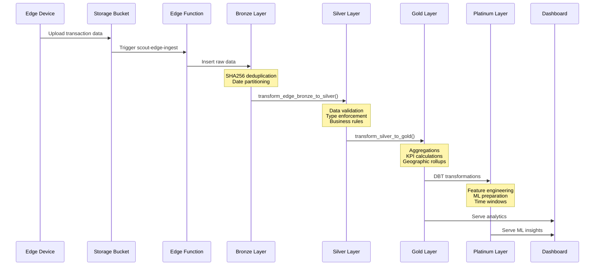
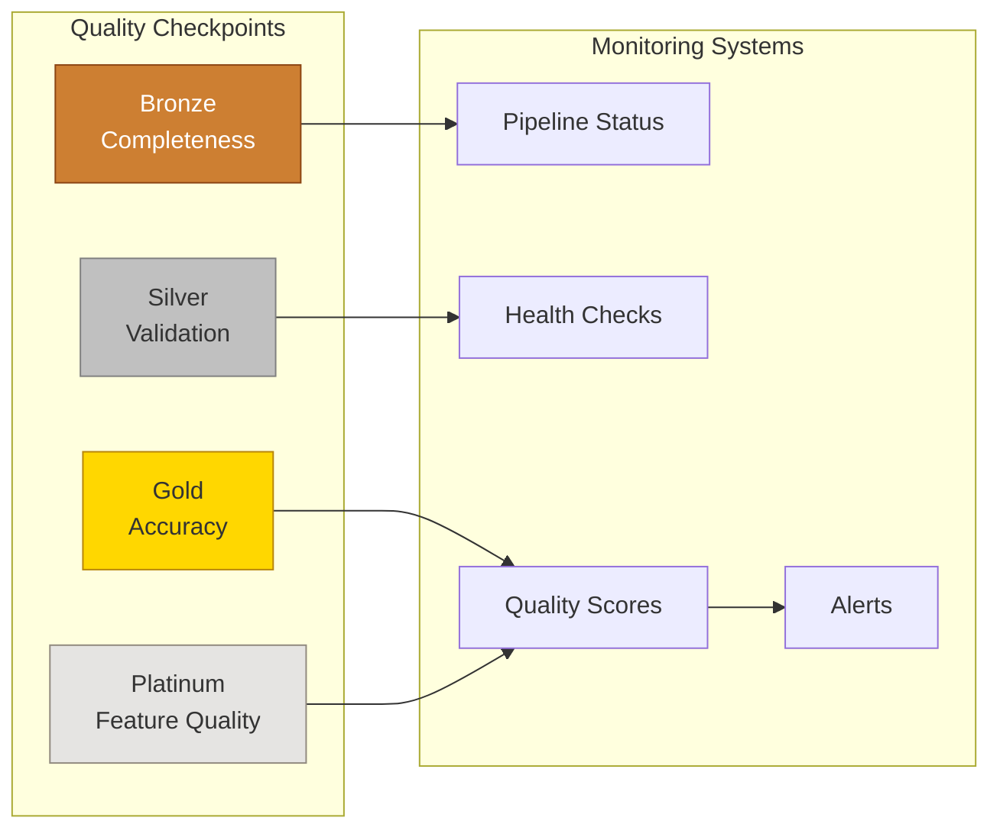

# Data Processing Flow Diagram

## Medallion Architecture Data Flow

```mermaid
graph TB
    %% Data Sources
    subgraph "🌐 Data Sources"
        E1[📱 Edge Devices<br/>Raspberry Pi 5]
        E2[☁️ Storage Buckets<br/>scout-ingest]
        E3[🌍 Web Scraping<br/>isko-scraper]
        E4[🔌 External APIs]
        E5[📁 Manual Uploads<br/>CSV/JSON]
    end

    %% Ingestion Layer
    subgraph "📥 Ingestion Layer"
        I1[scout-edge-ingest<br/>Edge Function]
        I2[Storage Uploader<br/>Role]
        I3[ETL Queue<br/>scout.etl_queue]
    end

    %% Bronze Layer
    subgraph "🥉 Bronze Layer (Raw)"
        B1[(bronze_edge_raw<br/>Raw JSON Payloads)]
        B2[(bronze_transactions_raw<br/>Unprocessed Transactions)]
        B3[SHA256 Deduplication]
        B4[Date Partitioning]
    end

    %% Silver Layer
    subgraph "🥈 Silver Layer (Cleansed)"
        S1[transform_edge_bronze_to_silver()]
        S2[(silver_transactions<br/>Validated & Typed)]
        S3[(silver_products<br/>Normalized Catalog)]
        S4[Business Rules<br/>Validation]
    end

    %% Gold Layer
    subgraph "🥇 Gold Layer (Analytics)"
        G1[transform_silver_to_gold()]
        G2[(fact_transactions<br/>Transaction Facts)]
        G3[(fact_transaction_items<br/>Line Items)]
        G4[(gold_store_daily_summary<br/>Daily Metrics)]
        G5[(gold_region_choropleth<br/>Geographic Analytics)]
    end

    %% Platinum Layer
    subgraph "💎 Platinum Layer (ML/AI)"
        P1[DBT Models]
        P2[(Feature Store<br/>ML Features)]
        P3[(Time Series<br/>Windows)]
        P4[(Predictive Models<br/>Training Data)]
    end

    %% Serving Layer
    subgraph "📊 Serving Layer"
        SV1[Scout Dashboard]
        SV2[REST APIs]
        SV3[Parquet Export]
        SV4[BI Tools<br/>Superset]
    end

    %% Monitoring
    subgraph "🔍 Monitoring & Quality"
        M1[Pipeline Status<br/>v_zip_pipeline_status]
        M2[Health Checks<br/>pipeline_health_check()]
        M3[Quality Sentinel<br/>Edge Function]
        M4[Data Lineage<br/>source_file tracking]
    end

    %% Flow connections
    E1 --> I1
    E2 --> I2
    E3 --> I3
    E4 --> I3
    E5 --> I2

    I1 --> B1
    I2 --> B2
    I3 --> B1

    B1 --> B3
    B2 --> B3
    B3 --> B4
    B4 --> S1

    S1 --> S2
    S1 --> S3
    S2 --> S4
    S3 --> S4

    S4 --> G1
    G1 --> G2
    G1 --> G3
    G1 --> G4
    G1 --> G5

    G2 --> P1
    G3 --> P1
    G4 --> P1
    P1 --> P2
    P1 --> P3
    P1 --> P4

    G2 --> SV1
    G3 --> SV1
    G4 --> SV1
    G5 --> SV1
    G2 --> SV2
    P2 --> SV3
    G5 --> SV4

    %% Monitoring connections (dotted lines)
    B1 -.-> M1
    S2 -.-> M2
    G2 -.-> M3
    P2 -.-> M4

    classDef source fill:#e1f5fe,stroke:#01579b,stroke-width:2px
    classDef bronze fill:#cd7f32,stroke:#8b4513,stroke-width:2px,color:#fff
    classDef silver fill:#c0c0c0,stroke:#808080,stroke-width:2px
    classDef gold fill:#ffd700,stroke:#b8860b,stroke-width:2px
    classDef platinum fill:#e5e4e2,stroke:#918a7f,stroke-width:2px
    classDef serving fill:#4caf50,stroke:#2e7d32,stroke-width:2px,color:#fff
    classDef monitoring fill:#ff9800,stroke:#e65100,stroke-width:2px,color:#fff

    class E1,E2,E3,E4,E5 source
    class B1,B2,B3,B4 bronze
    class S1,S2,S3,S4 silver
    class G1,G2,G3,G4,G5 gold
    class P1,P2,P3,P4 platinum
    class SV1,SV2,SV3,SV4 serving
    class M1,M2,M3,M4 monitoring
```

## Processing Pipeline Details



## Data Quality & Monitoring Flow



## Key Features by Layer

| Layer | Purpose | Key Features |
|-------|---------|--------------|
| 🥉 Bronze | Raw data preservation | • Immutable storage<br/>• Content hashing<br/>• Partitioning |
| 🥈 Silver | Data cleansing | • Type validation<br/>• Deduplication<br/>• Standardization |
| 🥇 Gold | Business analytics | • Pre-aggregated KPIs<br/>• Time-series data<br/>• Geographic insights |
| 💎 Platinum | ML/AI features | • Feature engineering<br/>• Training datasets<br/>• Predictive inputs |

## Technologies Used

- **Database**: PostgreSQL with PostGIS extensions
- **Functions**: Supabase Edge Functions (Deno)
- **Orchestration**: DBT + SQL transformations
- **Storage**: Supabase Storage (S3-compatible)
- **Monitoring**: Custom SQL views and health checks
- **Export**: Parquet format for data science workflows