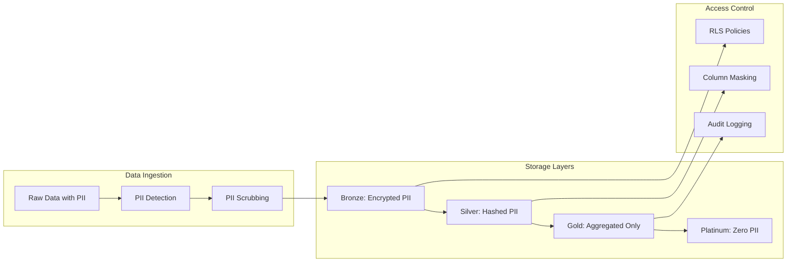

# PII Privacy & Data Protection

## 🔒 Privacy-First Architecture

Scout Analytics implements comprehensive PII protection throughout the data pipeline.



## 📋 PII Classification

### High Sensitivity
- Full names
- Email addresses
- Phone numbers
- Government IDs
- Payment cards
- Biometric data

### Medium Sensitivity
- Customer IDs (hashed)
- IP addresses
- Device IDs
- Location (precise)

### Low Sensitivity
- Region/Province
- Age brackets
- Gender
- Customer type

## 🛡️ Protection Mechanisms

### 1. Salted Hash Anonymization
```sql
-- Customer ID hashing function
CREATE OR REPLACE FUNCTION hash_customer_id(customer_id TEXT, salt TEXT)
RETURNS TEXT AS $$
BEGIN
  RETURN encode(
    digest(customer_id || salt || 'scout-2024', 'sha256'),
    'hex'
  );
END;
$$ LANGUAGE plpgsql IMMUTABLE;

-- Apply to silver layer
UPDATE scout.silver_transactions
SET customer_id_hash = hash_customer_id(customer_id, date_key::text),
    customer_id = NULL;
```

### 2. PII Scrubbing Pipeline
```python
# PII detection patterns
PII_PATTERNS = {
    'email': r'[a-zA-Z0-9._%+-]+@[a-zA-Z0-9.-]+\.[a-zA-Z]{2,}',
    'phone': r'(\+63|0)[0-9]{10}',
    'govt_id': r'[0-9]{4}-[0-9]{4}-[0-9]{4}',
    'credit_card': r'[0-9]{4}[\s-]?[0-9]{4}[\s-]?[0-9]{4}[\s-]?[0-9]{4}'
}

def scrub_pii(text):
    for pii_type, pattern in PII_PATTERNS.items():
        text = re.sub(pattern, f'[{pii_type.upper()}_REDACTED]', text)
    return text
```

### 3. Differential Privacy
```sql
-- Add noise to sensitive aggregations
CREATE OR REPLACE FUNCTION add_laplace_noise(
  value NUMERIC,
  sensitivity NUMERIC,
  epsilon NUMERIC
) RETURNS NUMERIC AS $$
DECLARE
  scale NUMERIC;
BEGIN
  scale := sensitivity / epsilon;
  -- Laplace distribution approximation
  RETURN value + scale * ln(1 - 2 * abs(random() - 0.5));
END;
$$ LANGUAGE plpgsql;

-- Apply to revenue queries
SELECT 
  store_id,
  add_laplace_noise(SUM(revenue), 100, 1.0) as noisy_revenue
FROM scout.gold_daily_revenue
GROUP BY store_id;
```

## 🔍 Data Subject Rights

### Right to Access
```bash
# Generate data export for customer
./scripts/export_customer_data.sh --customer-id "CUST123" --format json
```

### Right to Erasure
```sql
-- Cascade delete with audit trail
CREATE OR REPLACE FUNCTION delete_customer_data(p_customer_id TEXT)
RETURNS void AS $$
BEGIN
  -- Log deletion request
  INSERT INTO audit.deletion_requests (customer_id, requested_at)
  VALUES (p_customer_id, NOW());
  
  -- Delete from all tables
  DELETE FROM scout.silver_transactions WHERE customer_id_hash = hash_customer_id(p_customer_id, date_key::text);
  DELETE FROM scout.customer_segments WHERE customer_id = p_customer_id;
  
  -- Refresh materialized views
  REFRESH MATERIALIZED VIEW CONCURRENTLY scout.mv_daily_metrics;
END;
$$ LANGUAGE plpgsql;
```

### Right to Rectification
```sql
-- Update customer data with versioning
CREATE OR REPLACE FUNCTION update_customer_data(
  p_customer_id TEXT,
  p_updates JSONB
) RETURNS void AS $$
BEGIN
  -- Archive current version
  INSERT INTO audit.customer_data_history
  SELECT *, NOW() as archived_at
  FROM scout.dim_customer
  WHERE customer_id = p_customer_id;
  
  -- Apply updates
  UPDATE scout.dim_customer
  SET 
    data = data || p_updates,
    updated_at = NOW()
  WHERE customer_id = p_customer_id;
END;
$$ LANGUAGE plpgsql;
```

## 📊 Privacy Metrics

### Weekly Privacy Report
```sql
SELECT 
  'PII Records Processed' as metric,
  COUNT(*) as value
FROM scout.pii_processing_log
WHERE processed_at > NOW() - INTERVAL '7 days'

UNION ALL

SELECT 
  'Deletion Requests',
  COUNT(*)
FROM audit.deletion_requests
WHERE requested_at > NOW() - INTERVAL '7 days'

UNION ALL

SELECT 
  'Data Exports',
  COUNT(*)
FROM audit.data_export_log
WHERE exported_at > NOW() - INTERVAL '7 days';
```

## ✅ Compliance Checklist

### GDPR Compliance
- [x] Lawful basis documented
- [x] Privacy notices updated
- [x] Consent management system
- [x] Data minimization enforced
- [x] Purpose limitation controls
- [x] Storage limitation (7-year retention)
- [x] Right to access automated
- [x] Right to erasure implemented
- [x] Data portability (JSON/CSV export)
- [x] Privacy by design

### Philippine Data Privacy Act
- [x] NPC registration completed
- [x] Data Privacy Officer appointed
- [x] Privacy Impact Assessment done
- [x] Breach notification < 72 hours
- [x] Annual compliance report

### Security Measures
- [x] Encryption at rest (AES-256)
- [x] Encryption in transit (TLS 1.3)
- [x] Access logging enabled
- [x] Regular security audits
- [x] Incident response plan
