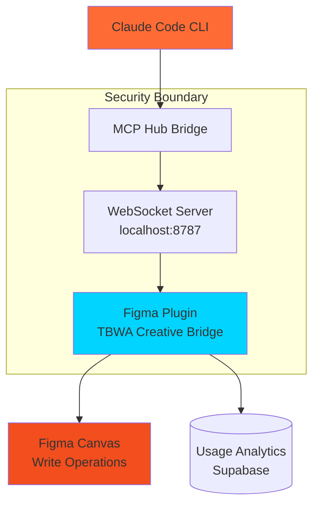

# Figma Bridge MCP Write Capabilities

Complete guide to TBWA's Figma Bridge Plugin enabling write operations in Figma via Claude Code CLI through Model Context Protocol (MCP).

## Overview

The Figma Bridge Plugin solves the fundamental limitation that the Figma REST API and Dev Mode MCP are **read-only**. This architecture enables Claude to perform write operations in Figma by:

1. **Local Plugin**: Runs inside Figma with full write permissions
2. **WebSocket Bridge**: Secure local-only communication channel  
3. **MCP Hub**: Translates Claude commands to Figma operations
4. **Validation Layer**: Ensures safe and valid operations

## Architecture



## Installation & Setup

### 1. Start MCP Hub Bridge

```bash
# Start the WebSocket bridge server
./scripts/figma.sh start

# Verify status
./scripts/figma.sh status
```

### 2. Install Figma Plugin

```bash
# Show installation instructions  
./scripts/figma.sh install
```

**Manual Steps**:
1. Open Figma Desktop
2. Go to: Plugins → Development → Import plugin from manifest...
3. Select: `creative-studio/figma-bridge-plugin/manifest.json`
4. Run "TBWA Creative Bridge" plugin
5. Verify "Connected to Claude MCP Hub" status

### 3. Configure Claude MCP

The bridge is automatically detected when Claude Desktop has the Figma MCP server configured:

```json
{
  "mcpServers": {
    "figma": {
      "command": "npx",
      "args": ["@figma/mcp-server", "--bridge=localhost:8787"],
      "env": {}
    }
  }
}
```

## Available MCP Tools

### FigJam Operations

#### `figma_create_sticky`
Create sticky notes in FigJam boards.

```typescript
interface StickyParams {
  text: string;           // Sticky note content (required)
  x?: number;            // X position (optional, default: 100)
  y?: number;            // Y position (optional, default: 100) 
  color?: 'yellow' | 'blue' | 'green' | 'pink' | 'red' | 'purple' | 'orange';
}
```

**Example Usage**:
```javascript
// Claude command: "Create a blue sticky note with sprint retrospective notes"
await figma_create_sticky({
  text: "Sprint Retrospective: What went well?",
  color: "blue",
  x: 200,
  y: 150
});
```

### Figma Frame Operations

#### `figma_create_frame`
Create frames (containers) in Figma designs.

```typescript
interface FrameParams {
  name: string;          // Frame name (required)
  width: number;         // Width in pixels (required, 1-16000)
  height: number;        // Height in pixels (required, 1-16000)
  x?: number;           // X position (optional, default: 100)
  y?: number;           // Y position (optional, default: 100)
}
```

**Example Usage**:
```javascript
// Claude command: "Create a mobile frame for iPhone 14 Pro"
await figma_create_frame({
  name: "iPhone 14 Pro",
  width: 393,
  height: 852,
  x: 100,
  y: 100
});
```

### Component Operations

#### `figma_create_component`
Convert selection into a reusable component.

```typescript
interface ComponentParams {
  name: string;          // Component name (required)
  width: number;         // Component width (required)
  height: number;        // Component height (required)
}
```

**Prerequisites**: Elements must be selected in Figma before calling.

**Example Usage**:
```javascript
// User selects button design elements
// Claude command: "Convert selection to a button component"
await figma_create_component({
  name: "Primary Button",
  width: 120,
  height: 40
});
```

#### `figma_place_component`
Place an instance of an existing component.

```typescript
interface PlaceComponentParams {
  key: string;           // Figma component key (required)
  name?: string;         // Instance name (optional)
  x?: number;           // X position (optional, default: 100)
  y?: number;           // Y position (optional, default: 100)
}
```

**Example Usage**:
```javascript
// Claude command: "Place the header component here"
await figma_place_component({
  key: "4d5e6f7g8h9i0j1k2l3m4n5o6p7q8r9s0t1u2v3w",
  name: "Page Header Instance",
  x: 0,
  y: 0
});
```

### Selection Operations

#### `figma_rename_selection`
Rename all currently selected elements.

```typescript
interface RenameParams {
  name: string;          // New name for selected elements (required)
}
```

**Prerequisites**: One or more elements must be selected.

**Example Usage**:
```javascript
// User selects multiple UI elements
// Claude command: "Rename selected elements to Navigation Items"
await figma_rename_selection({
  name: "Navigation Item"
});
```

### Dashboard Operations

#### `figma_create_dashboard_layout`
Generate complete dashboard layouts from specifications.

```typescript
interface DashboardParams {
  title: string;         // Dashboard title (required)
  grid: {
    cols: number;        // Number of columns (1-12)
    gutter: number;      // Gutter size in pixels (0-200)
  };
  tiles: Array<{
    id: string;          // Unique tile identifier
    type: string;        // Tile type: 'metric' | 'line' | 'bar' | 'table'
    x: number;           // Grid column position (0-based)
    y: number;           // Grid row position (0-based) 
    w: number;           // Width in grid columns (1-cols)
    h: number;           // Height in grid rows (1-20)
  }>;
}
```

**Example Usage**:
```javascript
// Claude command: "Create a sales dashboard with KPIs and charts"
await figma_create_dashboard_layout({
  title: "Q4 Sales Dashboard",
  grid: { cols: 4, gutter: 16 },
  tiles: [
    { id: "revenue", type: "metric", x: 0, y: 0, w: 1, h: 1 },
    { id: "sales_chart", type: "line", x: 1, y: 0, w: 3, h: 2 },
    { id: "top_products", type: "bar", x: 0, y: 2, w: 2, h: 2 },
    { id: "customer_table", type: "table", x: 2, y: 2, w: 2, h: 2 }
  ]
});
```

### Brand System Operations

#### `figma_apply_brand_tokens`
Apply design tokens to selected elements.

```typescript
interface BrandTokenParams {
  tokens: {
    colors?: Record<string, string>;      // Hex color values
    typography?: {
      heading?: { fontFamily: string };
      body?: { fontFamily: string };
    };
    spacing?: Record<string, number>;     // Pixel values
    borderRadius?: Record<string, number>; // Pixel values
  };
}
```

**Prerequisites**: Elements should be selected to apply tokens.

**Example Usage**:
```javascript
// Claude command: "Apply TBWA brand colors to selected elements"
await figma_apply_brand_tokens({
  tokens: {
    colors: {
      primary: "#FF6B35",
      secondary: "#004E89", 
      accent: "#00D4FF"
    },
    typography: {
      heading: { fontFamily: "Inter" },
      body: { fontFamily: "Inter" }
    },
    spacing: {
      small: 8,
      medium: 16,
      large: 24
    },
    borderRadius: {
      small: 4,
      medium: 8,
      large: 16
    }
  }
});
```

### Status Operations

#### `figma_get_status`
Get current bridge connection status and diagnostics.

```typescript
interface StatusResponse {
  connected: boolean;        // WebSocket connection status
  clientCount: number;       // Number of connected plugins
  pendingCommands: number;   // Commands awaiting response
}
```

**Example Usage**:
```javascript
// Claude command: "Check Figma bridge status"
const status = await figma_get_status();
// Returns: { connected: true, clientCount: 1, pendingCommands: 0 }
```

## Advanced Usage Patterns

### 1. Batch Operations
```javascript
// Create multiple stickies for brainstorming
const topics = ["User Research", "Competitive Analysis", "Feature Ideation"];
for (const topic of topics) {
  await figma_create_sticky({
    text: topic,
    color: "yellow",
    x: 100 + (topics.indexOf(topic) * 200),
    y: 100
  });
}
```

### 2. Responsive Dashboard Creation
```javascript
// Create mobile and desktop dashboard versions
const dashboards = [
  { title: "Mobile Dashboard", width: 375, cols: 2 },
  { title: "Desktop Dashboard", width: 1440, cols: 4 }
];

for (const dash of dashboards) {
  await figma_create_dashboard_layout({
    title: dash.title,
    grid: { cols: dash.cols, gutter: 16 },
    tiles: [
      { id: "kpi1", type: "metric", x: 0, y: 0, w: 1, h: 1 },
      { id: "chart1", type: "line", x: 1, y: 0, w: dash.cols-1, h: 2 }
    ]
  });
}
```

### 3. Design System Audit
```javascript
// Audit and standardize naming across components
const componentNames = [
  "Button/Primary/Large",
  "Button/Secondary/Medium", 
  "Card/Product/Default"
];

// User selects each component, Claude renames systematically
for (const name of componentNames) {
  await figma_rename_selection({ name });
  // Wait for user to select next component
}
```

## Security & Safety

### Input Validation
All commands are validated before execution:

- **Text Content**: Sanitized to prevent script injection, limited to 5000 characters
- **Dimensions**: Clamped between 1-16000 pixels to prevent resource exhaustion  
- **Positions**: Limited to reasonable canvas bounds (-50000 to 50000)
- **Names**: Sanitized to remove invalid file system characters
- **Colors**: Restricted to predefined safe color palette

### Network Security
- **Local Only**: WebSocket server only accepts localhost connections
- **No Authentication**: No tokens or passwords transmitted
- **Ephemeral**: Bridge runs only when needed, no persistent connections
- **Sandboxed**: Plugin runs in Figma's security sandbox

### Command Authorization
- **Explicit User Actions**: All operations require user to run the plugin
- **Visual Confirmation**: Users see all changes immediately in Figma
- **Undo Support**: All operations are undoable through Figma's undo system
- **No File Access**: Plugin cannot read/write files outside Figma

## Usage Analytics

The bridge automatically logs usage for design system analytics:

```typescript
interface UsageLog {
  component_id: string;    // Component or operation type
  action: string;          // Action performed
  platform: string;       // 'figma' or 'figjam'
  context: any;           // Additional context data
  user_id: string;        // Figma user ID
  timestamp: string;      // ISO timestamp
}
```

**Tracked Operations**:
- Component creation and placement
- Dashboard layout generation  
- Brand token application
- Sticky note creation
- Frame operations

**Analytics Use Cases**:
- Design system adoption metrics
- Popular component usage
- Dashboard template effectiveness
- User workflow optimization

## Troubleshooting

### Common Issues

#### 1. Plugin Not Connecting
```bash
# Check bridge status
./scripts/figma.sh status

# Restart bridge if needed
./scripts/figma.sh restart

# Verify plugin is running in Figma
```

#### 2. Commands Not Executing
- Ensure Figma plugin shows "Connected" status
- Check that required selections are made (for component/rename operations)
- Verify command parameters meet validation requirements

#### 3. Performance Issues
```bash
# Check pending commands
./scripts/figma.sh status

# Restart bridge to clear pending operations
./scripts/figma.sh restart
```

### Error Messages

| Error | Cause | Solution |
|-------|-------|----------|
| "No Figma plugins connected" | Plugin not running | Start plugin in Figma |
| "Command timeout" | Plugin unresponsive | Restart plugin and bridge |
| "Validation failed" | Invalid parameters | Check parameter requirements |
| "No selection" | Required selection missing | Select elements in Figma |
| "Connection failed" | Bridge not running | Run `./scripts/figma.sh start` |

### Debug Mode

Enable detailed logging:

```bash
# Start bridge with verbose logging
DEBUG=figma-bridge ./scripts/figma.sh start

# Monitor bridge logs
tail -f /tmp/figma-mcp-hub.log
```

## Limitations

### Current Limitations
- **Single Plugin Connection**: One plugin instance at a time
- **Local Network Only**: Bridge requires localhost access
- **Manual Plugin Start**: Must manually run plugin in Figma
- **Figma Desktop Only**: Does not work with browser version
- **Text-Based Operations**: No image or vector manipulation

### Platform Constraints
- **Figma API Limits**: Some operations may be slower than native Figma actions
- **WebSocket Stability**: Connection may drop on network changes
- **Plugin Permissions**: Limited by Figma's plugin security model
- **Canvas Size**: Operations limited to Figma's canvas constraints

## Roadmap

### Near Term (Q1 2025)
- [ ] **Auto-reconnection**: Improved WebSocket reliability
- [ ] **Batch Commands**: Execute multiple operations atomically
- [ ] **Component Library**: Integration with team component libraries
- [ ] **Template System**: Pre-built dashboard and layout templates

### Medium Term (Q2 2025)  
- [ ] **Figma Variables**: Integration with Figma's variable system
- [ ] **Auto Layout**: Enhanced auto-layout configuration
- [ ] **Plugin Discovery**: Automatic plugin installation flow
- [ ] **Design Tokens**: Full design token import/export

### Long Term (Q3+ 2025)
- [ ] **Multi-User Support**: Collaborative operations across team members
- [ ] **Version Control**: Integration with version control systems
- [ ] **AI Design Assistance**: Enhanced AI-powered design suggestions
- [ ] **Cross-Platform**: Support for FigJam and other Figma products

## API Reference

### Command Structure
All Figma bridge commands follow this structure:

```typescript
interface BridgeCommand {
  type: string;          // Command type identifier
  id?: string;          // Unique command ID (auto-generated)
  timestamp?: number;    // Command timestamp (auto-generated)
  [key: string]: any;   // Command-specific parameters
}
```

### Response Structure
```typescript
interface BridgeResponse {
  ok: boolean;          // Success status
  id: string;           // Matching command ID
  error?: string;       // Error message if failed
  result?: any;         // Command-specific result data
  timestamp: number;    // Response timestamp
}
```

### Validation Schema
Each command type has a specific validation schema. See `infra/mcp-hub/src/validation/figma-commands.ts` for complete validation rules.

## Contributing

### Development Setup
```bash
# Install dependencies
cd infra/mcp-hub
npm install

# Build TypeScript
npm run build

# Run tests  
npm test

# Start development server
npm run dev
```

### Adding New Commands
1. **Define Command Interface**: Add to `main.ts` in plugin
2. **Implement Handler**: Add command handler in plugin
3. **Add Validation**: Define validation rules in `figma-commands.ts`
4. **Create MCP Tool**: Add to `figma-bridge.ts` adapter
5. **Write Tests**: Add test cases to automated test suite
6. **Update Documentation**: Update this document with new capabilities

### Testing
```bash
# Run automated tests
node tests/figma-bridge/automated-tests.js

# Run manual UAT
# Follow tests/figma-bridge/uat-checklist.md
```

## Support

### Internal Support
- **Slack**: #figma-bridge-support  
- **Documentation**: This document
- **Source Code**: `creative-studio/figma-bridge-plugin/`

### External Resources
- **Figma Plugin API**: https://www.figma.com/plugin-docs/
- **WebSocket API**: https://developer.mozilla.org/en-US/docs/Web/API/WebSocket
- **MCP Protocol**: https://modelcontextprotocol.io/

---

**Last Updated**: 2025-01-28  
**Version**: 1.0.0  
**Maintainer**: TBWA Enterprise Data Platform Team