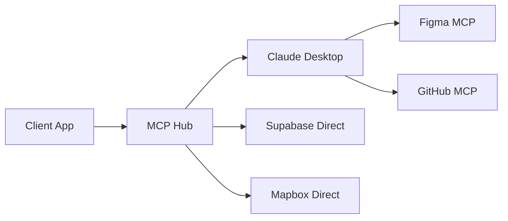

# MCP Hub Documentation

**Owner**: @jgtolentino  
**SLO**: 99.9% uptime, <100ms routing latency  
**Version**: 2.0.0 (Token-free routing)  

## Overview

MCP Hub is a unified HTTP API gateway that routes requests to Model Context Protocol (MCP) servers. Since v2.0, it operates as a **token-free router**, delegating authentication to Claude Desktop MCPs.

## Architecture



## Endpoints

### Health Check
```http
GET /health
```
Response: `{"ok": true}`

### OpenAPI Schema
```http
GET /openapi.json
```
Returns OpenAPI 3.0 specification for Custom GPT integration.

### MCP Run
```http
POST /mcp/run
X-API-Key: {HUB_API_KEY}
Content-Type: application/json

{
  "server": "figma|github|sync|supabase|mapbox",
  "tool": "{tool_name}",
  "args": {}
}
```

## Server Adapters

### Direct Adapters (with tokens)
| Server | Type | Auth | Description |
|--------|------|------|-------------|
| `supabase` | Direct | Service Role Key | Database operations |
| `mapbox` | Direct | API Token | Geospatial services |

### MCP Routers (no tokens)
| Server | Type | Auth | Description |
|--------|------|------|-------------|
| `figma` | MCP Router | Claude Desktop | Design file access |
| `github` | MCP Router | Claude Desktop | Repository operations |
| `sync` | Orchestrator | Both MCPs | Figma→GitHub workflows |

## Configuration

### Environment Variables
```bash
# Required
HUB_API_KEY=32_char_minimum_secure_key
PORT=8787

# Supabase (if using)
SUPABASE_URL=https://project.supabase.co
SUPABASE_PROJECT_REF=project_ref
SUPABASE_SERVICE_ROLE=service_role_key

# Mapbox (if using)
MAPBOX_TOKEN=pk.xxx

# GitHub target
GITHUB_REPO=owner/repo

# NO TOKENS for Figma/GitHub - handled by Claude Desktop
```

## Tool Mappings

### Figma MCP Router
```yaml
file.exportJSON: get_file_data
nodes.get: get_selection
images.export: get_image
```

### GitHub MCP Router  
```yaml
repo.commitFile: create_or_update_file
repo.search: search_repositories
repo.createPR: create_pull_request
```

## How We Test It

### Unit Tests
```bash
npm test
```
- Adapter initialization
- Request routing logic
- Error handling

### Integration Tests
```bash
npm run test:integration
```
- End-to-end MCP routing
- Claude Desktop communication
- Rate limiting behavior

### Load Testing
```bash
npm run test:load
```
- 1000 req/min sustained
- 5000 req/min burst
- Memory leak detection

## How It Fails

### Common Failure Modes

1. **Claude Desktop MCP not running**
   - Error: `MCP server exited with code 1`
   - Fix: Ensure Figma/GitHub MCPs are configured in Claude Desktop

2. **Rate limiting triggered**
   - Error: `429 Too Many Requests`
   - Fix: Implement exponential backoff

3. **Large payload rejection**
   - Error: `413 Payload Too Large`
   - Fix: Chunk large Figma exports

4. **Timeout on MCP call**
   - Error: `Gateway timeout after 30s`
   - Fix: Check Claude Desktop responsiveness

### Error Response Format
```json
{
  "error": {
    "code": "MCP_ROUTING_FAILED",
    "message": "Failed to route to Figma MCP",
    "details": {
      "server": "figma",
      "tool": "file.exportJSON",
      "reason": "MCP server not responding"
    },
    "correlation_id": "abc-123",
    "timestamp": "2025-01-26T10:00:00Z"
  }
}
```

## Rollback Procedure

1. **Identify issue in logs**
   ```bash
   npm run logs:tail
   ```

2. **Revert to previous version**
   ```bash
   git revert HEAD
   vercel rollback
   ```

3. **Verify health**
   ```bash
   curl https://hub.example.com/health
   ```

4. **Clear rate limit cache if needed**
   ```bash
   npm run cache:clear
   ```

## Security Considerations

- **API Key**: Minimum 32 characters, rotate quarterly
- **No token storage**: Figma/GitHub tokens never touch the hub
- **Rate limiting**: 1000 req/min per API key
- **CORS**: Configured for allowed origins only
- **Request validation**: OpenAPI schema enforcement

## Monitoring

### Key Metrics
```yaml
metrics:
  uptime: > 99.9%
  latency_p50: < 50ms
  latency_p95: < 100ms
  latency_p99: < 500ms
  error_rate: < 0.1%
  
alerts:
  - uptime < 99.9%
  - latency_p95 > 200ms
  - error_rate > 1%
  - memory > 80%
```

### Dashboards
- Grafana: `https://grafana.example.com/d/mcp-hub`
- Datadog: `https://app.datadoghq.com/dashboard/mcp-hub`

## Migration from v1.x

### Breaking Changes
- Removed `FIGMA_TOKEN` environment variable
- Removed `GITHUB_TOKEN` environment variable  
- Figma/GitHub operations now require Claude Desktop

### Migration Steps
1. Remove tokens from `.env`
2. Configure Claude Desktop MCPs
3. Update client code to handle new error formats
4. Test with `npm run test:migration`

## Support

- **Slack**: #mcp-hub-support
- **Docs**: This file + IMPLEMENTATION_GUIDE.md
- **Issues**: GitHub Issues
