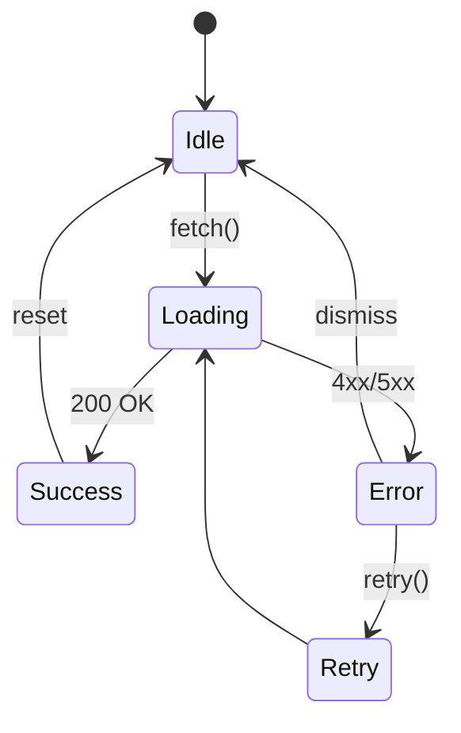

# Scout Dashboard v5.2 — Product Requirements Document

**Owner**: Product: @jgtolentino · Frontend: @D-Chan · Backend: @J-Rivera · Data: @M-Santos  
**Version**: 1.4.0  
**Last Updated**: 2025-01-26  
**Status**: In Development  

## Table of Contents
- [UI Specification](#ui-specification)
- [Interaction Specification](#interaction-specification)
- [Interface Control Document](#interface-control-document)
- [API Specification](#api-specification)
- [DAL Contract](#dal-contract)
- [Observability & SLOs](#observability--slos)
- [Test Oracles](#test-oracles)
- [Execution Appendix](#execution-appendix)

---

## UI Specification

### Design Tokens
```yaml
colors:
  primary: "#1E40AF"    # Blue-700
  secondary: "#7C3AED"  # Violet-600
  success: "#059669"    # Emerald-600
  warning: "#D97706"    # Amber-600
  error: "#DC2626"      # Red-600

spacing:
  xs: "4px"
  sm: "8px"
  md: "16px"
  lg: "24px"
  xl: "32px"

breakpoints:
  mobile: "640px"
  tablet: "768px"
  desktop: "1024px"
  wide: "1280px"
```

### Component Hierarchy
```
ScoutDashboard/
├── Executive/
│   ├── KpiRow
│   ├── RevenueTrend
│   └── TopBrands
├── Analytics/
│   ├── TransactionTrends
│   ├── ProductMix
│   └── CustomerSegments
├── Geographic/
│   ├── MapboxViewer
│   ├── RegionDrilldown
│   └── HeatmapOverlay
└── AI/
    ├── RecommendationPanel
    ├── AnomalyAlerts
    └── PredictiveInsights
```

### Accessibility Requirements
- WCAG 2.1 AA compliance
- Keyboard navigation for all interactive elements
- ARIA labels for dynamic content
- Focus management for modal/drawer transitions
- Color contrast ratio ≥ 4.5:1 for normal text

### Code Connect Mapping
```yaml
figma_frames:
  executive_overview: "ABC123:456"
  transaction_trends: "ABC123:789"
  product_mix: "ABC123:012"
  geographic_view: "DEF456:345"
```

---

## Interaction Specification

### State Machines

#### Data Loading States


#### Component States
- **Empty**: No data available → Show onboarding CTA
- **Loading**: Fetching data → Show skeleton UI
- **Error**: Request failed → Show error boundary with retry
- **Success**: Data loaded → Render visualization
- **Stale**: Data > 5 min old → Show refresh indicator

### Loading Patterns
- Skeleton screens for initial load
- Progressive enhancement for slow connections
- Optimistic updates for user actions
- Background refresh every 5 minutes

---

## Interface Control Document

**Version**: 1.4  
**Last Breaking Change**: 2025-01-26

### RPC Endpoints

| Endpoint | Method | Input | Output | Errors | SLA |
|----------|--------|-------|--------|--------|-----|
| `/api/executive/summary` | GET | `{period: string}` | `ExecutiveSummary` | 401, 404, 500 | 200ms p95 |
| `/api/transactions/trends` | POST | `TrendsRequest` | `TrendsResponse[]` | 400, 401, 500 | 500ms p95 |
| `/api/products/mix` | GET | `{store_id?: string}` | `ProductMix` | 401, 404, 500 | 300ms p95 |
| `/api/geo/regions` | GET | `{level: number}` | `GeoRegion[]` | 401, 500 | 400ms p95 |
| `/api/ai/recommendations` | POST | `RecommendationRequest` | `Recommendation[]` | 401, 429, 500 | 1s p95 |

### Type Definitions
```typescript
interface ExecutiveSummary {
  revenue: Money;
  transactions: number;
  aov: Money;
  growth: Percentage;
  period: DateRange;
}

interface TrendsRequest {
  granularity: 'hour' | 'day' | 'week' | 'month';
  start_date: ISO8601;
  end_date: ISO8601;
  metrics: string[];
  filters?: FilterSet;
}

interface TrendsResponse {
  timestamp: ISO8601;
  metrics: Record<string, number>;
  confidence?: number;
}
```

### Version History
- v1.4 (2025-01-26): Added AI recommendations endpoint
- v1.3 (2025-01-15): Geographic regions now support barangay level
- v1.2 (2025-01-01): Transaction trends added confidence scores
- v1.1 (2024-12-15): Initial release

---

## API Specification

### Authentication & Authorization
- JWT with RLS claims
- Role-based access: `viewer`, `analyst`, `admin`
- Token refresh every 60 minutes
- Rate limiting: 1000 req/min per user

### RPC Patterns
```typescript
// All RPCs follow this pattern
type RPC<Input, Output> = {
  endpoint: string;
  method: 'GET' | 'POST';
  input: Input;
  output: Output | ErrorResponse;
  headers: {
    'Authorization': `Bearer ${token}`;
    'X-Request-ID': string;
    'X-Client-Version': string;
  };
};
```

### Error Handling
```typescript
interface ErrorResponse {
  error: {
    code: string;        // Machine-readable
    message: string;     // Human-readable
    details?: unknown;   // Debug info
    correlation_id: string;
    timestamp: ISO8601;
  };
}
```

---

## DAL Contract

### Gold Views
```sql
-- Executive metrics (materialized, refreshed hourly)
CREATE MATERIALIZED VIEW gold.executive_summary AS
SELECT
  date_trunc('day', created_at) as date,
  SUM(amount) as revenue,
  COUNT(*) as transactions,
  AVG(amount) as aov
FROM silver.transactions
WHERE status = 'completed'
GROUP BY 1;

-- Product performance (materialized, refreshed daily)
CREATE MATERIALIZED VIEW gold.product_mix AS
SELECT
  product_id,
  product_name,
  category,
  SUM(quantity) as units_sold,
  SUM(revenue) as total_revenue,
  ROW_NUMBER() OVER (ORDER BY SUM(revenue) DESC) as rank
FROM silver.order_items
GROUP BY 1, 2, 3;

-- Geographic aggregations (indexed)
CREATE INDEX idx_geo_region ON gold.geographic_metrics(region_id, period);
CREATE INDEX idx_geo_city ON gold.geographic_metrics(city_id, period);
```

### Performance SLOs
- Query response time p95 < 100ms
- Materialized view refresh < 5 minutes
- Index hit ratio > 95%
- Connection pool saturation < 80%

### Data Freshness
- Real-time: Transactions (< 1 second)
- Near real-time: Executive metrics (< 5 minutes)
- Batch: Product mix, geo rollups (< 1 hour)

---

## Observability & SLOs

### Key Performance Indicators
```yaml
slos:
  availability: 99.9%  # 43.2 min/month downtime
  latency:
    p50: 100ms
    p95: 500ms
    p99: 1000ms
  error_rate: < 0.1%
  
kpis:
  daily_active_users: > 1000
  dashboard_load_time: < 2s
  api_success_rate: > 99.9%
  data_freshness: < 5 minutes
```

### Monitoring & Alerting
- Datadog APM for tracing
- Sentry for error tracking
- Custom dashboards in Grafana
- PagerDuty for incident management

### Error Budget
```yaml
monthly_budget:
  total_minutes: 43200
  allowed_downtime: 43.2  # 0.1%
  current_usage: 12.3
  remaining: 30.9
  forecast: "GREEN"  # On track
```

---

## Test Oracles

### Golden Data Sets
```yaml
test_data:
  executive:
    input: "fixtures/executive_2025_01.json"
    expected: "fixtures/executive_golden.json"
    tolerance: 0.01  # 1% variance allowed
    
  transactions:
    input: "fixtures/transactions_batch.csv"
    expected_count: 10000
    expected_sum: 1234567.89
    
  geographic:
    input: "fixtures/ph_regions.geojson"
    expected_regions: 17
    expected_cities: 146
```

### Test Coverage Requirements
- Unit tests: > 80% coverage
- Integration tests: All RPC endpoints
- E2E tests: Critical user journeys
- Performance tests: Load testing at 10x traffic
- Security tests: OWASP Top 10 scan

---

## Execution Appendix

```claude-exec
product: "Scout Dashboard v5.2"
goals:
  - "Integrate Executive Overview KPIs with gold views"
  - "Wire Geo Choropleth with Mapbox + RLS"
  - "Implement AI recommendations panel"
  - "Add export functionality for all charts"
  
constraints:
  - "Lighthouse performance score > 90"
  - "WCAG 2.1 AA compliance required"
  - "Mobile-first responsive design"
  - "Zero-downtime deployment"

outputs:
  - docs/claude/tasks.md
  - docs/claude/planning.md
  
rules:
  - atomic: true         # Tasks < 4 hours
  - testable: true       # Clear acceptance criteria
  - owners: required     # Every task has assignee
  - estimates: fibonacci # 1, 2, 3, 5, 8, 13
```

---

## Change Log

| Date | Version | Changes | Author |
|------|---------|---------|--------|
| 2025-01-26 | 1.4.0 | Added AI recommendations, updated ICD | @jgtolentino |
| 2025-01-15 | 1.3.0 | Geographic drill-down to barangay | @M-Santos |
| 2025-01-01 | 1.2.0 | Transaction confidence scores | @J-Rivera |
| 2024-12-15 | 1.1.0 | Initial PRD | @D-Chan |
