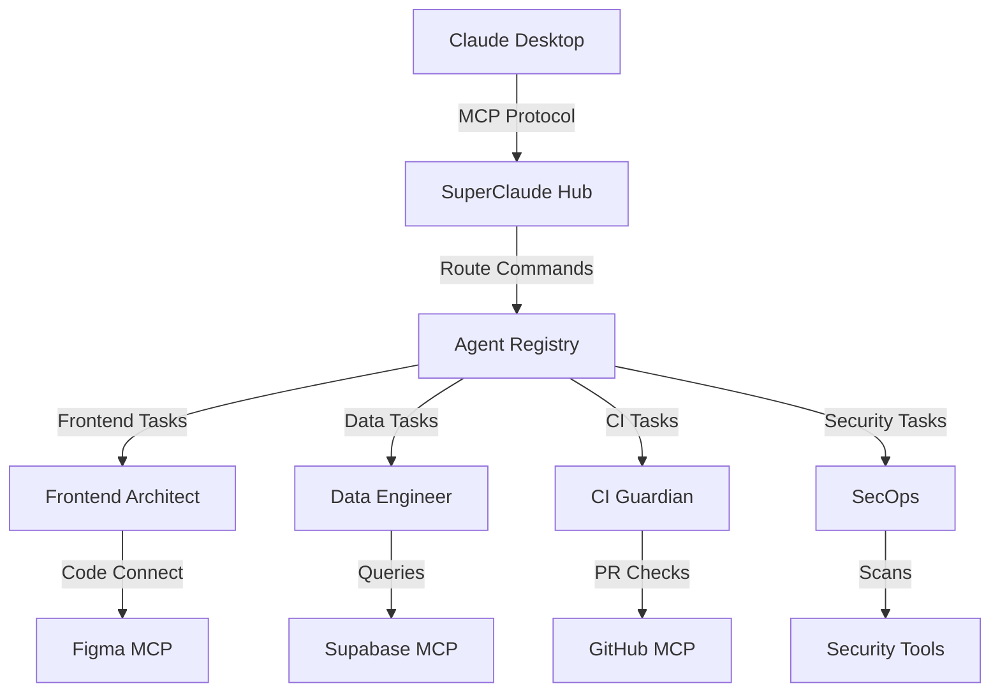

# SuperClaude Framework – Overview

## Purpose

A lightweight orchestration layer that standardizes how we use Claude + MCP to do real work in this monorepo. SuperClaude provides structured agents with defined personas, consistent command grammar, and safe MCP tool routing.

## Core Principles

- **Token-free where possible**: Leverage Claude Desktop MCP Hub for auth brokering
- **Standardized interfaces**: All agents accept task cards, return artifacts + PRs
- **Safe by default**: Mock data in previews, real data in repo
- **Traceability**: Every operation links task → agent → tools → validation

## Architecture



## Personas (Agents)

### 🎨 **Frontend Architect**
**Specialty**: Design-to-code, UI components, interactive previews  
**Tools**: Figma Dev Mode MCP, Code Connect, Storybook  
**Outputs**: React components, `.figma.tsx` mappings, component stories

**Example Tasks**:
- Wire Figma component to Code Connect mapping
- Generate responsive component variants
- Create interactive dashboard prototypes
- Polish accessibility and states

### 🗄️ **Data Engineer** 
**Specialty**: Database schemas, ETL pipelines, data integrity  
**Tools**: Supabase MCP, Postgres MCP, SQL validation  
**Outputs**: Migration files, RLS policies, seed data, ETL scripts

**Example Tasks**:
- Generate Supabase migration from schema diff
- Create RLS policies for multi-tenant data
- Set up data validation and monitoring
- Build ETL pipelines for Scout analytics

### ⚙️ **CI Guardian**
**Specialty**: Build systems, testing, deployment automation  
**Tools**: GitHub MCP, Vercel MCP, Package managers  
**Outputs**: Workflow fixes, dependency updates, deployment configs

**Example Tasks**:
- Fix failing CI pipelines and dependency conflicts
- Update GitHub Actions workflows
- Optimize build caching and performance
- Handle deployment and environment config

### 🔒 **SecOps**
**Specialty**: Security scanning, secret management, compliance  
**Tools**: Git history tools, secret scanners, audit logs  
**Outputs**: Security reports, cleaned history, rotation playbooks

**Example Tasks**:
- Scan for leaked credentials and clean history
- Set up secret rotation workflows
- Generate compliance audit reports
- Implement security policy enforcement

## Command Grammar

### Location
Commands live in `infra/superclaude/commands/` with consistent naming:

```
infra/superclaude/commands/
├── frontend/
│   ├── figma-connect.yaml
│   ├── component-generate.yaml
│   └── storybook-sync.yaml
├── data/
│   ├── migration-generate.yaml
│   ├── rls-setup.yaml
│   └── etl-pipeline.yaml
├── ci/
│   ├── workflow-fix.yaml
│   └── deploy-config.yaml
└── security/
    ├── secret-scan.yaml
    └── history-clean.yaml
```

### Convention
Pattern: `sc:<verb>-<object>` 

**Examples**:
- `sc:figma-connect` - Create Code Connect mapping
- `sc:mcp-full-stack` - End-to-end MCP setup
- `sc:schema-migrate` - Generate and apply DB migration
- `sc:workflow-fix` - Repair CI pipeline issues

### Transport
- **Primary**: Claude Desktop MCP + local stdio servers
- **Fallback**: HTTP MCP servers with GitHub Secrets auth
- **Goal**: No tokens where possible, secure secrets when required

## Task Card Format

All agents accept standardized task cards:

```yaml
task_id: FE-001
title: "Create KPI Tile Code Connect Mapping"
agent: "Frontend Architect"
inputs:
  figma_file: "xyz123"
  node_id: "45:67"
  component: "KpiTile"
  props:
    - label: string
    - value: number
    - delta: number (optional)
    - state: enum
outputs:
  files:
    - apps/scout-ui/src/components/Kpi/KpiTile.figma.tsx
    - apps/scout-ui/CHANGELOG.md
  verification:
    - figma-code-connect-validate
    - component-render-test
ci_gates:
  - figma-code-connect
  - ci
handoff:
  next_agent: "CI Guardian"
  condition: "on_ci_failure"
```

## Workflow Examples

### Design → Code → PR
1. **Designer**: Creates component in Figma, copies node link
2. **Frontend Architect**: `sc:figma-connect` generates mapping stub
3. **Developer**: Updates component props and mapping
4. **CI Guardian**: Validates Code Connect parsing
5. **Result**: PR with working Figma preview

### Schema Change → Migration → Deploy
1. **Data Engineer**: `sc:schema-migrate` detects drift from Supabase
2. **Agent**: Generates migration file and RLS policies
3. **CI Guardian**: Validates migration safety
4. **Result**: PR with schema changes ready for review

### CI Failure → Fix → Recovery
1. **CI Guardian**: Detects workflow failure pattern
2. **Agent**: `sc:workflow-fix` updates GitHub Actions
3. **Agent**: Fixes dependency conflicts or caching
4. **Result**: PR with working CI pipeline

## Integration Points

### Claude Desktop
- MCP servers configured in `claude_desktop_config.json`
- Commands available via natural language prompts
- Consistent response format with artifacts

### Repository Structure
- Commands: `infra/superclaude/commands/`
- Docs: `docs/superclaude/`
- Scripts: `scripts/agents/`
- Config: `figma.config.json`, `supabase/config.toml`

### CI/CD Pipeline
- Validation workflows in `.github/workflows/`
- Agent-specific checks (figma-code-connect, supabase-diff)
- Automated handoffs between agents

## Safety & Security

### Token-Free Philosophy
- **Figma Dev Mode**: Uses Claude Desktop SSO
- **GitHub**: Uses `gh` CLI authentication  
- **Supabase**: Personal Access Tokens via Keychain
- **Local Services**: stdio/localhost only

### Isolation Boundaries
- **Figma Previews**: Mock data only
- **Development**: Staging database access
- **Production**: Restricted to read-only queries
- **CI/CD**: Limited deployment permissions

### Audit Trail
Every agent operation logs:
- Task ID and agent persona
- MCP tools invoked
- Files modified
- CI gates passed/failed
- Handoff decisions

## Getting Started

### 1. Verify MCP Setup
```bash
# Check Claude Desktop MCP configuration
curl http://127.0.0.1:3845/health

# Validate Code Connect setup
pnpm run figma:connect:validate
```

### 2. Run First Command
```bash
# Generate component stub
./scripts/agents/superclaude.sh figma:stub MyComponent

# Or via Claude Desktop:
# "Use SuperClaude Frontend Architect to create a Code Connect mapping for MyComponent"
```

### 3. Verify Agent Response
Check for:
- Generated files in correct locations
- Valid Code Connect parsing
- CI checks passing
- Documentation updates

## Next Steps

1. **Expand Agent Registry**: Add more specialized agents for specific domains
2. **Enhanced Task Cards**: Include performance SLOs and acceptance criteria  
3. **Cross-Agent Workflows**: Complex tasks requiring multiple agent handoffs
4. **Metrics Dashboard**: Track agent performance and task completion rates

---

**Version**: 1.0.0  
**Last Updated**: August 28, 2025  
**Maintainer**: TBWA Data Platform Team