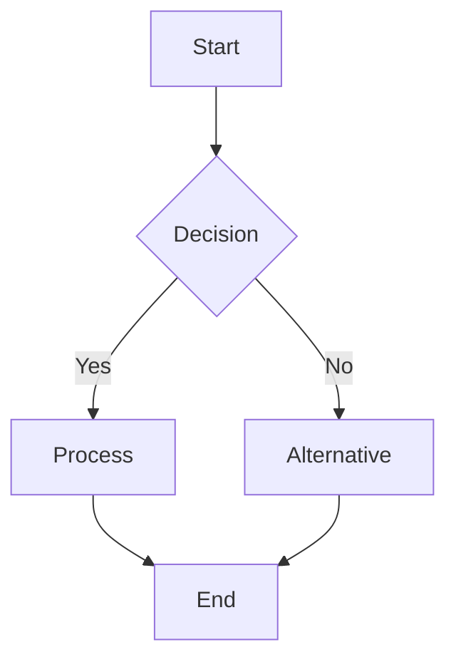
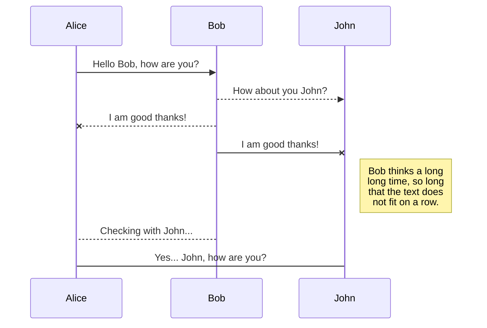
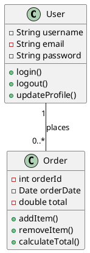
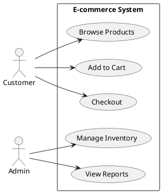

# Test Diagrams

Example diagrams to test the MCP server functionality.

## Mermaid Examples

### Flowchart


### Sequence Diagram


## PlantUML Examples

### Class Diagram


### Use Case Diagram


## D2 Examples

### Architecture Diagram
```d2
# Modern web application architecture
browser: Browser {
  shape: person
}

app: Web App {
  frontend: Frontend {
    shape: rectangle
    style.fill: "#e1f5fe"
  }
  
  backend: API Server {
    shape: rectangle  
    style.fill: "#f3e5f5"
  }
}

database: Database {
  shape: cylinder
  style.fill: "#e8f5e8"
}

cache: Redis Cache {
  shape: cylinder
  style.fill: "#fff3e0"
}

browser -> app.frontend: HTTPS
app.frontend -> app.backend: REST API
app.backend -> database: SQL
app.backend -> cache: Cache queries
```

## DBML Examples

### Database Schema
```dbml
Table users {
  id int [primary key]
  username varchar(50) [unique, not null]
  email varchar(100) [unique, not null]
  password_hash varchar(255) [not null]
  created_at timestamp [default: `now()`]
  updated_at timestamp [default: `now()`]
}

Table orders {
  id int [primary key]
  user_id int [ref: > users.id]
  total decimal(10,2) [not null]
  status varchar(20) [default: 'pending']
  created_at timestamp [default: `now()`]
}

Table order_items {
  id int [primary key]
  order_id int [ref: > orders.id]
  product_id int [ref: > products.id]
  quantity int [not null]
  price decimal(10,2) [not null]
}

Table products {
  id int [primary key]
  name varchar(200) [not null]
  description text
  price decimal(10,2) [not null]
  stock_quantity int [default: 0]
  created_at timestamp [default: `now()`]
}
```

## draw.io XML Example

### Simple Flowchart
```xml
<mxfile host="Electron">
  <diagram id="simple-flowchart" name="Simple Process">
    <mxGraphModel dx="1422" dy="794" grid="1" gridSize="10" guides="1" tooltips="1" connect="1" arrows="1" fold="1" page="1" pageScale="1" pageWidth="827" pageHeight="1169">
      <root>
        <mxCell id="0"/>
        <mxCell id="1" parent="0"/>
        <mxCell id="2" value="Start" style="ellipse;whiteSpace=wrap;html=1;fillColor=#d5e8d4;strokeColor=#82b366;" vertex="1" parent="1">
          <mxGeometry x="364" y="80" width="100" height="60" as="geometry"/>
        </mxCell>
        <mxCell id="3" value="Process Data" style="rounded=1;whiteSpace=wrap;html=1;fillColor=#dae8fc;strokeColor=#6c8ebf;" vertex="1" parent="1">
          <mxGeometry x="344" y="200" width="140" height="60" as="geometry"/>
        </mxCell>
        <mxCell id="4" value="End" style="ellipse;whiteSpace=wrap;html=1;fillColor=#f8cecc;strokeColor=#b85450;" vertex="1" parent="1">
          <mxGeometry x="364" y="320" width="100" height="60" as="geometry"/>
        </mxCell>
        <mxCell id="5" value="" style="endArrow=classic;html=1;rounded=0;exitX=0.5;exitY=1;exitDx=0;exitDy=0;entryX=0.5;entryY=0;entryDx=0;entryDy=0;" edge="1" parent="1" source="2" target="3">
          <mxGeometry width="50" height="50" relative="1" as="geometry">
            <mxPoint x="374" y="250" as="sourcePoint"/>
            <mxPoint x="424" y="200" as="targetPoint"/>
          </mxGeometry>
        </mxCell>
        <mxCell id="6" value="" style="endArrow=classic;html=1;rounded=0;exitX=0.5;exitY=1;exitDx=0;exitDy=0;entryX=0.5;entryY=0;entryDx=0;entryDy=0;" edge="1" parent="1" source="3" target="4">
          <mxGeometry width="50" height="50" relative="1" as="geometry">
            <mxPoint x="374" y="370" as="sourcePoint"/>
            <mxPoint x="424" y="320" as="targetPoint"/>
          </mxGeometry>
        </mxCell>
      </root>
    </mxGraphModel>
  </diagram>
</mxfile>
```

## Test Commands

Use these with the MCP server:

### 1. Plan and Generate
```json
{
  "tool": "diagram_plan_and_generate",
  "arguments": {
    "intent": "Create a system architecture diagram showing frontend, backend, and database"
  }
}
```

### 2. Render Mermaid
```json
{
  "tool": "diagram_render", 
  "arguments": {
    "engine": "mermaid",
    "code": "graph TD; A[Start] --> B[Process] --> C[End]",
    "output": "svg"
  }
}
```

### 3. draw.io CLI Export
```json
{
  "tool": "diagram_drawio_cli_export",
  "arguments": {
    "xml": "<mxfile>...</mxfile>",
    "format": "png",
    "crop": true
  }
}
```

### 4. Generate Viewer URL
```json
{
  "tool": "diagram_drawio_viewer_url",
  "arguments": {
    "xml": "<mxfile>...</mxfile>"
  }
}
```

### 5. Create Shareable Kroki URL
```json
{
  "tool": "diagram_kroki_url",
  "arguments": {
    "engine": "mermaid",
    "code": "graph TD; A-->B;",
    "output": "svg"
  }
}
```